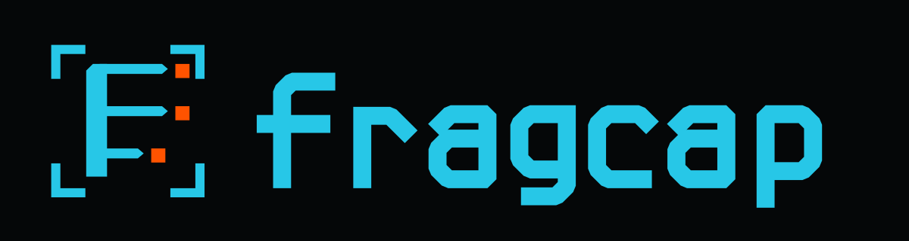

# fragcap Brand System

**Status:** Approved identity, version 1.0.0\
**Audience:** Product, engineering, documentation, and communications teams\
**Parent:** ShruggieTech\
**Domain:** `fragcap.com`\
**Last updated:** 2026-08-10

fragcap provides passive process-attributed network capture for games. Its
identity combines packet structure, capture framing, and controlled
fragmentation without borrowing the visual language of cheat tooling.

## Contents

- [Brand foundation](#brand-foundation)
- [Logo system](#logo-system)
- [Color](#color)
- [Typography](#typography)
- [Visual language](#visual-language)
- [Voice and writing](#voice-and-writing)
- [Parent brand relationship](#parent-brand-relationship)
- [Digital implementation](#digital-implementation)
- [Asset inventory](#asset-inventory)

## Brand foundation

### Governing principle: instrument, not weapon

Every visual and verbal decision must read as laboratory equipment. fragcap
observes traffic. It does not alter game state, conceal activity, automate
play, or promise advantage.

This distinction is operational. Branding that resembles cheat tooling can
trigger removal, security heuristics, and moderation before the software is
examined. The identity therefore functions as part of the product's trust and
security posture.

### Positioning

**Category:** Game network capture and analysis tooling.\
**Role:** Passive technical instrument.\
**Audience:** Developers, protocol researchers, security engineers, tool
authors, and technically capable operators.\
**Functional descriptor:** Passive process-attributed network capture for
games.

### Brand idea

**Captured signal. Preserved evidence.**

The brand treats packets as observable material. The system is quiet,
controlled, and exact. It privileges evidence over spectacle and inspection
over intervention.

### Personality

fragcap is precise, restrained, skeptical, and technically literate. It is
confident enough to state prerequisites and limitations plainly. It does not
perform excitement, posture as dangerous, or simplify away important detail.

| Trait | Expression | Avoid |
| --- | --- | --- |
| Precise | Exact nouns, units, formats, and commands | Vague claims |
| Instrumental | Observation, capture, evidence, traces | Combat metaphors |
| Dry | Calm statements and sparse wit | Hype or gamer slang |
| Competent | Assumes technical ability | Condescending tutorials |
| Transparent | Names limitations and prerequisites | Implied magic |

### Brand promises

- Capture is passive and inspectable.
- Output is evidence, not theater.
- Technical boundaries are stated before convenience claims.
- Terminology remains consistent across CLI, docs, schemas, and interfaces.
- Unknowns are labeled as unknowns.

## Logo system

### Mark construction

The mark contains three coordinated ideas:

- A triple-bladed **F** represents parallel packet lanes.
- Four separated corner segments create a capture frame without using a
  weapon-like circular crosshair.
- Orange packet terminals represent the bytes isolated by capture. The lower
  lane is deliberately shorter, keeping the silhouette legible as an F rather
  than an E.

The wordmark is custom vector lettering. Do not replace it with live text or
attempt to reproduce it with a typeface.

### Approved lockups

Use the horizontal lockup for headers, repository artwork, and wide surfaces.
Use the stacked lockup for square compositions and title pages. Use the mark
alone for application icons, favicons, avatars, and compact controls. Use the
wordmark alone only where another nearby element already establishes product
identity.

### Clear space

Maintain clear space equal to the width of one orange terminal square around
the outer edge of any lockup. No text, border, icon, or crop may enter this
area.

### Minimum size

| Asset | Minimum digital size |
| --- | --- |
| Mark | 24 px wide |
| Horizontal lockup | 160 px wide |
| Stacked lockup | 96 px wide |
| Wordmark | 120 px wide |

Below 24 px, use the supplied favicon exports. Do not rasterize a large logo
down to browser-icon size at runtime.

### Backgrounds

The primary presentation is signal cyan and capture orange on Void. The light
variant uses deeper accessible colors on the Light Surface token. Use the
single-color white or black variants when reproduction supports only one ink.

### Prohibited treatments

- Do not rotate, skew, stretch, outline, bevel, or add glow.
- Do not recolor individual packet lanes.
- Do not move the orange terminals or make them appear explosive.
- Do not close the four reticle corners into a box or circle.
- Do not place the logo over busy imagery.
- Do not combine the fragcap and ShruggieTech marks into one lockup.
- Do not add skulls, weapons, controllers, shields, or exploit imagery.

## Color

The palette is dark-first and close to monochrome. Cyan is the observed
signal. Orange is the captured terminal or state requiring attention. Orange
must remain scarce enough to retain its meaning.

| Token | Hex | Role |
| --- | --- | --- |
| Signal Cyan | `#27C7E7` | Primary identity, links, focus, active data |
| Capture Orange | `#FF5300` | Captured terminal, warning emphasis |
| Void | `#050708` | Primary background |
| Surface | `#0B1115` | Panels and code surfaces |
| Surface Raised | `#101A20` | Elevated controls and selected rows |
| Line | `#21323A` | Borders, separators, inactive diagrams |
| Text | `#F2F7F8` | Primary dark-mode text |
| Text Muted | `#94A8B0` | Secondary dark-mode text |
| Light Surface | `#F5F8F9` | Light reading background |
| Light Text | `#102027` | Primary light-mode text |
| Light Cyan | `#006F82` | Accessible cyan on light surfaces |
| Light Orange | `#C24100` | Accessible orange on light surfaces |

### Color ratio

Use approximately 80 percent neutral surfaces, 15 percent cyan, and no more
than 5 percent orange in a typical view. Orange is not a general CTA color.

### Semantic use

Cyan identifies selection, capture readiness, active filters, links, and focus.
Orange identifies captured boundaries, warnings, dropped data, or a state that
requires inspection. Errors use explicit text and an error icon in addition to
color. Success should use cyan unless a product requirement establishes a
separate semantic green.

## Typography

Typography is shared selectively with ShruggieTech. This creates lineage
through craft rather than through copied layouts or parent-brand color.

| Function | Typeface | Weights |
| --- | --- | --- |
| Display and headings | Space Grotesk | 500, 700 |
| Body and interface | Geist | 400, 500 |
| Packet data and code | Geist Mono | 400 |
| Product wordmark | Custom vector lettering | Fixed artwork |

### Monospace decision

Geist Mono resolves the former Q-7 requirement. Its zero, capital O, one,
lowercase L, and capital I remain distinguishable in packet payloads. Its
family relationship to Geist also prevents technical specimens from feeling
detached from surrounding documentation.

Evaluate future replacements against the included real-format specimen, not a
decorative alphabet. A candidate must distinguish `0 O`, `1 l I`, `8 B`,
`5 S`, and `2 Z` at the actual interface size.

### Type behavior

Display headings use tight tracking from `-0.02em` to `-0.03em`. Body copy uses
a line height near `1.65`. Metadata and labels use Geist Mono with modest
positive tracking. Hex dumps never use ligatures and never apply smart quotes
or automatic character substitution.

Sentence case is the default. Uppercase is reserved for compact labels,
capture states, and table metadata.

## Visual language

### Instrumentation

Visual references come from oscilloscopes, protocol analyzers, packet lanes,
capture gates, timing marks, and network topology. Use exact alignment and
quiet negative space. A graphic should explain a state or relationship.

### Iconography

Use simple line icons with 1.5 px to 2 px strokes, square or lightly chamfered
terminals, and minimal rounding. Prefer direct technical symbols such as
filter, file, clock, interface, endpoint, and search. Avoid mascots, weapons,
controllers, shields, hooded figures, and generic circuit-board decoration.

### Surfaces and geometry

Panels use 1 px Line borders and radii between 4 px and 8 px. Avoid glass
effects, large shadows, chrome, and decorative gradients. Selected states may
use a subtle cyan border or a low-opacity cyan fill. Orange backgrounds should
be rare and small.

### Data visualization

Prefer lanes, traces, timelines, byte grids, and topology diagrams. Cyan marks
the active observation path. Orange marks the selected terminal, discontinuity,
or warning. Gray remains the default for context.

### Motion

Motion communicates capture state, filtering, or continuity. Keep interface
transitions between 120 ms and 240 ms. Avoid pulsing glow, glitch effects,
screen shake, and decorative scan lines. Respect `prefers-reduced-motion`.

## Voice and writing

### Voice

Write precisely and dryly. Assume technical competence. Link unfamiliar terms
to the glossary instead of weakening the language around them.

Use active voice, concrete nouns, and observable outcomes. State prerequisites
before instructions. Distinguish supported behavior, inferred behavior, and
unknown behavior.

### Register

fragcap does not use conventional marketing structure. The landing page should
state what the tool is, show one worked invocation with representative output,
name the prerequisite plainly, and link to documentation. Avoid testimonials,
feature grids, urgency, and generalized calls to action.

### Preferred language

| Prefer | Avoid |
| --- | --- |
| capture, observe, inspect, decode | intercept, attack, exploit |
| packet, frame, trace, session | traffic magic, secret data |
| supported, experimental, unknown | flawless, revolutionary, effortless |
| requires, emits, records, filters | unlocks, dominates, supercharges |

### Examples

**Product statement:** Passive process-attributed network capture for games.

**Prerequisite:** Packet capture requires an Npcap-compatible capture driver.

**Limitation:** Encrypted payloads remain opaque unless a supported decoder can
derive the required session context.

**Empty state:** No packets matched the current filter.

**Error:** Capture stopped. Interface `Ethernet 2` is no longer available.

### Casing and terminology

The product name is always lowercase: **fragcap**. Begin a sentence with
`fragcap` rather than capitalizing it. File formats, protocol names, and command
flags preserve their canonical casing. Add new domain terms to the glossary
when they first enter user-facing documentation.

## Parent brand relationship

fragcap is an independent ShruggieTech product identity. It shares Space
Grotesk, Geist, Geist Mono, dark-first discipline, and the parent's exact
`#FF5300` orange. It does not inherit ShruggieTech green, the shruggie mark,
marketing layouts, or verbal flourish.

The approved endorsement is **A ShruggieTech project**. Set it in Geist Mono,
uppercase, with positive tracking. Keep it visually subordinate and outside
the fragcap logo's clear space. The endorsement may appear in the footer,
About page, repository metadata, title-page colophon, and social preview.

This resolves former Q-8. Do not create a combined parent-product logo.

## Digital implementation

### CSS

Import `fonts/fonts.css`, `tokens/colors.css`, and
`tokens/typography.css`. Prefer the semantic dark tokens for application
surfaces and the deeper light-mode accent tokens on pale backgrounds.

### Favicons

The `favicons/` directory includes SVG, ICO, standard browser PNGs, an Apple
touch icon, Android icons, and a web manifest. Keep the supplied Void
background in small icons because it protects the reticle corners and orange
terminals across browser themes.

### Accessibility

Do not use the bright Signal Cyan as body text on a light surface. Use Light
Cyan instead. Do not communicate capture status through orange alone. Every
interactive element requires a visible 2 px focus ring and a non-color state
change. Interface text should meet WCAG AA contrast at its rendered size.

## Asset inventory

| Directory | Contents |
| --- | --- |
| `logos/svg/` | Editable vector masters and all approved lockups |
| `logos/png/` | High-resolution raster exports and social preview |
| `favicons/` | Browser, Apple, Android, SVG, ICO, and manifest assets |
| `fonts/` | WOFF2, TTF, CSS declarations, and OFL licenses |
| `tokens/` | CSS and JSON design tokens |
| `specimens/` | Typography and hex-readability specimen |
| `brand-guide.pdf` | Printable reference manual |

Use SVG in product interfaces and documentation whenever the surface supports
it. Use PNG for social platforms, raster-only systems, and external listings.
Treat the files in `logos/svg/` as the source of truth.
