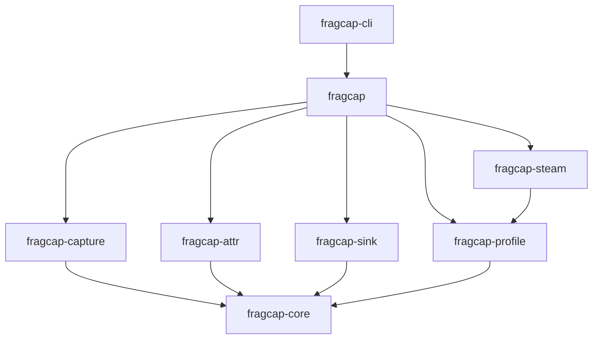
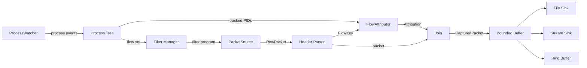
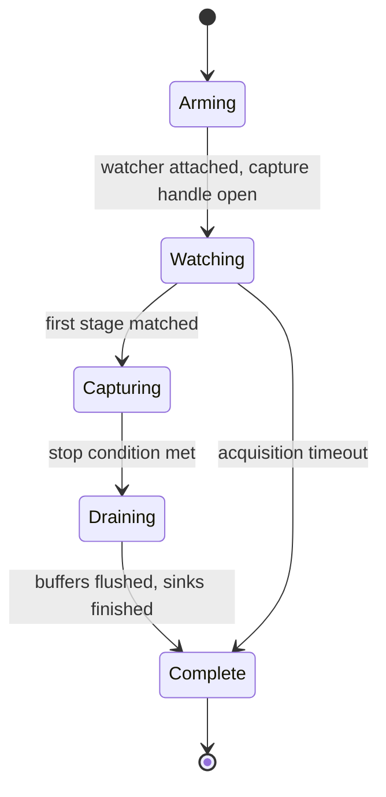
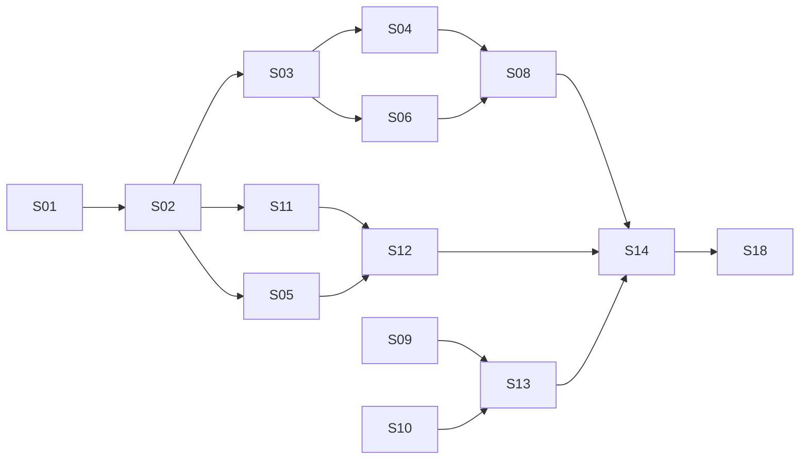

# fragcap v0.1.0 Technical Specification

**Status:** Draft \
**Version:** 0.1.0 \
**Audience:** Human-facing (operator, contributors, agent sessions) \
**Author:** William Thompson (Shruggie LLC, DBA ShruggieTech) \
**Date:** 2026-08-06 \
**Repository:** `github.com/h8rt3rmin8r/fragcap` \
**License:** Apache-2.0 \
**Supersedes:** `fragcap-v0.1.0-Spec-Outline.md`

## Table of Contents

- [1. Document Control](#1-document-control)
- [2. Purpose and Problem Statement](#2-purpose-and-problem-statement)
- [3. Goals, Non-Goals, and Success Criteria](#3-goals-non-goals-and-success-criteria)
- [4. Glossary and Terminology Policy](#4-glossary-and-terminology-policy)
- [5. Domain Background](#5-domain-background)
- [6. Constraints and Assumptions](#6-constraints-and-assumptions)
- [7. Functional Requirements](#7-functional-requirements)
- [8. System Architecture](#8-system-architecture)
- [9. Platform Strategy](#9-platform-strategy)
- [10. Process Detection and Lifecycle](#10-process-detection-and-lifecycle)
- [11. Flow Attribution](#11-flow-attribution)
- [12. Capture Pipeline](#12-capture-pipeline)
- [13. Output Formats](#13-output-formats)
- [14. Sinks and Streaming](#14-sinks-and-streaming)
- [15. Game Profiles](#15-game-profiles)
- [16. Steam Integration](#16-steam-integration)
- [17. Command Line Interface](#17-command-line-interface)
- [18. Shell Wrappers](#18-shell-wrappers)
- [19. Security Posture and Anti-Cheat Interaction](#19-security-posture-and-anti-cheat-interaction)
- [20. Licensing and Third-Party Obligations](#20-licensing-and-third-party-obligations)
- [21. Repository Layout](#21-repository-layout)
- [22. Documentation System](#22-documentation-system)
- [23. Website and Brand](#23-website-and-brand)
- [24. Build, CI, and Release](#24-build-ci-and-release)
- [25. Testing Strategy](#25-testing-strategy)
- [26. Observability and Diagnostics](#26-observability-and-diagnostics)
- [27. Spec Kit Decomposition](#27-spec-kit-decomposition)
- [28. Roadmap Beyond v0.2.0](#28-roadmap-beyond-v020)
- [29. Open Questions](#29-open-questions)
- [30. Appendices](#30-appendices)

## 1. Document Control

This document specifies fragcap for its first public release, v0.2.0,
which comprises the whole roadmap. It defines the product's
purpose, boundaries, architecture, interfaces, and delivery
requirements at a level sufficient to decompose into implementable work
without further design negotiation.

### 1.1 Relationship to Spec Kit

This specification is the upstream input to the project's GitHub Spec
Kit workflow. It does not replace `specs/` artifacts and it is not
consumed directly by implementing agents.

The relationship runs in one direction. Section 27 maps this document
onto two Spec Kit artifact classes. Durable rules that must survive
every agent session become constitution principles under `.specify/`.
Bounded units of work become numbered feature slices under
`specs/NNN-slug/`, each carrying its own `spec.md`, `plan.md`, and
`tasks.md` generated by the Spec Kit command chain.

When this document and a feature slice disagree, the feature slice
wins for the duration of that slice, and the divergence is recorded in
section 29 for reconciliation at the next version bump. This document
is amended between versions, not during them.

### 1.2 Terminology Conventions

The key words MUST, MUST NOT, REQUIRED, SHALL, SHALL NOT, SHOULD,
SHOULD NOT, RECOMMENDED, MAY, and OPTIONAL carry their RFC 2119
meanings.

Every domain term used in this document has a corresponding entry in
the project glossary. Section 4 defines that requirement and its
enforcement.

### 1.3 Revision History

| Version | Date | Author | Summary |
| --- | --- | --- | --- |
| 0.1.0-draft | 2026-08-06 | W. Thompson | Initial specification. |
| 0.1.1-draft | 2026-08-06 | W. Thompson | Reconnaissance findings applied. A-1 through A-4 confirmed, **A-5 refuted**. Changes to 5.4, 6.2, 8.4, 10.2, 10.3, 11.2, 12.1, 12.2, 15.2, 15.4, 22.3, 28, 29, Appendix D. Adds command line handling rules in 10.2. |
| 0.1.2-draft | 2026-08-06 | W. Thompson | **Withdraws a claim.** 0.1.1-draft asserted that a focal title passes a live credential on its client's command line, and described it as documented. That was inference from a parameter name and was not supported by the capture. An entropy scan of 3,694 command lines found no credential in either title. Sections 6.2, 10.2, 29, and Appendix D corrected. A-5's fallback now cites an observed named pipe instead. |
| 0.1.3-draft | 2026-08-06 | W. Thompson | **Withdraws the redaction rules.** 0.1.1-draft made command line capture opt-in, masked profile paths, redacted parameters by name at the source, and barred command lines from output. All four alter what the instrument reports, contrary to section 2.3 and to the project's stated purpose. Command lines are recorded verbatim, as the original 10.2 specified. Scope remains the operator's control; preparation for publication becomes an explicit downstream operation on a copy. Removes the 15.4 and 10.3 rules that existed only to manage the invented default. Adds constitution principle **P-9, The Instrument Does Not Lie** (constitution 1.1.0), so the reasoning that produced those rules is blocked rather than merely reverted. |
| 0.1.4-draft | 2026-08-10 | W. Thompson | Codifies the release-versioning scheme. v0.1.0 is the crates.io namespace-reservation stub; the first functional release is v0.2.0 (slices through S14); v0.3.0 completes S15 through S18. Partitions the 3.3 success criteria across the two functional releases, retitles section 28, and updates 9.1, 27.3, and scope prose throughout. |
| 0.1.5-draft | 2026-08-10 | W. Thompson | **Reverses the two-release split.** There is now one first public release, v0.2.0, comprising the whole roadmap (S01 through S18); it and the crates.io publication of the functional crates happen only after every slice is complete. Un-partitions the 3.3 success criteria (v0.2.0 is complete when SC-1 through SC-7 hold), collapses the 27.3 release table to a single functional release, retitles section 28 "Beyond v0.2.0", and updates the scope prose. v0.1.0 remains the already-published name-reservation stub. |

## 2. Purpose and Problem Statement

### 2.1 What fragcap Is

fragcap is a Rust library and command line tool that captures network
traffic belonging to a specific game client and attributes every
captured packet to the process that produced it. It writes attributed
captures to disk in a pcapng-compatible format, and streams them live
to downstream consumers over named pipes, Unix domain sockets, or TCP.

The library is the product. The command line tool is one consumer of
it, and the shell wrappers are consumers of the command line tool.
Anything a user can do through the CLI is reachable through the public
Rust API.

### 2.2 The Problem

Packet capture is solved. Attribution is not.

Capture on every mainstream operating system happens at the network
driver layer, below the socket layer. By the time a packet reaches a
capture handle, the operating system has already discarded the
association between that packet and the process that sent or received
it. A capture file records that a UDP datagram left the machine on
port 51834. It does not record that the game client sent it.

Recovering that association requires joining each packet's
[5-tuple](#) against a separately maintained table of open sockets and
their owning process identifiers. Every tool that offers per-process
capture performs this join internally, and the tools differ almost
entirely in how well they do it.

Games make the join harder than average in three specific ways.

Game clients are launched indirectly. A title acquired through Steam
is typically started by Steam, which starts a publisher launcher,
which starts the actual client. The launcher performs account
authentication and server selection, then hands off. Naive detection
that waits for the client process to appear has already missed the
authentication exchange, which is frequently the most information-dense
traffic of the entire session.

Process ancestry is unreliable on Windows. Parent process identifiers
are recorded but not maintained, and identifier values are recycled. By
the time a client process is observed, its recorded parent may be dead
and the number reassigned to something unrelated. Reconstructing the
launch chain after the fact does not work.

Platform services generate constant background traffic. A persistent
publisher client maintains its own connections for presence, overlay,
entitlement checks, and telemetry for the entire session. Capturing an
entire process tree without discrimination buries gameplay traffic
under service noise.

fragcap solves all three.

### 2.3 Why It Exists

fragcap is built as an instrument for observing where network theory
and shipped game networking diverge. Published protocol design and
production game networking disagree in interesting ways, and those
disagreements are visible only with correct per-process attribution
across the full session lifecycle, from launcher authentication through
client shutdown.

This motivation shapes priority. Fidelity of observation outranks
throughput. Correct attribution outranks capture completeness.
Compatibility with existing analysis tooling outranks feature
richness.

## 3. Goals, Non-Goals, and Success Criteria

### 3.1 Goals

**G-1. Correct attribution across the launch chain.** Every captured
packet carries the process identifier, executable name, and profile
role of its owning process, from launcher start through client exit.

**G-2. Zero-modification interoperability.** fragcap output opens in
unmodified Wireshark, tshark, and any other pcapng reader with no
plugins installed.

**G-3. Library-first design.** The public Rust API exposes every
capability the CLI uses. Third-party crates depend on fragcap without
depending on its binary.

**G-4. Game-agnostic core.** No crate below `fragcap-profile` contains
knowledge of any specific title. Adding a game requires writing a TOML
profile, not modifying Rust.

**G-5. Honest accounting.** Dropped packets, unattributed packets, and
capture gaps are counted and reported. The tool never silently loses
data.

**G-6. Passive operation.** fragcap observes. It does not inject,
modify, hook, or read the memory of any target process.

### 3.2 Non-Goals

Non-goals bind as strongly as goals. Each is a rule that constrains
implementation, and each becomes a constitution principle in section
27.

**NG-1. No process injection or memory access.** fragcap never loads
code into a target, never installs hooks, and never opens a handle to a
target process carrying memory-read rights.

**NG-2. No packet modification or injection.** fragcap never alters,
drops, delays, replays, or synthesizes traffic on a live connection.
Capture handles are opened for reading.

**NG-3. No traffic interception drivers.** fragcap uses capture
drivers, not filtering or interception drivers. Section 19 defines the
allowlist.

**NG-4. No game-specific protocol logic in core.** Protocol dissection
is a declared plugin seam, deferred beyond v0.2.0 (section 28). No
dissector ships in the core crates at any version.

**NG-5. Not a proxy, accelerator, or optimizer.** fragcap is not
positioned on the path between client and server, and does not affect
latency, routing, or connection behavior.

**NG-6. No decryption.** fragcap does not attempt to break, downgrade,
or work around transport encryption. Encrypted payloads are captured
and stored as ciphertext.

### 3.3 Success Criteria

The first public release is v0.2.0, comprising the whole roadmap; v0.1.0
is a crates.io namespace-reservation stub carrying no functionality
(section 27.3). The release is complete only when every success
criterion holds.

**v0.2.0 is complete when SC-1 through SC-7 hold.**

**SC-1.** A single `fragcap run --profile eso` invocation, issued
before the game starts, produces one capture file covering launcher
authentication through client exit, with every packet attributed to a
named role.

**SC-2.** That file opens in unmodified Wireshark with per-packet
attribution visible in the packet comment pane, and the display filter
`frame.comment contains "role=client"` isolates client traffic.

**SC-3.** `fragcap doctor` correctly reports capture readiness on a
clean Windows 11 installation, including the specific remediation step
when npcap is absent.

**SC-4.** The full pipeline, from packet source through sink, runs in
continuous integration on a runner with no capture driver installed and
no game present, using the replay source and scripted attributor.

SC-5 through SC-7 complete the remaining roadmap capabilities and are
part of the same v0.2.0 release.

**SC-5.** A downstream process consumes a live stream over a named pipe
and over TCP, and Wireshark attaches to a running capture through the
extcap interface.

**SC-6.** Every domain term appearing in project documentation resolves
to a glossary entry, verified by the documentation linter in
continuous integration.

**SC-7.** Attribution accuracy on a full ESO session is at or above 99
percent of captured packets belonging to profiled processes, measured
against socket table ground truth.

## 4. Glossary and Terminology Policy

### 4.1 Rationale

fragcap sits at the intersection of five specialist domains: network
protocols, Windows kernel internals, the Rust ecosystem, anti-cheat and
security tooling, and game platform infrastructure. No contributor is
fluent in all five. The project's difficulty concentrates in the seams
between them, and undefined vocabulary accumulates precisely at those
seams.

The glossary is therefore a first-class deliverable with an enforced
contract, not a documentation appendix.

### 4.2 The Undefined Term Rule

No domain term, acronym, or initialism appears in any project document
without a corresponding glossary entry. This is enforced mechanically,
not by review discipline. The documentation linter maintains a term
inventory and fails the build on any unresolved usage.

The rule applies to the specification, the README, architecture
documents, code comments intended for human readers, and website copy.
It does not apply to identifiers in source code.

### 4.3 Entry Structure

Every entry conforms to the following structure.

```markdown
## Term Name

**Also known as:** alternate names, acronym expansions

One-sentence blurb in plain language. Avoids other glossary terms
where possible.

Detail paragraph. Uses other glossary terms freely, and every one of
them is cross-linked. Explains the concept generally, without
reference to fragcap.

{: .matters }
> One or two sentences connecting the concept to this codebase and
> the decisions it drove.

**See also:** cross-links to related entries

**References:**

- Primary source, with a note on what it is
- Secondary source, with a note on what it is
```

The blurb serves readers who need only a reminder. The detail
paragraph serves readers encountering the concept for the first time.
The "why it matters here" callout is the field that distinguishes this
glossary from a general reference work, and it is REQUIRED on any term
that influenced a design decision.

### 4.4 Categories

Entries are stored one page per category and indexed alphabetically
across all categories.

| Category | Scope |
| --- | --- |
| Capture and Networking | Capture mechanics, protocols, filtering |
| Windows Internals | Kernel subsystems, APIs, tracing facilities |
| Process and Attribution | Process identity, lifecycle, socket ownership |
| Anti-Cheat and Security | Detection mechanisms, technique classification |
| Rust and Tooling | Language, ecosystem, and build vocabulary |
| Platform and Distribution | Game platforms, launchers, packaging |
| File and Wire Formats | Capture formats, encodings, block structures |
| Command Line and Diagnostics | CLI commands, flags, readiness checks, lifecycle events |

Category assignment is single-valued. A term belonging to two
categories is filed under its primary domain and cross-linked from the
other.

### 4.5 Reference Quality

References prefer primary sources. Vendor documentation outranks blog
commentary on vendor documentation. Original papers and RFCs outrank
summaries. Manual pages outrank forum answers.

Secondary sources are permitted as an additional reference where they
explain something the primary source assumes the reader already knows.
They do not replace the primary source.

### 4.6 Enforcement

The documentation linter runs in continuous integration and enforces
four checks.

1. Every entry contains a blurb, a detail paragraph, and a references
   section. Entries influencing a design decision also contain the
   "why it matters here" callout.
2. Every internal cross-link resolves to an existing entry anchor.
3. Every term appearing in project documentation resolves to an entry.
4. Every external reference URL responds successfully. This check runs
   on a weekly schedule rather than per commit, because link rot is
   real and unrelated to the change under review.

The linter also regenerates the alphabetical index from category page
contents, which removes any possibility of index drift.

## 5. Domain Background

This section establishes the shared context required to follow the
architectural decisions that follow. Readers already fluent in a given
subsection may skip it. Every term introduced here has a glossary
entry.

### 5.1 The Capture Stack on Windows

Capture on Windows is provided by npcap, which installs an NDIS
lightweight filter driver into the network stack and exposes the
portable libpcap API on top of it. Software written against libpcap
compiles and runs on Windows against npcap with no source changes,
which is why Wireshark, Nmap, and comparable tools ship a single
codebase across platforms.

The filter driver observes frames as they cross the network interface.
It sees Ethernet framing, IP headers, transport headers, and payload.
It does not see sockets, handles, or processes, because those
abstractions live above it in the stack.

npcap optionally installs a loopback capture adapter, which surfaces
traffic between processes on the same machine. Loopback traffic never
touches a physical interface and is invisible to a normal capture
handle, so this adapter is required for observing local inter-process
communication.

### 5.2 The Attribution Problem

The operating system knows which process owns which socket. It exposes
this through a socket table: on Windows through the IP Helper API, on
Linux through procfs and netlink. The table maps a local address and
port, plus a protocol, to an owning process identifier.

Attribution joins captured packets against this table using the packet
5-tuple. The join is straightforward. Its accuracy is not, because the
table is a live structure and the capture is a stream. A socket opened
and closed between two table reads leaves packets in the capture with
no corresponding table entry.

The severity of this race depends entirely on connection lifetime.
Short-lived request-response connections are frequently missed. Long
lived session connections, which is what game clients hold, are
captured reliably by periodic sampling.

### 5.3 Process Identity and Ancestry on Windows

A Windows process identifier is a value from a reusable pool. When a
process exits, its identifier returns to the pool and may be assigned
to a new process. Identifier values are therefore unique among live
processes but not unique over time.

Each process records the identifier of its creator. That record is not
updated when the creator exits. Reading a parent identifier from a
running process and looking it up yields either nothing, or a process
that has no relationship to the one under examination.

Reliable ancestry requires observing process creation as it happens,
because the parent relationship is only unambiguous at the instant of
creation. Windows exposes creation events through Event Tracing for
Windows, whose kernel process provider emits an event for every process
start and exit, carrying the parent identifier as recorded at that
instant.

### 5.4 The Platform Launcher Chain

A title acquired through Steam does not necessarily start when Steam
starts it. Two of the launch topologies relevant to fragcap are:

**Transient launcher.** Steam starts a publisher launcher. The launcher
authenticates the account, retrieves patch and server metadata, starts
the game client, and exits. The launcher's network activity is
concentrated in a short window before the client exists.

**Persistent platform service.** Steam starts a publisher platform
client, which starts the game client and remains running for the entire
session. The platform client maintains independent connections for
presence, overlay, entitlement, and telemetry throughout.

Both topologies defeat detection strategies that watch for the game
executable, and both require the observer to be running before the
chain begins.

**Observed depth.** Reconnaissance on the two focal titles found chains
deeper than either topology suggests in isolation. Both are recorded in
Appendix D; the shapes are:

```text
ESO   explorer.exe -> steam.exe -> zosSteamStarter.exe
                   -> Bethesda.net_Launcher.exe -> eso64.exe

DIV2  explorer.exe -> steam.exe -> TheDivision2.exe(A)
                   -> UbisoftGameLauncher.exe -> TheDivision2.exe(B)
                   -> EACLaunch.exe -> TheDivision2.exe(C)
```

Five levels and six levels respectively, counting from the shell. Three
observations follow, and each has a design consequence.

Chains contain **pure shims that hold no sockets at all**:
`zosSteamStarter.exe`, `UbisoftGameLauncher.exe`, and two of the three
Div2 processes transmit nothing. A detector that stops at the first
process bearing the expected image name binds to one of these and
observes an empty session.

Chains contain **an anti-cheat launcher in the ancestry path**. The Div2
client is a child of `EACLaunch.exe`. fragcap observes this relationship
through creation-time telemetry and does not interact with the
anti-cheat process in any way; see section 19.

The same image name **recurs at different depths with different roles**.
Three processes are named `TheDivision2.exe`, and only the last holds
sockets. Image name alone is therefore not a sufficient identity, which
is why section 10.3 provides `descends_from` and why section 15.4
requires its use where a name is ambiguous.

### 5.5 What Game Anti-Cheat Observes

Anti-cheat systems in current use monitor a defined set of behaviors
associated with cheating: code injected into the protected process,
inline hooks placed in its functions, handles opened to it carrying
memory access rights, drivers that intercept or modify its traffic,
and modifications to its executable image on disk or in memory.

These systems do not treat network observation as a cheating behavior,
because observation confers no gameplay advantage. Capture drivers are
ubiquitous in legitimate software and are not themselves signals.

The distinction that matters for design is between capture drivers,
which copy frames for observation, and filtering or interception
drivers, which sit inline and can alter traffic. The first class is
unremarkable. The second overlaps directly with cheat tooling. Section
19 formalizes this distinction into an enforced technique allowlist.

## 6. Constraints and Assumptions

### 6.1 Hard Constraints

Constraints are properties of the environment that fragcap accepts and
designs around. They are not negotiable within the functional
releases.

**C-1. Windows 11 is the target platform.** The capture binary is built
for the `x86_64-pc-windows-msvc` target and runs natively on Windows.

**C-2. WSL2 cannot host the capture binary.** WSL2 runs a separate
Linux kernel behind a virtualized network interface. It cannot observe
host interface traffic under default networking, and under mirrored
networking it still cannot read Windows process identifiers or socket
tables. Attribution from inside WSL2 is structurally impossible, not
merely degraded.

**C-3. npcap is a runtime prerequisite and is not redistributable.**
Its license permits free use and restricts bundling. fragcap detects
npcap and guides installation. It never ships it. Section 20 covers the
full obligation.

**C-4. Capture requires elevated privilege.** Opening a capture handle
and consuming kernel ETW providers both require administrative rights
on Windows.

**C-5. Encrypted payloads remain encrypted.** fragcap observes
ciphertext where transport encryption is in use, and section 3.2
forbids any attempt to change that.

### 6.2 Working Assumptions

Assumptions are beliefs about the environment that are load-bearing and
not yet fully verified. Each carries a validation method and a defined
fallback. Validation status is tracked in section 29.

**A-1. Game traffic is attributable by 5-tuple.** **CONFIRMED,
2026-08-06.**

- *Validation:* Compare captured flows against socket table snapshots
  across a full session for each focal title.
- *Fallback:* If a title multiplexes gameplay through a shared platform
  socket, attribution resolves to the platform process, and the profile
  marks the affected role as `attribution = "coarse"`.
- *Result:* 99.45 and 98.78 percent of frames attributed. All gameplay
  resolved to the client process. Unresolved conversations were
  ephemeral name-resolution sockets carrying under a tenth of one
  percent of UDP bytes. The fallback was not needed. Note the caveat in
  section 8.4: the 5-tuple is available for TCP only, and UDP resolves
  on the local endpoint, which proved sufficient for both titles.

**A-2. Game session connections are long-lived enough for poll-based
attribution.**

- *Validation:* Measure connection lifetime distribution. Confirm the
  fraction of packets on connections shorter than the poll interval.
- *Fallback:* Reduce poll interval, then promote to event-driven socket
  tracking if the measured loss exceeds the SC-7 threshold.
- *Result:* **CONFIRMED, 2026-08-06.** Of 11,246 and 1,003 connections
  observed opening and closing, none lived less than the 250 millisecond
  measurement interval. Gameplay connections ran for hundreds of
  seconds. Neither fallback step is warranted, and the event-driven
  backend in section 28 stays deferred on evidence rather than on
  preference.

**A-3. Neither focal title tunnels gameplay through a relay service.**

- *Validation:* Inspect a session capture for relay-characteristic
  traffic patterns and endpoint ownership.
- *Fallback:* Relay-tunneled traffic attributes to the platform
  process. The profile declares the relay, and section 11 gains a
  documented coarse-attribution path.
- *Result:* **CONFIRMED, 2026-08-06.** Neither title is relayed. One
  reaches publisher-operated address space directly; the other reaches
  publisher infrastructure hosted on commercial cloud providers, which
  is ordinary hosting rather than relaying, since no intermediary
  re-originates the traffic. The fallback was not needed. Both titles
  reach gameplay endpoints **by address with no preceding name
  resolution**, which section 12.2 depends on.

**A-4. Launcher and client traffic are separable by process.**

- *Validation:* Confirm each stage holds its own sockets rather than
  sharing an inherited handle.
- *Fallback:* Roles collapse to a single attributed process, and role
  separation becomes advisory rather than authoritative.
- *Result:* **CONFIRMED, 2026-08-06.** Every stage in both chains holds
  its own sockets on its own port ranges, with no shared or inherited
  handle observed. Role separation is authoritative. The fallback was
  not needed. Two qualifications, both recorded in section 5.4: several
  chain members are shims holding no sockets at all, and one title runs
  three processes under a single image name of which only the last
  transmits, so identifying the right process requires ancestry rather
  than image name.

**A-5. npcap's loopback adapter captures launcher-to-client local
traffic.** **REFUTED, 2026-08-06. The fallback is in effect.**

- *Validation:* Capture on the loopback adapter during a launch
  sequence and confirm the handoff is visible.
- *Fallback:* If the handoff uses named pipes or shared memory rather
  than loopback sockets, it is out of scope for a network capture tool
  and is documented as such.
- *Result:* No launcher-to-client loopback conversation exists in
  either focal title. Every loopback conversation attributed during the
  session had the same process on both ends, including the largest at
  5.4 MB. **The fallback applies as written.** One title's platform
  service is passed a named pipe path on its command line,
  `\\.\pipe\terminal_1_uplay_service_ipc_pipe_`, base64 encoded, which
  is direct evidence for the named-pipe mechanism the fallback
  anticipated. The other title's client receives parameters that appear
  intended for a handoff but are unset on the platform launch path, so
  its mechanism is **not established**; see Q-10.

  Either way the conclusion for fragcap is the same: the handoff is not
  a packet and will not appear in a capture. Sections 12.1 and 22.3
  carry the consequences.

## 7. Functional Requirements

Requirements are numbered, testable, and traceable to feature slices in
section 27. Each states what fragcap does, not how it does it.

### 7.1 Target Acquisition

**FR-1. Profile-driven detection.** fragcap detects target processes by
evaluating profile match rules against observed process creation
events. Detection covers every stage declared in the profile, in any
order, regardless of which stage starts first.

**FR-2. Pre-attachment.** fragcap attaches its process watcher and
opens its capture handle before the target process chain begins,
ensuring no traffic is missed between detection and capture start.

**FR-3. Managed launch.** `fragcap run` optionally starts the target
through its platform, guaranteeing that the watcher is attached before
the chain begins and eliminating the startup race entirely.

**FR-4. Ad-hoc targeting.** fragcap targets a running process by
identifier or executable name without a profile, producing attributed
capture with a single implicit role.

**FR-5. Multi-instance handling.** When several processes match one
stage, fragcap tracks all of them and attributes packets to the
specific instance that owns each flow.

### 7.2 Capture Modes

**FR-6. Bounded capture.** fragcap captures for a bounded window
defined by elapsed time, captured byte count, captured packet count, or
exit of the profile's terminal stage, whichever occurs first. On
completion it writes a capture file and reports statistics.

**FR-7. Live streaming.** fragcap streams captured packets to a sink
transport as they are processed, with optional directional filtering
restricting output to inbound traffic, outbound traffic, or both.

**FR-8. Ring capture.** fragcap maintains a rolling in-memory window
bounded by duration or size, discarding the oldest content as new
packets arrive, and writes the retained window to a capture file on
trigger.

**FR-9. Concurrent sinks.** A single capture session feeds multiple
sinks simultaneously. Writing a file and streaming to a socket are
concurrent operations on one capture, not two captures.

### 7.3 Attribution

**FR-10. Per-packet attribution.** Every emitted packet carries the
process identifier, executable name, and profile role of its owning
process, or an explicit unattributed marker.

**FR-11. Role separation.** Attribution distinguishes profile roles, so
launcher traffic, client traffic, and platform service traffic are
separable at analysis time without prior knowledge of process
identifiers.

**FR-12. Role selection.** Capture is restricted to a subset of profile
roles, allowing a session to exclude persistent platform service noise.

**FR-13. Unattributed retention.** Packets that cannot be attributed
are retained and explicitly marked. fragcap never discards a packet for
lack of attribution.

**FR-14. Late resolution.** Attribution data for closed flows is
retained for a bounded grace period, so packets arriving after socket
closure still resolve.

### 7.4 Output

**FR-15. Compatible capture files.** fragcap writes pcapng files that
open in unmodified readers. Attribution is carried in a manner that
compliant readers display or ignore, never in a manner that causes a
read failure.

**FR-16. Structured record output.** fragcap writes JSON Lines records
carrying packet metadata and payload, for consumers that do not read
pcapng.

**FR-17. Capture statistics.** Every capture reports packets captured,
packets dropped by the kernel, packets dropped by fragcap's own
buffering, packets attributed, and packets unattributed. Statistics are
written into capture files and reported on exit.

### 7.5 Interfaces

**FR-18. Library API.** Every capability above is reachable through the
public Rust API without invoking the binary.

**FR-19. Command line interface.** The CLI exposes the full capability
set with a documented argument grammar and exit-code contract.

**FR-20. Machine-readable events.** The CLI emits structured event
records on a dedicated stream, enabling thin wrappers and downstream
automation without output parsing.

**FR-21. Analyzer integration.** fragcap presents itself as a capture
source to external analyzers through the extcap interface, allowing a
live attributed capture to be opened directly in Wireshark.

**FR-22. Environment diagnostics.** fragcap reports its own readiness,
covering capture driver presence and version, privilege level, tracing
availability, and interface inventory, with actionable remediation for
each failed check.

## 8. System Architecture

### 8.1 Architectural Principle

The central structural claim of fragcap is that packet acquisition and
flow attribution are independent concerns and are modeled as
independent traits.

They differ in every dimension that matters. Acquisition depends on a
capture driver; attribution depends on operating system process APIs.
Acquisition fails by dropping packets; attribution fails by returning
no owner. Acquisition scales with traffic volume; attribution scales
with connection churn. Their upgrade paths are unrelated: a better
capture backend and a better attribution backend are separate pieces of
work with separate triggers.

Coupling them produces a component that is untestable without a capture
driver, a live game, and elevated privilege simultaneously. Separating
them means the pipeline runs end to end against a recorded capture file
and a scripted attributor, on any machine, with no privilege.

### 8.2 Crate Topology

```text
fragcap-core        Types, traits, pipeline. No I/O, no platform deps.
fragcap-profile     Profile schema, parsing, validation, matching.
fragcap-capture     PacketSource backends: live capture and replay.
fragcap-attr        FlowAttributor and ProcessWatcher backends.
fragcap-sink        Sink implementations and transports.
fragcap-steam       Steam library parsing and profile scaffolding.
fragcap             Facade. Re-exports the assembled public API.
fragcap-cli         Binary. Argument parsing, orchestration, reporting.
```

### 8.3 Dependency Direction

Dependencies flow in one direction only, from concrete toward abstract.



`fragcap-core` depends on no platform-specific crate, no I/O crate, and
no capture library. It compiles for any target that supports the
standard library. This is enforced in continuous integration by
building it for a target with no capture backend available.

No crate depends on `fragcap-cli`. No crate below the facade depends on
a sibling at its own level.

### 8.4 Core Types

```rust
pub enum Proto { Tcp, Udp }

pub struct FlowKey {
    pub proto:  Proto,
    pub local:  SocketAddr,
    pub remote: SocketAddr,
}

pub enum Direction { Inbound, Outbound }

pub struct Attribution {
    pub pid:     u32,
    pub process: Arc<str>,
    pub role:    Option<Arc<str>>,
    pub stage:   Option<StageId>,
}

pub struct RawPacket {
    pub ts:       Timestamp,
    pub data:     Bytes,
    pub orig_len: u32,
}

pub struct CapturedPacket {
    pub ts:          Timestamp,
    pub data:        Bytes,
    pub orig_len:    u32,
    pub flow:        Option<FlowKey>,
    pub direction:   Option<Direction>,
    pub attribution: Option<Attribution>,
}
```

`FlowKey` normalizes direction. The local endpoint is always the
endpoint on the capturing host, determined by matching against the
interface address set. This makes a single flow one key rather than
two, and makes `Direction` an independent property of each packet.

**The join against the socket table is asymmetric by protocol, because
the operating system supplies different information for each.** The TCP
socket table carries both endpoints, so a TCP flow resolves on the full
5-tuple. The UDP socket table carries the local endpoint and owning
process only, because a UDP socket generally has no fixed peer, so a UDP
flow resolves on `(proto, local)` alone.

```rust
impl FlowKey {
    /// The subset of this key that can be matched against a socket
    /// table entry. TCP matches on both endpoints; UDP matches on the
    /// local endpoint, since the table carries no remote for it.
    pub fn attribution_key(&self) -> AttributionKey {
        match self.proto {
            Proto::Tcp => AttributionKey::Pair(self.local, self.remote),
            Proto::Udp => AttributionKey::Local(self.local),
        }
    }
}
```

UDP sockets bound to a wildcard address are matched against the wildcard
as well as the specific interface address, since the table reports the
bind address rather than the address a datagram arrived on.

This is a property of the platform interface rather than a fragcap
design choice, and it holds on every backend in section 9.4.
Implementations MUST NOT paper over it by inventing a remote endpoint
for UDP entries, because that produces confident wrong attributions
rather than honest coarse ones.

Measurement in Appendix D found the practical impact smaller than the
asymmetry suggests: one focal title carries gameplay entirely over TCP,
and the other carries it on a single long-lived UDP socket, so the local
endpoint identifies it unambiguously. The UDP conversations that fail to
resolve are short-lived request-response sockets, chiefly name
resolution, carrying under a tenth of one percent of UDP bytes.

`Attribution` uses `Arc<str>` for process and role names because both
are drawn from a small set and repeat across every packet in a flow.
Reference counting avoids per-packet allocation.

### 8.5 Core Traits

```rust
pub trait PacketSource {
    fn next_packet(&mut self, timeout: Duration)
        -> Result<Option<RawPacket>, SourceError>;
    fn set_filter(&mut self, filter: &FilterProgram)
        -> Result<(), SourceError>;
    fn stats(&self) -> SourceStats;
    fn link_type(&self) -> LinkType;
}

pub trait FlowAttributor: Send {
    fn resolve(&self, key: &FlowKey) -> Option<Attribution>;
    fn refresh(&mut self) -> Result<(), AttrError>;
    fn active_endpoints(&self) -> Vec<Endpoint>;
}

pub trait ProcessWatcher: Send {
    fn subscribe(&self) -> Receiver<ProcessEvent>;
    fn snapshot(&self) -> Vec<ProcessRecord>;
}

pub trait Sink: Send {
    fn write(&mut self, packet: &CapturedPacket)
        -> Result<(), SinkError>;
    fn flush(&mut self) -> Result<(), SinkError>;
    fn finish(self: Box<Self>, stats: &CaptureStats)
        -> Result<(), SinkError>;
}
```

`Dissector` is declared as a public trait in `fragcap-core` with no
implementations. Declaring the seam in v0.2.0 fixes its shape before
any protocol work begins, and prevents the eventual dissector layer
from being retrofitted against types that were not designed for it.

### 8.6 Pipeline Data Flow



The pipeline runs on three threads. A capture thread owns the
`PacketSource` and performs header parsing, pushing parsed packets into
a bounded buffer. A control thread owns the `ProcessWatcher`, the
process tree, the `FlowAttributor`, and the filter manager. A sink
thread drains the bounded buffer and fans out to sinks.

Attribution lookups happen on the capture thread against a lock-free
snapshot published by the control thread, so attribution never blocks
packet acquisition.

### 8.7 Extension Seams

Three extension points are public and stable from v0.2.0.

`PacketSource` accepts new acquisition backends. `FlowAttributor`
accepts new attribution backends. `Sink` accepts new output formats and
destinations. A consumer implementing any of these composes it with the
stock pipeline without forking.

`Dissector` is declared and unimplemented, reserved for protocol
analysis in a later version.

## 9. Platform Strategy

### 9.1 v0.2.0 Target

fragcap v0.2.0 targets Windows 11 on `x86_64-pc-windows-msvc`. The
capture backend uses npcap through the libpcap API. The attribution
backend uses the IP Helper API socket tables. The process watcher uses
the Event Tracing for Windows kernel process provider.

The MSVC toolchain is required rather than GNU, because npcap's import
library and the Windows API crates target MSVC conventions.

### 9.2 The WSL2 Boundary

fragcap does not run its capture pipeline inside WSL2, and the CLI
detects and refuses that configuration with an explanatory message.

Under default NAT networking, WSL2 presents a virtualized interface
behind a virtual switch. Traffic on the Windows host does not traverse
it. Under mirrored networking, host interfaces become visible, and the
capture half becomes possible.

Attribution remains impossible under both. Windows process identifiers
and Windows socket tables are not readable from a Linux kernel running
in a separate virtual machine, regardless of network configuration.
Since attribution is the product, a WSL2-hosted capture is not a
degraded fragcap. It is a different and lesser tool.

WSL2 remains a supported development and invocation environment. The
Bash wrapper runs inside WSL2 and invokes the native Windows binary
through interop, translating paths across the boundary. Section 18
specifies this.

### 9.3 Portability Discipline

`fragcap-core` compiles for Linux and macOS from v0.2.0 and is verified
to do so in continuous integration. No usable backend exists for those
platforms yet, and none is claimed.

This constraint exists to prevent the trait definitions from taking on
Windows-shaped assumptions that would require breaking changes later.
Three assumptions are specifically excluded from core: that a process
identifier is a 32-bit value with recycling semantics, that a socket
table is polled rather than subscribed, and that a capture handle maps
to a named interface.

### 9.4 Future Backends

Backends named here to constrain trait design, not scheduled for
any functional release.

| Platform | PacketSource | FlowAttributor | ProcessWatcher |
| --- | --- | --- | --- |
| Linux | libpcap or AF_PACKET | procfs and netlink | eBPF or netlink |
| macOS | libpcap on BPF device | libproc | EndpointSecurity |

The Linux path additionally supports network namespace isolation, which
yields exact attribution without a socket table join by placing the
target in an isolated namespace and capturing its interface directly.
This is a materially different attribution strategy, and `FlowAttributor`
accommodates it through an implementation that resolves every flow to a
single known process.

## 10. Process Detection and Lifecycle

### 10.1 Mechanism

fragcap builds its process tree from Event Tracing for Windows kernel
process events. It subscribes to the kernel process provider and
receives a start event for every process created and an exit event for
every process terminated, system wide, for the duration of the session.

Each start event carries the new process identifier, its parent's
identifier, the image path, and the command line. The parent identifier
in a start event is recorded at the instant of creation, which is the
only instant at which it is unambiguous.

fragcap does not poll for processes, and does not read parent
identifiers from running processes. Both techniques fail on the launch
topologies fragcap exists to handle: polling misses transient launchers
whose lifetime is shorter than the poll interval, and stored parent
identifiers are invalidated by identifier recycling when the parent
exits before the child is examined.

A snapshot of existing processes is taken once at startup, so that
targets already running when fragcap starts are detected. The snapshot
establishes initial state; the event stream maintains it thereafter.

### 10.2 The Process Tree

fragcap maintains an in-memory tree keyed by a synthetic session-local
identifier rather than by operating system process identifier. Each
node records the operating system identifier, the parent's synthetic
identifier, image path, command line, start timestamp, exit timestamp
where applicable, and the matched profile stage where applicable.

Synthetic identifiers are never reused within a session. Operating
system identifiers are, so a node is uniquely identified by the pair of
operating system identifier and start timestamp. This makes the tree
correct across recycling: two nodes may share an operating system
identifier if their lifetimes do not overlap, and lookups resolve to
the node live at the relevant timestamp.

Exited nodes are retained for the session. Retention costs a few
kilobytes and permits attribution of packets that arrive after their
owning process has terminated.

**Command lines are recorded verbatim.** They are a tree field, as
listed above, and fragcap does not alter, truncate, mask, or withhold
them. This follows from constitution principle P-9: what the instrument
reports is what the instrument observed.

Command lines contain identifying material. Reconnaissance measured
what: every one carries the operator's account name in user-profile
paths, along with installation layout and whatever else was running. An
entropy scan over 3,694 command lines from two focal-title sessions
found **no credentials** in either title, though argv is a known
credential-carrying channel in general and a future title may differ.

None of that is a reason for fragcap to modify what it records. A
capture already contains addresses, timing, and endpoint identities that
are equally revealing, and a tool that quietly sanitizes one channel
while faithfully recording the others has not protected the operator; it
has only made its own output untrustworthy in a way the operator cannot
see. **An instrument that decides what its user may know is not an
instrument.**

Two things follow instead, and both keep the observation intact.

**Scope is the operator's control, and it is honest.** Section 15.2's
capture defaults and the command line surface in section 17 decide which
processes are watched. Choosing not to observe something is a scope
decision the operator makes and can see in their own invocation.
Observing it and then altering the record is not the same act, and the
second is never performed silently.

**Preparation for sharing is a separate, explicit, downstream
operation.** Publishing a capture is a distinct act from taking one, and
it is the point at which removing identifying material is appropriate.
That belongs in a documented transformation applied to a copy, which
reports exactly what it changed and how many times, leaving the original
untouched. Section 25.3 requires this for the fixture corpus, which is
the one case where captures are deliberately published. It is never a
default and never implicit.

If fragcap ever does omit something it observed, that omission is
counted in a named counter and surfaced, per P-4. A silent redaction is
the same defect class as a silent packet drop, and is treated the same
way.

### 10.3 Stage Matching

Each start event is evaluated against every stage declared in the
active profile. A match binds that process node to that stage and
assigns it the stage's role.

Match predicates are evaluated in the following order, and all
specified predicates must hold.

| Predicate | Semantics |
| --- | --- |
| `exe` | Executable file name, glob syntax, case-insensitive |
| `path_contains` | Substring of full image path, case-insensitive |
| `path_regex` | Regular expression against full image path |
| `cmdline_contains` | Substring of command line |
| `descends_from` | Ancestor bound to the named stage |

`descends_from` resolves against the synthetic tree, not the operating
system parent chain, which is what makes it reliable.

**Where an image name is not unique within a chain, `descends_from` is
required rather than advisory.** Section 5.4 records a focal title
running three processes that share one image name, only the last of
which holds sockets. A stage matching on `exe` alone binds to the first,
which transmits nothing, and the session then completes successfully
having captured no gameplay. Section 15.4 makes this a validation error
rather than a matter of profile-author discipline, because the failure
is silent and the output looks correct.

### 10.4 Lifecycle Classes

Every stage declares a lifecycle, which governs how fragcap treats
that process on exit.

**`transient`.** The process is expected to exit during the session.
Its exit is normal and does not affect capture. Publisher launchers
that hand off and terminate are transient.

**`session`.** The process is expected to live for the session. Its
exit is a significant event. If the stage is also marked terminal, its
exit ends the capture.

**`service`.** The process is expected to outlive the session and may
have been running before it began. Platform clients are services. A
service process is never awaited during target acquisition, because
waiting for something already running deadlocks.

### 10.5 Session Lifecycle

A capture session moves through five states.



`Arming` opens the capture handle and attaches the process watcher
before any target exists. `Watching` holds an armed capture with no
matched target, discarding packets. `Capturing` begins on the first
stage match and retains packets thereafter.

The transition from `Watching` to `Capturing` is the reason FR-2
exists. The capture handle is already open, so the transition costs no
setup time and no traffic is lost at the boundary.

### 10.6 Stop Conditions

Capture ends on the first of the following to occur.

- Elapsed duration reaches the configured bound.
- Captured bytes or packets reach the configured bound.
- The profile's terminal stage exits.
- All matched processes have exited and no stage remains awaited.
- An operator interrupt is received.
- An unrecoverable sink error occurs.

Every stop condition produces the same orderly shutdown: capture halts,
the buffer drains, sinks flush and finish, and statistics are reported.
An interrupt is a normal stop, not an abort, and yields a complete and
valid capture file.

## 11. Flow Attribution

### 11.1 Mechanism

fragcap attributes flows by periodically snapshotting the operating
system socket table and joining captured packets against it by 5-tuple.

The socket table is read through the IP Helper API, which returns
TCP and UDP endpoint tables with owning process identifiers. Each
snapshot yields a map from endpoint, meaning the tuple of protocol,
local address, and local port, to owning process identifier.

The resulting identifier is resolved against the process tree from
section 10, which supplies the executable name and the profile role.
Attribution is therefore a two-stage lookup: endpoint to process
identifier through the socket table, and process identifier to role
through the process tree.

### 11.2 Snapshot Cadence

The default snapshot interval is one second. Snapshots are additionally
triggered on demand by two events.

The interval is set by measurement rather than caution. A socket table
snapshot through the platform's table interface costs one to three
milliseconds against roughly 1800 sockets, so the cadence is bounded by
what is useful rather than by what is affordable, and a substantially
tighter interval remains available if a title ever requires one.

Note that the cost differs by three orders of magnitude across access
paths to the same data on Windows: the object-model projection of the
socket table costs 1400 to 2000 milliseconds for the same query. An
implementation that reaches for the convenient interface rather than the
table interface will conclude that polling is unworkable and reach for
the event-driven backend in section 28 without needing it. The
measurement is recorded in Appendix D.

A process start event matching a profile stage triggers an immediate
snapshot, because a newly matched process is about to open sockets.

An unattributed packet on a previously unseen endpoint triggers a
snapshot, rate limited to one triggered snapshot per two hundred
milliseconds. This bounds the attribution gap for a newly opened socket
to a fraction of the poll interval in the common case.

### 11.3 The Race Window and Its Bound

A socket opened and closed entirely between two snapshots is invisible
to the attributor. Packets on that socket are unattributed.

This is accepted rather than eliminated, because the exposure is
bounded and small for the traffic fragcap targets. Game session
connections are held open for minutes to hours. The measurable
exposure is confined to short-lived connections, which in a game
session are dominated by patcher and telemetry traffic rather than
gameplay.

SC-7 sets the acceptance threshold at 99 percent of packets belonging
to profiled processes. Assumption A-2 in section 6.2 defines the
validation method and the escalation path if the threshold is not met.

### 11.4 Endpoint Retention

Endpoints that disappear from the socket table are retained in the
attribution map for a grace period, defaulting to thirty seconds.

Retention exists because capture and socket table observation are not
synchronized. A connection closing produces final packets that may be
processed after the socket has left the table. Discarding attribution
at the instant an endpoint disappears would leave the tail of every
connection unattributed.

Retained endpoints are marked, and their attributions carry a flag
indicating resolution from a closed endpoint. The flag is preserved
into output so that analysis can distinguish live from retained
attribution.

### 11.5 Unattributed Packets

A packet whose endpoint resolves to no process, or to a process not
bound to any profile stage, is unattributed.

Unattributed packets are never discarded on attribution grounds.
Whether they are retained depends on the capture scope: when capture is
restricted to specific roles, packets belonging to other roles are
filtered as a scope decision, not an attribution failure, and are
counted separately.

Retained unattributed packets are emitted with an explicit marker
rather than an absent field, so that analysis can distinguish a packet
fragcap could not attribute from a packet fragcap did not examine.

### 11.6 Attribution Snapshot Publication

The attribution map is published to the capture thread as an immutable
snapshot. The control thread builds a new map on each refresh and
publishes it atomically. The capture thread reads the current snapshot
without locking.

This costs one map allocation per refresh and guarantees that
attribution lookup never blocks packet acquisition. At the default
cadence the allocation rate is one per second, which is negligible
against packet volume.

## 12. Capture Pipeline

### 12.1 Interface Selection

fragcap captures on one or more interfaces selected in the following
precedence order.

1. Interfaces named explicitly on the command line or in the profile.
2. The interface carrying the default route, plus the loopback adapter
   when the profile requests loopback capture.
3. All interfaces that are up, have an address, and are not virtual, if
   the profile requests broad capture.

**Why loopback capture is retained.** The original justification was
that the launcher-to-client handoff would be visible there.
Reconnaissance refuted that; see assumption A-5 in section 6.2. Loopback
capture is nonetheless required, for a different reason that the
measurement supplied: both focal titles use loopback heavily for
intra-process communication, with one client moving 5.4 MB of it in a
twenty minute session. Excluding loopback would leave a visible and
unexplained gap in the record of what a process did.

Two consequences for the operator's expectations, which the getting
started documentation must state rather than leave to discovery. The
handoff is not in the capture, so looking for it there wastes time. And
loopback conversations are frequently a process talking to itself, so a
conversation appearing on the loopback adapter is not evidence that two
processes communicated.

Virtual interfaces created by hypervisors, container runtimes, and
subsystem networking are excluded from automatic selection. They are
selectable explicitly. This exclusion exists because a development
machine typically carries several such interfaces, none of which carry
game traffic, and their presence in automatic selection produces
confusing captures.

Each interface is captured on its own handle and its own thread. All
handles feed one bounded buffer, and packets carry an interface
identifier that is preserved into output.

### 12.2 Kernel Filtering Strategy

Filtering happens in the kernel wherever possible, because userspace
filtering requires copying every frame across the boundary before
discarding most of them.

The complication is that game endpoints are not known until a session
begins, so no useful filter can be installed in advance. fragcap
resolves this with a three-phase filter lifecycle.

**Phase one, bootstrap.** Before any target is matched, the installed
filter admits IPv4 and IPv6 traffic and nothing else. Packets are
discarded in userspace, because no attribution exists yet.

**Phase two, narrowing.** Once the attribution map contains endpoints
belonging to profiled processes, fragcap compiles a filter admitting
only those endpoints and installs it on each live handle. Traffic
volume crossing the kernel boundary drops to the target's traffic plus
whatever shares its ports.

**Phase three, maintenance.** As the endpoint set changes, fragcap
recompiles and reinstalls. Recompilation is debounced by two seconds
and rate limited to one reinstallation per five seconds per handle,
because filter installation briefly interrupts capture on that handle
and endpoint sets churn during connection establishment.

Narrowing matters more than the phase description suggests. In
reconnaissance on an ordinary working machine, a single unrelated
background process accounted for up to 94 percent of captured bytes, and
concurrent development work contributed thousands of further loopback
conversations. Bootstrap-phase volume is not a theoretical concern, and
the interval before narrowing should be treated as a cost to minimize.

Gameplay endpoints are reached **by address, with no preceding name
resolution**, in both focal titles. A filter strategy that expects to
learn endpoints from observed name resolution will not find them. The
attribution map is the only reliable source, which is why phase two
depends on it rather than on traffic inspection.

### 12.3 Filter Correctness

A narrowed filter is a performance optimization and never the sole
determinant of what is captured. Userspace attribution runs on every
packet regardless of the installed filter, and the capture scope
decision is made there.

This ordering matters. A filter that is briefly stale during phase
three admits packets fragcap does not want, which userspace discards
correctly, and may briefly exclude packets fragcap does want, which is
counted as a filter gap and reported in statistics. Correctness never
depends on filter freshness.

The bootstrap filter is deliberately permissive for the same reason.
Narrowing before attribution exists would discard traffic in the kernel
with no way to know what was lost.

### 12.4 Buffering and Backpressure

The capture thread writes into a bounded ring buffer with a default
capacity of 65,536 packets. The sink thread drains it.

When the buffer is full, fragcap drops the oldest buffered packet to
admit the newest, and increments a drop counter. It does not block the
capture thread, because blocking a capture thread stalls the kernel
buffer behind it and converts a fragcap drop into a kernel drop, which
is both less visible and less controllable.

Drop-oldest is chosen over drop-newest because a stalled sink is most
often a transient condition, and preserving recent traffic across a
stall keeps the capture aligned with whatever event caused the stall.

Three drop counters are maintained separately and reported separately.

| Counter | Meaning |
| --- | --- |
| `kernel_dropped` | Dropped by the capture driver before fragcap |
| `buffer_dropped` | Dropped by fragcap's bounded buffer |
| `sink_dropped` | Dropped by a sink that could not accept |

Separating them makes remediation obvious. Kernel drops indicate an
undersized driver buffer. Buffer drops indicate a slow sink. Sink drops
indicate a slow consumer downstream of fragcap.

### 12.5 Header Parsing

The capture thread parses link, network, and transport headers to
derive a `FlowKey` and a `Direction`. Parsing is zero-copy and
allocation-free, reading fields directly from the captured buffer.

fragcap parses Ethernet and raw IP link types, IPv4 and IPv6 network
headers including extension header chains, and TCP and UDP transport
headers. Anything else yields a packet with no flow key, which is
retained and marked unattributed.

IP fragments are handled by attributing the first fragment normally,
which carries the transport header, and attributing subsequent
fragments by their fragment identifier and address pair. fragcap does
not reassemble fragments. Reassembly is an analysis concern, and
performing it during capture would destroy the on-wire fidelity that
makes the capture worth taking.

### 12.6 Direction Determination

Direction is determined by matching the packet's source address
against the address set of the capturing interface. A packet whose
source is a local address is outbound; a packet whose destination is a
local address is inbound.

Loopback traffic matches both tests. On the loopback adapter, direction
is assigned from the perspective of the attributed process: a packet
whose source port matches the attributed process's endpoint is
outbound.

The interface address set is refreshed on address change notifications
rather than polled, because a changed address silently inverts
direction on every subsequent packet.

### 12.7 Timestamping

Packets carry the timestamp supplied by the capture driver, which is
applied close to the point of interface arrival and is the most
accurate source available.

fragcap additionally records a session anchor at capture start,
consisting of a wall clock time, a monotonic clock reading, and the
capture driver's own clock reading. The anchor is written into the
capture file and permits correlation with external event logs whose
clocks drift relative to the capture clock.

All timestamps are stored with microsecond resolution in the capture
file, matching the pcapng interface timestamp resolution declared for
each interface.

## 13. Output Formats

### 13.1 Format Principle

fragcap writes pcapng. Attribution is carried inside the pcapng
structure using facilities the format already defines, so that an
unmodified reader opens a fragcap capture successfully and either
displays the attribution or ignores it.

Compatibility outranks richness. A format that carries more information
at the cost of requiring a plugin is a worse format for this project,
because the value of attribution is realized in existing analysis
tooling and not in tooling fragcap would have to build.

The term `.fcapng` names a pcapng profile, not a distinct format. Every
`.fcapng` file is a valid pcapng file. The extension signals that
attribution annotations are present.

### 13.2 Block Structure

A fragcap capture contains the following pcapng blocks.

**Section Header Block.** One per file. Declares the application in
`shb_userappl` as `fragcap/0.1.0`, and carries an `opt_comment`
declaring the annotation profile version.

**Interface Description Block.** One per captured interface. Declares
the link type, snap length, interface name, and timestamp resolution.
Interface identifiers assigned here are referenced by every packet
block.

**Enhanced Packet Block.** One per captured packet. Carries the
interface identifier, timestamp, captured length, original length,
packet data, and the attribution annotation described in section 13.3.

**Interface Statistics Block.** Written per interface at capture end.
Carries `isb_ifrecv`, `isb_ifdrop`, and `isb_osdrop`, populated from
the counters in section 12.4.

### 13.3 Attribution Encoding

Attribution is carried in the Enhanced Packet Block `opt_comment`
option as a structured string.

```text
fragcap:pid=7412;proc=eso64.exe;role=client;dir=out;attr=live
```

The grammar is a leading `fragcap:` sentinel followed by
semicolon-separated `key=value` pairs. Keys are lowercase ASCII. Values
are percent-encoded where they contain a semicolon, an equals sign, or
a percent sign.

| Key | Presence | Meaning |
| --- | --- | --- |
| `pid` | When attributed | Operating system process identifier |
| `proc` | When attributed | Executable file name |
| `role` | When stage-bound | Profile role name |
| `stage` | When stage-bound | Profile stage identifier |
| `dir` | Always | `in`, `out`, or `local` |
| `attr` | Always | `live`, `retained`, or `none` |
| `iface` | When multi-interface | Capture interface name |

`opt_comment` is chosen over pcapng custom options for three reasons.
Every pcapng reader displays comments, so attribution is visible in
Wireshark with no configuration. Comments are defined as text, so no
reader can misinterpret the payload. Custom options require a Private
Enterprise Number that this project does not hold.

The cost is parsing overhead in consumers and a modest size increase.
Both are accepted for v0.2.0. Section 28 records binary custom options
as a deferred optimization contingent on measurement.

### 13.4 Attribution Fidelity

The `attr` key records how attribution was obtained, and its value is
never inferred by a consumer.

`live` indicates the endpoint was present in the socket table at the
time of resolution. `retained` indicates resolution from the grace
period map described in section 11.4. `none` indicates the packet could
not be attributed, in which case `pid`, `proc`, `role`, and `stage` are
absent.

Distinguishing `live` from `retained` matters because retained
attribution is inferential. An endpoint that closed and was reassigned
to a different process within the grace period would attribute
incorrectly. Marking the distinction lets analysis discount retained
attribution where precision matters.

### 13.5 JSON Lines Output

fragcap writes newline-delimited JSON for consumers that do not read
pcapng. One object per packet, one object per line, no enclosing array.

```json
{"ts":1754500000.123456,"iface":"Ethernet","pid":7412,
 "proc":"eso64.exe","role":"client","dir":"out","attr":"live",
 "proto":"udp","src":"192.0.2.10:51834","dst":"198.51.100.7:24100",
 "len":242,"orig_len":242,"data":"3f8a01..."}
```

Payload is hex-encoded in the `data` field. Hex is chosen over base64
because the primary consumers are shell pipelines and inspection tools,
where hex is directly readable and directly comparable against a
protocol reference.

A payload-free mode omits `data` entirely, producing a metadata-only
stream suitable for flow analysis at a fraction of the volume.

The stream is preceded by one header object declaring the fragcap
version, session anchor, and interface set, and followed by one trailer
object carrying final statistics. Both are distinguished by a `type`
key that packet records do not carry.

### 13.6 Statistics Reporting

Every capture produces a statistics record written to all applicable
destinations: Interface Statistics Blocks in pcapng output, the trailer
object in JSON Lines output, the structured event stream, and the
human-readable summary on exit.

```text
Capture complete: 00:12:43 elapsed

  Packets captured      184,229
  Bytes captured         96.4 MB
  Attributed            183,901  (99.82%)
    launcher              2,114
    client              181,787
  Unattributed              328  (0.18%)

  Dropped (kernel)            0
  Dropped (buffer)            0
  Dropped (sink)              0
  Filter gaps                 2  (during narrowing)

  Output  captures/eso-20260806-142201.fcapng
```

Reporting attributed and unattributed counts alongside drop counters is
required by G-5. A capture that silently lost data is worse than a
capture that reports having lost data, because the first invalidates
analysis without warning.

## 14. Sinks and Streaming

### 14.1 Sink Model

A sink accepts `CapturedPacket` values and writes them somewhere. Sinks
are independent of one another and of the pipeline, and a session may
have any number attached.

Each sink is constructed from a destination specification and a format.
The two are orthogonal: any format writes to any transport.

```text
--sink file:captures/session.fcapng
--sink pipe:fragcap
--sink tcp://127.0.0.1:9999
--sink unix:/tmp/fragcap.sock
```

Format is inferred from the destination extension where one exists, and
is otherwise specified explicitly with a format qualifier.

```text
--sink tcp://127.0.0.1:9999,format=jsonl,payload=false
--sink pipe:fragcap,format=pcapng
```

### 14.2 Transports

**File.** Writes to a path. Supports rotation by size or duration,
producing numbered segments. Rotation boundaries are clean pcapng
section boundaries, so every segment is independently readable.

**Named pipe.** Creates a Windows named pipe under `\\.\pipe\` and
writes to whichever client connects. This is the transport that makes
live analysis work with no additional software, because Wireshark opens
a named pipe as a capture interface directly.

**Unix domain socket.** Creates a socket at a filesystem path. Present
for parity and for future platform support.

**TCP.** Listens on an address and port and writes to connected
clients. Required for consumers that cannot reach a local pipe,
including processes in containers and on other hosts.

### 14.3 Multiple Consumers

Named pipe and TCP transports accept multiple simultaneous consumers.
Each connected consumer receives a complete, independently valid
stream: for pcapng, that means each consumer receives its own Section
Header Block and Interface Description Blocks before any packet data,
regardless of when it connected.

A consumer connecting mid-capture receives a valid stream beginning at
the connection point. It does not receive prior packets, and the stream
it receives declares the same interfaces as any other consumer.

### 14.4 Consumer Backpressure

A consumer that stops reading must not stall the capture. Each consumer
has an independent bounded queue, and a consumer whose queue fills has
packets dropped on its own connection only. Drops are counted per
consumer and reported.

A consumer whose queue remains full beyond a timeout is disconnected,
with the disconnection logged. This prevents a dead consumer from
holding buffer indefinitely.

Slow consumers therefore degrade only themselves. The file sink is
unaffected by a stalled network consumer, which is what makes
concurrent file-and-stream capture safe.

### 14.5 Analyzer Integration

fragcap implements the extcap interface, which allows an external
analyzer to enumerate, configure, and start it as a capture source.

Four invocations constitute the contract.

| Invocation | Response |
| --- | --- |
| `--extcap-interfaces` | Declares available fragcap interfaces |
| `--extcap-dlts` | Declares link types per interface |
| `--extcap-config` | Declares configurable options |
| `--capture --fifo <path>` | Streams pcapng to the named pipe |

Configurable options exposed through extcap are the profile selection,
role filter, direction filter, and loopback inclusion. The analyzer
renders these as a native configuration dialog from the declaration, so
a full graphical interface exists without fragcap containing any
graphical code.

Installation places the fragcap binary in the analyzer's extcap
directory. The `fragcap doctor` command reports whether this has been
done and where the directory is.

## 15. Game Profiles

### 15.1 Purpose

A profile is a declarative description of a game's process topology and
capture defaults. Profiles are the mechanism by which fragcap supports
specific titles without containing knowledge of them.

Adding support for a game requires writing a TOML file. It never
requires modifying Rust.

### 15.2 Schema

```toml
schema = 1

[game]
id        = "eso"
name      = "The Elder Scrolls Online"
platform  = "steam"
app_id    = "306130"

[capture]
mode      = "file"
duration  = "30m"
roles     = ["launcher", "client"]
loopback  = true
payload   = true

[[stage]]
role      = "launcher"
lifecycle = "transient"
match     = { exe = "*Launcher.exe", path_contains = "Elder Scrolls Online" }

[[stage]]
role      = "client"
lifecycle = "session"
terminal  = true
match     = { exe = "eso64.exe" }
```

Where an image name is unique within the chain, as `eso64.exe` is, `exe`
alone suffices. Where it is not, ancestry is required. The second focal
title runs three processes named `TheDivision2.exe` and only the last
holds sockets, so its profile must disambiguate:

```toml
[[stage]]
role      = "platform"
lifecycle = "service"
match     = { exe = "upc.exe" }

[[stage]]
role      = "client"
lifecycle = "session"
terminal  = true
# exe alone matches three processes here, two of which never transmit.
# The anti-cheat launcher is the ancestor that distinguishes the real
# client; fragcap observes the relationship and does not interact with
# that process. See sections 5.4 and 19.
match     = { exe = "TheDivision2.exe", descends_from = "anticheat" }

[[stage]]
role      = "anticheat"
lifecycle = "transient"
match     = { exe = "EACLaunch.exe" }
```

| Field | Required | Meaning |
| --- | --- | --- |
| `schema` | Yes | Schema version, currently `1` |
| `game.id` | Yes | Slug, unique, used for profile resolution |
| `game.name` | Yes | Display name |
| `game.platform` | No | Platform for managed launch |
| `game.app_id` | No | Platform application identifier |
| `capture.*` | No | Defaults, overridable on the command line |
| `stage.role` | Yes | Role name, unique within the profile |
| `stage.lifecycle` | Yes | `transient`, `session`, or `service` |
| `stage.terminal` | No | Exit ends capture, at most one per profile |
| `stage.match` | Yes | Match predicates per section 10.3 |

### 15.3 Resolution Order

A profile reference resolves in the following order, first match
winning.

1. A path to an existing file.
2. A file named `<ref>.toml` in the profile directory specified on the
   command line.
3. A file named `<ref>.toml` in the user profile directory.
4. A profile bundled with the fragcap distribution whose `game.id`
   matches.

User profiles shadow bundled profiles by design, so a bundled profile
that has drifted from a game update is corrected locally without
waiting for a release.

### 15.4 Validation

`fragcap profile validate` checks a profile and reports every problem
found rather than stopping at the first.

Validation is structural and semantic. Structural checks cover schema
version support, required field presence, and type correctness.
Semantic checks cover role name uniqueness, at most one terminal stage,
`descends_from` referencing a declared role, regular expression
compilation, glob compilation, duration parsing, and the requirement
that at least one stage is not a service, since a profile consisting
entirely of services can never trigger acquisition.

Two further semantic checks exist because the failures they catch are
silent, and a silent failure in a capture tool produces a file that
looks correct and is not.

**Ambiguous image match.** If two stages in a profile match on `exe`
alone with patterns that can match the same image name, or if a stage
matches on `exe` alone against an image name the profile elsewhere
indicates recurs, validation fails and names the stages. Section 5.4
records the case this exists for: a title running three processes under
one image name, only the last of which transmits. A stage bound to the
wrong one produces a complete, well-formed, empty capture.

Because a profile cannot generally know that a name recurs, the check
also fires at runtime: if a stage matching on `exe` alone binds to a
process that transmits nothing before a later process with the same
image name appears, fragcap emits a warning naming the stage and
suggesting `descends_from`. Under constitution principle P-4 this is a
counted, surfaced event rather than a silent rebinding.

Validation runs implicitly before every capture. A profile that fails
validation produces exit code 2 and no capture attempt.

### 15.5 Bundled Profiles

v0.2.0 ships profiles for the two focal titles used in development.
Bundled profiles are correct at release and are expected to drift as
games update, which is why section 15.3 places them last in resolution
order.

Profiles are data, not code. They are Apache-2.0 licensed with the rest
of the repository, and contributed profiles are accepted without
requiring the contributor to write Rust.

## 16. Steam Integration

### 16.1 Scope

The `fragcap-steam` crate reads Steam's local installation metadata to
enumerate installed titles, scaffold profiles, and perform managed
launch. It contains no capture logic and no attribution logic.

Isolating platform knowledge in its own crate preserves G-4. Core has
no notion of Steam, and a future platform crate adds support without
touching anything below the facade.

### 16.2 Library Discovery

Steam records its library locations in a manifest within its own
installation directory. Each library contains an application manifest
per installed title, recording the application identifier, the
installation directory name, and the last known state.

fragcap locates the Steam installation through its registry entry,
reads the library manifest, and reads every application manifest in
every library. The result is a list of installed titles with their
identifiers and installation paths.

These files use Valve's key-value text format. The crate contains a
parser for it, because the format is small, stable, and not worth a
dependency.

### 16.3 Profile Scaffolding

`fragcap steam profile <app_id>` generates a profile skeleton from an
installed title.

Scaffolding scans the installation directory for executable images and
classifies them heuristically. An image whose name or path contains
launcher-suggestive tokens is proposed as a launcher stage. The largest
executable image not classified as a launcher is proposed as the client
stage.

The output is explicitly a starting point. It carries a header comment
stating that the classification is heuristic and requires verification
against an observed session. Section 15.4 validation passes on
scaffolded output, so the profile is immediately usable and immediately
correctable.

### 16.4 Managed Launch

`fragcap run --profile <ref> --launch` starts the title through Steam's
protocol handler after the process watcher is attached and the capture
handle is open.

This eliminates the acquisition race entirely. Because fragcap is
already in the `Watching` state when the launch is issued, every
process in the chain generates a start event that fragcap observes,
including a launcher whose entire lifetime is shorter than any
practical poll interval.

Managed launch requires `game.platform` and `game.app_id` in the
profile. Without them, `--launch` is a configuration error.

### 16.5 Environment Inheritance

Steam sets application identifier variables in the environment of
processes it starts, and child processes inherit them. This offers an
independent means of associating a process with a Steam title, without
reference to process ancestry.

fragcap reads process environment blocks only for processes not bound
to a stage marked `protected`. Reading another process's environment on
Windows requires a handle carrying memory-read rights, which section 19
prohibits against protected clients.

The technique is therefore used opportunistically on launchers and
platform services, and never on game clients. It is a corroborating
signal, never the primary mechanism, because section 10 already
provides reliable ancestry through creation events.

## 17. Command Line Interface

### 17.1 Command Surface

```text
fragcap run       Capture using a profile
fragcap tap       Capture a process ad-hoc, without a profile
fragcap replay    Run a capture file back through the pipeline
fragcap profile   Manage and validate profiles
fragcap steam     Enumerate titles and scaffold profiles
fragcap doctor    Report environment readiness
fragcap extcap    Analyzer integration interface
```

### 17.2 Capture Invocation

```text
fragcap run --profile <REF> [OPTIONS]

  -p, --profile <REF>        Profile path, name, or game id
  -m, --mode <MODE>          file | stream | ring        [default: file]
  -o, --out <PATH>           Output path for file and ring modes
  -s, --sink <SPEC>          Sink specification, repeatable
  -d, --duration <DUR>       Capture duration bound
      --max-bytes <SIZE>     Capture size bound
      --max-packets <N>      Capture packet-count bound
  -r, --roles <LIST>         Roles to capture       [default: profile]
      --direction <DIR>      in | out | both          [default: both]
  -i, --interface <NAME>     Capture interface, repeatable
      --loopback             Include the loopback adapter
      --no-payload           Capture headers only
      --ring <DUR|SIZE>      Ring window for ring mode
      --launch               Start the title through its platform
      --wait <DUR>           Acquisition timeout        [default: none]
  -q, --quiet                Suppress progress output
      --silent               Suppress all non-error output
      --json                 Emit structured events on stderr
  -h, --help                 Print help
  -V, --version              Print version
```

Every capture option present in a profile's `[capture]` table is
overridable on the command line. Command line wins.

### 17.3 Worked Invocations

```bash
# Bounded capture, launched by fragcap, written to a dated file
fragcap run --profile eso --launch --duration 30m

# Client traffic only, streamed to Wireshark through a named pipe
fragcap run --profile div2 --mode stream --roles client \
            --sink pipe:fragcap

# Rolling ten-minute window, dumped on interrupt
fragcap run --profile eso --mode ring --ring 10m \
            --out captures/eso-ring.fcapng

# File and metadata stream concurrently
fragcap run --profile eso \
            --sink file:captures/session.fcapng \
            --sink tcp://127.0.0.1:9999,format=jsonl,payload=false

# Ad-hoc capture of a running process, no profile
fragcap tap --process eso64.exe --duration 5m
```

### 17.4 Exit Codes

| Code | Class | Examples |
| --- | --- | --- |
| 0 | Success | Capture completed, diagnostics passed |
| 1 | Expected failure | Target never appeared, driver absent |
| 2 | Usage or configuration error | Bad arguments, invalid profile |

An operator interrupt during capture is exit code 0, because the
capture completes normally and the output is valid. Diagnostics that
find a blocking problem exit 1, because the command succeeded in
determining that the environment is not ready.

A profile reference that resolves to no profile is an expected failure
(exit 1) uniformly, whether it is an absent id-slug or a path-shaped
string that names no readable file, and `profile show` and `profile
validate` agree on it. A profile file that exists but fails validation is
a configuration error (exit 2). Refusing live capture because the session
is not elevated is an expected environment-precondition failure (exit 1),
consistent with refusing it because no live capture backend is present.

### 17.5 Structured Event Stream

With `--json`, fragcap emits newline-delimited JSON events on standard
error while capture output goes to its configured sinks. This separates
control information from capture data on separate streams.

```json
{"ts":"2026-08-06T14:22:01Z","event":"session.armed",
 "interfaces":["Ethernet","NPF_Loopback"]}
{"ts":"2026-08-06T14:22:14Z","event":"stage.matched",
 "role":"launcher","pid":4820,"proc":"Launcher.exe"}
{"ts":"2026-08-06T14:22:41Z","event":"stage.matched",
 "role":"client","pid":7412,"proc":"eso64.exe"}
{"ts":"2026-08-06T14:22:43Z","event":"stage.exited",
 "role":"launcher","pid":4820}
{"ts":"2026-08-06T14:22:44Z","event":"filter.narrowed",
 "endpoints":3}
{"ts":"2026-08-06T14:34:44Z","event":"session.complete",
 "packets":184229,"attributed":183901,"dropped":0}
```

This stream is what makes the shell wrappers thin. A wrapper reacts to
capture lifecycle without parsing human-readable output, and section 18
depends on it.

The non-capture commands emit their results as structured records too,
so automation never scrapes human text. `profile validate --json` emits
one `diagnostic` record per problem, each carrying the diagnostic's code,
key path, line, column, and message as distinct fields, followed by a
terminal `summary`; `profile list --json` emits its counts as a record;
and `doctor --json` emits one record per readiness check. Because these
are command results rather than capture lifecycle, they are written to
standard output, where the command's human output would otherwise go.

### 17.6 Output Conventions

Progress output goes to standard error. Capture data goes to sinks.
When a sink writes to standard output, all diagnostic output moves to
standard error without exception, so the data stream stays clean.

Color is used when standard error is a terminal and `NO_COLOR` is
unset. `--quiet` suppresses progress and retains warnings and errors.
`--silent` suppresses everything except errors, and errors are never
suppressed.

## 18. Shell Wrappers

### 18.1 Scope Discipline

The wrappers are thin. They handle environment concerns that belong
outside a portable binary and contain no capture logic, no parsing of
capture output, and no reimplementation of anything the CLI does.

Five responsibilities are in scope.

1. Privilege verification and elevation.
2. Capture driver presence detection with actionable guidance.
3. Interface enumeration and selection assistance.
4. Path translation across environment boundaries.
5. Output path templating and directory preparation.

A wrapper that grows beyond these indicates a missing capability in the
binary. The correct response is to add the capability to Rust and
shrink the wrapper again.

### 18.2 PowerShell Wrapper

`Invoke-FragCap.ps1` is built to the ShruggieTech PowerShell standard:
comment-based help, explicit `CmdletBinding`, parameter sets with
single-letter aliases, `Write-Log`, `ShouldProcess` gating on
destructive actions, `LiteralPath` handling, and the 0/1/2 exit-code
contract.

It verifies that the session is elevated and re-launches elevated when
it is not. It queries the capture driver's installed state and version
and reports the download location when absent. It enumerates interfaces
and filters virtual adapters from the presented list. It expands output
path templates carrying date, time, and profile tokens.

### 18.3 Bash Wrapper

`fragcap.sh` is built to the ShruggieTech Bash standard: the fixed
four-section layout, a self-parsing help block, `set -euo pipefail`
with explicit `IFS`, the `has_cmd`, `log_*`, and `safe_run` fixtures,
`-q` and `--silent` verbosity handling with `NO_COLOR` and terminal
detection, and the 0/1/2 exit-code contract.

Its distinguishing responsibility is the subsystem boundary. When
running under WSL2, it invokes the native Windows binary through
interop and translates paths in both directions, so that a relative
output path given in a Linux shell resolves to the intended location
and the resulting file path is reported back in Linux form.

When running on a Linux host with no Windows binary reachable, it
reports that capture is unavailable on this platform and exits 1
rather than failing obscurely.

### 18.4 Shared Contract

Both wrappers accept the same options, pass through unrecognized
options unchanged, and consume the structured event stream from section
17.5 rather than parsing human-readable output.

Both are covered by the compliance checkers bundled with their
respective house standards, and both checkers run in continuous
integration.

## 19. Security Posture and Anti-Cheat Interaction

### 19.1 Framing

This section defines an engineering constraint, not a policy position.
fragcap observes network traffic passively and confers no gameplay
advantage. The constraint exists because several techniques that would
be convenient for an observation tool are also the primitives that
memory-reading and traffic-manipulating cheats require, and using them
generates detection signals for no capability gain.

The rule is straightforward. Where two techniques achieve the same
result and one of them overlaps with cheat tooling, fragcap uses the
other.

### 19.2 Technique Allowlist

The following techniques are permitted and used.

| Technique | Used for | Why it is safe |
| --- | --- | --- |
| NDIS capture driver | Packet acquisition | Copies frames only, outside the target's address space |
| ETW kernel providers | Process tree | Read-only system telemetry, no target interaction |
| IP Helper socket tables | Attribution | Read-only system query, no target handle |
| Process enumeration | Startup snapshot | Query-only access rights, no memory rights |
| Platform protocol handler | Managed launch | Ordinary application launch |

### 19.3 Technique Denylist

The following techniques are prohibited. Each entry states the
capability it would provide and the permitted alternative that provides
it instead.

**Packet interception and filtering drivers.** Would provide inline
access to traffic. Prohibited because inline drivers can modify traffic
and are a recognized cheat component. A capture driver supplies every
observation capability fragcap requires.

**Code injection into a target.** Would provide direct access to
application-layer data before encryption. Prohibited outright by NG-1,
with no alternative, because this capability is out of scope.

**Function hooking.** Would provide interception of socket calls with
process attribution for free. Prohibited because inline hooks are the
canonical cheat primitive. Socket table attribution supplies the same
association from outside the process.

**Handles carrying memory-read rights against a target.** Would provide
access to the process environment block and other in-process state.
Prohibited because these handle rights are the signal anti-cheat
watches most directly. Creation-time ancestry from ETW supplies the
process relationships fragcap needs.

**Layered service providers and Winsock catalog modification.** Would
provide socket-level attribution with no correlation. Prohibited
because the technique modifies system-wide network behavior for every
process and is historically associated with malware.

**Executable image modification.** Would provide arbitrary
instrumentation. Prohibited outright by NG-1.

### 19.4 Enforcement

The denylist is enforced at three points.

It is a constitution principle, so every agent session inherits it
without being reminded.

It is a dependency policy. The crate manifest forbids dependencies that
provide prohibited capabilities, checked by a dependency audit in
continuous integration.

It is a code review gate. Any use of process handles specifies the
requested access rights explicitly, and requests carrying memory rights
fail review.

### 19.5 Privilege Handling

fragcap requires administrative privilege for capture handle creation
and ETW session consumption. It acquires the resources requiring
privilege during the arming phase and does not require elevation
thereafter.

Privilege is not dropped after arming on Windows, because the platform
provides no clean equivalent to the privilege-dropping model available
elsewhere and a partial implementation would be misleading. The Linux
backend, when it exists, drops capabilities after handle creation, and
the trait boundaries accommodate that difference already.

### 19.6 What fragcap Cannot See

Stated plainly so that users form correct expectations.

Where a game uses transport encryption, payloads are captured as
ciphertext. fragcap does not decrypt them, does not attempt key
extraction, and does not downgrade or interfere with negotiation.

What remains observable under encryption is substantial: endpoint
identity, connection topology, packet timing, packet sizing, flow
lifetime, and traffic volume in each direction. Protocol behavior is
frequently inferable from timing and sizing alone, and that analysis is
a legitimate and productive use of fragcap output.

Traffic that never traverses a network interface is invisible.
Inter-process communication over named pipes, shared memory, or window
messages is out of scope for a network capture tool.

## 20. Licensing and Third-Party Obligations

### 20.1 Project License

fragcap is licensed under the Apache License, Version 2.0. The
repository contains a `LICENSE` file with the full text and a `NOTICE`
file per Apache convention.

Every source file carries an SPDX identifier comment.

```rust
// SPDX-License-Identifier: Apache-2.0
```

Apache-2.0 is chosen over the Rust ecosystem's conventional
`MIT OR Apache-2.0` dual license deliberately. The express patent grant
in section 3 of the license has real value for a tool operating in a
domain where technique patents exist, and the attribution and NOTICE
requirements are appropriate for a project whose correctness claims
matter. The deviation from ecosystem convention is recorded here so it
is not relitigated.

Crate manifests declare `license = "Apache-2.0"`.

### 20.2 The npcap Obligation

**npcap is not redistributable under its standard license.** It may be
downloaded and used freely. Bundling it in a distributed product
requires a separate commercial license from its authors, which this
project does not hold and does not seek.

Four requirements follow, and they shape the product rather than merely
the paperwork.

**No bundling.** No fragcap distribution artifact contains npcap
binaries, installers, or driver files. This includes release archives,
installers, and container images.

**Detection, not installation.** fragcap detects npcap's presence and
version at runtime and reports its absence with the official download
location. It does not download, install, or invoke an installer.

**Documented prerequisite.** Installation documentation states npcap as
a required separate installation, with the required installation
options, before any fragcap usage instruction.

**Linking posture.** The `pcap` crate links against the npcap import
library at build time and the driver library at runtime. Build
environments require the npcap Software Development Kit, which is
separately downloadable and is not redistributed either. Continuous
integration acquires it at build time rather than vendoring it.

### 20.3 Required npcap Installation Options

fragcap requires two npcap installation options that are not both
default. `fragcap doctor` verifies each and names the specific option
when it is missing.

Loopback traffic capture support is required for observing local
launcher-to-client communication. WinPcap API compatibility mode is
required because the `pcap` crate links against the WinPcap-compatible
interface.

### 20.4 Dependency Licensing

All dependencies must carry licenses compatible with Apache-2.0
distribution. Permitted licenses are MIT, Apache-2.0, BSD two-clause
and three-clause, ISC, Unicode-DFS, and Zlib.

Copyleft licenses are excluded. A dependency under GPL, LGPL, MPL, or
any license imposing reciprocal obligations on fragcap's own source is
not accepted. This exclusion applies with particular force to packet
interception libraries, which are commonly copyleft licensed, and which
section 19.3 prohibits on independent grounds.

License compliance is verified in continuous integration against a
declared allowlist, and a new dependency introducing a license outside
it fails the build.

### 20.5 Contribution Terms

Contributions are accepted under the Apache-2.0 inbound-equals-outbound
model described in section 5 of the license. No separate contributor
license agreement is required.

Contributed game profiles are data covered by the same license.

## 21. Repository Layout

### 21.1 Structure

```text
fragcap/
├── .github/
│   └── workflows/
├── .specify/                 Spec Kit constitution and templates
├── specs/                    Spec Kit feature slices
├── crates/
│   ├── fragcap/              Facade
│   ├── fragcap-core/         Types, traits, pipeline
│   ├── fragcap-profile/      Profile schema and matching
│   ├── fragcap-capture/      PacketSource backends
│   ├── fragcap-attr/         Attribution and process watching
│   ├── fragcap-sink/         Sinks and transports
│   ├── fragcap-steam/        Steam integration
│   └── fragcap-cli/          Binary
├── xtask/                    Repository task runner
├── docs/                     Documentation content (MDX)
├── web/                      Website and documentation application
├── profiles/                 Bundled game profiles
├── scripts/                  Shell wrappers and linters
├── fixtures/                 Test capture files and scripted data
├── Cargo.toml                Workspace manifest
├── LICENSE
├── NOTICE
├── CONVENTIONS.md
└── README.md
```

### 21.2 Content and Application Separation

Documentation content lives in `docs/` as MDX. The application that
renders it lives in `web/`. The separation is deliberate: documentation
is edited without touching application source, and the application is
replaced without touching documentation.

Build output is never committed. The documentation site is built by
continuous integration and deployed as an artifact, so `docs/` contains
source exclusively.

### 21.3 Monorepo Tooling

The repository contains two ecosystems and coordinates them with the
minimum machinery that works.

The Rust side is a Cargo workspace with a shared lockfile, shared
profile settings, and workspace-inherited dependency versions. The web
side is a package manager workspace. Cross-cutting tasks are driven by
an `xtask` binary, which is a Cargo convention rather than an external
tool and requires nothing installed beyond the Rust toolchain.

A dedicated monorepo orchestrator is not adopted. At two ecosystems and
eight crates, the coordination such tools provide costs more in
configuration and contributor onboarding than it saves, and adopting
one later is straightforward if the web side grows.

### 21.4 Workspace Manifest

```toml
[workspace]
members  = ["crates/*", "xtask"]
resolver = "2"

[workspace.package]
version      = "0.1.0"
edition      = "2021"
rust-version = "1.82"
license      = "Apache-2.0"
repository   = "https://github.com/h8rt3rmin8r/fragcap"
authors      = ["William Thompson"]

[workspace.dependencies]
fragcap-core    = { version = "0.1.0", path = "crates/fragcap-core" }
fragcap-profile = { version = "0.1.0", path = "crates/fragcap-profile" }
```

All crates share one version number across the functional releases.
Independent versioning
is deferred until the public API stabilizes, because coordinated
releases are simpler while the trait definitions are still moving.

### 21.5 Conventions File

`CONVENTIONS.md` holds the mechanical rules that apply to every file:
UTF-8 without byte order mark, LF line endings, no trailing whitespace,
a single trailing newline, no em-dashes or en-dashes in any file
including code comments, 80-column wrapping in Markdown prose, and
language tags on every fenced code block.

These are enforced by a repository linter in continuous integration,
not by review attention.

## 22. Documentation System

### 22.1 Framework

The documentation site is built with Fumadocs on Next.js, statically
exported and deployed to GitHub Pages at the project's own domain.

The framework is chosen for three properties. It renders MDX with a
search implementation, sidebar navigation, and anchor generation that
would otherwise have to be built. It supports a marketing landing page
and a documentation section in one application, which matches the site
structure in section 23. It exports fully static output, which removes
any hosting dependency beyond a static file server.

A hosted documentation service is not adopted, because the project's
source, site, and documentation live in one repository under one
license, and introducing a vendor dependency for documentation
undermines that.

### 22.2 Static Export Requirements

Static export imposes four requirements that are configured once.

Export mode is enabled in the framework configuration. Image
optimization is disabled, since no server exists to perform it. A
`.nojekyll` marker is emitted into the output root, without which the
static host's legacy processing removes the framework's asset
directory and the site loads with no styling or interactivity. No base
path is configured, because the site is served from a domain root
rather than a repository subpath.

### 22.3 Information Architecture

```text
/                        Landing page
/docs/getting-started    Installation, prerequisites, first capture
/docs/guides             Task-oriented walkthroughs
/docs/reference          CLI, profile schema, output formats
/docs/architecture       Design and rationale
/docs/glossary           Glossary, by category and alphabetically
/docs/contributing       Development setup, standards, workflow
```

Getting started is ordered by the actual first-run sequence: install
the capture driver with its required options, verify with diagnostics,
capture a session, open the result.

Getting started also sets three expectations that users otherwise form
incorrectly and spend time disproving. Each comes from a measured
finding in Appendix D.

**Payloads are encrypted.** Both focal titles encrypt everything. Users
get timing, sizing, endpoints, and attribution, not readable game
packets. Section 19.6 states the position; getting started states it
where a new user will actually encounter it.

**The launcher-to-client handoff is not in the capture.** It happens on
the command line, so no packet carries it. It is visible in process
metadata instead. Without this, a user reasonably spends an evening
looking for a packet that does not exist.

**Loopback conversations are usually a process talking to itself.**
Loopback capture is on because processes use it heavily for internal
communication, not because it reveals inter-process handoffs. A
conversation on the loopback adapter is not evidence that two processes
communicated.

### 22.4 Glossary Implementation

The glossary occupies one page per category from section 4.4, plus a
generated alphabetical index at the glossary root.

Search indexes at heading level, so each term is an independent search
result. The search tokenizer splits on whitespace, underscores, and
hyphens, which makes compound identifiers findable by their parts
rather than only as opaque wholes.

The "why it matters here" callout renders as a distinct visual element,
which is the field a reader scans for when the general definition was
already understood.

Cross-links between entries resolve within and across category pages,
and the documentation linter verifies every one of them.

### 22.5 Documentation Linter

`scripts/lint-docs.sh` is built to the ShruggieTech Bash standard and
performs the checks in section 4.6, plus regeneration of the
alphabetical index.

It runs in three modes. Check mode validates and reports, exiting
non-zero on failure, and is what continuous integration runs. Fix mode
regenerates the index in place. Link mode performs external URL
verification and runs on a weekly schedule rather than per commit.

### 22.6 Local Development

`cargo xtask docs` starts the documentation site locally with hot
reload. The task is the same entry point continuous integration uses,
so local and built output cannot diverge through configuration drift.

## 23. Website and Brand

### 23.1 Site Structure

The site is one application serving a landing page and the
documentation described in section 22, deployed to `fragcap.com`.

The landing page leads with the problem fragcap solves that standard
tooling does not: capture below the socket layer has already discarded
the association between a packet and the process that produced it, and
for a client started indirectly through a launcher the owning process is
not the launcher. It then states what fragcap is, shows one worked
invocation with its output, presents a small number of concrete
capability statements each linking into the documentation that proves it,
and names the prerequisite plainly, linking to getting started, the
repository, and the glossary. It does not carry testimonials, feature
grids, or calls to action; the capability statements are plain facts with
links, not marketing copy, and the voice stays within section 23.3. The
earlier assumption that the audience arrives already knowing they need a
capture tool is retired: the page should still reach a technically
competent visitor who does not yet know that attribution is the hard
part.

### 23.2 Hosting and Domain

Deployment targets GitHub Pages, from a static export built by
continuous integration. The apex domain resolves through address
records to the static host's published addresses, and the `www`
subdomain resolves through an alias to the repository's default site
host. HTTPS enforcement is enabled.

Hosting introduces no vendor account, no billing relationship, and no
service terms beyond those already accepted for source hosting. This is
the reason for the choice.

### 23.3 Brand Guardrails

Brand identity is resolved (brand session, 2026-08-10). The approved kit
is vendored in `brand/` and recorded in `docs/brand/README.md`, and the
former open questions Q-7 and Q-8 are closed (section 29). The following
guardrails governed that work and remain the acceptance test for the site
and interface design.

**Governing principle: instrument, not weapon.** Every visual and
verbal decision reads as laboratory equipment. This is accurate
positioning, since fragcap is a passive observation tool, and it is
also load-bearing: identity that reads as cheat tooling attracts
platform removal, security software heuristics, and community
moderation regardless of what the software does.

**Excluded.** Saturated multi-color peripheral palettes, angular
chrome logotypes, skull and crosshair imagery, and exploit vocabulary.
Each signals cheat tooling to precisely the audiences whose assessment
matters.

**Directional.** Instrumentation visual language, drawn from
oscilloscopes, spectrum analyzers, and network topology diagrams. A
restrained dark base with a single signal accent. Density and precision
over decoration.

**Typography carries functional weight.** The monospace face is
selected against hex-reading criteria: unambiguous zero against capital
O, unambiguous one against lowercase L and capital I, and clear
separation among hexadecimal digits. This is a selection requirement,
not a stylistic preference, because users read packet payloads in it.

**Voice.** Precise, dry, assumes technical competence, and links
unfamiliar vocabulary to the glossary rather than simplifying it. The
glossary exists so that prose does not have to condescend.

**Parent brand relationship.** fragcap is a ShruggieTech sub-brand with
its own visual identity, alongside the other product sub-brands rather
than inheriting the parent system. The nature of the visible
relationship is resolved in the brand session.

## 24. Build, CI, and Release

### 24.1 Toolchain

The Rust toolchain is pinned by a `rust-toolchain.toml` declaring a
minimum supported version of 1.82, the `x86_64-pc-windows-msvc` target,
and the `rustfmt` and `clippy` components. Pinning ensures local and
continuous integration builds are identical.

Windows builds require the npcap Software Development Kit, acquired at
build time per section 20.2 rather than vendored.

### 24.2 Workflows

| Workflow | Trigger | Purpose |
| --- | --- | --- |
| `ci` | Push, pull request | Format, lint, unit and pipeline tests |
| `platform` | Push, pull request | Windows platform tests with capture driver |
| `audit` | Push, weekly | Dependency vulnerabilities and licenses |
| `docs` | Push to default branch | Build and deploy the site |
| `links` | Weekly | External reference verification |
| `release` | Tag push | Artifacts and crate publication |

### 24.3 Continuous Integration Gates

The `ci` workflow runs on Linux and Windows and enforces the following,
all of which are blocking.

Formatting is clean. Clippy produces no warnings under
`-D warnings`. All unit and pipeline tests pass. `fragcap-core` builds
for a Linux target, verifying the portability discipline in section
9.3. The repository conventions linter passes. The documentation linter
passes in check mode. Both shell wrapper compliance checkers pass.

The pipeline tests run on runners with no capture driver installed and
no game present, which is the property section 25 exists to guarantee.

### 24.4 Release Process

Releases are tag-triggered and follow semantic versioning. Below 1.0.0,
minor version increments may carry breaking changes, and this is stated
in the README rather than discovered.

The release workflow builds Windows artifacts, generates checksums,
creates a release with notes derived from the changelog, and publishes
crates to the registry in dependency order.

```text
fragcap-core → fragcap-profile → fragcap-capture
             → fragcap-attr    → fragcap-sink
             → fragcap-steam   → fragcap → fragcap-cli
```

Publication is ordered because the registry rejects a crate whose path
dependencies are not yet published at the declared version. The order
is encoded in `cargo xtask publish`, which verifies each crate is
available before publishing its dependents.

### 24.5 Artifacts

Each release publishes a Windows archive containing the binary, both
shell wrappers, the bundled profiles, the license, and the notice file.
Checksums accompany every artifact.

No artifact contains npcap or any component of it, per section 20.2.

### 24.6 Versioning of the Output Profile

The `.fcapng` annotation profile carries its own version, declared in
the Section Header Block and independent of the fragcap version.

Separation exists because the annotation grammar and the software
change on different schedules. A consumer parsing fragcap output
depends on the annotation profile version, and coupling it to the
software version would force consumers to track releases that do not
affect them.

## 25. Testing Strategy

### 25.1 The Testability Claim

The trait separation in section 8.1 exists so that the entire pipeline
runs without a capture driver, without elevated privilege, and without
a game.

Substituting a replay `PacketSource` reading a recorded capture file
and a scripted `FlowAttributor` returning predetermined attributions
converts the pipeline into a deterministic function from fixture input
to output. Header parsing, direction determination, the attribution
join, buffering and drop accounting, ring windowing, format encoding,
and statistics all become testable on any machine.

Without this property, the only way to exercise the pipeline is a live
game session on an elevated Windows machine, which is slow,
non-reproducible, and impossible in continuous integration. Testability
is the primary return on the architectural decision, and it is
available from the first slice rather than retrofitted.

### 25.2 Test Tiers

**Tier 0, unit.** Pure functions and data structures with no I/O.
Header parsing against synthetic buffers, flow key normalization,
profile parsing and validation, annotation encoding and decoding,
duration and size parsing, match predicate evaluation. Runs on every
platform, every push, in seconds.

**Tier 1, pipeline.** Full pipeline against a replay source and a
scripted attributor, verified against golden output files. Covers the
join, buffering, backpressure and drop accounting, ring windowing,
format writing, multi-sink fanout, and statistics. Runs on every
platform, every push, with no privilege and no capture driver.

**Tier 2, platform.** Exercises real platform integration on Windows:
capture driver enumeration and handle creation, socket table reads,
ETW process events, and named pipe transport. Traffic is generated by
the test itself over loopback, and processes are spawned by the test.
No game is required. Runs on a Windows runner with the capture driver
installed.

**Tier 3, live.** Manual verification against a real game session,
executed before release. Verifies end-to-end acquisition through the
launcher chain, attribution accuracy against SC-7, and analyzer
integration. Results are recorded in the release checklist.

| Tier | Privilege | Capture driver | Game | In CI |
| --- | --- | --- | --- | --- |
| 0 | No | No | No | Yes |
| 1 | No | No | No | Yes |
| 2 | Yes | Yes | No | Yes, Windows runner |
| 3 | Yes | Yes | Yes | No, manual |

### 25.3 Fixture Corpus

Fixtures live in `fixtures/` and are committed. Each is small, and each
exists to exercise a stated condition.

| Fixture | Exercises |
| --- | --- |
| `tcp-session.pcap` | Ordinary TCP flow, both directions |
| `udp-gameplay.pcap` | Sustained UDP flow at gameplay cadence |
| `ipv6-mixed.pcap` | IPv6 with extension header chains |
| `fragmented.pcap` | IP fragmentation, first and subsequent |
| `loopback.pcap` | Local traffic, direction ambiguity |
| `malformed.pcap` | Truncated and invalid headers |
| `port-reuse.pcap` | Same port, different processes, over time |
| `burst.pcap` | Sustained rate exceeding buffer capacity |

Each capture fixture is paired with an attribution script declaring
what the scripted attributor returns for each flow at each point in
time, which is how port reuse and retained attribution become testable.

Fixtures are synthetic or self-generated. No fixture contains traffic
captured from a real game session, because such captures contain
account identifiers, session tokens, and network addresses that do not
belong in a public repository.

### 25.4 Golden Output

Tier 1 tests compare against committed golden files. Comparison is
structural rather than byte-exact, ignoring fields that legitimately
vary between runs: capture timestamps carried from fixtures are stable,
but the session anchor and generation timestamp are not.

Golden files are regenerated by `cargo xtask golden --update`, and the
resulting diff is reviewed as part of any change that alters output.
Regenerating goldens without reviewing the diff defeats the purpose,
and this is stated in the contributing documentation.

### 25.5 Property Testing

Three areas receive property-based testing, because their input spaces
are large and adversarial inputs are realistic.

Header parsing is fuzzed against arbitrary byte sequences, with the
property that parsing never panics and never reads out of bounds.
Annotation encoding and decoding are tested for round-trip fidelity
across arbitrary attribution values, including values requiring
percent-encoding. Profile parsing is fuzzed against arbitrary TOML,
with the property that any input either parses to a valid profile or
produces a diagnostic, never a panic.

### 25.6 Attribution Accuracy Measurement

SC-7 requires 99 percent attribution on profiled processes. The
measurement method is specified so the criterion is verifiable rather
than asserted.

During a tier 3 session, fragcap records a high-cadence socket table
log alongside the capture. Post-session, each captured packet is
matched against the log to determine ground truth ownership at its
timestamp. Accuracy is the fraction of packets whose fragcap
attribution matches ground truth, over packets whose ground truth
owner is a profiled process.

Packets with no ground truth owner are excluded from the denominator,
since they belong to no process fragcap was asked to attribute. The
measurement tool is `cargo xtask accuracy`, and its output is recorded
in the release checklist.

## 26. Observability and Diagnostics

### 26.1 Logging

Logging is structured, emitted through the `tracing` facade, and
rendered per section 17.6. Five levels are used with defined meanings.

| Level | Meaning |
| --- | --- |
| `error` | Capture cannot continue correctly |
| `warn` | Capture continues with reduced fidelity |
| `info` | Session lifecycle transitions |
| `debug` | Filter changes, attribution refreshes, sink events |
| `trace` | Per-packet detail, for development only |

Verbosity defaults to `info`, is raised by repeated `-v`, and is
lowered by `--quiet` and `--silent`. The `FRAGCAP_LOG` environment
variable accepts a directive string for per-module control.

Every warning names a consequence and a remediation. A warning that
reports a condition without stating what it costs the user or what to
do about it is treated as a defect.

### 26.2 Runtime Statistics

During capture, statistics are available on demand and are emitted at
intervals when progress output is enabled. They carry packets captured,
bytes captured, current packet rate, attribution ratio, all three drop
counters, buffer occupancy, and per-sink queue depth.

Buffer occupancy and per-sink queue depth are the leading indicators of
a backpressure problem. Exposing them during capture means a stalled
consumer is visible while the capture is running rather than discovered
in the final drop count.

### 26.3 Diagnostics

`fragcap doctor` reports environment readiness and is the first command
a user runs when something does not work.

```text
fragcap doctor

  Platform
    OS                    Windows 11 (26100)                   ok
    Subsystem             native (not WSL)                     ok
    Privilege             elevated                             ok

  Capture driver
    npcap                 version 1.79                         ok
    Loopback adapter      NPF_Loopback present                 ok
    WinPcap API mode      enabled                              ok
    Live backend          live capture backend is built in     ok
    Socket-table backend  socket-table attribution is built in ok

  Tracing
    ETW kernel process    session available                    ok

  Interfaces
    Ethernet              192.0.2.10        up                 ok
    Wi-Fi                 not connected                      skip
    NPF_Loopback          127.0.0.1         up                 ok
    vEthernet (WSL)       172.30.16.1       up               skip

  Integration
    Analyzer extcap       not installed                      warn
      Copy fragcap.exe to the analyzer's extcap directory
      to enable live capture from its interface list.

  Profiles
    Bundled                            2 available             ok
    User directory                     0 profiles              ok

  Ready to capture.
```

Every failing check names the specific remediation, including the exact
installation option when a driver option is missing. Exit code is 0
when capture is possible and 1 when a blocking problem exists. Warnings
about optional integration do not block.

The report distinguishes the capture capabilities compiled into the
running binary from the environment around it. A binary built without the
live capture backend cannot capture at all, so its absence is a blocking
failure and its empty interface list is reported as a consequence of the
missing backend rather than an adapter fault. A binary built without the
socket-table attribution backend can still capture but attributes less, so
its absence is a non-blocking warning. A missing npcap loopback adapter is
likewise a warning, because loopback capture is only needed when the
operator requests it with `--loopback`; on that path its absence is
blocking. The npcap line reports the detected driver version when it can be
read, falling back to a plain "installed" otherwise so it never claims a
version it did not read.

`--json` produces the same content as structured records for
consumption by the shell wrappers and other automation.

### 26.4 Failure Reporting

Errors state what was attempted, what happened, and what to do next.

```text
error: cannot open capture handle on interface "Ethernet"

  The capture driver reported: permission denied.

  Capture requires an elevated session. Re-run from an elevated
  terminal, or use the PowerShell wrapper, which elevates
  automatically.

  Run `fragcap doctor` to check the full environment.
```

Errors carry a stable identifier for documentation cross-reference and
for wrapper handling. Identifiers appear in structured error records
and in the reference documentation, so a wrapper reacts to a specific
condition without matching on message text.

## 27. Spec Kit Decomposition

### 27.1 Mapping

This specification maps onto two Spec Kit artifact classes. Durable
rules become constitution principles. Bounded work becomes numbered
feature slices.

### 27.2 Constitution Principles

The following are constitution content, because each must survive every
agent session without restatement.

**P-1. Passive observation only.** The section 19.3 denylist is
absolute. No technique on it is used regardless of convenience,
including under time pressure or when a slice appears blocked.

**P-2. Core stays platform-neutral.** `fragcap-core` acquires no
platform-specific dependency. The dependency direction in section 8.3
is not violated to expedite a slice.

**P-3. Capture and attribution stay separate.** No implementation
merges `PacketSource` and `FlowAttributor`, and no attribution logic
enters a packet source.

**P-4. No silent loss.** Every discarded packet is counted in a named
counter and surfaced in statistics. Adding a discard path without a
counter is a defect.

**P-5. Compatibility outranks richness.** Output format changes that
would require a plugin to read are rejected in favor of changes
readable by unmodified tooling.

**P-6. Glossary first.** A term introduced in code or documentation
gets a glossary entry in the same change that introduces it.

**P-7. Wrappers stay thin.** Wrappers gain no logic that belongs in the
binary. A wrapper needing to parse capture output indicates a missing
capability in Rust.

**P-8. House standards apply.** Bash and PowerShell follow the
ShruggieTech scripting standards. Markdown follows the house authoring
standard. `CONVENTIONS.md` binds every file.

### 27.3 Feature Slices

Eighteen slices, ordered by dependency. Each is sized to complete
within a single autopilot run.

| ID | Slice | Depends on | Specification sections |
| --- | --- | --- | --- |
| S01 | Workspace scaffold, licensing, CI skeleton | none | 20, 21, 24 |
| S02 | Core types and traits | S01 | 8.4, 8.5 |
| S03 | Header parsing and flow keys | S02 | 12.5, 12.6 |
| S04 | Replay source and fixture corpus | S03 | 25.1, 25.3 |
| S05 | Profile schema, parsing, validation | S02 | 15 |
| S06 | pcapng writer and annotation encoding | S03 | 13.1 to 13.4 |
| S07 | JSON Lines writer | S03 | 13.5 |
| S08 | Pipeline, buffering, drop accounting | S04, S06 | 8.6, 12.4 |
| S09 | Live capture source and interfaces | S03 | 12.1, 12.2 |
| S10 | Socket table attributor | S02 | 11 |
| S11 | ETW process watcher and tree | S02 | 10 |
| S12 | Stage matching and session lifecycle | S05, S11 | 10.3 to 10.6 |
| S13 | Filter management | S09, S10 | 12.2, 12.3 |
| S14 | CLI: run, tap, doctor, profile | S08, S12, S13 | 17, 26.3 |
| S15 | Transports and streaming sinks | S08 | 14.1 to 14.4 |
| S16 | Ring mode and triggers | S08 | 7.2 |
| S17 | Steam integration and managed launch | S05, S12 | 16 |
| S18 | Extcap, wrappers, documentation site | S14, S15 | 14.5, 18, 22 |

The eighteen slices ship in one first public release, v0.2.0, cut only
once every slice is complete and operational. v0.1.0 is a crates.io
namespace-reservation stub carrying no functionality and is not a
functional release; the crates.io publication of the functional crates
happens at v0.2.0, that is, only after all slices are complete. There is
no earlier functional release: the capture-to-file CLI (through S14) and
the remaining capabilities (streaming transports, ring mode, managed
launch, and the extcap and documentation surfaces, S15 through S18) ship
together as v0.2.0.

| Release | Scope | Slices |
| --- | --- | --- |
| v0.1.0 | crates.io namespace reservation; no functionality | published stub |
| v0.2.0 | First public release; the complete roadmap | S01 through S18 |

### 27.4 Critical Path



The critical path runs through core types, header parsing, the replay
source, the pipeline, and the CLI. Everything on it is testable at tier
1, so the project reaches a demonstrable end-to-end pipeline before any
platform-specific work is written.

This ordering is deliberate. S09 through S11 are the slices requiring
Windows, elevated privilege, and a capture driver, and they are the
hardest to verify. Placing them after a proven pipeline means each is
integrated against a known-good consumer rather than debugged alongside
one.

### 27.5 Slice Conventions

Each slice directory is `specs/NNN-slug/` and carries the artifacts the
Spec Kit command chain produces. Each slice references the
specification sections it implements, and any deviation discovered
during implementation is recorded in the slice and promoted to section
29 of this document at the next version.

## 28. Roadmap Beyond v0.2.0

Recorded so that scope pressure during the roadmap has a destination.
None of the following is in v0.2.0.

**Linux backend.** libpcap or AF_PACKET acquisition, procfs and netlink
attribution, eBPF process watching. Includes the network namespace
strategy from section 9.4, which provides exact attribution without a
socket table join.

**Event-driven attribution.** Replacing socket table polling with
subscription, eliminating the race window in section 11.3. Scheduled
only if measurement against A-2 shows polling insufficient.

Measurement has now been taken and does not support scheduling it. Of
12,249 connections observed opening and closing across two focal-title
sessions, none lived less than the 250 millisecond sampling interval,
and the table interface sustains an interval far tighter than that at
one to three milliseconds per snapshot. This item stays deferred on
evidence. Revisit only if a future title measures differently, not on
the general intuition that polling is inferior to subscription.

**Binary annotation options.** pcapng custom options carrying
attribution in binary form alongside the text comment, reducing size
and parsing cost. Requires a Private Enterprise Number. Contingent on
measurement showing the text encoding is a real cost.

**Dissector plugins.** Implementations of the `Dissector` trait
declared in section 8.5, enabling per-game protocol interpretation.
Ships as separate crates, never in core, per NG-4.

**Additional platform integrations.** Crates parallel to
`fragcap-steam` for other distribution platforms.

**Analysis tooling.** Consumers of fragcap output performing flow
summarization, timing analysis, and session comparison. Separate
repository.

**macOS backend.** Lowest priority, since the target titles do not run
there natively.

## 29. Open Questions

Tracked unknowns with resolution methods. Assumption identifiers refer
to section 6.2.

| ID | Question | Method | Blocks | Status |
| --- | --- | --- | --- | --- |
| Q-1 | Are focal title gameplay flows attributable by 5-tuple? (A-1) | Reconnaissance session per title | S10 | **Resolved 2026-08-06.** A-1 confirmed. |
| Q-2 | Is either focal title relay-tunneled? (A-3) | Endpoint ownership inspection | S10 | **Resolved 2026-08-06.** A-3 confirmed, neither relayed. |
| Q-3 | Connection lifetime distribution per title (A-2) | Socket table logging over a session | S10 | **Resolved 2026-08-06.** A-2 confirmed. |
| Q-4 | Exact process topology and image names per title (A-4) | Process tree capture during launch | S17 profiles | **Resolved 2026-08-06.** A-4 confirmed. |
| Q-5 | Is the launcher handoff visible on loopback? (A-5) | Loopback capture during launch | S09 | **Resolved 2026-08-06. A-5 REFUTED.** |
| Q-6 | Transport encryption posture per title | Payload entropy inspection | Documentation | **Resolved 2026-08-06.** Encrypted throughout. |
| Q-7 | Monospace face selection for brand | Brand session | S18 | **Resolved 2026-08-10.** Geist Mono (see `brand/`). |
| Q-8 | Parent brand visual relationship | Brand session | S18 | **Resolved 2026-08-10.** ShruggieTech sub-brand; "A ShruggieTech project" endorsement, no combined logo (see `brand/`). |
| Q-9 | Crate name reservation on the registry | Reserve before first release | S01 | Open |

Q-1 through Q-6 were answered by one reconnaissance session per focal
title, using existing analyzer tooling and requiring no fragcap code.
Performing them before S10 meant sections 11 and 12 are implemented
against evidence rather than assumption, and the fallbacks in section
6.2 are exercised only if actually needed. Findings are in Appendix D.

That sequencing paid for itself. Five assumptions were confirmed and one
refuted, and the refutation changed three sections plus a security
requirement. Building attribution machinery first would have produced a
loopback strategy aimed at traffic that does not exist and a process
watcher that recorded credentials by default.

New questions raised by the reconnaissance, none of which block the
functional releases:

| ID | Question | Method | Blocks |
| --- | --- | --- | --- |
| Q-10 | By what mechanism does the first focal title hand off to its client? Its argv parameters are unset on the platform path and no loopback conversation exists, so the channel is unidentified. | Launch outside the platform path; inspect argv, named pipes, and shared sections | Nothing. Documentation completeness only. |
| Q-11 | Do any titles pass credentials on argv? Not observed in either focal title across 3,694 command lines. | Entropy scan as profiles are contributed | Redaction list defaults, section 10.2 |
| Q-12 | Does image-name recurrence appear in titles beyond the second focal title? | Observe during profile authoring | Section 15.4 check severity |

Q-10 and Q-11 are open because they are unanswered, not because they
are suspected. An earlier revision asserted a credential handoff on argv
for the first focal title; that assertion was inference from a parameter
name, was not supported by the capture, and has been withdrawn. The
measurement that replaced it found no credential in either title.

## 30. Appendices

### Appendix A: Crate Inventory

| Crate | Purpose | Key dependencies |
| --- | --- | --- |
| `fragcap-core` | Types, traits, pipeline | `bytes`, `tracing` |
| `fragcap-profile` | Profile schema and matching | `serde`, `toml`, `regex` |
| `fragcap-capture` | Acquisition backends | `pcap`, `pcap-file`, `etherparse` |
| `fragcap-attr` | Attribution and process watching | `netstat2`, `ferrisetw`, `sysinfo` |
| `fragcap-sink` | Sinks and transports | `pcap-file`, `serde_json`, `interprocess` |
| `fragcap-steam` | Steam integration | `winreg` |
| `fragcap` | Facade | workspace crates |
| `fragcap-cli` | Binary | `clap`, `tracing-subscriber` |

Dependency selection is subject to the licensing constraints in section
20.4 and the technique constraints in section 19.3.

### Appendix B: Profile Schema Reference

The normative schema is section 15.2. This appendix is generated from
the schema definition during the documentation build, so the reference
and the implementation cannot diverge.

### Appendix C: Annotation Encoding Reference

The normative encoding is section 13.3. This appendix carries the
formal grammar, the percent-encoding rules, and worked examples
including the unattributed and retained cases.

### Appendix D: Reconnaissance Findings

Populated by the reconnaissance sessions answering Q-1 through Q-6.
Each entry records the title, date, game build, observed process
topology, transport protocols, endpoint ownership, encryption posture,
and connection lifetime distribution.

Findings are recorded without account identifiers, session tokens, or
addresses attributable to the operator. Raw session artifacts are
retained locally and are never committed.

#### D.1 Environment

Established before any session, and applicable to both.

| Property | Finding |
| --- | --- |
| Capture driver options | Both options required by section 20.3 are readable from the registry as `WinPcapCompatible` and the presence of a loopback device in the interface list. `fragcap doctor` can verify them without opening a handle. |
| Privilege for capture | **Not required** when the driver is installed permitting non-administrator access. Section 19.5 overstates this: only the process telemetry source requires elevation, and an unprivileged fallback exists for it. |
| Socket table, remote endpoint | The UDP table carries no remote endpoint. UDP attribution keys on the local endpoint. See section 8.4. |
| Socket table, creation time | The TCP table exposes a socket creation timestamp, so attribution can be back-dated to socket creation rather than to first observation. This narrows the section 11.3 race window to sockets that both open and close within one interval. |
| Socket table, cost | 1 to 3 ms per snapshot of roughly 1800 sockets through the table interface. The object-model projection of the same data costs 1400 to 2000 ms. See section 11.2. |

#### D.2 The Elder Scrolls Online

| Field | Finding |
| --- | --- |
| Session | 2026-08-06, 19.6 minutes, launcher through gameplay |
| Process topology | `explorer.exe` to `steam.exe` to `zosSteamStarter.exe` to `Bethesda.net_Launcher.exe` to `eso64.exe` |
| Stage sockets | Shim holds none; launcher 16 flows on 443; client 4 flows on 24120 to 24131 |
| Transport, gameplay | **TCP only.** No UDP gameplay observed. |
| Endpoint ownership | Publisher-operated address space, reached by address with no name resolution |
| Encryption | TCP 7.61, UDP 7.951 bits per byte. Encrypted throughout. |
| Connection lifetimes | 11,246 closed, none under 250 ms, gameplay connections in the hundreds of seconds |
| Loopback | 5.4 MB, entirely intra-process. No launcher-to-client conversation. |
| Handoff | **Not established.** The client's argv carries `viewer_id`, `onetime_token`, and an unsubstituted `{ProductID}` placeholder, all unset on the Steam launch path. Consistent with an unused template as much as with a disabled handoff channel. See Q-10. |
| Credential scan | 2,526 command lines scanned by entropy. No credential found. Highest-entropy values were build identifiers and paths. |
| Verdicts | A-1 confirmed, A-2 confirmed, A-3 confirmed, A-4 confirmed, **A-5 refuted** |

#### D.3 Tom Clancy's The Division 2

| Field | Finding |
| --- | --- |
| Session | 2026-08-06, 15.4 minutes, launcher through gameplay |
| Process topology | `explorer.exe` to `steam.exe` to `TheDivision2.exe` to `UbisoftGameLauncher.exe` to `TheDivision2.exe` to `EACLaunch.exe` to `TheDivision2.exe` |
| Image name recurrence | **Three processes share the image name `TheDivision2.exe`; only the last holds sockets.** The anti-cheat launcher is the distinguishing ancestor. |
| Stage sockets | Two shims and the anti-cheat launcher hold none; platform service 10 flows on 443; client 31 flows on 13000, 22003, 51000, 55002, 443 |
| Transport, gameplay | TCP and UDP concurrently to one host, both for the full session on a single long-lived socket each |
| Endpoint ownership | Publisher infrastructure on commercial cloud providers. Not relayed: no intermediary re-originates traffic. Reached by address with no name resolution. |
| Encryption | TCP 7.862, UDP 7.947 bits per byte. Encrypted throughout. |
| Connection lifetimes | 1,003 closed, none under 250 ms |
| Loopback | 125 conversations, no launcher-to-client conversation |
| Inter-process channel | Named pipe. `UplayService.exe` receives `\\.\pipe\terminal_1_uplay_service_ipc_pipe_` base64 encoded on argv. This is the mechanism the A-5 fallback anticipated, observed directly. |
| Credential scan | 1,168 command lines scanned by entropy. No credential found. Highest-entropy values decoded to file paths and the named pipe above. |
| Verdicts | A-1 confirmed, A-2 confirmed, A-3 confirmed, A-4 confirmed, **A-5 refuted** |

#### D.4 Measurement caveats

Recorded so that later readers can judge how far these findings
generalize.

Both sessions ran on one machine, on one date, on one network, against
one build of each title. Findings about topology and transport are
likely stable across builds; findings about specific address ranges and
port numbers are not, and profiles are expected to drift per section
15.3.

Both sessions ran on a working machine with unrelated software active. A
single background process accounted for up to 94 percent of captured
bytes, and a concurrent test suite contributed thousands of loopback
conversations. This affected volume statistics, which is why the
attribution figures above are frame-weighted over traffic the host
originated or received, excluding foreign multicast the adapter merely
witnessed. It did not affect the topology, lifetime, or handoff
findings.

The unprivileged process telemetry source polls at one second and can
miss a process living less than that. Every chain member reported here
persisted for far longer, but a shorter-lived member could have gone
unobserved in either chain.

### Appendix E: Referenced Standards

| Reference | Relevance |
| --- | --- |
| pcapng specification | Output format, block structure, options |
| RFC 2119 | Requirement keyword semantics |
| libpcap filter syntax | Kernel filter expression grammar |
| Extcap interface specification | Analyzer integration contract |
| Apache License 2.0 | Project license |
| Semantic Versioning 2.0.0 | Version policy |

Full citations with links are maintained in the glossary references
rather than duplicated here.
