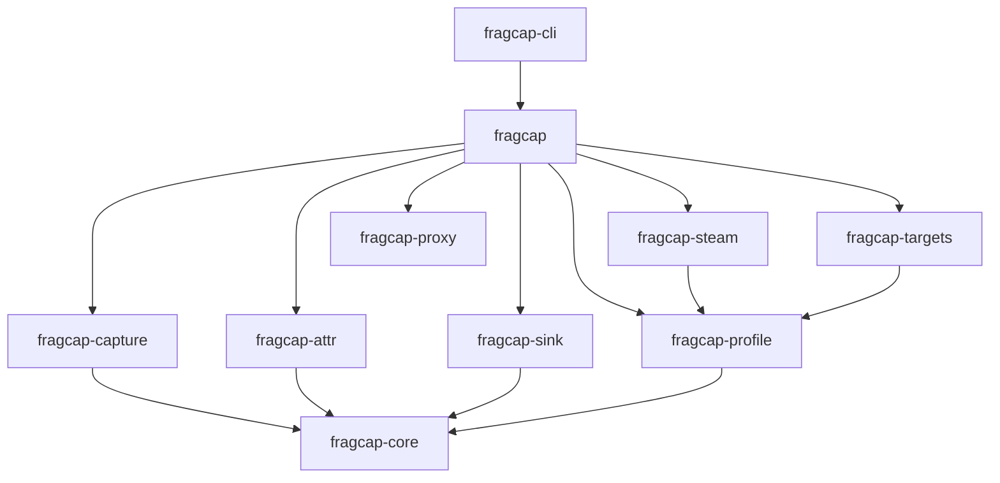
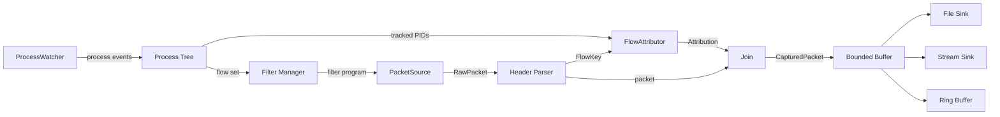
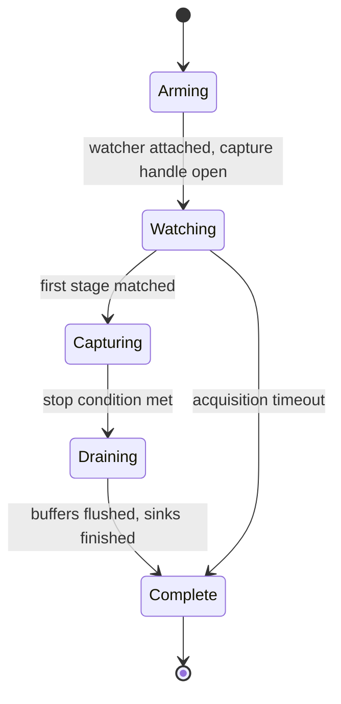
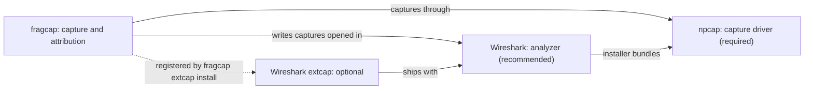
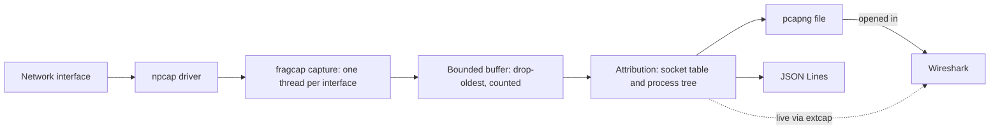
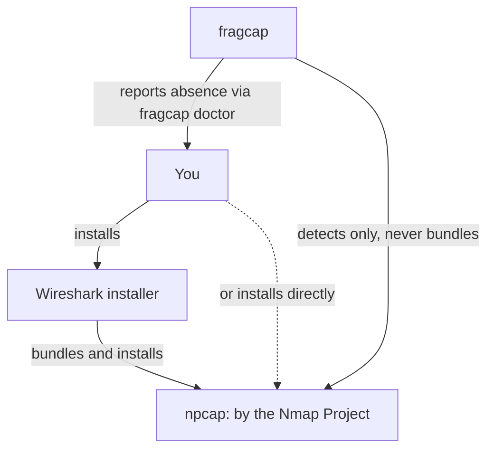
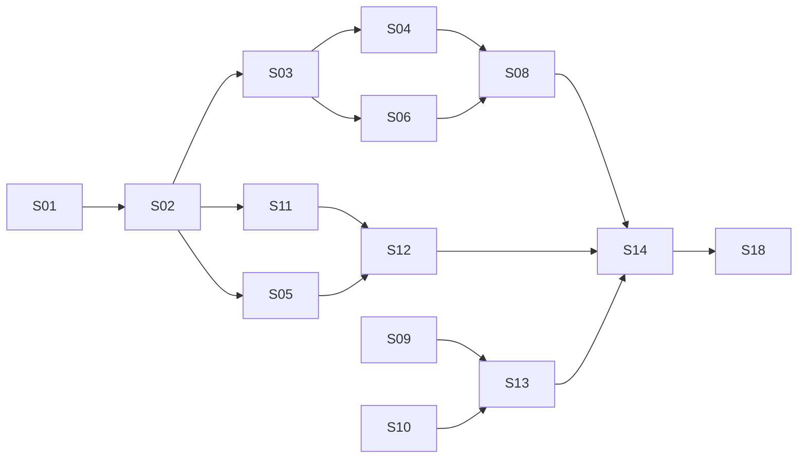

# fragcap Technical Specification

**Status:** Draft \
**Version:** 0.1.52-draft \
**Applies-To:** 0.8.0 \
**Audience:** Human-facing (operator, contributors, agent sessions) \
**Author:** William Thompson (Shruggie LLC, DBA ShruggieTech) \
**Date:** 2026-08-30 \
**Repository:** `github.com/h8rt3rmin8r/fragcap` \
**License:** Apache-2.0 \
**Supersedes:** `fragcap-v0.1.0-Spec-Outline.md`

## Table of Contents

- [1. Document Control](#1-document-control)
- [2. Purpose and Problem Statement](#2-purpose-and-problem-statement)
- [3. Goals, Non-Goals, and Success Criteria](#3-goals-non-goals-and-success-criteria)
- [4. Glossary and Terminology Policy](#4-glossary-and-terminology-policy)
- [5. Domain Background](#5-domain-background)
- [6. Constraints and Assumptions](#6-constraints-and-assumptions)
- [7. Functional Requirements](#7-functional-requirements)
- [8. System Architecture](#8-system-architecture)
- [9. Platform Strategy](#9-platform-strategy)
- [10. Process Detection and Lifecycle](#10-process-detection-and-lifecycle)
- [11. Flow Attribution](#11-flow-attribution)
- [12. Capture Pipeline](#12-capture-pipeline)
- [13. Output Formats](#13-output-formats)
- [14. Sinks and Streaming](#14-sinks-and-streaming)
- [15. Game Profiles](#15-game-profiles)
- [16. Steam Integration](#16-steam-integration)
- [17. Command Line Interface](#17-command-line-interface)
- [18. Shell Wrappers](#18-shell-wrappers)
- [19. Security Posture and Anti-Cheat Interaction](#19-security-posture-and-anti-cheat-interaction)
- [20. Licensing and Third-Party Obligations](#20-licensing-and-third-party-obligations)
- [21. Repository Layout](#21-repository-layout)
- [22. Documentation System](#22-documentation-system)
- [23. Website and Brand](#23-website-and-brand)
- [24. Build, CI, and Release](#24-build-ci-and-release)
- [25. Testing Strategy](#25-testing-strategy)
- [26. Observability and Diagnostics](#26-observability-and-diagnostics)
- [27. Spec Kit Decomposition](#27-spec-kit-decomposition)
- [28. Roadmap Beyond the Current Release](#28-roadmap-beyond-the-current-release)
- [29. Open Questions](#29-open-questions)
- [30. Appendices](#30-appendices)

## 1. Document Control

This document is the architecture of record for fragcap. It defines the
product's purpose, boundaries, architecture, interfaces, and delivery
requirements at a level sufficient to decompose into implementable work
without further design negotiation.

Two version fields in the header mean different things. **Applies-To** names the
released software version this document describes. It tracks the workspace
package version and is bound to it by `cargo xtask spec`, so the specification
and the shipped artifact cannot drift (constitution P-11). **Version** is this
document's own revision, recorded in the history below. As of this revision the
released software runs from v0.1.0, the crates.io namespace-reservation stub
carrying no functionality, through v0.8.0. The per-release scope is in section
27.3.

### 1.1 Relationship to Spec Kit

This specification is the upstream input to the project's GitHub Spec
Kit workflow. It does not replace `specs/` artifacts and it is not
consumed directly by implementing agents.

The relationship runs in one direction. Section 27 maps this document
onto two Spec Kit artifact classes. Durable rules that must survive
every agent session become constitution principles under `.specify/`.
Bounded units of work become numbered feature slices under
`specs/NNN-slug/`, each carrying its own `spec.md`, `plan.md`, and
`tasks.md` generated by the Spec Kit command chain.

When this document and a feature slice disagree, the feature slice
wins for the duration of that slice, and the divergence is recorded in
section 29 for reconciliation at the next version bump. This document
is amended between versions, not during them.

### 1.2 Terminology Conventions

The key words MUST, MUST NOT, REQUIRED, SHALL, SHALL NOT, SHOULD,
SHOULD NOT, RECOMMENDED, MAY, and OPTIONAL carry their RFC 2119
meanings.

Every domain term used in this document has a corresponding entry in
the project glossary. Section 4 defines that requirement and its
enforcement.

### 1.3 Revision History

| Version | Date | Author | Summary |
| --- | --- | --- | --- |
| 0.1.0-draft | 2026-08-06 | W. Thompson | Initial specification. |
| 0.1.1-draft | 2026-08-06 | W. Thompson | Reconnaissance findings applied. A-1 through A-4 confirmed, **A-5 refuted**. Changes to 5.4, 6.2, 8.4, 10.2, 10.3, 11.2, 12.1, 12.2, 15.2, 15.4, 22.3, 28, 29, Appendix D. Adds command line handling rules in 10.2. |
| 0.1.2-draft | 2026-08-06 | W. Thompson | **Withdraws a claim.** 0.1.1-draft asserted that a focal title passes a live credential on its client's command line, and described it as documented. That was inference from a parameter name and was not supported by the capture. An entropy scan of 3,694 command lines found no credential in either title. Sections 6.2, 10.2, 29, and Appendix D corrected. A-5's fallback now cites an observed named pipe instead. |
| 0.1.3-draft | 2026-08-06 | W. Thompson | **Withdraws the redaction rules.** 0.1.1-draft made command line capture opt-in, masked profile paths, redacted parameters by name at the source, and barred command lines from output. All four alter what the instrument reports, contrary to section 2.3 and to the project's stated purpose. Command lines are recorded verbatim, as the original 10.2 specified. Scope remains the operator's control; preparation for publication becomes an explicit downstream operation on a copy. Removes the 15.4 and 10.3 rules that existed only to manage the invented default. Adds constitution principle **P-9, The Instrument Does Not Lie** (constitution 1.1.0), so the reasoning that produced those rules is blocked rather than merely reverted. |
| 0.1.4-draft | 2026-08-10 | W. Thompson | Codifies the release-versioning scheme. v0.1.0 is the crates.io namespace-reservation stub; the first functional release is v0.2.0 (slices through S14); v0.3.0 completes S15 through S18. Partitions the 3.3 success criteria across the two functional releases, retitles section 28, and updates 9.1, 27.3, and scope prose throughout. |
| 0.1.5-draft | 2026-08-10 | W. Thompson | **Reverses the two-release split.** There is now one first public release, v0.2.0, comprising the whole roadmap (S01 through S18); it and the crates.io publication of the functional crates happen only after every slice is complete. Un-partitions the 3.3 success criteria (v0.2.0 is complete when SC-1 through SC-7 hold), collapses the 27.3 release table to a single functional release, retitles section 28 "Beyond v0.2.0", and updates the scope prose. v0.1.0 remains the already-published name-reservation stub. |
| 0.1.6-draft | 2026-08-16 | W. Thompson | **Reconciles the specification with shipped reality (slice S049).** v0.2.0 shipped 2026-08-12 as the first functional release (the S01 through S18 roadmap); v0.3.0 and v0.4.0 followed on 2026-08-14; the document had continued to describe v0.2.0 as unshipped. Adds the **Applies-To** header field (0.4.0), bound to the workspace version by `cargo xtask spec`; makes the title version-neutral; reframes 3.3, updates the 27.3 release table, retitles section 28 version-neutrally, and corrects the scope prose throughout; replaces the 23.1 landing-page paragraph. Adds constitution principles **P-10** (One Path To A Target) and **P-11** (The Specification Describes What Shipped, constitution 1.2.0). Per-release scope beyond v0.2.0 is recorded in CHANGELOG.md rather than restated here. |
| 0.1.7-draft | 2026-08-24 | W. Thompson | **Positions Capture and Deep Capture as first-class product modes (issue #213).** Updates sections 2.1, 3.1, 3.2, 19, 27.2, 28, and 29 so shipped Capture remains passive while planned Deep Capture is explicit, scoped local proxy inspection. Expands constitution principle **P-1** to No Covert Target Instrumentation (constitution 1.4.0), adds target TLS key extraction to the denylist, and records `AI_CONTEXT.md` as required context for cybersecurity-sensitive agent work. |
| 0.1.8-draft | 2026-08-25 | W. Thompson | **Defines the Deep Capture session bundle and output correlation model (issue #216).** Adds section 13.7, updates sections 28 and 29, and records the manifest, artifact authority rules, application JSONL, HAR conditions, sensitive TLS key-log handling, proxy/process sidecars, compatibility update sidecar, cleanup report, and correlation anchors. |
| 0.1.9-draft | 2026-08-25 | W. Thompson | **Adds Deep Capture readiness and cleanup checks to doctor (issue #218).** Extends section 26.3 so doctor reports proxy backend availability, local CA trust state, analyzer key-log readiness, stale proxy ports/processes, stale manifests, TLS key logs, sensitive sidecars, and session storage, with confirmation-gated cleanup for fragcap-owned residue. |
| 0.1.10-draft | 2026-08-26 | W. Thompson | **Adds the first Deep Capture MVP command path (issue #219).** Extends sections 13.3, 13.5, 13.7, 17.2, 28, and 29. The MVP requires one stored target, fact-backed cold Steam managed launch ownership, explicit current-user CA trust confirmation, current scoped-proxy compatibility facts for real targets, a replaceable `mitmdump` backend boundary, packet-side flow correlation, complete or partial session bundles, live analyzer access to requested TLS key logs, observed compatibility fact updates, and controlled local verification without game accounts. Warm Steam and direct-executable cases are side-effect-free preflight refusals. |
| 0.1.11-draft | 2026-08-26 | W. Thompson | **Publishes Deep Capture traffic support and local compatibility evidence (issue #220).** Extends sections 15, 17.2, 19.6, 28, and 29. `targets show` renders a deterministic, non-aggregating matrix from the selected target's local facts, including launch case, evidence source, and freshness. The public reference distinguishes HTTP, HTTPS, WebSocket, non-HTTP TLS, QUIC, UDP, and plaintext behavior without publishing a guessed title list or claiming universal decryption. |
| 0.1.12-draft | 2026-08-26 | W. Thompson | **Corrects homepage positioning and labels the target listing's next command (issues #232 and #208).** Updates sections 17.7, 23.1, and 23.3. The homepage now leads with process-attributed game traffic, distinguishes Capture from Deep Capture, qualifies attribution and inspection claims, states the live-capture and analyzer dependencies accurately, and uses a synthetic current CLI specimen. The target listing ends with the exact labelled footer `Next command:  fragcap capture <row>`. This revision supersedes S057's frozen homepage-copy requirement without modifying its historical artifacts. |
| 0.1.13-draft | 2026-08-26 | W. Thompson | **Adds interactive doctor progress and diagnostic timings (issue #202).** Extends section 26.3 so human terminal `fragcap doctor` runs show probe progress on stderr while preserving final human and JSON report bytes. A hidden `--timings` flag exposes per-probe elapsed times for maintainers without changing report contracts. |
| 0.1.14-draft | 2026-08-26 | W. Thompson | **Marks unverified target technology findings (issue #211).** Extends section 17.7 so `fragcap targets` renders below-verified ENGINE and SENSITIVITIES products with a `?` suffix while verified-or-stronger products remain unmarked. The target-entry export/import contract continues to preserve each finding's raw fidelity token so machine readers can derive the same distinction. |
| 0.1.15-draft | 2026-08-26 | W. Thompson | **Names capped binary-marker scan subjects (issue #206).** Clarifies section 15.7.2 so capped binary-marker coverage warnings name the scanned root, preserve the skipped candidate count, and state that technology detection for that root may be incomplete. |
| 0.1.16-draft | 2026-08-27 | W. Thompson | **Renders target discovery as a listing (issue #207).** Extends section 17.7 so `fragcap targets discover` prints labelled store paths, a headed aligned candidate table with source, identity, fidelity, and name columns, indented evidence lines, and a labelled discovery account block with zero-valued outcomes grouped. |
| 0.1.17-draft | 2026-08-27 | W. Thompson | **Excludes non-capturable Steam app types from target discovery (issue #212).** Extends section 16.2 so Steam `Music`, `Tool`, `Application`, `Config`, and `Video` app types are counted as not-a-game and never emitted as capture candidates, while `Demo`, `Game`, and unknown app types remain eligible. |
| 0.1.18-draft | 2026-08-27 | W. Thompson | **Delegates Bash wrapper compliance to the vendored checker (issue #199).** Extends sections 18.4 and 24.3 so `cargo xtask wrappers` invokes the vendored ShruggieTech Bash checker for every gated Bash script, treats missing scripts or checker bytes as failed checks, and treats a missing Bash-runnable ShellCheck executable as an unable-to-run environment failure. |
| 0.1.19-draft | 2026-08-28 | W. Thompson | **Reconciles public entry points with v0.7.0 (issue #244).** Corrects sections 1, 2.1, 19.1, 27.3, and 28 so current-status prose and release history describe Capture and Deep Capture as shipped modes, record releases through v0.7.0, and leave only unshipped work in the roadmap. The repository landing page, contributor guides, documentation index, issue forms, and GitHub description now project the same bounded product definition. |
| 0.1.20-draft | 2026-08-28 | W. Thompson | **Implements the Deep Capture CA trust-state probe (issue #250).** Corrects section 26.3 so doctor derives exact owned identities from session-manifest thumbprints, reads current-user and local-machine Root inventories without mutation, reports absent, supported, wrong-store, mismatch, and unknown states honestly, and offers cleanup only for an exact observed owned resource. |
| 0.1.21-draft | 2026-08-28 | W. Thompson | **Adds an explicit Deep Capture compatibility bootstrap (issue #251).** Extends sections 13.7, 15, 17.2.1, 19, 25, 26, 28, and 29. Compatibility calibration measures one declared launch case in separate reachability and TLS phases, displays and confirms every bounded effect, retains partial observed facts and cleanup truth, and leaves ordinary Deep Capture's eligibility refusal intact. Corrects the prior MVP inference that final-client routing proves environment propagation; routing is the eligibility fact, while propagation remains independently observed evidence. |
| 0.1.22-draft | 2026-08-29 | W. Thompson | **Makes Deep Capture a library-first session capability (issue #252).** Updates sections 8, 13.7, 17.2.1, 25, and 29. The `fragcap` facade now owns side-effect-free preparation, plan-bound authorization, typed lifecycle ordering, evidence classification, append-only fact selection, bounded resource cleanup, immutable terminal reports, and adapter contracts. The CLI maps arguments, supplies the shipped production effect bridges, presents plans and events, and maps terminal status while the same controlled API remains usable without a driver, elevation, game, remote service, or trust mutation. |
| 0.1.23-draft | 2026-08-29 | W. Thompson | **Records the native proxy backend spike decision (issue #253).** Updates section 29 after an isolated Windows comparison. `hudsucker 0.23.0` passed the controlled protocol, lifecycle, HAR-source, CA-separation, bounded-cache, and client-facing key-log proofs, but its advisory-clean resolved graph is not parseable by Rust 1.82's Cargo and the latest line requires Rust 1.86. The shipped `mitmdump` backend remains unchanged while one smaller native fallback is evaluated. |
| 0.1.24-draft | 2026-08-30 | W. Thompson | **Closes the native proxy backend comparison (issue #274).** Updates section 29 after the isolated `http-mitm-proxy 0.18.0` fallback spike. The smaller candidate passes HTTP/1.1, client-facing HTTPS and HTTP/2, bounded-cache, CA-separation, and HAR-source proofs, but its exact graph is not parseable by Rust 1.82's Cargo and its public API provides neither client-facing TLS key logging nor bounded ownership of spawned connection tasks. Deep Capture retains the shipped external `mitmdump` backend and opens no further speculative backend path. |
| 0.1.25-draft | 2026-08-30 | W. Thompson | **Adds managed direct-executable launch (issue #254).** Updates sections 7.1, 16.4, 17.2.1, 19.2, 19.4, and 29. Capture and Deep Capture consume one immutable launch prepared from the selected stored target. A cold direct target uses an exact executable beneath its install root, an explicit working directory and argument vector, and child-only proxy environment additions without a command shell or post-effect re-resolution. Warm direct targets remain refused. |
| 0.1.26-draft | 2026-08-30 | W. Thompson | **Reconciles the specification and public documentation with v0.8.0.** Updates sections 1, 2.1, and 27.3 so current-status prose and release history include compatibility calibration, the public library-first session API, and managed direct-executable launch. Corrects public current-version examples and the assembled Decisions hierarchy. |
| 0.1.27-draft | 2026-08-30 | W. Thompson | **Makes complete native Rust Deep Capture the required product end state (issues #279, #280, #281, #282, and #291).** Adds the native proxy leaf crate and bounded runtime foundation, raises the workspace MSRV to 1.88 for the selected exact protocol graph, and publishes the #278 ownership, support, refusal, and milestone gates. Explicitly supersedes S100's external-backend end state while retaining mitmdump as the v0.8 functional CLI backend until #290. |
| 0.1.28-draft | 2026-08-30 | W. Thompson | **Completes the secure native proxy foundation (issues #283 through #289).** Adds authenticated loopback admission, bounded upstream policy and native roots, per-session certificate and exact current-user trust ownership, a loss-accounted raw observation contract, and the deterministic local protocol lab. Production forwarding and inspection remain external until #290. |
| 0.1.29-draft | 2026-08-30 | W. Thompson | **Cuts Deep Capture over to native HTTP and TLS (issues #290, #292, and #293).** Removes the production Python and mitmdump path, adds session-authenticated bounded HTTP/1.1 and CONNECT forwarding, terminates approved client TLS with the session authority, establishes a separately verified upstream TLS boundary, maps truthful coarse observations through the facade, and verifies the public CLI with real controlled loopback traffic. Deep Capture remains incomplete until #334. |
| 0.1.30-draft | 2026-08-30 | W. Thompson | **Adds native HTTP/2, complete protocol metadata, bounded streaming bodies, and application JSON Lines version 2 (issues #294, #296, #297, and #301).** Extends sections 13.7, 19.6, 25, and 28.1. HTTP/2 multiplexing retains distinct stream identity and bounded flow control, HTTP metadata preserves the evidence available at each protocol boundary, raw bodies stream independently from bounded retention and derived decoding, and the application artifact is append-only and crash-readable during the session. Deferred protocol families and unavailable HTTP/2 wire representations remain explicit. |
| 0.1.31-draft | 2026-08-30 | W. Thompson | **Adds streaming application protocols (issues #295, #298, and #299).** Extends sections 13.7, 19.6, 25, and 28.1. Verified HTTP/1.1 upgrades and RFC 8441 carry bounded WebSocket frame and message evidence, identity event streams produce incremental SSE fields and events, and HTTP/2 gRPC streams retain method, metadata, opaque envelopes, compression flags, and terminal status without protobuf inference. Observation remains independent from transparent forwarding. |
| 0.1.32-draft | 2026-09-01 | W. Thompson | **Completes native TLS evidence and sensitive artifact ownership (issues #300, #304, and #322).** Extends sections 13.7, 17.2, 19, 25, 26.3, and 28.1. Explicit client-facing TLS key logs are protected and live-flushed, operator-supplied client identities enable upstream mutual TLS, refusal categories preserve only observable evidence, and sensitive artifacts gain pre-traffic access control, bounded recovery, confirmed deletion, and immutable share-copy transformation. General session recovery remains open under #320. |
| 0.1.33-draft | 2026-09-01 | W. Thompson | **Correlates native evidence and versions the bundle contract (issues #302, #303, and #335).** Extends sections 13.7, 25, and 28.1. Accepted proxy connections reconcile after capture against timestamped packet-flow ownership, truthful bounded HAR 1.2 is projected only from complete native application evidence, and manifest version 2 declares authority, sensitivity, finalization, completeness, loss, correlation, and omissions under a published schema. Deep Capture remains incomplete until #334. |
| 0.1.34-draft | 2026-09-01 | W. Thompson | **Adds the native HTTP and TLS conformance gate (issue #305).** Extends sections 25 and 28.1. A closed versioned matrix requires two independent client and origin lineages for HTTP/1.1, HTTPS, HTTP/2, WebSocket, SSE, and gRPC, exact expected and observed outcomes, zero skipped required rows, complete native artifact reconciliation, and unmodified TShark consumption in a dedicated CI tier. Generic transports remain in milestone 3 and Deep Capture remains incomplete until #334. |
| 0.1.35-draft | 2026-09-01 | W. Thompson | **Adds exact managed publisher-launcher chains (issue #307).** Extends sections 16.4, 17.2.1, and 28.1. One stored ordered role chain now supplies the shared Capture profile and managed launch, fragcap starts only a proven-cold root with child-scoped routing, and creation-time ancestry binds declared intermediates to the terminal client. Exact absolute paths may name external publisher installs; relative paths remain confined beneath the game install root. Warm and uncertain chains remain refused, and Deep Capture remains incomplete until #334. |
| 0.1.36-draft | 2026-09-01 | W. Thompson | **Adds cold platform-client ownership (issue #308).** Extends sections 16.4, 17.2.1, and 28.1. Deep Capture prepares an exact Steam root and retained title dispatch, starts the cold root with child-scoped routing, waits until the exact created process binds to the platform role, and then dispatches the selected title once. Terminal ownership requires the declared client beneath that platform ancestry. Warm, escaped, exited, failed, ambiguous, and timed-out paths remain named non-success outcomes. Routing and propagation remain separate evidence, ordinary Capture keeps Steam protocol launch, and Deep Capture remains incomplete until #334. |
| 0.1.37-draft | 2026-09-01 | W. Thompson | **Adds authenticated native SOCKS5 TCP routing (issue #310).** Extends sections 17.2.1, 19, 25, and 28.1. The shared loopback listener accepts only RFC 1929 username/password credentials bound to the current session capability, supports bounded CONNECT for IPv4, IPv6, and proxy-resolved domain destinations under the existing upstream policy, preserves full-duplex bytes and half-close, and records typed negotiation, destination, classification, transfer, and terminal evidence. UDP ASSOCIATE and generic TCP payload semantics remain deferred, and Deep Capture remains incomplete until #334. |
| 0.1.37-draft | 2026-09-01 | W. Thompson | **Adds the explicit warm-to-cold Deep Capture workflow (issue #309).** Extends sections 17.2.1, 26, 28, and 29. A selected bounded workflow reports identity-uncertain warm image observations, waits while the operator uses normal application shutdown, freshly resolves and prepares the cold launch, and requires a second authorization before effects. fragcap performs no process-control action or force-kill fallback. |
| 0.1.38-draft | 2026-09-02 | W. Thompson | **Adds scoped SOCKS5 UDP association (issue #311).** Extends sections 19, 25, and 28.1. One authenticated TCP control connection owns one finite UDP relay with immutable client endpoint pinning, proxy-owned domain resolution, existing destination policy, fixed family sockets, bounded exact contacted-peer mappings, reply-source validation, explicit fragmentation refusal, metadata-only evidence, loss conservation, and terminal cleanup. Generic UDP payload evidence remains #313, and Deep Capture remains incomplete until #334. |
| 0.1.39-draft | 2026-09-02 | W. Thompson | **Adds bounded generic TCP and non-HTTP TLS evidence (issue #312).** Extends sections 13.7, 19.6, 25, and 28.1. Authenticated SOCKS5 tunnels retain bounded directional plaintext or encrypted chunks with explicit provenance, while trusted no-ALPN CONNECT tunnels may terminate under the session authority and retain protocol-unknown decrypted chunks after separately verified upstream TLS. Forwarding remains independent from retention, HTTP keeps its existing engines, and trust, pinning, client-auth, protocol, and transport failures never silently downgrade. Generic UDP remains #313, and Deep Capture remains incomplete until #334. |
| 0.1.40-draft | 2026-09-03 | W. Thompson | **Adds bounded generic UDP datagram evidence (issue #313).** Extends sections 13.7, 19.6, 25, and 28.1. Authenticated SOCKS5 UDP associations retain one exact application record per accepted ingress datagram with direction, independent sequence, endpoints, timestamp, observed length, bounded payload prefix, and retention outcome. Forwarding remains complete and independent from evidence retention and storage. Queue loss, bounded identity overflow, and platform-observed socket errors are explicit without inferring ICMP facts. Unrouted UDP remains packet-only, QUIC remains #314, and Deep Capture remains incomplete until #334. |
| 0.1.41-draft | 2026-09-03 | W. Thompson | **Adds scoped QUIC and HTTP/3 inspection (issue #314).** Extends sections 13.7, 19.6, 25, and 28.1. Authenticated target-scoped UDP routes admit immutable QUIC connection pairs under the session authority and independently verified upstream TLS. Exact-pinned Quinn and Hyperium HTTP/3 provide TLS 1.3, ALPN-selected HTTP/3, finite transport ownership, and bounded connection, stream, datagram, metadata, and body evidence. Unknown ALPN, zero round-trip application data, and active migration are refused without transparent fallback. Unrouted QUIC remains packet-only, IPv6 parity remains #315, and Deep Capture remains incomplete until #334. |
| 0.1.42-draft | 2026-09-03 | W. Thompson | **Completes native IPv6 parity (issue #315).** Extends sections 13.7, 17.2.1, 19.6, 25, 26.3, and 28.1. One immutable plan now authorizes one exact IPv4 or IPv6 loopback socket, generated IPv6 routes use bracketed authorities, scoped IPv6 literals retain bounded numeric socket indexes, and mapped aliases have one canonical policy and correlation identity. Proxy-owned TCP connection establishment uses a finite 250 ms staggered dual-stack race with one winner and cancelled losers. HTTP, HTTPS, SOCKS, TCP, UDP, and QUIC controlled rows cover IPv6, while Doctor reports exact IPv4 and IPv6 bind readiness independently. S119 adds no dependency or wildcard bind, and Deep Capture remains incomplete until #334. |
| 0.1.43-draft | 2026-09-03 | W. Thompson | **Makes Deep Capture protocol classification and omission reasons exhaustive (issue #316).** Extends sections 13.7, 19.6, 25, and 28.1. A versioned facade contract separates traffic family, detection state, inspectability, and stable reason for every shipped protocol path. Application records, terminal summaries, compatibility eligibility, and typed manifest omissions retain their separate authorities and reconcile without converting parser, retention, writer, trust, or routing failures into target support claims. S120 adds no dependency, routing behavior, or completion claim. |
| 0.1.44-draft | 2026-09-03 | W. Thompson | **Completes the native compatibility calibration matrix (issue #317).** Extends sections 13.7, 15, 17.2.1, 19, 25, and 28.1. Every calibration names one exact launch case, routing strategy, loopback family, protocol case, backend and product version, and target version when available. Version-10 storage preserves append-only conflicts and legacy rows, while only the latest exact current applicable routing fact can authorize a session. S121 adds no dependency, bypass behavior, or Deep Capture completion claim. |
| 0.1.45-draft | 2026-09-03 | W. Thompson | **Adds explicit proxy bypass and local-destination policy (issue #318).** Extends sections 13.7, 17.2.1, 19, 25, and 28.1. Typed canonical rules cover DNS domains, IP addresses, CIDRs, ports, and IPv6; bare and leading-dot DNS inputs both include descendants so conventional `NO_PROXY` clients cannot broaden an exact-name claim; the exact listener remains separate session infrastructure; uppercase and lowercase child proxy variables are plan-owned; every proxied DNS answer remains subject to resolved-address policy. Bypass is visible scope rather than proxy loss. S122 adds no dependency, system proxy mutation, transparent fallback, or Deep Capture completion claim. |
| 0.1.46-draft | 2026-09-03 | W. Thompson | **Completes native process lifecycle evidence (issue #319).** Extends sections 10, 13.7, 19, 25, and 28.1. A bounded capture report joins managed launch receipts, ETW starts and exits, query-only snapshots, declared stage transitions, packet-derived socket ownership, watcher loss, and terminal state. PID plus observed creation time defines an instance; missing authority remains explicit; the versioned process trace trailer drives compatibility and manifest truth. S123 adds no target handle, second attribution path, dependency, or Deep Capture completion claim. |
| 0.1.47-draft | 2026-09-03 | W. Thompson | **Completes native Doctor runtime readiness and residue diagnostics (issue #321).** Extends sections 26.3 and 28.1. Doctor derives independent Capture and Deep Capture verdicts from one check set, inventories bounded native journal and owner evidence without mutation, proves an active session with a generation lease rather than PID liveness, and offers only exact journal recovery. Healthy retained evidence is history, every inventory limitation blocks a false-clean Deep Capture verdict, and S124 adds no process handle, dependency package, packaging claim, or completion claim. |
| 0.1.48-draft | 2026-09-04 | W. Thompson | **Completes the native Deep Capture threat model and abuse-case gate (issue #323).** Extends sections 19, 25, and 28.1. One versioned registry maps every trust boundary, sensitive asset, and high-risk abuse case to prevention, detection, containment, evidence, and exact executable negative tests. The ordinary CI gate rejects missing or ignored tests and unreviewed drift in the exhaustive protocol-family or direct proxy dependency inventories. S125 records no residual-risk acceptance, adds no dependency or runtime behavior, and does not claim Deep Capture complete before #334. |
| 0.1.49-draft | 2026-09-04 | W. Thompson | **Adds exhaustive native parser and artifact fuzzing (issue #324).** Extends sections 24.3, 25.5, and 28.1. A versioned registry maps twenty fragcap-owned protocol and artifact surfaces to six bounded libFuzzer targets, minimized synthetic corpora, stable deterministic replay, and an exact-pinned CI matrix. Dependency-owned wire decoders remain explicit boundaries. S126 isolates its fuzz dependency graph, adds no product lock package or runtime behavior, and leaves Deep Capture incomplete until #334. |
| 0.1.50-draft | 2026-09-04 | W. Thompson | **Adds exhaustive native failure-injection evidence (issue #325).** Extends sections 25.5 and 28.1. A versioned registry generates before and after scenarios for seven journaled effects and eight checked lifecycle transitions. Ten controlled failure families execute through the production coordinator and resource journal while terminal, artifact, fact, event, cleanup, journal, and recovery authorities remain independent. Source-derived inventory checks prevent unreviewed gaps. S127 adds no dependency, runtime fault switch, destructive host test, or Deep Capture completion claim. |
| 0.1.51-draft | 2026-09-04 | W. Thompson | **Adds the bounded native performance envelope (issue #326).** Extends sections 25.5 and 28.1. A reviewed registry freezes fourteen production protocol and payload-retention cases, short and manual two-hour soak profiles, finite timing and resource limits, seven independent worker windows, immutable JSON Lines evidence, and exact runtime failure, task, cache, queue, loss, and shutdown accounting. Windows and Ubuntu run the short gate; Windows exposes soak evidence by manual dispatch. Final S128 acceptance records the project owner's explicit approval of 1,916 zero-failure terminals across 4,316 seconds without altering the interrupted raw report. The isolated measurement lock adds no product dependency. |
| 0.1.52-draft | 2026-09-04 | W. Thompson | **Adds the finite native Windows integration authority (issue #327).** Extends sections 24.3, 25.5, and 28.1. A closed registry maps every required Windows completion domain to exact hosted or physical evidence. The hosted gate builds the official feature set from a temporary Npcap SDK, exercises a relocated staged binary, and publishes only a sanitized summary. Explicitly authorized physical evidence covers non-admin refusal, installed Npcap, current-user trust cleanup, unmodified analyzer use, and zero owned residue. S129 validates the staged install layout while final installer and archive behavior remains #329. |

## 2. Purpose and Problem Statement

### 2.1 What fragcap Is

fragcap is a Rust library and command line tool for game-network
observability on Windows. Its shipped **Capture** mode captures network
traffic belonging to a specific game client and attributes every captured
packet to the process that produced it. It writes attributed captures to disk
in a pcapng-compatible format, and streams them live to downstream consumers
over named pipes, Unix domain sockets, or TCP.

The shipped **Deep Capture** mode adds explicit, scoped local proxy inspection
for targets whose traffic can be routed through a proxy. Deep Capture makes
supported application-layer traffic inspectable for game developers and
researchers without process injection, function hooking, target memory reads,
packet interception drivers, or target TLS key extraction.

The library is the product. The command line tool is one consumer of it, and
the shell wrappers are consumers of the command line tool. Deep Capture's
session orchestration is exposed through the public facade API; the CLI maps
arguments and supplies the shipped production effect bridges.

Deep Capture is functional but incomplete. S108 extends the native Rust sole
production path with bounded HTTP/2 multiplexing, protocol-faithful HTTP
metadata, incrementally retained bodies, bounded gzip, deflate, and Brotli
decoding, a live application JSON Lines version 2 stream, WebSocket frame and
message inspection, incremental SSE, schema-free gRPC envelopes, proxy-owned TLS
key logs, explicit upstream client identities, and protected sensitive-artifact
lifecycle operations, final packet/process correlation, truthful bounded HAR
1.2 projection, and versioned native bundle authority. Client-facing TLS
uses the exact session authority and upstream TLS is verified independently.
Issue #278 is the completion authority. Deep Capture
MUST NOT be described as self-contained or feature-complete until issue #334 closes.

### 2.2 The Problem

Packet capture is solved. Attribution is not.

Capture on every mainstream operating system happens at the network
driver layer, below the socket layer. By the time a packet reaches a
capture handle, the operating system has already discarded the
association between that packet and the process that sent or received
it. A capture file records that a UDP datagram left the machine on
port 51834. It does not record that the game client sent it.

Recovering that association requires joining each packet's
[5-tuple](#) against a separately maintained table of open sockets and
their owning process identifiers. Every tool that offers per-process
capture performs this join internally, and the tools differ almost
entirely in how well they do it.

Games make the join harder than average in three specific ways.

Game clients are launched indirectly. A title acquired through Steam
is typically started by Steam, which starts a publisher launcher,
which starts the actual client. The launcher performs account
authentication and server selection, then hands off. Naive detection
that waits for the client process to appear has already missed the
authentication exchange, which is frequently the most information-dense
traffic of the entire session.

Process ancestry is unreliable on Windows. Parent process identifiers
are recorded but not maintained, and identifier values are recycled. By
the time a client process is observed, its recorded parent may be dead
and the number reassigned to something unrelated. Reconstructing the
launch chain after the fact does not work.

Platform services generate constant background traffic. A persistent
publisher client maintains its own connections for presence, overlay,
entitlement checks, and telemetry for the entire session. Capturing an
entire process tree without discrimination buries gameplay traffic
under service noise.

fragcap solves all three.

### 2.3 Why It Exists

fragcap is built as an instrument for observing where network theory
and shipped game networking diverge. Published protocol design and
production game networking disagree in interesting ways, and those
disagreements are visible only with correct per-process attribution
across the full session lifecycle, from launcher authentication through
client shutdown.

This motivation shapes priority. Fidelity of observation outranks
throughput. Correct attribution outranks capture completeness.
Compatibility with existing analysis tooling outranks feature
richness.

## 3. Goals, Non-Goals, and Success Criteria

### 3.1 Goals

**G-1. Correct attribution across the launch chain.** Every captured
packet carries the process identifier, executable name, and profile
role of its owning process, from launcher start through client exit.

**G-2. Zero-modification interoperability.** fragcap output opens in
unmodified Wireshark, tshark, and any other pcapng reader with no
plugins installed.

**G-3. Library-first design.** The public Rust API exposes every
capability the CLI uses. Third-party crates depend on fragcap without
depending on its binary.

**G-4. Game-agnostic core.** No crate below `fragcap-profile` contains
knowledge of any specific title. Adding a game requires writing a TOML
profile, not modifying Rust.

**G-5. Honest accounting.** Dropped packets, unattributed packets, and
capture gaps are counted and reported. The tool never silently loses
data.

**G-6. Mode-specific safety.** Capture mode observes passively. Deep Capture is
active local proxy inspection only when the operator selected it explicitly.
Neither mode injects code, modifies executables, installs hooks, reads target
memory, or extracts TLS keys from a target process.

**G-7. Unified capture experience.** Deep Capture augments the Capture session
rather than replacing it. Packet capture, process attribution, logs, statistics,
and session outputs remain correlated so a user can move from encrypted Capture
evidence to decrypted Deep Capture evidence without learning a separate product.

### 3.2 Non-Goals

Non-goals bind as strongly as goals. Each is a rule that constrains
implementation, and each becomes a constitution principle in section
27.

**NG-1. No process injection or memory access.** fragcap never loads
code into a target, never installs hooks, and never opens a handle to a
target process carrying memory-read rights.

**NG-2. No packet modification or injection.** fragcap never alters,
drops, delays, replays, or synthesizes traffic on a live connection.
Capture handles are opened for reading.

**NG-3. No traffic interception drivers.** fragcap uses capture
drivers, not filtering or interception drivers. Section 19 defines the
allowlist.

**NG-4. No game-specific protocol logic in core.** Protocol dissection
is a declared plugin seam, deferred to the roadmap (section 28). No
dissector ships in the core crates at any version.

**NG-5. Not an ambient proxy, accelerator, or optimizer.** fragcap is not a
general system proxy, network accelerator, latency optimizer, or routing tool.
Deep Capture may place a selected target session on the path through a local
inspection proxy, but that proxy is target-scoped, explicit, reversible, and
auditable.

**NG-6. No covert decryption or target key extraction.** Capture mode stores
encrypted payloads as ciphertext. Deep Capture inspects only traffic routed
through its local proxy under explicit operator control and for currently
supported traffic types. fragcap does not break encryption, downgrade
negotiation, bypass certificate pinning, or extract TLS keys from a target
process.

### 3.3 Success Criteria

v0.2.0 was the first functional release, comprising the whole roadmap; v0.1.0
is a crates.io namespace-reservation stub carrying no functionality
(section 27.3). It shipped on 2026-08-12 meeting the criteria below, which
remain the standing success criteria for the product's core across every
functional release.

**A functional release holds SC-1 through SC-7.**

**SC-1.** A single `fragcap capture --target eso --launch` invocation, issued
before the game starts, produces one capture file covering launcher
authentication through client exit, with every packet attributed to a
named role.

**SC-2.** That file opens in unmodified Wireshark with per-packet
attribution visible in the packet comment pane, and the display filter
`frame.comment contains "role=client"` isolates client traffic.

**SC-3.** `fragcap doctor` correctly reports capture readiness on a
clean Windows 11 installation, including the specific remediation step
when npcap is absent.

**SC-4.** The full pipeline, from packet source through sink, runs in
continuous integration on a runner with no capture driver installed and
no game present, using the replay source and scripted attributor.

SC-5 through SC-7 cover the remaining core capabilities and held at v0.2.0.

**SC-5.** A downstream process consumes a live stream over a named pipe
and over TCP, and Wireshark attaches to a running capture through the
extcap interface.

**SC-6.** Every domain term appearing in project documentation resolves
to a glossary entry, verified by the documentation linter in
continuous integration.

**SC-7.** Attribution accuracy on a full ESO session is at or above 99
percent of captured packets belonging to profiled processes, measured
against socket table ground truth.

## 4. Glossary and Terminology Policy

### 4.1 Rationale

fragcap sits at the intersection of five specialist domains: network
protocols, Windows kernel internals, the Rust ecosystem, anti-cheat and
security tooling, and game platform infrastructure. No contributor is
fluent in all five. The project's difficulty concentrates in the seams
between them, and undefined vocabulary accumulates precisely at those
seams.

The glossary is therefore a first-class deliverable with an enforced
contract, not a documentation appendix.

### 4.2 The Undefined Term Rule

No domain term, acronym, or initialism appears in any project document
without a corresponding glossary entry. This is enforced mechanically,
not by review discipline. The documentation linter maintains a term
inventory and fails the build on any unresolved usage.

The rule applies to the specification, the README, architecture
documents, code comments intended for human readers, and website copy.
It does not apply to identifiers in source code.

### 4.3 Entry Structure

Every entry conforms to the following structure.

```markdown
## Term Name

**Also known as:** alternate names, acronym expansions

One-sentence blurb in plain language. Avoids other glossary terms
where possible.

Detail paragraph. Uses other glossary terms freely, and every one of
them is cross-linked. Explains the concept generally, without
reference to fragcap.

{: .matters }
> One or two sentences connecting the concept to this codebase and
> the decisions it drove.

**See also:** cross-links to related entries

**References:**

- Primary source, with a note on what it is
- Secondary source, with a note on what it is
```

The blurb serves readers who need only a reminder. The detail
paragraph serves readers encountering the concept for the first time.
The "why it matters here" callout is the field that distinguishes this
glossary from a general reference work, and it is REQUIRED on any term
that influenced a design decision.

### 4.4 Categories

Entries are stored one page per category and indexed alphabetically
across all categories.

| Category | Scope |
| --- | --- |
| Capture and Networking | Capture mechanics, protocols, filtering |
| Windows Internals | Kernel subsystems, APIs, tracing facilities |
| Process and Attribution | Process identity, lifecycle, socket ownership |
| Anti-Cheat and Security | Detection mechanisms, technique classification |
| Rust and Tooling | Language, ecosystem, and build vocabulary |
| Platform and Distribution | Game platforms, launchers, packaging |
| File and Wire Formats | Capture formats, encodings, block structures |
| Command Line and Diagnostics | CLI commands, flags, readiness checks, lifecycle events |

Category assignment is single-valued. A term belonging to two
categories is filed under its primary domain and cross-linked from the
other.

### 4.5 Reference Quality

References prefer primary sources. Vendor documentation outranks blog
commentary on vendor documentation. Original papers and RFCs outrank
summaries. Manual pages outrank forum answers.

Secondary sources are permitted as an additional reference where they
explain something the primary source assumes the reader already knows.
They do not replace the primary source.

### 4.6 Enforcement

The documentation linter runs in continuous integration and enforces
four checks.

1. Every entry contains a blurb, a detail paragraph, and a references
   section. Entries influencing a design decision also contain the
   "why it matters here" callout.
2. Every internal cross-link resolves to an existing entry anchor.
3. Every term appearing in project documentation resolves to an entry.
4. Every external reference URL responds successfully. This check runs
   on a weekly schedule rather than per commit, because link rot is
   real and unrelated to the change under review.

The linter also regenerates the alphabetical index from category page
contents, which removes any possibility of index drift.

## 5. Domain Background

This section establishes the shared context required to follow the
architectural decisions that follow. Readers already fluent in a given
subsection may skip it. Every term introduced here has a glossary
entry.

### 5.1 The Capture Stack on Windows

Capture on Windows is provided by npcap, which installs an NDIS
lightweight filter driver into the network stack and exposes the
portable libpcap API on top of it. Software written against libpcap
compiles and runs on Windows against npcap with no source changes,
which is why Wireshark, Nmap, and comparable tools ship a single
codebase across platforms.

The filter driver observes frames as they cross the network interface.
It sees Ethernet framing, IP headers, transport headers, and payload.
It does not see sockets, handles, or processes, because those
abstractions live above it in the stack.

npcap optionally installs a loopback capture adapter, which surfaces
traffic between processes on the same machine. Loopback traffic never
touches a physical interface and is invisible to a normal capture
handle, so this adapter is required for observing local inter-process
communication.

### 5.2 The Attribution Problem

The operating system knows which process owns which socket. It exposes
this through a socket table: on Windows through the IP Helper API, on
Linux through procfs and netlink. The table maps a local address and
port, plus a protocol, to an owning process identifier.

Attribution joins captured packets against this table using the packet
5-tuple. The join is straightforward. Its accuracy is not, because the
table is a live structure and the capture is a stream. A socket opened
and closed between two table reads leaves packets in the capture with
no corresponding table entry.

The severity of this race depends entirely on connection lifetime.
Short-lived request-response connections are frequently missed. Long
lived session connections, which is what game clients hold, are
captured reliably by periodic sampling.

### 5.3 Process Identity and Ancestry on Windows

A Windows process identifier is a value from a reusable pool. When a
process exits, its identifier returns to the pool and may be assigned
to a new process. Identifier values are therefore unique among live
processes but not unique over time.

Each process records the identifier of its creator. That record is not
updated when the creator exits. Reading a parent identifier from a
running process and looking it up yields either nothing, or a process
that has no relationship to the one under examination.

Reliable ancestry requires observing process creation as it happens,
because the parent relationship is only unambiguous at the instant of
creation. Windows exposes creation events through Event Tracing for
Windows, whose kernel process provider emits an event for every process
start and exit, carrying the parent identifier as recorded at that
instant.

### 5.4 The Platform Launcher Chain

A title acquired through Steam does not necessarily start when Steam
starts it. Two of the launch topologies relevant to fragcap are:

**Transient launcher.** Steam starts a publisher launcher. The launcher
authenticates the account, retrieves patch and server metadata, starts
the game client, and exits. The launcher's network activity is
concentrated in a short window before the client exists.

**Persistent platform service.** Steam starts a publisher platform
client, which starts the game client and remains running for the entire
session. The platform client maintains independent connections for
presence, overlay, entitlement, and telemetry throughout.

Both topologies defeat detection strategies that watch for the game
executable, and both require the observer to be running before the
chain begins.

**Observed depth.** Reconnaissance on the two focal titles found chains
deeper than either topology suggests in isolation. Both are recorded in
Appendix D; the shapes are:

```text
ESO   explorer.exe -> steam.exe -> zosSteamStarter.exe
                   -> Bethesda.net_Launcher.exe -> eso64.exe

DIV2  explorer.exe -> steam.exe -> TheDivision2.exe(A)
                   -> UbisoftGameLauncher.exe -> TheDivision2.exe(B)
                   -> EACLaunch.exe -> TheDivision2.exe(C)
```

Five levels and six levels respectively, counting from the shell. Three
observations follow, and each has a design consequence.

Chains contain **pure shims that hold no sockets at all**:
`zosSteamStarter.exe`, `UbisoftGameLauncher.exe`, and two of the three
Div2 processes transmit nothing. A detector that stops at the first
process bearing the expected image name binds to one of these and
observes an empty session.

Chains contain **an anti-cheat launcher in the ancestry path**. The Div2
client is a child of `EACLaunch.exe`. fragcap observes this relationship
through creation-time telemetry and does not interact with the
anti-cheat process in any way; see section 19.

The same image name **recurs at different depths with different roles**.
Three processes are named `TheDivision2.exe`, and only the last holds
sockets. Image name alone is therefore not a sufficient identity, which
is why section 10.3 provides `descends_from` and why section 15.4
requires its use where a name is ambiguous.

### 5.5 What Game Anti-Cheat Observes

Anti-cheat systems in current use monitor a defined set of behaviors
associated with cheating: code injected into the protected process,
inline hooks placed in its functions, handles opened to it carrying
memory access rights, drivers that intercept or modify its traffic,
and modifications to its executable image on disk or in memory.

These systems do not treat network observation as a cheating behavior,
because observation confers no gameplay advantage. Capture drivers are
ubiquitous in legitimate software and are not themselves signals.

The distinction that matters for design is between capture drivers,
which copy frames for observation, and filtering or interception
drivers, which sit inline and can alter traffic. The first class is
unremarkable. The second overlaps directly with cheat tooling. Section
19 formalizes this distinction into an enforced technique allowlist.

## 6. Constraints and Assumptions

### 6.1 Hard Constraints

Constraints are properties of the environment that fragcap accepts and
designs around. They are not negotiable within the functional
releases.

**C-1. Windows 11 is the target platform.** The capture binary is built
for the `x86_64-pc-windows-msvc` target and runs natively on Windows.

**C-2. WSL2 cannot host the capture binary.** WSL2 runs a separate
Linux kernel behind a virtualized network interface. It cannot observe
host interface traffic under default networking, and under mirrored
networking it still cannot read Windows process identifiers or socket
tables. Attribution from inside WSL2 is structurally impossible, not
merely degraded.

**C-3. npcap is a runtime prerequisite and is not redistributable.**
Its license permits free use and restricts bundling. fragcap detects
npcap and guides installation. It never ships it. Section 20 covers the
full obligation.

**C-4. Capture requires elevated privilege.** Opening a capture handle
and consuming kernel ETW providers both require administrative rights
on Windows.

**C-5. Encrypted payloads remain encrypted.** fragcap observes
ciphertext where transport encryption is in use, and section 3.2
forbids any attempt to change that.

### 6.2 Working Assumptions

Assumptions are beliefs about the environment that are load-bearing and
not yet fully verified. Each carries a validation method and a defined
fallback. Validation status is tracked in section 29.

**A-1. Game traffic is attributable by 5-tuple.** **CONFIRMED,
2026-08-06.**

- *Validation:* Compare captured flows against socket table snapshots
  across a full session for each focal title.
- *Fallback:* If a title multiplexes gameplay through a shared platform
  socket, attribution resolves to the platform process, and the profile
  marks the affected role as `attribution = "coarse"`.
- *Result:* 99.45 and 98.78 percent of frames attributed. All gameplay
  resolved to the client process. Unresolved conversations were
  ephemeral name-resolution sockets carrying under a tenth of one
  percent of UDP bytes. The fallback was not needed. Note the caveat in
  section 8.4: the 5-tuple is available for TCP only, and UDP resolves
  on the local endpoint, which proved sufficient for both titles.

**A-2. Game session connections are long-lived enough for poll-based
attribution.**

- *Validation:* Measure connection lifetime distribution. Confirm the
  fraction of packets on connections shorter than the poll interval.
- *Fallback:* Reduce poll interval, then promote to event-driven socket
  tracking if the measured loss exceeds the SC-7 threshold.
- *Result:* **CONFIRMED, 2026-08-06.** Of 11,246 and 1,003 connections
  observed opening and closing, none lived less than the 250 millisecond
  measurement interval. Gameplay connections ran for hundreds of
  seconds. Neither fallback step is warranted, and the event-driven
  backend in section 28 stays deferred on evidence rather than on
  preference.

**A-3. Neither focal title tunnels gameplay through a relay service.**

- *Validation:* Inspect a session capture for relay-characteristic
  traffic patterns and endpoint ownership.
- *Fallback:* Relay-tunneled traffic attributes to the platform
  process. The profile declares the relay, and section 11 gains a
  documented coarse-attribution path.
- *Result:* **CONFIRMED, 2026-08-06.** Neither title is relayed. One
  reaches publisher-operated address space directly; the other reaches
  publisher infrastructure hosted on commercial cloud providers, which
  is ordinary hosting rather than relaying, since no intermediary
  re-originates the traffic. The fallback was not needed. Both titles
  reach gameplay endpoints **by address with no preceding name
  resolution**, which section 12.2 depends on.

**A-4. Launcher and client traffic are separable by process.**

- *Validation:* Confirm each stage holds its own sockets rather than
  sharing an inherited handle.
- *Fallback:* Roles collapse to a single attributed process, and role
  separation becomes advisory rather than authoritative.
- *Result:* **CONFIRMED, 2026-08-06.** Every stage in both chains holds
  its own sockets on its own port ranges, with no shared or inherited
  handle observed. Role separation is authoritative. The fallback was
  not needed. Two qualifications, both recorded in section 5.4: several
  chain members are shims holding no sockets at all, and one title runs
  three processes under a single image name of which only the last
  transmits, so identifying the right process requires ancestry rather
  than image name.

**A-5. npcap's loopback adapter captures launcher-to-client local
traffic.** **REFUTED, 2026-08-06. The fallback is in effect.**

- *Validation:* Capture on the loopback adapter during a launch
  sequence and confirm the handoff is visible.
- *Fallback:* If the handoff uses named pipes or shared memory rather
  than loopback sockets, it is out of scope for a network capture tool
  and is documented as such.
- *Result:* No launcher-to-client loopback conversation exists in
  either focal title. Every loopback conversation attributed during the
  session had the same process on both ends, including the largest at
  5.4 MB. **The fallback applies as written.** One title's platform
  service is passed a named pipe path on its command line,
  `\\.\pipe\terminal_1_uplay_service_ipc_pipe_`, base64 encoded, which
  is direct evidence for the named-pipe mechanism the fallback
  anticipated. The other title's client receives parameters that appear
  intended for a handoff but are unset on the platform launch path, so
  its mechanism is **not established**; see Q-10.

  Either way the conclusion for fragcap is the same: the handoff is not
  a packet and will not appear in a capture. Sections 12.1 and 22.3
  carry the consequences.

## 7. Functional Requirements

Requirements are numbered, testable, and traceable to feature slices in
section 27. Each states what fragcap does, not how it does it.

### 7.1 Target Acquisition

**FR-1. Profile-driven detection.** fragcap detects target processes by
evaluating profile match rules against observed process creation
events. Detection covers every stage declared in the profile, in any
order, regardless of which stage starts first.

**FR-2. Pre-attachment.** fragcap attaches its process watcher and
opens its capture handle before the target process chain begins,
ensuring no traffic is missed between detection and capture start.

**FR-3. Managed launch.** `fragcap capture --launch` optionally starts the target
through its platform, guaranteeing that the watcher is attached before
the chain begins and eliminating the startup race entirely.

**FR-4. Ad-hoc targeting.** fragcap targets a running process by
identifier or executable name without a profile, producing attributed
capture with a single implicit role.

**FR-5. Multi-instance handling.** When several processes match one
stage, fragcap tracks all of them and attributes packets to the
specific instance that owns each flow.

**FR-6. Watch mode (the default launch-agnostic path).** fragcap's
default capture path does not require it to be the launcher. In watch
mode fragcap arms its process watcher and sinks and captures the first
process matching the target identity, however and wherever it was
started, and attaches to one already running at arm (from the startup
snapshot of section 19.2). Managed launch (FR-3) is a convenience layered
on top for the easy platform case, never the spine. This is what makes a
modded install launched from a mod manager, a standalone title, and every
non-storefront game capturable at all: the only durable fact is that at
runtime a process exists that is the game and holds sockets (section
15.7). The identity is an executable name plus a path anchor; `descends_from`
is reserved for runtime disambiguation, not the identity's spine, because a
modded launch has alien ancestry. The path anchor is matched against the full
image path, which a process starting after arm supplies but the startup snapshot
of section 19.2 does not: the toolhelp enumeration carries only the executable
name, because reading a running process's full path means opening a handle the
no-handle posture of P-1 declines. So a path anchor disambiguates a target that
starts after arm, and an already-running target is attached by executable name
alone; where a path anchor cannot be checked against an already-running process,
fragcap says so rather than time out silently (P-9). A watch that never sees its
target gives
up at the acquisition timeout with a named reason and its discard
accounting surfaced (section 10.6, constitution P-4), never silently. This
runtime case is the one a hint database marks `launcher_mediated` (issue
#78): the launch entry is the stub or publisher launcher, and watch mode is
what attributes the socket-holding descendant.

**FR-6a. One discovery seam.** Every origin of a capture target, a platform
walk, a scan of the known game-install roots, a directory the user points at, is
a discovery source implementing one seam. Each yields the same kind of value, a
candidate target, plus a discovery account whose named outcomes reconcile to the
number of items it considered (constitution P-4). Its outcomes distinguish a
known-roots container that was descended from one whose descendants remained
outside the shallow depth bound; the latter is also reported by path so reduced
coverage is visible. Single-target authoring and bulk
platform walking are the same operation at different batch sizes (constitution
P-10), so adding a new platform is a new implementor of the seam with no
downstream change. A candidate is surfaced live and becomes a durable target entry
(section 15.8) only when the user acts on it; discovery itself writes nothing
durable except the volume eligibility table below.

**FR-6b. Discovery tiers.** Discovery runs in three tiers ordered by how directly
each names a game. Tier 1 is the platform walkers (Steam today). Tier 2 is the
known-roots source, which walks a fixed list of directories that only ever contain
games across every eligible fixed volume, so a machine without Steam still lists
games and a second or third drive is walked as readily as the system drive. Tier 3
is the user-pointed directory and interactive sources. Exhaustive enumeration of
every executable on the machine is rejected: a normal machine carries thousands of
non-Windows executables that would bury the game.

**FR-6c. Directory-shape descent.** Tiers 2 and 3 classify a directory by its
shape (an engine signature such as a Unity player library or an Unreal
engine-binaries tree), not a curated per-title list. The walk tests each directory
and stops descending on a title hit, emitting one candidate. A directory whose
observed findings name more than one distinct engine product is an organizational
container rather than one title: it is not emitted, and the walk descends through it
while the same shallow depth bound permits. A container at the bound is counted and
reported as truncated coverage. Repeated markers for one engine and non-engine
findings do not establish a container. The walk never enumerates a directory's
executables first and then asks whether each is a game. The signature matcher and
the descent control remain separate concerns joined through the classifier seam.

**FR-6d. Volume eligibility.** The cross-volume walk enumerates known roots only
on volumes the volume eligibility table marks eligible. The table is a persistent,
user-editable allowlist in the user-owned store, not a denylist, because a static
denylist cannot recognize a userspace or FUSE mount that reports itself as an
ordinary fixed drive. On first run it is seeded with the fixed volumes then
present; afterward a later-appearing or misreporting volume is walked only after an
explicit user opt-in. Each volume is keyed on a stable identity (its volume GUID
path), never its reassignable drive letter, and each eligibility decision is
recoverable rather than silent (constitution P-9, P-4).

Deep filesystem scanning beyond the shallow known-roots walk is deferred to a later
release, and three hazards it must handle are recorded here so they are not
rediscovered: cloud placeholder hydration (a file marked recall-on-open or
recall-on-data-access must not be forced to hydrate by the walk), reparse-point
loops (junctions and symlinks can form cycles a deep walk must detect), and the
within-volume skip list (system, temporary, and package-cache directories a deep
walk should not descend). The shallow walk needs none of these; the eligibility
machinery ships with it because the walk already crosses fixed volumes.

### 7.2 Capture Modes

**FR-6. Bounded capture.** fragcap captures for a bounded window
defined by elapsed time, captured byte count, captured packet count, or
exit of the profile's terminal stage, whichever occurs first. On
completion it writes a capture file and reports statistics.

**FR-7. Live streaming.** fragcap streams captured packets to a sink
transport as they are processed, with optional directional filtering
restricting output to inbound traffic, outbound traffic, or both.

**FR-8. Ring capture.** fragcap maintains a rolling in-memory window
bounded by duration or size, discarding the oldest content as new
packets arrive, and writes the retained window to a capture file on
trigger.

**FR-9. Concurrent sinks.** A single capture session feeds multiple
sinks simultaneously. Writing a file and streaming to a socket are
concurrent operations on one capture, not two captures.

### 7.3 Attribution

**FR-10. Per-packet attribution.** Every emitted packet carries the
process identifier, executable name, and profile role of its owning
process, or an explicit unattributed marker.

**FR-11. Role separation.** Attribution distinguishes profile roles, so
launcher traffic, client traffic, and platform service traffic are
separable at analysis time without prior knowledge of process
identifiers.

**FR-12. Role selection.** Capture is restricted to a subset of profile
roles, allowing a session to exclude persistent platform service noise.

**FR-13. Unattributed retention.** Packets that cannot be attributed
are retained and explicitly marked. fragcap never discards a packet for
lack of attribution.

**FR-14. Late resolution.** Attribution data for closed flows is
retained for a bounded grace period, so packets arriving after socket
closure still resolve.

### 7.4 Output

**FR-15. Compatible capture files.** fragcap writes pcapng files that
open in unmodified readers. Attribution is carried in a manner that
compliant readers display or ignore, never in a manner that causes a
read failure.

**FR-16. Structured record output.** fragcap writes JSON Lines records
carrying packet metadata and payload, for consumers that do not read
pcapng.

**FR-17. Capture statistics.** Every capture reports packets captured,
packets dropped by the kernel, packets dropped by fragcap's own
buffering, packets attributed, and packets unattributed. Statistics are
written into capture files and reported on exit.

### 7.5 Interfaces

**FR-18. Library API.** Every capability above is reachable through the
public Rust API without invoking the binary.

**FR-19. Command line interface.** The CLI exposes the full capability
set with a documented argument grammar and exit-code contract.

**FR-20. Machine-readable events.** The CLI emits structured event
records on a dedicated stream, enabling thin wrappers and downstream
automation without output parsing.

**FR-21. Analyzer integration.** fragcap presents itself as a capture
source to external analyzers through the extcap interface, allowing a
live attributed capture to be opened directly in Wireshark.

**FR-22. Environment diagnostics.** fragcap reports its own readiness,
covering capture driver presence and version, privilege level, tracing
availability, and interface inventory, with actionable remediation for
each failed check.

## 8. System Architecture

### 8.1 Architectural Principle

The central structural claim of fragcap is that packet acquisition and
flow attribution are independent concerns and are modeled as
independent traits.

They differ in every dimension that matters. Acquisition depends on a
capture driver; attribution depends on operating system process APIs.
Acquisition fails by dropping packets; attribution fails by returning
no owner. Acquisition scales with traffic volume; attribution scales
with connection churn. Their upgrade paths are unrelated: a better
capture backend and a better attribution backend are separate pieces of
work with separate triggers.

Coupling them produces a component that is untestable without a capture
driver, a live game, and elevated privilege simultaneously. Separating
them means the pipeline runs end to end against a recorded capture file
and a scripted attributor, on any machine, with no privilege.

### 8.2 Crate Topology

```text
fragcap-core        Types, traits, pipeline. No I/O, no platform deps.
fragcap-profile     Profile schema, parsing, validation, matching.
fragcap-capture     PacketSource backends: live capture and replay.
fragcap-attr        FlowAttributor and ProcessWatcher backends.
fragcap-sink        Sink implementations and transports.
fragcap-steam       Steam library parsing and profile scaffolding.
fragcap-targets     Target discovery, compatibility facts, and local stores.
fragcap-proxy       Native Deep Capture listener, protocol, TLS, and task ownership.
fragcap             Facade. Assembles and orchestrates the public product API.
fragcap-cli         Binary. Arguments, production effect bridges, presentation, exit mapping.
```

### 8.3 Dependency Direction

Dependencies flow in one direction only, from concrete toward abstract.



`fragcap-core` depends on no platform-specific crate, no I/O crate, and
no capture library. It compiles for any target that supports the
standard library. This is enforced in continuous integration by
building it for a target with no capture backend available.

No crate depends on `fragcap-cli`. No crate below the facade depends on
a sibling at its own level.

### 8.3.1 Deep Capture Session API

Deep Capture orchestration lives in the `fragcap::deep_capture` facade module,
not in `fragcap-core` and not in the binary. Side-effect-free preflight resolves
one target, launch case, ordinary Capture preparation, proxy descriptor, bundle
destination, effective deadlines, loopback scope, and compatibility prerequisites
into one immutable prepared plan. Caller authorization names that plan identifier;
a declined, stale, or mismatched authorization causes no proxy, trust, launch,
bundle, or fact effect.

The public coordinator exposes checked start, observation, stop, finalization, and
cleanup operations plus an end-to-end convenience runner. Invalid order and reuse
return typed transition errors before adapter calls. Once effects begin, the
authoritative terminal report retains every observation and chronological failure,
records each independent fact and artifact attempt, and names each cleanup result.
Facts and cleanup are attempted before the coordinator freezes one terminal
snapshot. Bundle finalization consumes that snapshot, while each artifact result
is returned independently so a late write failure cannot produce a complete
terminal report.

Proxy execution, trust management, managed launch, ordinary Capture execution,
target-owned fact persistence, bundle persistence, time, identifiers, loopback
allocation, and typed event delivery are narrow injectable interfaces. Adapters
perform effects only. The coordinator owns ordering, classification, fact
selection, outcome, and finalization timing. Blocking adapters receive finite budgets
and must cooperatively honor them. Event-delivery failure after effects begin is
reported but never prevents bounded cleanup. Controlled adapters exercise the
whole public API without platform or privileged effects.

Routing is a typed effect in the immutable plan. The plan names the strategy,
every destination and scope, the source of each secret-bearing value, the
verification contract, and cleanup. Child environment is the first implemented
strategy. Command arguments, reversible target configuration, HTTP proxy, SOCKS,
and protocol-specific routing remain explicit unavailable strategies until an
adapter can prepare and verify them. Preparation refuses an unsupported target
before proxy or trust mutation. No adapter may silently fall back to a global
proxy setting, and verification reports evidence about the final socket owner
rather than inferring environment propagation.

After bundle protection and before the first proxy effect, the coordinator opens
an append-only resource journal. It synchronizes a pending obligation before each
listener, task, trust, route, launch, Capture, artifact, or cleanup effect and
synchronizes the resulting state afterward. Recovery consumes only a validated,
bounded crash prefix and mutates only a resource with exact ownership evidence.
Pending effects with uncertain application, reused resources, malformed records,
and unsupported versions are refusals. The same recovery planner is used by
startup inspection and `doctor`; repeated successful recovery is idempotent.

The production native proxy implementation belongs to the leaf
`fragcap-proxy` crate and is adapted to these facade traits without a binary
dependency. Its S102 foundation owns an explicit loopback listener, finite
connection permits and buffers, runtime tasks, cancellation, bounded drain,
forced termination, and terminal accounting. It reports a stable backend
identity, authenticated admission, bounded upstream policy, session certificate
ownership, exact native trust effects, and raw observations. S104 deliberately
switches the CLI to that native path and adds authenticated HTTP/1.1, CONNECT,
and separately verified HTTPS inspection. No production external adapter remains.

### 8.4 Core Types

```rust
pub enum Proto { Tcp, Udp }

pub struct FlowKey {
    pub proto:  Proto,
    pub local:  SocketAddr,
    pub remote: SocketAddr,
}

pub enum Direction { Inbound, Outbound }

pub struct Attribution {
    pub pid:     u32,
    pub process: Arc<str>,
    pub role:    Option<Arc<str>>,
    pub stage:   Option<StageId>,
}

pub struct RawPacket {
    pub ts:       Timestamp,
    pub data:     Bytes,
    pub orig_len: u32,
}

pub struct CapturedPacket {
    pub ts:          Timestamp,
    pub data:        Bytes,
    pub orig_len:    u32,
    pub flow:        Option<FlowKey>,
    pub direction:   Option<Direction>,
    pub attribution: Option<Attribution>,
}
```

`FlowKey` normalizes direction. The local endpoint is always the
endpoint on the capturing host, determined by matching against the
interface address set. This makes a single flow one key rather than
two, and makes `Direction` an independent property of each packet.

**The join against the socket table is asymmetric by protocol, because
the operating system supplies different information for each.** The TCP
socket table carries both endpoints, so a TCP flow resolves on the full
5-tuple. The UDP socket table carries the local endpoint and owning
process only, because a UDP socket generally has no fixed peer, so a UDP
flow resolves on `(proto, local)` alone.

```rust
impl FlowKey {
    /// The subset of this key that can be matched against a socket
    /// table entry. TCP matches on both endpoints; UDP matches on the
    /// local endpoint, since the table carries no remote for it.
    pub fn attribution_key(&self) -> AttributionKey {
        match self.proto {
            Proto::Tcp => AttributionKey::Pair(self.local, self.remote),
            Proto::Udp => AttributionKey::Local(self.local),
        }
    }
}
```

UDP sockets bound to a wildcard address are matched against the wildcard
as well as the specific interface address, since the table reports the
bind address rather than the address a datagram arrived on.

This is a property of the platform interface rather than a fragcap
design choice, and it holds on every backend in section 9.4.
Implementations MUST NOT paper over it by inventing a remote endpoint
for UDP entries, because that produces confident wrong attributions
rather than honest coarse ones.

Measurement in Appendix D found the practical impact smaller than the
asymmetry suggests: one focal title carries gameplay entirely over TCP,
and the other carries it on a single long-lived UDP socket, so the local
endpoint identifies it unambiguously. The UDP conversations that fail to
resolve are short-lived request-response sockets, chiefly name
resolution, carrying under a tenth of one percent of UDP bytes.

`Attribution` uses `Arc<str>` for process and role names because both
are drawn from a small set and repeat across every packet in a flow.
Reference counting avoids per-packet allocation.

### 8.5 Core Traits

```rust
pub trait PacketSource {
    fn next_packet(&mut self, timeout: Duration)
        -> Result<Option<RawPacket>, SourceError>;
    fn set_filter(&mut self, filter: &FilterProgram)
        -> Result<(), SourceError>;
    fn stats(&self) -> SourceStats;
    fn link_type(&self) -> LinkType;
}

pub trait FlowAttributor: Send {
    fn resolve(&self, key: &FlowKey) -> Option<Attribution>;
    fn refresh(&mut self) -> Result<(), AttrError>;
    fn active_endpoints(&self) -> Vec<Endpoint>;
}

pub trait ProcessWatcher: Send {
    fn subscribe(&self) -> Receiver<ProcessEvent>;
    fn snapshot(&self) -> Vec<ProcessRecord>;
}

pub trait Sink: Send {
    fn write(&mut self, packet: &CapturedPacket)
        -> Result<(), SinkError>;
    fn flush(&mut self) -> Result<(), SinkError>;
    fn finish(self: Box<Self>, stats: &CaptureStats)
        -> Result<(), SinkError>;
}
```

`Dissector` is declared as a public trait in `fragcap-core` with no
implementations. Declaring the seam in v0.2.0 fixes its shape before
any protocol work begins, and prevents the eventual dissector layer
from being retrofitted against types that were not designed for it.

### 8.6 Pipeline Data Flow



The pipeline runs on three threads. A capture thread owns the
`PacketSource` and performs header parsing, pushing parsed packets into
a bounded buffer. A control thread owns the `ProcessWatcher`, the
process tree, the `FlowAttributor`, and the filter manager. A sink
thread drains the bounded buffer and fans out to sinks.

Attribution lookups happen on the capture thread against a lock-free
snapshot published by the control thread, so attribution never blocks
packet acquisition.

### 8.7 Extension Seams

Three extension points are public and stable from v0.2.0.

`PacketSource` accepts new acquisition backends. `FlowAttributor`
accepts new attribution backends. `Sink` accepts new output formats and
destinations. A consumer implementing any of these composes it with the
stock pipeline without forking.

`Dissector` is declared and unimplemented, reserved for protocol
analysis in a later version.

## 9. Platform Strategy

### 9.1 Target Platform

fragcap targets Windows 11 on `x86_64-pc-windows-msvc`. The
capture backend uses npcap through the libpcap API. The attribution
backend uses the IP Helper API socket tables. The process watcher uses
the Event Tracing for Windows kernel process provider.

The MSVC toolchain is required rather than GNU, because npcap's import
library and the Windows API crates target MSVC conventions.

### 9.2 The WSL2 Boundary

fragcap does not run its capture pipeline inside WSL2, and the CLI
detects and refuses that configuration with an explanatory message.

Under default NAT networking, WSL2 presents a virtualized interface
behind a virtual switch. Traffic on the Windows host does not traverse
it. Under mirrored networking, host interfaces become visible, and the
capture half becomes possible.

Attribution remains impossible under both. Windows process identifiers
and Windows socket tables are not readable from a Linux kernel running
in a separate virtual machine, regardless of network configuration.
Since attribution is the product, a WSL2-hosted capture is not a
degraded fragcap. It is a different and lesser tool.

WSL2 remains a supported development and invocation environment. The
Bash wrapper runs inside WSL2 and invokes the native Windows binary
through interop, translating paths across the boundary. Section 18
specifies this.

### 9.3 Portability Discipline

`fragcap-core` compiles for Linux and macOS from v0.2.0 and is verified
to do so in continuous integration. No usable backend exists for those
platforms yet, and none is claimed.

This constraint exists to prevent the trait definitions from taking on
Windows-shaped assumptions that would require breaking changes later.
Three assumptions are specifically excluded from core: that a process
identifier is a 32-bit value with recycling semantics, that a socket
table is polled rather than subscribed, and that a capture handle maps
to a named interface.

### 9.4 Future Backends

Backends named here to constrain trait design, not scheduled for
any functional release.

| Platform | PacketSource | FlowAttributor | ProcessWatcher |
| --- | --- | --- | --- |
| Linux | libpcap or AF_PACKET | procfs and netlink | eBPF or netlink |
| macOS | libpcap on BPF device | libproc | EndpointSecurity |

The Linux path additionally supports network namespace isolation, which
yields exact attribution without a socket table join by placing the
target in an isolated namespace and capturing its interface directly.
This is a materially different attribution strategy, and `FlowAttributor`
accommodates it through an implementation that resolves every flow to a
single known process.

## 10. Process Detection and Lifecycle

### 10.1 Mechanism

fragcap builds its process tree from Event Tracing for Windows kernel
process events. It subscribes to the kernel process provider and
receives a start event for every process created and an exit event for
every process terminated, system wide, for the duration of the session.

Each start event carries the new process identifier, its parent's
identifier, the image path, and the command line. The parent identifier
in a start event is recorded at the instant of creation, which is the
only instant at which it is unambiguous.

fragcap does not poll for processes, and does not read parent
identifiers from running processes. Both techniques fail on the launch
topologies fragcap exists to handle: polling misses transient launchers
whose lifetime is shorter than the poll interval, and stored parent
identifiers are invalidated by identifier recycling when the parent
exits before the child is examined.

A snapshot of existing processes is taken once at startup, so that
targets already running when fragcap starts are detected. The snapshot
establishes initial state; the event stream maintains it thereafter.

### 10.2 The Process Tree

fragcap maintains an in-memory tree keyed by a synthetic session-local
identifier rather than by operating system process identifier. Each
node records the operating system identifier, the parent's synthetic
identifier, image path, command line, start timestamp, exit timestamp
where applicable, and the matched profile stage where applicable.

Synthetic identifiers are never reused within a session. Operating
system identifiers are, so a node is uniquely identified by the pair of
operating system identifier and start timestamp. This makes the tree
correct across recycling: two nodes may share an operating system
identifier if their lifetimes do not overlap, and lookups resolve to
the node live at the relevant timestamp.

Exited nodes are retained for the session. Retention costs a few
kilobytes and permits attribution of packets that arrive after their
owning process has terminated.

**Command lines are recorded verbatim.** They are a tree field, as
listed above, and fragcap does not alter, truncate, mask, or withhold
them. This follows from constitution principle P-9: what the instrument
reports is what the instrument observed.

Command lines contain identifying material. Reconnaissance measured
what: every one carries the operator's account name in user-profile
paths, along with installation layout and whatever else was running. An
entropy scan over 3,694 command lines from two focal-title sessions
found **no credentials** in either title, though argv is a known
credential-carrying channel in general and a future title may differ.

None of that is a reason for fragcap to modify what it records. A
capture already contains addresses, timing, and endpoint identities that
are equally revealing, and a tool that quietly sanitizes one channel
while faithfully recording the others has not protected the operator; it
has only made its own output untrustworthy in a way the operator cannot
see. **An instrument that decides what its user may know is not an
instrument.**

Two things follow instead, and both keep the observation intact.

**Scope is the operator's control, and it is honest.** Section 15.2's
capture defaults and the command line surface in section 17 decide which
processes are watched. Choosing not to observe something is a scope
decision the operator makes and can see in their own invocation.
Observing it and then altering the record is not the same act, and the
second is never performed silently.

**Preparation for sharing is a separate, explicit, downstream
operation.** Publishing a capture is a distinct act from taking one, and
it is the point at which removing identifying material is appropriate.
That belongs in a documented transformation applied to a copy, which
reports exactly what it changed and how many times, leaving the original
untouched. Section 25.3 requires this for the fixture corpus, which is
the one case where captures are deliberately published. It is never a
default and never implicit.

If fragcap ever does omit something it observed, that omission is
counted in a named counter and surfaced, per P-4. A silent redaction is
the same defect class as a silent packet drop, and is treated the same
way.

### 10.3 Stage Matching

Each start event is evaluated against every stage declared in the
active profile. A match binds that process node to that stage and
assigns it the stage's role.

Match predicates are evaluated in the following order, and all
specified predicates must hold.

| Predicate | Semantics |
| --- | --- |
| `exe` | Executable file name, glob syntax, case-insensitive |
| `path_contains` | Substring of full image path, case-insensitive |
| `path_regex` | Regular expression against full image path |
| `cmdline_contains` | Substring of command line |
| `descends_from` | Ancestor bound to the named stage |

`descends_from` resolves against the synthetic tree, not the operating
system parent chain, which is what makes it reliable.

**Where an image name is not unique within a chain, `descends_from` is
required rather than advisory.** Section 5.4 records a focal title
running three processes that share one image name, only the last of
which holds sockets. A stage matching on `exe` alone binds to the first,
which transmits nothing, and the session then completes successfully
having captured no gameplay. Section 15.4 makes this a validation error
rather than a matter of profile-author discipline, because the failure
is silent and the output looks correct.

### 10.4 Lifecycle Classes

Every stage declares a lifecycle, which governs how fragcap treats
that process on exit.

**`transient`.** The process is expected to exit during the session.
Its exit is normal and does not affect capture. Publisher launchers
that hand off and terminate are transient.

**`session`.** The process is expected to live for the session. Its
exit is a significant event. If the stage is also marked terminal, its
exit ends the capture.

**`service`.** The process is expected to outlive the session and may
have been running before it began. Platform clients are services. A
service process is never awaited during target acquisition, because
waiting for something already running deadlocks.

### 10.5 Session Lifecycle

A capture session moves through five states.



`Arming` opens the capture handle and attaches the process watcher
before any target exists. `Watching` holds an armed capture with no
matched target, discarding packets. `Capturing` begins on the first
stage match and retains packets thereafter.

The transition from `Watching` to `Capturing` is the reason FR-2
exists. The capture handle is already open, so the transition costs no
setup time and no traffic is lost at the boundary.

`Watching` is where watch mode (section 7.1, FR-6) lives: an armed
capture waiting for a target that may start later or may already be
running. A target that starts after arm reaches `Capturing` through the
`first stage matched` transition on its start event; a target already
running at arm reaches `Capturing` when the startup snapshot is folded in
(section 19.2), which matches it on the executable name the snapshot carries.
The snapshot records are folded parent-first, so a `descends_from` stage
resolves against an ancestor already present even though a toolhelp enumeration
gives no creation-order guarantee. Both are runtime observation, at two moments;
they differ only in that a start event supplies the full image path and a
snapshot record the executable name alone. The `Watching --> Complete`
transition on the acquisition timeout is the loud give-up: it carries
`StopReason::AcquisitionTimeout` and the watch-time discard accounting, so
a watch that never acquires reports why rather than hanging or exiting
silently (constitution P-4).

### 10.6 Stop Conditions

Capture ends on the first of the following to occur.

- Elapsed duration reaches the configured bound.
- Captured bytes or packets reach the configured bound.
- The profile's terminal stage exits.
- All matched processes have exited and no stage remains awaited.
- An operator interrupt is received.
- An unrecoverable sink error occurs.

Every stop condition produces the same orderly shutdown: capture halts,
the buffer drains, sinks flush and finish, and statistics are reported.
An interrupt is a normal stop, not an abort, and yields a complete and
valid capture file.

## 11. Flow Attribution

### 11.1 Mechanism

fragcap attributes flows by periodically snapshotting the operating
system socket table and joining captured packets against it by 5-tuple.

The socket table is read through the IP Helper API, which returns
TCP and UDP endpoint tables with owning process identifiers. Each
snapshot yields a map from endpoint, meaning the tuple of protocol,
local address, and local port, to owning process identifier.

The resulting identifier is resolved against the process tree from
section 10, which supplies the executable name and the profile role.
Attribution is therefore a two-stage lookup: endpoint to process
identifier through the socket table, and process identifier to role
through the process tree.

### 11.2 Snapshot Cadence

The default snapshot interval is one second. Snapshots are additionally
triggered on demand by two events.

The interval is set by measurement rather than caution. A socket table
snapshot through the platform's table interface costs one to three
milliseconds against roughly 1800 sockets, so the cadence is bounded by
what is useful rather than by what is affordable, and a substantially
tighter interval remains available if a title ever requires one.

Note that the cost differs by three orders of magnitude across access
paths to the same data on Windows: the object-model projection of the
socket table costs 1400 to 2000 milliseconds for the same query. An
implementation that reaches for the convenient interface rather than the
table interface will conclude that polling is unworkable and reach for
the event-driven backend in section 28 without needing it. The
measurement is recorded in Appendix D.

A process start event matching a profile stage triggers an immediate
snapshot, because a newly matched process is about to open sockets.

An unattributed packet on a previously unseen endpoint triggers a
snapshot, rate limited to one triggered snapshot per two hundred
milliseconds. This bounds the attribution gap for a newly opened socket
to a fraction of the poll interval in the common case.

### 11.3 The Race Window and Its Bound

A socket opened and closed entirely between two snapshots is invisible
to the attributor. Packets on that socket are unattributed.

This is accepted rather than eliminated, because the exposure is
bounded and small for the traffic fragcap targets. Game session
connections are held open for minutes to hours. The measurable
exposure is confined to short-lived connections, which in a game
session are dominated by patcher and telemetry traffic rather than
gameplay.

SC-7 sets the acceptance threshold at 99 percent of packets belonging
to profiled processes. Assumption A-2 in section 6.2 defines the
validation method and the escalation path if the threshold is not met.

### 11.4 Endpoint Retention

Endpoints that disappear from the socket table are retained in the
attribution map for a grace period, defaulting to thirty seconds.

Retention exists because capture and socket table observation are not
synchronized. A connection closing produces final packets that may be
processed after the socket has left the table. Discarding attribution
at the instant an endpoint disappears would leave the tail of every
connection unattributed.

Retained endpoints are marked, and their attributions carry a flag
indicating resolution from a closed endpoint. The flag is preserved
into output so that analysis can distinguish live from retained
attribution.

### 11.5 Unattributed Packets

A packet whose endpoint resolves to no process, or to a process not
bound to any profile stage, is unattributed.

Unattributed packets are never discarded on attribution grounds.
Whether they are retained depends on the capture scope: when capture is
restricted to specific roles, packets belonging to other roles are
filtered as a scope decision, not an attribution failure, and are
counted separately.

Retained unattributed packets are emitted with an explicit marker
rather than an absent field, so that analysis can distinguish a packet
fragcap could not attribute from a packet fragcap did not examine.

### 11.6 Attribution Snapshot Publication

The attribution map is published to the capture thread as an immutable
snapshot. The control thread builds a new map on each refresh and
publishes it atomically. The capture thread reads the current snapshot
without locking.

This costs one map allocation per refresh and guarantees that
attribution lookup never blocks packet acquisition. At the default
cadence the allocation rate is one per second, which is negligible
against packet volume.

## 12. Capture Pipeline

### 12.1 Interface Selection

fragcap captures on one or more interfaces selected in the following
precedence order.

1. Interfaces named explicitly on the command line or in the profile.
2. The interface carrying the default route, plus the loopback adapter
   when the profile requests loopback capture.
3. All interfaces that are up, have an address, and are not virtual, if
   the profile requests broad capture.

**Why loopback capture is retained.** The original justification was
that the launcher-to-client handoff would be visible there.
Reconnaissance refuted that; see assumption A-5 in section 6.2. Loopback
capture is nonetheless required, for a different reason that the
measurement supplied: both focal titles use loopback heavily for
intra-process communication, with one client moving 5.4 MB of it in a
twenty minute session. Excluding loopback would leave a visible and
unexplained gap in the record of what a process did.

Two consequences for the operator's expectations, which the getting
started documentation must state rather than leave to discovery. The
handoff is not in the capture, so looking for it there wastes time. And
loopback conversations are frequently a process talking to itself, so a
conversation appearing on the loopback adapter is not evidence that two
processes communicated.

Virtual interfaces created by hypervisors, container runtimes, and
subsystem networking are excluded from automatic selection. They are
selectable explicitly. This exclusion exists because a development
machine typically carries several such interfaces, none of which carry
game traffic, and their presence in automatic selection produces
confusing captures.

Each interface is captured on its own handle and its own thread. All
handles feed one bounded buffer, and packets carry an interface
identifier that is preserved into output.

### 12.2 Kernel Filtering Strategy

Filtering happens in the kernel wherever possible, because userspace
filtering requires copying every frame across the boundary before
discarding most of them.

The complication is that game endpoints are not known until a session
begins, so no useful filter can be installed in advance. fragcap
resolves this with a three-phase filter lifecycle.

**Phase one, bootstrap.** Before any target is matched, the installed
filter admits IPv4 and IPv6 traffic and nothing else. Packets are
discarded in userspace, because no attribution exists yet.

**Phase two, narrowing.** Once the attribution map contains endpoints
belonging to profiled processes, fragcap compiles a filter admitting
only those endpoints and installs it on each live handle. Traffic
volume crossing the kernel boundary drops to the target's traffic plus
whatever shares its ports.

**Phase three, maintenance.** As the endpoint set changes, fragcap
recompiles and reinstalls. Recompilation is debounced by two seconds
and rate limited to one reinstallation per five seconds per handle,
because filter installation briefly interrupts capture on that handle
and endpoint sets churn during connection establishment.

Narrowing matters more than the phase description suggests. In
reconnaissance on an ordinary working machine, a single unrelated
background process accounted for up to 94 percent of captured bytes, and
concurrent development work contributed thousands of further loopback
conversations. Bootstrap-phase volume is not a theoretical concern, and
the interval before narrowing should be treated as a cost to minimize.

Gameplay endpoints are reached **by address, with no preceding name
resolution**, in both focal titles. A filter strategy that expects to
learn endpoints from observed name resolution will not find them. The
attribution map is the only reliable source, which is why phase two
depends on it rather than on traffic inspection.

### 12.3 Filter Correctness

A narrowed filter is a performance optimization and never the sole
determinant of what is captured. Userspace attribution runs on every
packet regardless of the installed filter, and the capture scope
decision is made there.

This ordering matters. A filter that is briefly stale during phase
three admits packets fragcap does not want, which userspace discards
correctly, and may briefly exclude packets fragcap does want, which is
counted as a filter gap and reported in statistics. Correctness never
depends on filter freshness.

The bootstrap filter is deliberately permissive for the same reason.
Narrowing before attribution exists would discard traffic in the kernel
with no way to know what was lost.

### 12.4 Buffering and Backpressure

The capture thread writes into a bounded ring buffer with a default
capacity of 65,536 packets. The sink thread drains it.

When the buffer is full, fragcap drops the oldest buffered packet to
admit the newest, and increments a drop counter. It does not block the
capture thread, because blocking a capture thread stalls the kernel
buffer behind it and converts a fragcap drop into a kernel drop, which
is both less visible and less controllable.

Drop-oldest is chosen over drop-newest because a stalled sink is most
often a transient condition, and preserving recent traffic across a
stall keeps the capture aligned with whatever event caused the stall.

Three drop counters are maintained separately and reported separately.

| Counter | Meaning |
| --- | --- |
| `kernel_dropped` | Dropped by the capture driver before fragcap |
| `buffer_dropped` | Dropped by fragcap's bounded buffer |
| `sink_dropped` | Dropped by a sink that could not accept |

Separating them makes remediation obvious. Kernel drops indicate an
undersized driver buffer. Buffer drops indicate a slow sink. Sink drops
indicate a slow consumer downstream of fragcap.

### 12.5 Header Parsing

The capture thread parses link, network, and transport headers to
derive a `FlowKey` and a `Direction`. Parsing is zero-copy and
allocation-free, reading fields directly from the captured buffer.

fragcap parses Ethernet and raw IP link types, IPv4 and IPv6 network
headers including extension header chains, and TCP and UDP transport
headers. Anything else yields a packet with no flow key, which is
retained and marked unattributed.

IP fragments are handled by attributing the first fragment normally,
which carries the transport header, and attributing subsequent
fragments by their fragment identifier and address pair. fragcap does
not reassemble fragments. Reassembly is an analysis concern, and
performing it during capture would destroy the on-wire fidelity that
makes the capture worth taking.

### 12.6 Direction Determination

Direction is determined by matching the packet's source address
against the address set of the capturing interface. A packet whose
source is a local address is outbound; a packet whose destination is a
local address is inbound.

Loopback traffic matches both tests. On the loopback adapter, direction
is assigned from the perspective of the attributed process: a packet
whose source port matches the attributed process's endpoint is
outbound.

The interface address set is refreshed on address change notifications
rather than polled, because a changed address silently inverts
direction on every subsequent packet.

### 12.7 Timestamping

Packets carry the timestamp supplied by the capture driver, which is
applied close to the point of interface arrival and is the most
accurate source available.

fragcap additionally records a session anchor at capture start,
consisting of a wall clock time, a monotonic clock reading, and the
capture driver's own clock reading. The anchor is written into the
capture file and permits correlation with external event logs whose
clocks drift relative to the capture clock.

All timestamps are stored with microsecond resolution in the capture
file, matching the pcapng interface timestamp resolution declared for
each interface.

## 13. Output Formats

### 13.1 Format Principle

fragcap writes pcapng. Attribution is carried inside the pcapng
structure using facilities the format already defines, so that an
unmodified reader opens a fragcap capture successfully and either
displays the attribution or ignores it.

Compatibility outranks richness. A format that carries more information
at the cost of requiring a plugin is a worse format for this project,
because the value of attribution is realized in existing analysis
tooling and not in tooling fragcap would have to build.

The term `.fcapng` names a pcapng profile, not a distinct format. Every
`.fcapng` file is a valid pcapng file. The extension signals that
attribution annotations are present.

### 13.2 Block Structure

A fragcap capture contains the following pcapng blocks.

**Section Header Block.** One per file. Declares the application in
`shb_userappl` as `fragcap/0.1.0`, and carries an `opt_comment`
declaring the annotation profile version.

**Interface Description Block.** One per captured interface. Declares
the link type, snap length, interface name, and timestamp resolution.
Interface identifiers assigned here are referenced by every packet
block.

**Enhanced Packet Block.** One per captured packet. Carries the
interface identifier, timestamp, captured length, original length,
packet data, and the attribution annotation described in section 13.3.

**Interface Statistics Block.** Written per interface at capture end.
Carries `isb_ifrecv`, `isb_ifdrop`, and `isb_osdrop`, populated from
the counters in section 12.4.

### 13.3 Attribution Encoding

Attribution is carried in the Enhanced Packet Block `opt_comment`
option as a structured string.

```text
fragcap:pid=7412;proc=client.exe;role=client;dir=out;attr=live;flow_id=flow-00000001
```

The grammar is a leading `fragcap:` sentinel followed by
semicolon-separated `key=value` pairs. Keys are lowercase ASCII. Values
are percent-encoded where they contain a semicolon, an equals sign, or
a percent sign.

| Key | Presence | Meaning |
| --- | --- | --- |
| `pid` | When attributed | Operating system process identifier |
| `proc` | When attributed | Executable file name |
| `role` | When stage-bound | Profile role name |
| `stage` | When stage-bound | Profile stage identifier |
| `dir` | Always | `in`, `out`, or `local` |
| `attr` | Always | `live`, `retained`, or `none` |
| `iface` | When multi-interface | Capture interface name |
| `flow_id` | When packet has a flow key | Stable session-local flow identifier |

`opt_comment` is chosen over pcapng custom options for three reasons.
Every pcapng reader displays comments, so attribution is visible in
Wireshark with no configuration. Comments are defined as text, so no
reader can misinterpret the payload. Custom options require a Private
Enterprise Number that this project does not hold.

`flow_id` is assigned by the capture session from the parsed flow key.
The same canonical flow key receives one id for the whole session,
regardless of packet direction, and packets with no flow key omit the
field. Application sidecars use the identical id when proxy observations
can be joined to the packet flow, which makes `flow_id` the packet-side
mapping for Deep Capture correlation rather than a sidecar-only token.
Assignment occurs on the pipeline's single output thread after the packet
passes the bounded write gate. Acquisition threads remain lock-free. The
session registry also retains the latest already-computed attribution for
each flow so a proxy observation can reuse packet-side process and role
truth without opening a process handle or running a second attributor.
Proxy connection identifiers remain separate tokens and never substitute
for `flow_id`.

The cost is parsing overhead in consumers and a modest size increase.
Both are accepted. Section 28 records binary custom options as a
deferred optimization contingent on measurement.

### 13.4 Attribution Fidelity

The `attr` key records how attribution was obtained, and its value is
never inferred by a consumer.

`live` indicates the endpoint was present in the socket table at the
time of resolution. `retained` indicates resolution from the grace
period map described in section 11.4. `none` indicates the packet could
not be attributed, in which case `pid`, `proc`, `role`, and `stage` are
absent.

Distinguishing `live` from `retained` matters because retained
attribution is inferential. An endpoint that closed and was reassigned
to a different process within the grace period would attribute
incorrectly. Marking the distinction lets analysis discount retained
attribution where precision matters.

### 13.5 JSON Lines Output

fragcap writes newline-delimited JSON for consumers that do not read
pcapng. One object per packet, one object per line, no enclosing array.

```json
{"ts":1754500000.123456,"iface":"Ethernet","flow_id":"flow-00000001","pid":7412,
 "proc":"eso64.exe","role":"client","dir":"out","attr":"live",
 "proto":"udp","src":"192.0.2.10:51834","dst":"198.51.100.7:24100",
 "len":242,"orig_len":242,"data":"3f8a01..."}
```

Payload is hex-encoded in the `data` field. Hex is chosen over base64
because the primary consumers are shell pipelines and inspection tools,
where hex is directly readable and directly comparable against a
protocol reference.

A payload-free mode omits `data` entirely, producing a metadata-only
stream suitable for flow analysis at a fraction of the volume.

The stream is preceded by one header object declaring the fragcap
version, session anchor, and interface set, and followed by one trailer
object carrying final statistics. Both are distinguished by a `type`
key that packet records do not carry.

### 13.6 Statistics Reporting

Every capture produces a statistics record written to all applicable
destinations: Interface Statistics Blocks in pcapng output, the trailer
object in JSON Lines output, the structured event stream, and the
human-readable summary on exit.

```text
Capture complete: 00:12:43 elapsed

  Packets captured      184,229
  Bytes captured         96.4 MB
  Attributed            183,901  (99.82%)
    launcher              2,114
    client              181,787
  Unattributed              328  (0.18%)

  Dropped (kernel)            0
  Dropped (buffer)            0
  Dropped (sink)              0
  Filter gaps                 2  (during narrowing)

  Output  captures/eso-20260806-142201.fcapng
```

Reporting attributed and unattributed counts alongside drop counters is
required by G-5. A capture that silently lost data is worse than a
capture that reports having lost data, because the first invalidates
analysis without warning.

### 13.7 Deep Capture Session Bundles

Deep Capture writes a session bundle rather than one overloaded output file. A bundle is a directory or logical artifact set rooted at a required `manifest.json`. The manifest is the durable index for the session: it names the target, mode, session id, start and stop times, proxy backend identity, proxy backend version, proxy mode, local CA thumbprint state, artifact paths, artifact authority, sensitivity labels, omissions, correlation anchors, compatibility fact updates, and cleanup report reference.

The `.fcapng` file remains packet truth. It owns packet bytes, packet timestamps, interfaces, attribution comments, and loss accounting. It does not carry full decrypted application objects. Application-layer records live in sidecars so unmodified packet analyzers can continue to read the pcapng artifact as ordinary packet capture.

Application JSON Lines version 2 is the canonical machine-readable application event stream for proxy observations. It is opened before proxy traffic, appended and flushed during the session through a bounded nonblocking queue, and begins with a schema header distinct from the product version. Complete newline-framed records remain a readable prefix after interruption. Exactly one reconciling trailer marks orderly writer completion; its absence cannot be interpreted as success. Each application record carries every available structured correlation anchor: `session_id`, target id or stable target handle, `flow_id`, proxy connection id, HTTP stream id where applicable, process id when known, role when known, attribution state, protocol, scope, loss state, and event time. Unknown values are not invented. The packet side of the join remains the `flow_id` annotation in section 13.3.

Every applicable application record also carries protocol classification schema
version 1. Classification has four independent fields: traffic family,
detection state, inspectability state, and an optional stable reason. Detection
distinguishes `identified`, `unknown`, `unsupported`, and `failed`.
Inspectability distinguishes `full`, `metadata-only`, `decrypted-unknown`,
`encrypted-opaque`, `packet-only`, and `unavailable`. Stable reasons distinguish
`not-routed`, `not-reached`, `encrypted-opaque`, `certificate-pinned`,
`client-auth-required`, `unsupported-version`, `parser-failed`, `truncated`, and
`writer-failed`. Raw transport, TLS, parser, retention, queue, and writer detail
remains in its owning record. The trailer counts every retained classification
on each axis and separately reports records lost before classification.

HTTP metadata records retain HTTP/1.1 field order, name casing, duplicates, empty values, informational blocks, and trailers. HTTP/2 records retain typed pseudo-fields, binary-safe regular values, duplicate value order exposed by the protocol engine, and explicit provenance that original HPACK bytes and compressed cross-name order are unavailable. Body records are bounded ordered segments. Raw observed bytes are authoritative; transfer and gzip, zlib-wrapped deflate, or Brotli decoding are separate derived transformations with exact completion or failure outcomes. Forwarding capacity is independent from evidence-retention capacity, so a valid large or indefinite stream is not refused merely because its artifact is truncated.

Generic TCP records retain bounded directional chunks with byte offsets and
plaintext, encrypted, or decrypted provenance. Generic UDP records retain one
accepted ingress datagram per record, never a chunked or merged representation.
Each UDP record names its direction, independent directional sequence, pinned
client endpoint, exact selected or observed remote endpoint, event time,
observed length, retained prefix, and retention outcome. Duplicate and reordered
datagrams remain distinct. Both generic paths use the shared sensitive-data
budgets, and forwarding remains independent from retention and writer pressure.
UDP socket errors retain only platform-observed local results without inferring
ICMP facts. Unrouted UDP remains packet-only.

HAR is an HTTP-oriented projection, not the only application truth and not exclusive to Deep Capture. Capture may produce HAR when HTTP semantics are actually observable, such as plaintext HTTP or an already-decrypted stream. Deep Capture is the expected mode for useful HTTPS HAR output because the proxy can observe HTTP semantics only when the selected target routes through it and accepts the configured local certificate authority.

HAR 1.2 is finalized from a complete application JSON Lines stream, never from
parallel ad hoc state. A standard entry requires observed request, response,
status, absolute URL, terminal outcome, and native send, wait, and receive
timings. Transactions lacking those facts remain under
`_fragcapPartialEntries` with exact reasons. Header sizes come from observed
HTTP/1.1 head bytes or remain unavailable; bodies prefer content-decoded, then
transfer-decoded, then raw evidence, retain explicit truncation, and encode
binary content as base64. Projection and publication are bounded and atomic.

Manifest version 2 is distinct from the product version and is validated before
atomic publication. Each produced artifact or omission has one authority owner,
sensitivity, content type, finalization, completeness, loss, and correlation
contract. A protected crash prefix cannot claim completion. Version 1 manifests
remain readable without rewrite, and share copies receive a destination manifest
that declares omitted sensitive artifacts instead of copying source claims.

TLS key logs are optional analyzer aids for proxy-owned TLS tunnels. They are sensitive session material, not decrypted output. When an operator requests analyzer integration or selects an output profile that includes it, fragcap creates the final bundle's key-log file before starting proxy traffic and announces its absolute path through human status and `deep_capture.key_log_ready`. The proxy appends secrets to that same file during the session so analyzers can consume them without waiting for finalization. The manifest marks a nonempty result as session-scoped, proxy-owned, and secret-adjacent.

`proxy.jsonl` and `cleanup.jsonl` are versioned append-only lifecycle streams.
The proxy stream owns listener, accepted connection, TLS, protocol, error, loss,
stop, and drain records. Every application connection identifier is either named
by lifecycle evidence or by an exact bounded-loss identity range. Successful DNS
answers remain an explicit typed gap until the native resolver exposes them.
The cleanup stream owns obligation creation, acquisition, attempt, adapter result,
retention, and recovery-journal linkage. Both streams keep complete newline-framed
crash prefixes and require one reconciling trailer for completion. Partial writer
failure and queue pressure remain explicit and cannot block forwarding.

`resource-journal.jsonl` is the synchronized ownership authority.
`cleanup.json` is a derived compatibility projection of a completed
`cleanup.jsonl` stream and declares `cleanup-lifecycle` as its source role in
manifest version 2. Process traces and compatibility update records remain
sidecars. The manifest declares the proxy chronology, cleanup chronology, cleanup
summary, journal, finalization, completeness, loss, correlation, and omissions as
separate roles.

Expected artifacts that are not produced are recorded as typed manifest
omissions. The closed vocabulary is `not-requested`, `not-produced`,
`not-observable`, `unsupported-protocol`, `not-routed`, `not-reached`,
`certificate-pinned`, `client-auth-required`, `unsupported-version`,
`parser-failed`, `truncated`, `backend-unavailable`, `no-http-semantics`,
`projection-failed`, and `writer-failed`. Omission severity is derived from that
type and cannot disagree with it. Share-copy transformation additionally uses
`sharing-excludes-sensitive-artifact`, the existing explicit reason for material
deliberately removed from a shareable copy. A Deep Capture session that could only provide
metadata remains useful, but it must say which application artifacts were
unavailable and why.

The manifest state is `complete`, `partial`, or `failed`. A capture or proxy
failure does not discard observations already collected: cleanup runs first,
the manifest records missing artifacts and writer state, and scrubbed local
compatibility facts are written only for values actually observed. A failed
session with no packet truth reports that absence rather than creating a
fabricated capture. A requested TLS key log is declared only when the proxy
produced non-empty proxy-owned key material.

For compatibility calibration, `compatibility.json` also owns the displayed plan, declared phase, phase outcome, observation summaries, omissions, proposed fact rows, and the result of each attempted local-store append. The plan is emitted before confirmation and names the target, launch case, loopback proxy action, bundle destination, finite launch, observation, shutdown, and cleanup deadlines, possible fact families, trust action, and cleanup obligations. `cleanup.jsonl` is authoritative for individual cleanup resources, `cleanup.json` is its derived compatibility projection, and `manifest.json` remains the bundle index. A phase outcome is not a target compatibility verdict.

## 14. Sinks and Streaming

### 14.1 Sink Model

A sink accepts `CapturedPacket` values and writes them somewhere. Sinks
are independent of one another and of the pipeline, and a session may
have any number attached.

Each sink is constructed from a destination specification and a format.
The two are orthogonal: any format writes to any transport.

```text
--sink file:captures/session.fcapng
--sink pipe:fragcap
--sink tcp://127.0.0.1:9999
--sink unix:/tmp/fragcap.sock
```

Format is inferred from the destination extension where one exists, and
is otherwise specified explicitly with a format qualifier.

```text
--sink tcp://127.0.0.1:9999,format=jsonl,payload=false
--sink pipe:fragcap,format=pcapng
```

### 14.2 Transports

**File.** Writes to a path. Supports rotation by size or duration,
producing numbered segments. Rotation boundaries are clean pcapng
section boundaries, so every segment is independently readable.

**Named pipe.** Creates a Windows named pipe under `\\.\pipe\` and
writes to whichever client connects. This is the transport that makes
live analysis work with no additional software, because Wireshark opens
a named pipe as a capture interface directly.

**Unix domain socket.** Creates a socket at a filesystem path. Present
for parity and for future platform support.

**TCP.** Listens on an address and port and writes to connected
clients. Required for consumers that cannot reach a local pipe,
including processes in containers and on other hosts.

### 14.3 Multiple Consumers

Named pipe and TCP transports accept multiple simultaneous consumers.
Each connected consumer receives a complete, independently valid
stream: for pcapng, that means each consumer receives its own Section
Header Block and Interface Description Blocks before any packet data,
regardless of when it connected.

A consumer connecting mid-capture receives a valid stream beginning at
the connection point. It does not receive prior packets, and the stream
it receives declares the same interfaces as any other consumer.

### 14.4 Consumer Backpressure

A consumer that stops reading must not stall the capture. Each consumer
has an independent bounded queue, and a consumer whose queue fills has
packets dropped on its own connection only. Drops are counted per
consumer and reported.

A consumer whose queue remains full beyond a timeout is disconnected,
with the disconnection logged. This prevents a dead consumer from
holding buffer indefinitely.

Slow consumers therefore degrade only themselves. The file sink is
unaffected by a stalled network consumer, which is what makes
concurrent file-and-stream capture safe.

### 14.5 Analyzer Integration

fragcap implements the extcap interface, which allows an external
analyzer to enumerate, configure, and start it as a capture source.

Four invocations constitute the contract.

| Invocation | Response |
| --- | --- |
| `--extcap-interfaces` | Declares available fragcap interfaces |
| `--extcap-dlts` | Declares link types per interface |
| `--extcap-config` | Declares configurable options |
| `--capture --fifo <path>` | Streams pcapng to the named pipe |

Configurable options exposed through extcap are the target selection,
role filter, direction filter, and loopback inclusion. The target is a
stored-target selector resolved against the local store exactly as
`capture --target` resolves it, through one shared resolution
implementation, so the analyzer's dialog and the command line select
capture identically. The analyzer renders these as a native
configuration dialog from the declaration, so a full graphical interface
exists without fragcap containing any graphical code.

Installation places the fragcap binary in the analyzer's extcap
directory. The `fragcap doctor` command reports whether this has been
done and where the directory is.

## 15. Game Profiles

### 15.1 Purpose

A profile is a declarative description of a game's process topology and
capture defaults. Profiles are the mechanism by which fragcap supports
specific titles without containing knowledge of them.

Adding support for a game requires writing a JSON file. It never
requires modifying Rust. The format moved from TOML to JSON in the
profile migration (#76); a profile is the `profile` variant of the master
schema of section 15.6.

### 15.2 Schema

```json
{
  "schema": 1,
  "kind": "profile",
  "fidelity": "verified",
  "game": {
    "id": "eso",
    "name": "The Elder Scrolls Online",
    "platform": "steam",
    "app_id": "306130"
  },
  "capture": {
    "mode": "file",
    "duration": "30m",
    "roles": ["launcher", "client"],
    "loopback": true,
    "payload": true
  },
  "stage": [
    { "role": "launcher", "lifecycle": "transient",
      "match": { "exe": "*Launcher.exe", "path_contains": "Elder Scrolls Online" } },
    { "role": "client", "lifecycle": "session", "terminal": true,
      "match": { "exe": "eso64.exe" } }
  ]
}
```

Where an image name is unique within the chain, as `eso64.exe` is, `exe`
alone suffices. Where it is not, ancestry is required. The second focal
title runs three processes named `TheDivision2.exe` and only the last
holds sockets, so its profile must disambiguate. The anti-cheat launcher
is the ancestor that distinguishes the real client; fragcap observes the
relationship and does not interact with that process (see sections 5.4
and 19):

```json
{
  "schema": 1,
  "kind": "profile",
  "fidelity": "verified",
  "game": { "id": "div2", "name": "Tom Clancy's The Division 2" },
  "stage": [
    { "role": "platform", "lifecycle": "service", "match": { "exe": "upc.exe" } },
    { "role": "client", "lifecycle": "session", "terminal": true,
      "match": { "exe": "TheDivision2.exe", "descends_from": "anticheat" } },
    { "role": "anticheat", "lifecycle": "transient", "match": { "exe": "EACLaunch.exe" } }
  ]
}
```

| Field | Required | Meaning |
| --- | --- | --- |
| `schema` | Yes | Schema version, currently `1` |
| `kind` | Yes | `profile` for a capture profile (section 15.6) |
| `fidelity` | Yes | Trust tier; `authored` or `verified` for a hand-written profile |
| `game.id` | Yes | Slug, unique, used for profile resolution |
| `game.name` | Yes | Display name |
| `game.platform` | No | Platform for managed launch |
| `game.app_id` | No | Platform application identifier |
| `capture.*` | No | Defaults, overridable on the command line |
| `stage.role` | Yes | Role name, unique within the profile |
| `stage.lifecycle` | Yes | `transient`, `session`, or `service` |
| `stage.terminal` | No | Exit ends capture, at most one per profile |
| `stage.match` | Yes | Match predicates per section 10.3 |

### 15.3 Resolution Order

A profile reference resolves in the following order, first match
winning.

1. A path to an existing file.
2. A file named `<ref>.json` in the profile directory specified on the
   command line.
3. A file named `<ref>.json` in the user profile directory.
4. A profile bundled with the fragcap distribution whose `game.id`
   matches.

fragcap keeps two stores in the per-user data root, `%APPDATA%\fragcap\`, both
siblings of the user profile directory. `catalog.db` is the ShruggieTech-shipped
catalog, disposable and replaced wholesale by a catalog refresh; `local.db` is
the user-owned store, where learned launch data and later user data accumulate
and which a catalog refresh never touches. When neither the `--catalog-db` option
nor the `FRAGCAP_CATALOG_DB` environment variable names a catalog, `run` uses the
default and creates it on first use: it copies a store shipped beside the binary
when one is present, and otherwise creates an empty store. The local store
defaults the same way (`--local-db`, `FRAGCAP_LOCAL_DB`) and is always created
empty. A store named explicitly is used as given and, when absent, is neither
created nor an error.

Were a profile bundled, a user profile of the same id would shadow it by
design, so a bundled profile that had drifted from a game update is
corrected locally without waiting for a release. fragcap bundles none
(section 15.5), so step 4 currently matches nothing.

### 15.4 Validation

Every profile is validated before it is captured with, reporting every problem
found rather than stopping at the first. Since S054 retired the profile-file
surface, validation is no longer reached through a `profile validate` command; it
runs implicitly before every `capture`, and `schema validate <file>` remains for
checking a JSON artifact before sharing it.

Validation is structural and semantic. Structural checks cover schema
version support, required field presence, and type correctness.
Semantic checks cover role name uniqueness, at most one terminal stage,
`descends_from` referencing a declared role, regular expression
compilation, glob compilation, duration parsing, and the requirement
that at least one stage is not a service, since a profile consisting
entirely of services can never trigger acquisition.

Two further semantic checks exist because the failures they catch are
silent, and a silent failure in a capture tool produces a file that
looks correct and is not.

**Ambiguous image match.** If two stages in a profile match on `exe`
alone with patterns that can match the same image name, or if a stage
matches on `exe` alone against an image name the profile elsewhere
indicates recurs, validation fails and names the stages. Section 5.4
records the case this exists for: a title running three processes under
one image name, only the last of which transmits. A stage bound to the
wrong one produces a complete, well-formed, empty capture.

Because a profile cannot generally know that a name recurs, the check
also fires at runtime: if a stage matching on `exe` alone binds to a
process that transmits nothing before a later process with the same
image name appears, fragcap emits a warning naming the stage and
suggesting `descends_from`. Under constitution principle P-4 this is a
counted, surfaced event rather than a silent rebinding.

Validation runs implicitly before every capture. A profile that fails
validation produces exit code 2 and no capture attempt.

### 15.5 Bundled Profiles

fragcap ships no bundled profiles. A capture identity is obtained per title
instead: an installed Steam title is registered as a target with `fragcap targets
add --steam <app_id>` and captured by selector, or a running process is captured
directly with `fragcap capture --process`. The distribution bundles none, and the
release archive carries no `profiles/` directory (section 24.5). `fragcap doctor`
no longer reports a profile count: with no user-authored profile files and no
bundled set, the report names the catalog and local stores rather than a profile
directory (section 26.3).

The resolution order (section 15.3) still defines where a bundled profile
would resolve, so a profile contributed to a future release is found there,
shadowed by a user profile of the same id. Profiles are data, not code:
they are Apache-2.0 licensed with the rest of the repository, and a
contributed profile is accepted without requiring the contributor to write
Rust.

### 15.6 Master Schema and Target Artifacts

The profile of sections 15.2 through 15.5 is one of several
machine-readable targeting and attribution artifacts. As of the master
schema slice (issue #75) a single versioned JSON Schema (Draft 2020-12)
governs all of them, so a profile, a partial hint, a user-authored
package, and a database export share one vocabulary and cannot drift.
The schema is the authoritative artifact `target-schema.v1.json`,
embedded in the binary as the single source of truth, published in the
repository under `docs/schema/`, and rendered as a field reference.

Every artifact declares two top-level keys, `schema` (version) and
`kind`, the latter a closed discriminator over four forms:

| `kind` | Shape | Meaning |
| --- | --- | --- |
| `profile` | strict | The authoritative description the pipeline runs against. |
| `package` | strict | A hand-authored or community-submitted profile, highest precedence. |
| `hint` | loose | A heuristic guess from a provider or the hint database. |
| `export` | loose | The JSON projection of hint-database rows. |

Every artifact also declares a structured `fidelity` tier, ordered
`authored` > `verified` > `heuristic-unverified` > `observed`, which the
resolver reads and which the instrument never fabricates: a guess is
stamped as a guess (constitution P-9). A loose artifact additionally
carries `provenance` (its `source` and an optional seed time) and is
refused if either `fidelity` or `provenance` is absent.

Validation of these artifacts is layered, and the seam is deliberate.
Structural conformance (types, required keys, enum ranges, string
shapes, unknown-key refusal, the discriminators) is what the schema
expresses and what `fragcap schema validate <file>` checks, reporting
every violation in one pass. The semantic invariants of section 15.4
(acyclic `descends_from`, at most one terminal stage, role reachability,
no ambiguous image match) are not expressible in a schema and remain the
profile-load path's responsibility. A document that passes
`schema validate` is asserting structural conformance only.

One migration sits on this schema and is tracked separately: the hint
database and its schema-conformant export are issue #78. The profile
parser's move from TOML onto JSON (issue #76) has landed; the runtime
profile form is the JSON of section 15.2, structurally validated against
this schema and semantically validated by the checks of section 15.4.

#### 15.6.1 Loose hint-record seeding fields

The loose variants carry three optional structures the hint database (issue #78)
will emit, revised into the schema by issue #83's Steam catalog research. They
appear on a `hint` at the top level and on each record inside an `export`
envelope, and are refused on the strict `profile` and `package` variants and on
the export envelope's own top level, because they are hint-seeding metadata rather
than the authored capture format. The addition is additive within schema version
1: every prior artifact still validates and no version bump is made.

The first is `launch`, an array of a title's Steam launch configurations. Each
entry records one `config.launch` entry: an optional operating-system,
architecture, launch-type, and beta-branch filter (free strings, because Steam's
launch vocabularies evolve externally), a required non-empty `executable`, and an
optional `arguments` string and `description`. The array is carried whole and is
never reduced at seeding time to a single "the game binary"; for a
launcher-mediated title the invoked entry is a publisher launcher rather than the
socket holder, and reducing the array to one executable would record the launcher
as the game. Which entry, or which descendant of the invoked one, holds the
sockets is the resolution cascade's runtime job (section 15.7), not a seeding-time
transformation.

The second is `launcher_mediated`, a boolean marking exactly that class of titles
(for example ESO or The Division 2) where Steam starts a publisher launcher that
then starts the real client. It is a second signal into the same stub-to-client
hop the engine rule (section 15.7.1) already performs.

The third is `engine`, an engine attribution carrying an optional engine `name`, a
`source` from the closed set {`pcgamingwiki`, `exe_heuristic`,
`depot_filename_rules`} naming where the attribution came from, and a `confidence`
from the closed set {`confirmed`, `high`, `medium`, `low`, `unknown`}. A failed
lookup leaves the object absent rather than present with a fabricated value. The
engine `confidence` is a within-field grading of one heuristic guess and is
deliberately not a rung on the record `fidelity` ladder: the record fidelity says
how much to trust the record as a whole, while the engine confidence grades one
field inside it, so a low-confidence engine guess never silently moves the
record's overall trust (constitution P-9). The engine `source` is likewise
distinct from the record's provenance `source`, which names where the whole record
came from. Building the database, the seeding pipeline, and the external lookups
that fill these fields is issue #78; this schema defines the shape they target.

#### 15.6.2 Local launch-data accumulation

The `launch` field is filled per user, locally, rather than seeded into the
shipped database. Baking a maintainer's launch data into the distributed database
would disclose which games the maintainer owns; instead each end user's copy of
fragcap learns its own titles' launch executables on its own machine, and the
shipped database carries only the public catalog and engine tiers.

At capture start, when a local store is configured (which the resolution cascade
of section 15.7 consults before the catalog), fragcap walks the installed Steam
library and, for each installed title, reads that title's launch configuration
from the machine's own application-info cache (`appcache/appinfo.vdf`) into the
launch columns of the local store. The cache is a binary key-values format distinct from the text VDF of
section 16.2; fragcap parses it with a hand-rolled parser that frames each
application's section by a size field, so a malformed section is isolated and the
walk continues. A title is read only when the store holds no launch data for it or
the cache's change-number for the title exceeds the one the store recorded; a title
already at the current change-number is skipped, so the first run is slower and
later runs are mostly skips. The launch entries are stored exactly as the cache
records them, never reduced or normalized (constitution P-9), and neither
`launcher_mediated` nor `token_required` is populated from this source, which has
no reliable field for either.

The read is passive: it opens no network connection and no process handle, only a
file Steam already wrote (constitution P-1). Every installed title the walk
considers lands in exactly one counted outcome (written, skipped as current, failed
to parse, or yielding nothing to store), and the outcomes reconcile to the number
considered, so a partial walk cannot read as a complete one (constitution P-4). The
accumulation never prunes: a title absent from the cache leaves any stored launch
data in place. The local collection is the substrate for a future opt-in community
pool (issue #94), which is out of scope here; until then every learned fact stays
on the machine that learned it.

### 15.7 Target Resolution Cascade

Deciding what to capture for a given game is a separate question from how
the game is launched (section 7.1). A game may start from a storefront,
from a desktop shortcut, or from a mod manager through a script extender,
and in every case the durable fact is the same: at runtime a process
exists that is the game and holds the sockets. The resolution cascade
(issue #77) is the launch-agnostic mechanism that answers "what is this
game's target identity?" from many sources of varying trust.

Each source is a **provider**. The **target resolver** consults its
providers in a fixed **precedence** order and returns the first available
answer, a **target**, stamped with the source's fidelity tier (section
15.6) and provenance. The precedence, highest trust first, is:

| Precedence | Provider | Fidelity it stamps |
| --- | --- | --- |
| 1 | Profile (an authored package or a curated profile) | `authored`, `verified`, or `heuristic-unverified` |
| 2 | Hint database (issue #78) | `heuristic-unverified` |
| 3 | Engine rule (a general install-layout rule) | `heuristic-unverified` |
| 4 | Platform walker (a storefront library walk) | `heuristic-unverified` |
| 5 | Runtime observation | `observed` |

The profile provider occupies the top band alone: an authored package and
a verified profile are both profiles, and the section 15.3 file
precedence already selects one, so the distinction is carried by the
fidelity the file declares rather than by two providers. Runtime
observation sits at the bottom as the arbiter that assumes nothing about
origin, so it resolves a modded install, a standalone game, and a plain
storefront title alike, once a process matching the target identity
appears.

Two properties are load-bearing. The order is **total and imposed**: when
more than one provider can answer, the higher-precedence one wins, and it
wins regardless of the order the providers were registered or iterated
in. Each precedence position holds exactly one provider, which is what
makes the order total; a resolver built with two providers at one position
is refused rather than resolved by registration order. Every answer is
**stamped and never overstated**: a target carries exactly one fidelity
tier, an observed answer is `observed` and never verified or authored, and
provider precedence never inverts the fidelity order (constitution P-9).
So that the top-precedence provider cannot answer below a lower one, a
capture profile may not declare `fidelity: observed`: the `observed` tier
is the observation provider's runtime stamp, not a trust level an author
claims, and the profile-load path refuses it. When no provider answers,
resolution returns a distinct not-resolved outcome rather than a silent
empty answer (constitution P-4).

A target's identity is the existing match predicates of section 10.3 (an
executable image name plus optional path anchors); ancestry
(`descends_from`) is reserved for genuine runtime disambiguation rather
than being the identity's spine, because a modded launch has alien
ancestry. A resolved target carries that identity, not only the process
that happened to be live when it was resolved, so a later capture can
re-match it after a restart. Runtime observation matches on the image name
and path only (`exe`, `path_contains`, `path_regex`); it does not read the
command line or stage ancestry, and an identity that anchors on neither
image nor path matches nothing rather than every process. It reads only
what is already in the process snapshot; it opens no process handle and
reads no process memory (constitution P-1).

The cascade is distinct from the profile-reference resolution order of
section 15.3, which is a narrower, first-match lookup of a single
profile by name or path within the profile provider. The cascade sits
above it, choosing which provider answers at all.

The platform walker and the hint-database provider are defined here but
filled in by later slices (S030 and issue #78); until then they are
registered providers that return no answer, so adding their data does not
change the resolver's ordering. The engine-rule provider is filled in by
slice S029, described next.

#### 15.7.1 Engine rules

An **engine rule** recognizes a game's socket-holding client from its game
engine's documented on-disk install layout, with no per-title data. It is
the highest-leverage general provider because it needs nothing authored: a
large class of games ship a thin launcher stub in the install root whose
only job is to relaunch the real networked client, and before the game has
run, only the on-disk layout distinguishes the stub from the client.
Neither standard capture tooling nor the profile provider can name that
client without per-title data; an engine rule names it from the engine's
convention alone.

The engine-rule provider takes an install directory (a launch entry point,
supplied directly here or by the platform walker in S030) and evaluates a
fixed, ordered set of rules against it, returning the first engine whose
layout is present:

| Engine | Layout signature | Resolved client |
| --- | --- | --- |
| Unreal | a `*-Win64-Shipping.exe` file under a `Binaries\Win64` directory | that shipping executable |
| Unity | a `*_Data` directory and a `UnityPlayer.dll` or `GameAssembly.dll` in the root | the player executable named after the `*_Data` stem |
| Godot | a `*.pck` archive in the root | the executable named after the archive stem |
| Ren'Py | a `renpy` directory and one or more `.rpa` archives | the launcher executable in the root |

These signatures are the same class of filename and path evidence the
Steam database uses to attribute an engine. SteamDB's detection ruleset,
`SteamDatabase/FileDetectionRuleSets` (MIT), matches engines from depot
file names and paths alone, never from file contents, and lists exactly
these markers (`*-Win64-Shipping.exe` for Unreal, `UnityPlayer.dll` and
`GameAssembly.dll` for Unity, a `.pck` for Godot, and so on). fragcap
tracks the subset of that ruleset that also names the client executable, so
the rules stay aligned with a maintained, authoritative source rather than
an invented one. Like SteamDB's, they are educated guesses from layout,
which is why the answer is `heuristic-unverified`.

The rules key on install-layout convention only. They read no launcher
token and no post-run artifact: per-user AppData files, which some engines
write on first run, do not exist at the moment a pre-launch resolver runs,
so they are useless to it. The provider reads the filesystem and nothing
else; it opens no process handle, reads no process memory, and launches
nothing (constitution P-1).

Every engine-rule answer is stamped `heuristic-unverified` with provenance
`engine-rule`, and never a higher tier: a documented on-disk convention is
a good guess, not a fact an author vouched for (constitution P-9).
Composition with the platform walker (S030) is by design: the walker finds
a title's install location, and the engine rule hops from that location to
the socket holder, so the walker's output feeds the same provider
unchanged.

When a rule recognizes its layout but matches more than one candidate
client (for example two `*-Win64-Shipping.exe` files under
`Binaries\Win64`), the provider declines rather than pick one arbitrarily,
and records the ambiguity so a not-resolved outcome can explain itself
(constitution P-4). The cascade then falls through to runtime observation,
the arbiter that disambiguates from the live process set once the game is
running. A recognized layout whose named client is absent from disk
likewise yields no answer rather than a fabricated target.

A filesystem error is not the same as an absent layout, and the provider
keeps them distinct. When a directory cannot be read, the scan is
incomplete, and an incomplete scan could hide a second candidate and turn a
true ambiguity into a false single answer. So the provider declines and
records the unreadable path rather than resolving from a partial view; the
path is observable on the not-resolved outcome, distinguishing an
inaccessible install from an unrecognized engine (constitution P-4). A
clean, readable layout for a lower-precedence engine still resolves; the
unreadable path surfaces only when nothing resolves.

#### 15.7.2 Platform walker

A **platform walker** turns a storefront's installed library into cascade
answers. It sits directly below the engine rule, because an engine's
documented layout is a more specific signal than a storefront's generic
"here is the install directory." The first walker reads Steam's local
library (section 16), enumerating installed titles and their install
directories.

The walker contributes in two ways. First, it makes a title's install
directory available to the resolver as the request's install-root input, so
the higher-precedence engine rule (section 15.7.1) can name the socket
holder from layout. An Unreal title installed through Steam therefore
resolves through the engine rule, with the walker only having supplied the
directory. Second, when the engine rule does not recognize the layout, the
walker answers at its own precedence by classifying the install directory's
executables, dropping installers, redistributables, helpers, and launcher
stubs (the same classification section 16.3 uses), and resolving the single
remaining client.

The walker declines rather than guess. It resolves only when exactly one
plausible client executable remains; zero, or several, is a decline. It does
not select a client by size among several candidates, which is a coincidental
signal rather than a reliable one, so the walker, feeding automatic capture,
does not guess where the human-reviewed scaffold of section 16.3 does
(constitution P-9). A declined resolution lets the cascade fall through to
runtime observation, which resolves the game from the live socket-holding
process once it is running; an ambiguous or unreadable install is recorded as
a surfaced not-resolved reason rather than a silent drop (constitution P-4).

Every walker answer is stamped `heuristic-unverified` with provenance
`steam-library`, an honest name for the library walk and install-directory
classification the walker performed. It is not `steam-appinfo`: the walker
does not read Steam's application info (the `config.launch` array that names
the executable Steam itself invokes), which lives only in Steam's networked
product-info service or a local binary cache. Reading application info is a
documented future direction, not part of the first walker; until then the
engine rule and the install-directory classification cover the common cases
and the hard, launcher-mediated titles degrade to runtime observation.

The walker provider lives in the `fragcap-steam` crate, not in the crate that
owns the cascade, because it needs Steam knowledge and the dependency
direction (section 8.3) forbids the profile crate from depending on the Steam
crate. The facade, which depends on both, assembles the resolver.

#### 15.7.3 Technology detection

Technology detection is a surface adjacent to the cascade, not a provider in it.
Where an engine rule (section 15.7.1) reads an install layout only to name the
socket-holding client, technology detection reports the wider set of technologies
the same directory reveals: its game engine, anti-cheat, SDK, emulator,
container, and launcher. It labels what a game is built on and what watches it;
it does not choose a capture target, and it does not change which executable the
resolver picks.

Detection is data, not code (slice S053). The signature set lives in a table in
the shipped catalog database, `signature(id, category, kind, pattern, product,
confidence)`, where a category is `engine`, `anti-cheat`, or `drm` and a kind is a
filename, a directory shape, a PE version string, or a binary marker. A single
generic matcher evaluates the table against a directory: detection behavior is a
function of the table's contents, not of per-product code, so adding a signature of
an implemented kind is honored on the next scan with no code change and no release.
`fragcap catalog seed --tier signature` fills the table from a bundled document,
refreshing detection capability through the same catalog-seed path that refreshes
the title catalog. This replaced an earlier vendored SteamDB ruleset that was
compiled into the binary, authored for depot manifests rather than on-disk
installs, and never validated against a real game; the seeded set is authored for
on-disk install layouts instead.

The matcher reads directory entries, for a PE version string the version resource
in a binary's own on-disk bytes, and for a binary marker the section table in a
bounded prefix of a candidate executable's own bytes. It opens no process handle,
reads no process memory, launches nothing, and makes no network call (P-1). A
locally detected engine is stamped `verified`, which outranks the
`heuristic-unverified` engine attribution a remote catalog carries: local evidence
on disk outranks a remote claim (P-9). Loading the table partitions its rows into
applied, inert (a row this build cannot match, carried but not evaluated), and
skipped (a malformed pattern), and the three counts reconcile to the rows loaded,
so reduced coverage is visible rather than silent (P-4); an unreadable install
subtree is surfaced distinctly from a clean empty scan.

Matchability is a property of the row rather than of its kind. Filename,
directory-shape, and PE-version-string rows are always evaluated. A binary-marker
row is evaluated when its pattern has the form `section:<glob>`, which matches a
name in the candidate binary's PE section table; a binary-marker pattern of any
other form names a byte sequence no shipped build matches and is carried inert.
The deep-protection DRM products (Denuvo, Arxan, VMProtect) are carried in that
inert class.

A section-marker scan does not read every binary in the tree. Its candidates are
executables at a small bounded depth below the install root, which is where a
launch target sits and where a wrapper is applied, capped at a bounded count, and
each is read as a bounded prefix rather than whole. A candidate dropped by the
count cap is counted on the scan outcome and reported with the scanned root, the
exact skipped candidate count, and the consequence that technology detection for
that root may be incomplete. A candidate that could not be opened is recorded
unreadable rather than treated as carrying no marker: unread is not the same as
absent (P-4, P-9).

The presence of a platform SDK redistributable is not a DRM signal and is not
seeded as one. The Steamworks client library ships with essentially every Steam
title regardless of whether any DRM wrapper is applied, so a signature keyed on it
records an observation nobody made; the wrapper's own appended PE section is the
discriminator, and is what the shipped set matches.

A detected anti-cheat or DRM product is neutral evidence, never a gate. fragcap
does not restrict, block, warn against, or discourage capture based on what it
detects, and no output value, color, or wording frames a title as off limits,
risky, or discouraged; a title with no recorded online mode is still fully
capturable, because a single-player title that produces network traffic is one of
the most interesting results the tool can surface. The matcher runs automatically
in the scan phase of every discovery source (a directory whose shape matches an
engine signature is a game, and the walk stops descending on the hit) and also
backs the standalone `fragcap technologies` command a researcher uses to inventory
a directory without registering it. Findings are carried in a target artifact as
the multi-category `technologies` structure defined in the master target schema
(section 15.2 vocabulary), each recording its category, technology name, marker
path, and fidelity. Detection does not run inside the live capture loop and does
not alter the packet-stream output, which stays byte-compatible with unmodified
analyzers (P-5). The `Signature` value type and the matcher live in the
`fragcap-profile` crate; the table, its seed, and the discovery classifier live in
`fragcap-targets`; neither adds a dependency.

#### 15.7.4 Cascade capture

The cascade resolves a target; the `capture` command captures one. Since S054
retired the profile-file surface, `capture` identifies its target by a stored
selector (`--target`) or a raw process image name (`--process`), and the ad-hoc
`--install-dir`/`--steam` capture-without-registration inputs are gone: capturing
an installed title is register-then-capture (`targets add --steam`, `targets scan`,
or discovery, then `capture --target`).

A `--target` that carries a Steam anchor is resolved through the install-layout
cascade keyed on the anchor's app id: its install root is looked up through the
local library, so the engine rule and the walker resolve the socket-holding client
from layout and runtime observation resolves it from a matching live process. The
synthesized identity is built through the same validating profile construction an
authored profile took, and is stamped `heuristic-unverified`, never `authored`: it
was resolved by a heuristic, not vouched for by an author (P-9). A `--target` that
carries a stored launch executable, or a `--process` image name, synthesizes a
one-stage identity directly.

The capture reaches the target the same passive way every capture does: the
session arms, folds a query-only startup snapshot to attach to an already-running
target, and attributes from outside the process. No process handle is opened and
no process memory is read (P-1). A Steam app id that is not installed, an install
tree the cascade cannot resolve to a single client, or a target that names no
capturable executable each produce a surfaced command failure that names the
reason and captures nothing (P-4), distinguishable from a game that ran but sent no
traffic. The install-layout providers were activated by slices S029, S030, and
S032; S054 routes them through `capture --target` rather than the retired
`run --install-dir`/`--steam` inputs.

### 15.8 Target Entries

As of v0.5.0 (slice S051) a capture target is representable as a stored entry in
`local.db` rather than as a profile file. A target entry carries a stable
identifier, a handle, a display name, a classification and the source that
assigned it, a fidelity, and the launch entries, install root, provenance, and
evidence carried whole. Every source that produces a target (interactive
authoring, platform walking, directory scanning, runtime observation) writes the
same row in the same store, read by one resolution path (P-10).

A handle is the unique human selector, derived deterministically from the name by
the normalization of section 5.2 (strip decorative symbols, NFKD, strip combining
marks, lowercase, expand `&` to `and`, delete apostrophes, collapse runs outside
`[a-z0-9]` to a single underscore, trim, truncate to 64). The `&` expansion
(slice S066) is forward-looking only: it changes what a new name normalizes to,
never an already-derived, already-stored handle. A handle is never purely numeric (a bare
integer is a row-index selector); a name that would normalize to digits falls back
to the executable stem, then `target_<n>`, and a collision suffixes the new item
`_2`, `_3`. An anchored target's identifier is the low 63 bits of BLAKE3 over its
canonical anchor string (`steam:<appid>`, `epic:<catalogItemId>`,
`gog:<productId>`), so independent registrations of one title collide on identity
and merge; a non-canonical anchor prefix (`STEAM:620`) is canonicalized before
hashing so it resolves to the same identifier. An unanchored target's identifier
is a random 63-bit value, replaced by the anchored value (and kept as a superseded
alias) when the target later gains an anchor. Both occupy the low 63 bits so the
value is non-negative; whether an entry is anchored is read from its `anchor`
column, not from a bit of the identifier. The identifier derives only from the
anchor.

Resolution over the stores is fidelity-ordered: a local entry resolves at its own
fidelity, a `catalog.db` row always answers heuristic-unverified, and a runtime
observation may promote a match to verified, with the highest fidelity winning
(`authored > verified > heuristic-unverified > observed`). The four declines of
section 15.7 (a sparse row, an engine-only row, a launcher-mediated row, and a row
naming more than one distinct client) are preserved as fidelity-aware conditions
for entries as well.

A title can carry more than one name: the platform display name a handle derives
from, and, when a source observed one, the platform's own folder-identifying value
(`folder_name`) and an observed launch executable (`executable_hint`), both stored
verbatim and never reconstructed from the display name or from each other (slice
S066). Selector resolution consults all three, case-insensitively and by substring,
once an exact handle and an exact name both miss, so a title findable in Explorer
only by its installed folder name is findable by fragcap the same way. `targets
show` names both the display name and `folder_name` when they diverge on more than
a casing, whitespace, or truncation difference; a merely cosmetic divergence stays
quiet.

A target's `install_root` is never trusted as still valid: the listing derives,
fresh at every read, whether it is present, absent, or not recorded at all, and a
recorded-but-absent row is marked rather than rendered as an ordinary, healthy one.
Nothing about this derivation ever mutates the stored entry; a target whose files
have gone missing remains registered, selectable, and resolvable exactly as before.

Deep Capture compatibility facts are stored beside the target entry, not in a
parallel resolver. Each fact row belongs to one `targets(id)` row and carries a
closed fact key, a key-specific value, an optional launch case, a provenance
source, freshness fields (`observed_at`, fragcap version, target version), proxy
backend identity/version/mode, the observed final-owner executable, a
final-owner handoff marker, a stale marker, and an optional note. Unknown is an
allowed value where the product needs to preserve uncertainty; out-of-vocabulary
values are rejected by both the Rust model and SQLite CHECK constraints where
the value domain is closed. Observed routing, propagation, final socket-owner
role, proxy variables, TLS trust behavior, protocol behavior, and inspectability
are recorded as facts with provenance rather than inferred from platform
metadata. Launch case and final-owner handoff are separate fields, so a run can
retain the actual launch case while still recording that the socket owner moved
to a later executable. A row can be retained as stale, but no refresh that would
require launching a target, changing trust state, or altering proxy routing is
performed silently.

`targets show` projects those rows into the user-facing compatibility matrix for
the selected target. The projection is read-only, retains repeated and
conflicting rows, orders stored observations by durable row identity, and
presents each row's key, value, optional launch case, evidence source, and
freshness. A row is stale when its stale marker is set or its source is
`stale-observation`; no timestamp threshold is invented. A successful read with
no rows is `unknown`, while a stored fact whose value is `unknown` remains
evidence rather than becoming an empty matrix. Platform, engine, executable,
and title metadata never create compatibility facts or an aggregate compatible
or incompatible verdict. Free-form notes and final executable names remain out
of this display because they can carry local details unrelated to the verdict.

An unknown target can produce local facts only through an explicitly selected compatibility calibration. One invocation measures one stored target, one declared launch case, one target-scoped routing strategy, one loopback address family, and either routing or one exact shipped protocol family. Reachability never changes certificate trust. TLS is a separate invocation and is refused before side effects unless the latest applicable `proxy-routing=reached-client` row exactly matches the target, launch case, routing strategy, address family, backend and version, product version, and current target version when that version is available. Protocol-specific facts must additionally match the selected protocol; route facts store explicit protocol inapplicability. Legacy rows with absent case dimensions remain readable history but cannot authorize work. Routing to the final client does not prove how proxy configuration propagated through a launcher, so `proxy-propagation=confirmed` is written only from independent non-invasive evidence such as a controlled target reporting its own environment. Repeated, conflicting, partial, negative, stale, and mismatched observations remain individual rows or phase outcomes rather than an aggregate title verdict.

The transition away from profile files is staged: the fidelity-ordered store read,
the entry model, the handle and identifier scheme, and the selector ship in S051.
The engine and platform-walker providers become target sources in S052; the JSON
export and import of entry documents and their unification with the master schema
land in S055 and S057. The profile-file surface (the `profile` command, the AppData
profile directory, the `--profile-dir` global, the file-backed provider, and the
`run`/`tap`/`watch --profile` capture selectors) is retired by S054's command
rework, which collapses `run`/`tap`/`watch` into the single `capture` verb.

## 16. Steam Integration

### 16.1 Scope

The `fragcap-steam` crate reads Steam's local installation metadata to
enumerate installed titles, scaffold profiles, and perform managed
launch. It contains no capture logic and no attribution logic.

Steam is one adapter feeding the target-resolution cascade (section 15.7),
not the spine of targeting. Its library enumeration and executable
classification are exposed through the cascade as the platform walker
(section 15.7.2), which sits below the engine rule and above runtime
observation; a title Steam cannot resolve statically degrades to runtime
observation like any other. The managed launch below is a convenience for
starting a title under capture, not a precondition of resolving or capturing
one.

Isolating platform knowledge in its own crate preserves G-4. Core has
no notion of Steam, and a future platform crate adds support without
touching anything below the facade. The platform walker respects the same
direction: it lives in `fragcap-steam` and implements the cascade's provider
trait, because the profile crate that owns the cascade may not depend on the
Steam crate.

### 16.2 Library Discovery

Steam records its library locations in a manifest within its own
installation directory. Each library contains an application manifest
per installed title, recording the application identifier, the
installation directory name, and the last known state.

fragcap locates the Steam installation through its registry entry,
reads the library manifest, and reads every application manifest in
every library. The result is a list of installed titles with their
identifiers and installation paths.

These files use Valve's key-value text format. The crate contains a
parser for it, because the format is small, stable, and not worth a
dependency.

A title's install directory is resolved by its app type, read from Steam's
appinfo cache (which the crate also reads for launch entries), rather than
unconditionally under `common/` (slice S066). A `Music`-typed title (a
soundtrack) resolves under `music/` instead of `common/`. Steam app types that
cannot be capture targets (`Music`, `Tool`, `Application`, `Config`, and
`Video`) are excluded from target discovery and counted through the existing
not-a-game discovery outcome, so a utility bundle such as Steamworks Common
Redistributables is never offered as ready to capture. `Demo` remains eligible
because a demo can be a playable title, and an app type that cannot be
determined (no appinfo entry, an unreadable cache) falls back to the `common/`
assumption and remains eligible because absence of the type is not evidence that
the title is non-game. When Steam discovery runs alongside the known-roots pass,
the current non-game Steam install roots are passed down as exact directory
exclusions so the structural `steamapps/common` prior cannot reintroduce the same
utility entry as a path candidate.

### 16.3 Registering an Installed Title

`fragcap targets add --steam <app_id>` registers an installed title as a target in
the local store, resolving its name through the local Steam installation and
anchoring it to `steam:<app_id>` (replacing the retired `steam profile <app_id>`
scaffold). The client executable is recovered at capture time by the install-layout
cascade keyed on the anchor (section 15.7.4).

`fragcap steam list` enumerates the installed titles this machine can see, so an
operator can find the app id to register.

### 16.4 Managed Launch

`fragcap capture --target <selector> --launch` starts the stored title after the
process watcher is attached and the capture handle is open. A target carrying a
`steam:<app_id>` anchor uses Steam's protocol handler unchanged. A target with no
platform anchor may instead launch one exact resolved Windows client beneath its
stored install root, or one exact ordered publisher chain declared by stored
roles. A `--process` capture cannot be launched (section 17.2).

This eliminates the acquisition race entirely. Because fragcap is
already in the `Watching` state when the launch is issued, every
process in the chain generates a start event that fragcap observes,
including a launcher whose entire lifetime is shorter than any
practical poll interval.

Direct launch is prepared before capture resources open. The immutable value
carries a canonical absolute executable path, canonical working directory, and
ordered argument vector as separate fields. `targets add --exe <absolute-path>`
stores the executable's parent as the install root and the file name as its
relative client path. A legacy authored row that already carries an absolute
client and no install root derives the same two values during preparation. A
missing or ambiguous client, a relative client with no install root, path escape,
missing file, or non-file is a configuration error. Direct execution creates
that exact child without a command shell and does not inspect it or retain a
second process observer. ETW and socket-table attribution remain authoritative
for the process and its descendants.

A publisher chain is another immutable managed-launch value, not a sequence of
commands. Its first stored role is `launcher`, its last is `client`, and each
unique intermediate role descends from the role immediately before it. fragcap
starts only the launcher root; the publisher software creates every descendant.
The shared Capture profile binds those observed descendants through creation-time
ancestry and makes only the client terminal. An exact stored absolute path may
name an external publisher installation. A relative path resolves beneath the
canonical game install root and cannot escape it. Missing, duplicate, reordered,
ambiguous, or escaping declarations refuse before effects.

Deep Capture replaces the ordinary Steam protocol effect with an owned cold
platform plan. Preparation resolves the canonical Steam root and exact
`steam.exe`, retains the selected application identifier as a separate dispatch,
and refuses a warm or uncertain same-named process before any bundle, proxy,
trust, routing, launch, or fact effect. The root alone receives the session
environment. Title dispatch is withheld until the process identifier returned by
root creation is observed and bound to the exact path-anchored `platform` stage.
Dispatch is one-shot. The declared terminal client must bind beneath that owned
platform ancestry; a matching identity outside it is an escaped client and never
acquires terminal ownership. Platform start failure, dispatch failure, platform
exit before client acquisition, escaped ancestry, ambiguity, watcher loss, and
deadline expiry are distinct non-success outcomes. Capture mode continues to use
the existing Steam protocol launch unchanged.

### 16.5 Environment Inheritance

Steam sets application identifier variables in the environment of
processes it starts, and child processes inherit them. This offers an
independent means of associating a process with a Steam title, without
reference to process ancestry.

fragcap reads process environment blocks only for processes not bound
to a stage marked `protected`. Reading another process's environment on
Windows requires a handle carrying memory-read rights, which section 19
prohibits against protected clients.

The technique is therefore used opportunistically on launchers and
platform services, and never on game clients. It is a corroborating
signal, never the primary mechanism, because section 10 already
provides reliable ancestry through creation events.

## 17. Command Line Interface

### 17.1 Command Surface

One capture verb, grouped under four presentational headings that hide
nothing. The retired `run`, `tap`, and `watch` are gone with no aliases.

```text
Capture:
  fragcap capture       Capture a target's traffic (--target or --process)
  fragcap replay        Run a capture file back through the pipeline

Targets:
  fragcap targets       Manage capture targets in the local store (local.db)
  fragcap technologies  Detect engines, anti-cheat, and DRM in an install dir
  fragcap steam         Enumerate installed Steam titles

Environment:
  fragcap doctor        Report environment readiness
  fragcap extcap        Analyzer integration interface

Data:
  fragcap catalog       Maintain the shipped catalog store (catalog.db)
  fragcap schema        Validate JSON artifacts against the master schema
```

A bare `fragcap` with no subcommand lists the registered targets and prints
a footer pointing at `--help`; an explicit `fragcap targets` prints the same
listing without the footer.

The namespaces follow the two stores (section 15): `catalog` writes the
shipped, disposable `catalog.db`; `targets` writes the user-owned `local.db`.

### 17.2 Capture Invocation

```text
fragcap capture (--target <SELECTOR> | --id <ID> | --process <IMAGE>) [OPTIONS]

      --target <SELECTOR>    A stored target: handle, name, or listing row index
      --id <ID>              A stored target by durable identifier (for automation)
      --process <IMAGE>      A raw process image name, no stored target
      --path <SUBSTR>        Image-path substring anchor
      --path-regex <RE>      Image-path regex anchor
      --catalog-db <PATH>    The shipped catalog store used to resolve a target
      --local-db <PATH>      The local store where registered targets live
      --mode <MODE>          file | stream | ring   [default: profile mode, else file]
  -o, --out <PATH>           Output path for file and ring modes
      --sink <SPEC>          Sink specification, repeatable
  -d, --duration <DUR>       Capture duration bound
      --max-bytes <SIZE>     Capture size bound
      --max-packets <N>      Capture packet-count bound
      --roles <LIST>         Roles to capture   [default: profile roles, else all]
      --scope <SCOPE>        target | all             [default: target]
      --direction <DIR>      in | out | both          [default: both]
  -i, --interface <NAME>     Capture interface, repeatable
      --loopback             Include the loopback adapter
      --no-payload           Capture headers only
      --ring <DUR|SIZE>      Ring window for ring mode
      --launch               Start the title through its platform (--target only)
      --wait <DUR>           Acquisition timeout        [default: none]
      --quiet                Suppress progress output
      --silent               Suppress all non-error output
      --json                 Emit structured events on stderr
  -h, --help                 Print help
```

`--target`, `--id`, and `--process` are mutually exclusive and exactly one
is required. `--target` is the human selector (handle, name, or listing row
index); `--id` addresses a stored target by its durable identifier, the
stable form automation uses. A bare-integer row index resolves against the
snapshot the most recent `targets` listing wrote (section 17.7), so `capture
3` names the row the user saw even after an intervening add or remove; a
position past the snapshot, or one taken before any listing has run, is an
out-of-range usage error (exit 2).
Every other flag is orthogonal to the target input, so a named process, a
ring buffer, a wait-for-start, and a launch-under-capture all compose freely.
`--launch` needs the resolved stored target to carry a platform anchor (a
Steam app id); a `--process` capture, or an anchorless target, cannot be
launched and is refused (exit 2). A path anchor (`--path`/`--path-regex`)
rides onto a `--process` or a stored-executable target; against a
Steam-anchored target, whose client the install-layout cascade determines, a
path anchor is refused (exit 2) rather than discarded.

A stored target whose launch chain is unresolved (a `no` or `unsure` answer to
the socket-holder question at registration, section 17.7) is not refused: it is
captured in launch-and-observe mode. fragcap builds a profile from the executable
the user did record, captures, and watches which process actually holds the
sockets. When the run observes a dominant socket-holding process, the target is
promoted to a resolved client at verified fidelity (capture-time promotion); a run
that observes nothing leaves the target exactly as it was, because promoting on no
observation would record a socket holder the tool never saw. This slice does not
add a direct-executable launcher, so an unresolved target that carries no platform
anchor is started by the operator (by any means) and observe-mode captures it; only
a platform-anchored target is started by `--launch`. A path anchor does not apply
to an observe-mode capture, whose client the observed ancestry determines, and is
refused (exit 2) rather than discarded.

#### 17.2.1 Deep Capture Invocation

```text
fragcap deep-capture (<SELECTOR> | --target <SELECTOR> | --id <ID>) --launch [OPTIONS]

      --target <SELECTOR>    A stored target: handle, name, or listing row index
      --id <ID>              A stored target by durable identifier
      --catalog-db <PATH>    The shipped catalog store used to resolve context
      --local-db <PATH>      The local store holding targets and compatibility facts
      --bundle <DIR>         Session bundle directory
  -d, --duration <DURATION>  Capture duration bound
      --wait <DURATION>      Target acquisition timeout
      --max-packets <COUNT>  Stop after this many captured packets
      --max-bytes <SIZE>     Stop after this many captured bytes
  -i, --interface <NAME>     Capture interface; repeatable
      --no-payload           Write packet metadata without payload bytes
      --trust-ca             Confirm fragcap-owned CA trust changes
      --yes                  Pre-confirm Deep Capture prompts
      --restart-warm         Wait for normal shutdown and prepare a new cold launch
      --calibrate <PHASE>    Measure compatibility: reachability or tls
      --calibration-protocol <PROTOCOL>
                             Exact routing or shipped protocol case to measure
      --launch-case <CASE>   Declare the launch case being measured
      --har                  Write HAR when HTTP semantics are observable
      --key-log              Write a proxy-owned analyzer key log
      --proxy-bypass <RULE>  Add an explicit target bypass rule; repeatable
      --proxy-family <FAMILY> Exact loopback family: ipv4 (default) or ipv6
      --quiet                Suppress progress output
      --silent               Suppress all non-error output
      --json                 Emit structured events on stderr
  -h, --help                 Print help
```

`deep-capture` is the first functional Deep Capture path. It requires a stored
target rather than a raw process image because the command needs one target
identity, one launch path, one local compatibility-fact destination, and one
session manifest. Raw process observation remains the `capture --process` path.

The command is an adapter over `fragcap::deep_capture`. It maps clap values into
the public session configuration, supplies production bridges to the existing
proxy, trust, Capture, target-store, and bundle implementations, presents the
immutable prepared plan, supplies the caller's exact-plan authorization, renders
typed library events, and maps the terminal report to the established exit-code classes. Target resolution,
compatibility prerequisites, lifecycle order, observation classification, fact
selection, cleanup ordering, snapshot authority, and terminal outcome belong to
the library coordinator and are directly testable without invoking the binary.

The MVP requires `--launch`. The command must own the launch environment so
scoped proxy configuration can be applied to that session only. It refuses real
targets whose local compatibility facts do not show scoped proxy routing reaching
the final client, and it refuses missing CA trust confirmation before mutating
trust state. It never silently promotes an unknown launch path to system-wide
proxy settings.

`--proxy-bypass` is the only operator bypass input. Repeated values and
comma-delimited tokens accept ASCII DNS domains, IP literals, canonical CIDRs,
and optional ports on DNS or IP authorities. Bare and leading-dot DNS inputs
share one domain-boundary meaning that includes the apex and descendants.
Rules are canonicalized, deduplicated, and ordered before authorization.
Wildcard-all, schemes, paths, credentials, ambiguous authorities, invalid
ports, CIDR host bits, and rules that include the exact selected listener are
refused before effects.

An empty explicit policy means no target destination bypasses. The plan owns
uppercase and lowercase HTTP, HTTPS, all-proxy, and no-proxy environment
variables, so ambient values are never merged or inherited. The exact listener
is separately identified session infrastructure and can never be an upstream
target. Controlled loopback origins stay on the proxy path through exact
session-owned grants; unrelated local and private destinations remain refused.
Bypass matches a requested DNS authority before resolution. Every proxied DNS
answer is re-evaluated by the native destination policy on every attempt, with
no transparent fallback, so mixed answers and rebinding cannot carry earlier
permission. Plans and bundles expose the canonical policy and routing-decision
authority. An intentional bypass is scoped exclusion and advances no proxy
loss counter; traffic absent from proxy evidence is not invented as observed.

Compatibility calibration is the deliberate evidence-producing path for an unknown stored target:

```text
fragcap deep-capture <SELECTOR> --launch --calibrate reachability --calibration-protocol routing --launch-case steam-protocol-cold
fragcap deep-capture <SELECTOR> --launch --calibrate tls --calibration-protocol https --launch-case steam-protocol-cold --trust-ca
```

The calibration phase, launch case, and protocol flags form one explicit case and are absent from an ordinary Deep Capture invocation. Reachability accepts only `routing`; TLS requires one concrete protocol from the closed shipped classification set. Real calibration supports an exact owned cold Steam platform client, a cold direct-executable, and an exact cold publisher-chain launch over one explicit IPv4 or IPv6 loopback family. The existing `steam-protocol-cold` compatibility token names the Steam launch case and remains stable, but Deep Capture executes it through the owned root and observe-before-dispatch path. Warm Steam, warm direct executable, warm publisher launcher, a declared-versus-observed case mismatch, an unavailable routing strategy, and any unowned path are refused before bundle, proxy, trust, launch, or fact mutation. The controlled verification target may declare its synthetic direct launch case.

After side-effect-free resolution, launch-state validation, bundle validation, and Capture preparation, calibration emits the complete plan in human or structured form. It then requires an interactive affirmative answer or `--yes`. Preconfirmation never suppresses the plan. JSON and noninteractive runs without `--yes` refuse before mutation. Reachability refuses trust, HAR, and key-log options and never constructs a trust manager. TLS requires current same-case final-client routing and explicit trust intent.

Each phase has finite launch, observation, proxy-shutdown, and cleanup deadlines. A shorter operator-supplied `--wait` or `--duration` becomes the effective bound; a longer value is capped at the calibration maximum. The plan and bundle report those effective values, proxy shutdown and cleanup enforce their displayed bounds, and no advertised deadline is merely descriptive. Structured events include `deep_capture.calibration_plan` before confirmation and `deep_capture.calibration_phase` for transitions and the terminal phase outcome. Existing proxy, trust, launch, application, bundle, cleanup, and completion events remain authoritative for their resources. Outcomes distinguish reached client, launcher only, escaped tree, proxy not reached, no relevant traffic, inconclusive, local CA accepted, explicitly observed certificate pinning, unknown trust, metadata only, unsupported protocol, interruption, and failure. Silence alone never proves a negative routing or pinning fact. Local CA acceptance additionally requires a full HTTPS observation correlated to the final client; launcher traffic cannot establish the selected target's trust behavior.

The supported real-target managed paths are an exact owned Steam launch from a
cold Steam state, a cold direct-executable launch, and an exact cold publisher chain
whose current facts prove routing reaches its terminal client. A publisher chain
is prepared from ordered stored roles through the same Capture path, starts only
the root launcher, and binds each declared descendant by an anchored,
case-insensitive canonical executable path plus creation-time ancestry. One
process may bind each declared role in that publisher session. A competing
match ends with explicit ambiguity and cannot become terminal ownership.
Generated profile stages use descendant-first matching precedence, while the
prepared launch plan retains stored root-to-client order, so roles may reuse an
executable. The publisher session's acquisition deadline stays active after the
launcher appears until the exact terminal client binds; an omitted
publisher-chain `--wait` uses a finite two-minute default. Ordinary profiles
retain multi-process roles and watching-only acquisition timeout behavior.
Explicitly stored absolute stages may name an external publisher installation;
relative stages remain confined beneath the selected game's install root. A
running Steam process cannot
inherit environment changes made in fragcap, so a warm Steam protocol launch is
refused even when older facts exist for that case. A warm direct target is also
refused because fragcap cannot retroactively change its environment. Deep Capture
resolves and retains the effective Capture launch configuration during preflight,
before starting the proxy, creating session CA material, or changing current-user
trust. For a direct launch, it adds the selected loopback proxy variables to that
exact child configuration. The run consumes the prepared path, working directory,
arguments, and environment rather than resolving them again afterward.

A running publisher launcher remains warm even when its game client is absent,
because child-scoped routing cannot be applied retroactively. Existing launcher,
intermediate, or client images therefore refuse the cold path. Same-named
unrelated processes produce a conservative refusal, and escaped, ambiguous,
missing, failed, or timed-out descendants never acquire terminal-client identity.

For the owned Steam path, Deep Capture prepares the canonical platform root and
the application dispatch before effects. It starts only that root with the
child-scoped route, observes the exact created process as `platform`, and then
issues the retained application dispatch once. The client becomes terminal only
when its declared identity binds beneath the owned platform ancestry. Routing
reachability and platform-to-client propagation remain separate compatibility
facts: platform traffic cannot confirm final-client routing, and final-client
propagation is confirmed only by a proxy observation attributed to that owned
terminal client. Silence, loss, or incomplete ancestry remains inconclusive.

The no-handle startup snapshot exposes executable image names, not full paths.
When any process already has the selected direct client's image name, preflight
therefore refuses because it cannot prove cold ownership. It does not claim that
the same-named process is the selected target. Exact path disambiguation would
require the target-process handle the project deliberately does not open.

`--restart-warm` adds an explicit ordinary Deep Capture preflight workflow for
warm direct, Steam, and publisher observations. It does not claim the same-named
process belongs to the selected target and performs no terminate, signal,
window-message, protocol-exit, relaunch, or force-kill action. After an
interactive confirmation, or `--yes`, the operator closes the application
through its normal user-facing control while fragcap observes the complete
declared image set. The effective wait is the shorter of `--wait` and two
minutes, defaulting to two minutes. Partial closure, inventory failure, and
deadline expiry are distinct no-effect outcomes.

One complete snapshot with every declared image absent permits fresh target
resolution and cold launch preparation. The selector must resolve to the same
stored target and the observed result must be the corresponding supported cold
case. fragcap then presents that newly prepared plan and requires a second
interactive authorization, also pre-confirmable by `--yes`, before bundle,
proxy, trust, routing, launch, or compatibility effects. The ordinary managed
session and cleanup authorities own every later result. The option conflicts
with compatibility calibration and the controlled target; #317 retains
calibration expansion.

S104 removes the backend selector and makes the library-owned native proxy the
sole production path. Continuous verification launches a controlled child process
through the same authenticated scoped proxy environment used by a real session.
Deterministic plain and TLS loopback origins exercise real HTTP/1.1, CONNECT,
client-facing session-CA TLS, separately verified upstream TLS, observations,
bundles, compatibility facts, and cleanup. This requires no third-party account,
external service, locally installed game, capture driver, or trust-store change.
The controlled packet artifact is synthetic test truth because continuous
integration has no capture driver; real sessions reuse the ordinary Capture
pipeline and its packet-side flow registry.

### 17.3 Worked Invocations

```bash
# Bounded capture of a registered title, launched by fragcap
fragcap capture --target eso --launch --duration 30m --out capture.fcapng

# Ad-hoc capture of a running process, no stored target
fragcap capture --process eso64.exe --duration 5m --out capture.fcapng

# A named process not yet running, into a rolling ten-minute window
fragcap capture --process unknown.exe --wait 5m --mode ring --ring 10m \
                --out captures/ring.fcapng

# Client traffic only, streamed to Wireshark through a named pipe
fragcap capture --target div2 --mode stream --roles client --sink pipe:fragcap

# Register an installed Steam title as a target, then capture it
fragcap targets add --steam 306130 --db local.db
fragcap capture --target eso --duration 5m --out capture.fcapng
```

### 17.4 Exit Codes

| Code | Class | Examples |
| --- | --- | --- |
| 0 | Success | Capture completed, diagnostics passed |
| 1 | Expected failure | Target never appeared, driver absent |
| 2 | Usage or configuration error | Bad arguments, no or both target inputs, `--launch` on a `--process` capture |

An operator interrupt during capture is exit code 0, because the
capture completes normally and the output is valid. Diagnostics that
find a blocking problem exit 1, because the command succeeded in
determining that the environment is not ready.

A `--target` selector that matches no stored target is a usage error
(exit 2); an ambiguous selector lists its matches and exits 2 rather than
guessing (P-9). A synthesized identity that fails validation (an empty match
or a path regex that does not compile) is a configuration error (exit 2).
Refusing live capture because the session is not elevated is an expected
environment-precondition failure (exit 1), consistent with refusing it
because no live capture backend is present.

### 17.5 Structured Event Stream

With `--json`, fragcap emits newline-delimited JSON events on standard
error while capture output goes to its configured sinks. This separates
control information from capture data on separate streams.

```json
{"ts":"2026-08-06T14:22:01Z","event":"session.armed",
 "interfaces":["Ethernet","NPF_Loopback"]}
{"ts":"2026-08-06T14:22:14Z","event":"stage.matched",
 "role":"launcher","pid":4820,"proc":"Launcher.exe"}
{"ts":"2026-08-06T14:22:41Z","event":"stage.matched",
 "role":"client","pid":7412,"proc":"eso64.exe"}
{"ts":"2026-08-06T14:22:43Z","event":"stage.exited",
 "role":"launcher","pid":4820}
{"ts":"2026-08-06T14:22:44Z","event":"filter.narrowed",
 "endpoints":3}
{"ts":"2026-08-06T14:34:44Z","event":"session.complete",
 "packets":184229,"attributed":183901,"dropped":0}
```

This stream is what makes the shell wrappers thin. A wrapper reacts to
capture lifecycle without parsing human-readable output, and section 18
depends on it.

The non-capture commands emit their results as structured records too,
so automation never scrapes human text. `schema validate --json` emits
one `diagnostic` record per problem, each carrying the diagnostic's code,
key path, line, column, and message as distinct fields, followed by a
terminal `summary`; and `doctor --json` emits one record per readiness
check. Because these are command results rather than capture lifecycle,
they are written to standard output, where the command's human output
would otherwise go.

### 17.6 Output Conventions

Progress output goes to standard error. Capture data goes to sinks.
When a sink writes to standard output, all diagnostic output moves to
standard error without exception, so the data stream stays clean.

Color is used when standard error is a terminal and `NO_COLOR` is
unset. `--quiet` suppresses progress and retains warnings and errors.
`--silent` suppresses everything except errors, and errors are never
suppressed.

### 17.7 The Targets Command

`fragcap targets` is the hero command: the one command a new user runs
successfully on their own machine that makes attribution concrete using their
own data. With no subcommand it runs discovery across its tiers, registers any
newly found titles into `local.db` idempotently, and lists the registered
targets as a numbered table:

```text
  #  TARGET            CAPTURE         ENGINE         SENSITIVITIES
  1  sample_adventure  ready           Sample Engine  not scanned
  2  sample_arena      needs a target  not scanned    Sample Protection

Next command:  fragcap capture 1
```

Rows are ordered by handle. The CAPTURE column is `ready` when the entry names
a Windows client or carries a resolvable anchor, and `needs a target` when its
launch chain is unresolved; every listed row is capturable in principle, so the
column reports how close, never whether the row is valid, and it states that
distinction once rather than restating it elsewhere in the row.

The ENGINE and SENSITIVITIES columns are neutral evidence, partitioned on the
category each detection finding carries: ENGINE names the detected engine, and
SENSITIVITIES names the detected anti-cheat and DRM products, anti-cheat before
DRM. No column mixes an engine with a protection product, and the same partition
is recoverable from the target-entry export, so the table and the machine-readable
output cannot disagree about what a technology is.

Technology products also carry the fidelity of the finding that named them. A
verified-or-stronger product renders unmarked, for example `Unreal`; any lower,
missing, or malformed finding fidelity renders with a `?` suffix, for example `Unreal?`.
Repeated findings for the same product collapse to one product label using the
strongest fidelity among those findings, so a verified finding is not weakened by
an earlier heuristic match and a heuristic match is not silently promoted to fact
(P-9).

When a technology column has no products it carries the row's detection coverage
state instead of a blank: `-` for a complete scan that matched nothing,
`incomplete` for a scan whose coverage was reduced, and `not scanned` when no scan
is recorded for the row. A scanned-clean row, an incompletely scanned row, and an
unscanned row are three different facts and are rendered as three different
things (P-4).

No column value is truncated and no row is wrapped. Every column but the last
sizes to its content, the last is free-running, and the columns other than the
target handle cost a bounded width; a handle wider than the remainder of an 80
column terminal overflows visibly rather than being clipped, because a silently
truncated value is the same class of loss as a silently dropped packet.

After any machine-findings section, a populated listing ends with one blank line
and the exact labelled footer `Next command:  fragcap capture <row>`. The row is
the first ready target whose install root is not missing, then the first target
whose install root is not missing when none is both ready and present, and only
then the first displayed target when every install root is missing. An empty
result prints the commands that populate the store rather than an empty table
and prints no next-command footer. Registration is additive and idempotent: a
repeat listing over an unchanged environment registers nothing new and never
modifies or removes an existing entry. A bare `fragcap` prints the same listing
with a `--help` footer after the target output; the labelled target footer remains
unchanged.

The listing suppresses already stored platform-created rows whose current Steam
app id or install root matches an appinfo type excluded by section 16.2. This is
a presentation and row-index rule, not a destructive migration: the row remains
in `local.db`, and user-authored rows are not hidden solely because they share
the same anchor or install directory.

The listing writes a snapshot of the rows it displayed to `local.db`, and a
bare-integer selector resolves against that snapshot (section 17.2), so a row
number keeps naming the row the user saw across an intervening mutation.

The subcommands manage the local store. Each takes an optional `--db <local.db>`;
when it is omitted the subcommand resolves the same default local store the bare
`fragcap targets` listing uses (the `FRAGCAP_LOCAL_DB` override, else the per-user
default), so registering, showing, removing, exporting, importing, and listing a
target need no store path unless one is named explicitly.

- `targets add [NAME] [--exe <EXE>] [--steam <APP_ID>] [--anchor <A>]` registers
  a target. Pointed at an executable interactively, it shows the detected engine,
  anti-cheat, and DRM evidence inline, then asks whether that executable is the
  process that holds the sockets (`[Y/n/unsure]`). The `unsure` answer registers
  the entry with its launch chain unresolved and records no socket holder the
  tool did not observe; `no` records the executable as a launcher with the holder
  unresolved; `yes` records it as the resolved client. When standard input is not
  a terminal the same decision is supplied by `--socket-holder yes|no|unsure`
  (which requires `--exe`). `--steam <app_id>` scaffolds an installed title
  (formerly `steam profile`). A target registered `no` or `unsure` reads `needs a
  target` until a capture against it observes the real socket holder and promotes
  it to a resolved client at verified fidelity (launch-and-observe, section 17.2),
  after which it reads `ready`.
- `targets scan <DIR> [--db <local.db>]` registers the titles discovered under a
  directory, through the same idempotent registration the listing uses.
- `targets remove <SELECTOR>` removes exactly the resolved target; an ambiguous
  name lists its matches and refuses (exit 2).
- `targets export [SELECTOR]` emits registered targets as a JSON array of
  target-entry objects (all targets, or the one a selector resolves), and
  `targets import <FILE>` merges each element on its stable identifier, so an
  export round-trips through an import with identical identifiers and no
  duplicate rows. This representation carries the entry identity and is distinct
  from the master capture schema (section 15). Each record carries the per-finding
  category and fidelity of its evidence and, when a scan is recorded, its
  detection coverage state, so a machine reader can make the same partition, mark
  the same uncertain products, and draw the same coverage conclusion the listing
  does. An out-of-set coverage value is rejected at import and nothing is applied.
- `targets show <SELECTOR>` and `targets discover` are read-only inspections;
  `discover`, unlike the listing, registers nothing. Human `targets discover`
  output names the catalog and local stores as labelled lines, then prints a
  headed, aligned candidate table whose visible columns are SOURCE, IDENTITY,
  FIDELITY, and NAME. It does not print the candidate classification as a human
  table column, because a stock barebones catalog commonly makes that column
  read `unknown` for every row while adding no operator value. Candidate
  evidence prints directly under the owning row as indented category, product,
  and fidelity lines. Discovery rows contain spaces rather than tabs, size every
  column except the final NAME column to the widest rendered value or heading,
  and never truncate or wrap values. The discovery account prints as a labelled
  block: `considered` and `produced` always appear, non-zero outcome buckets
  appear on individual lines, and zero-valued outcomes may be grouped on one
  `zero:` line. `container descended` and `container descent truncated` remain
  separately named. Warnings stay diagnostics on the emitter path, not in the
  command-result stream. `targets show` appends the selected target's Deep
  Capture compatibility matrix from local facts. It renders every row with its
  evidence source and freshness, reports `unknown` only when a successful read
  finds no facts, and performs no launch, proxy, trust, catalog, network, or
  refresh action.

## 18. Shell Wrappers

### 18.1 Scope Discipline

The wrappers are thin. They handle environment concerns that belong
outside a portable binary and contain no capture logic, no parsing of
capture output, and no reimplementation of anything the CLI does.

Five responsibilities are in scope.

1. Privilege verification and elevation.
2. Capture driver presence detection with actionable guidance.
3. Interface enumeration and selection assistance.
4. Path translation across environment boundaries.
5. Output path templating and directory preparation.

A wrapper that grows beyond these indicates a missing capability in the
binary. The correct response is to add the capability to Rust and
shrink the wrapper again.

### 18.2 PowerShell Wrapper

`Invoke-FragCap.ps1` is built to the ShruggieTech PowerShell standard:
comment-based help, explicit `CmdletBinding`, parameter sets with
single-letter aliases, `Write-Log`, `ShouldProcess` gating on
destructive actions, `LiteralPath` handling, and the 0/1/2 exit-code
contract.

It verifies that the session is elevated and re-launches elevated when
it is not. It queries the capture driver's installed state and version
and reports the download location when absent. It enumerates interfaces
and filters virtual adapters from the presented list. It expands output
path templates carrying date, time, and profile tokens.

### 18.3 Bash Wrapper

`fragcap.sh` is built to the ShruggieTech Bash standard: the fixed
four-section layout, a self-parsing help block, `set -euo pipefail`
with explicit `IFS`, the `has_cmd`, `log_*`, and `safe_run` fixtures,
`-q` and `--silent` verbosity handling with `NO_COLOR` and terminal
detection, and the 0/1/2 exit-code contract.

Its distinguishing responsibility is the subsystem boundary. When
running under WSL2, it invokes the native Windows binary through
interop and translates paths in both directions, so that a relative
output path given in a Linux shell resolves to the intended location
and the resulting file path is reported back in Linux form.

When running on a Linux host with no Windows binary reachable, it
reports that capture is unavailable on this platform and exits 1
rather than failing obscurely.

### 18.4 Shared Contract

Both wrappers accept the same options, pass through unrecognized
options unchanged, and consume the structured event stream from section
17.5 rather than parsing human-readable output.

Both are covered by the compliance checkers bundled with their
respective house standards, and both checkers run in continuous
integration. `cargo xtask wrappers` invokes the vendored ShruggieTech
Bash checker for `scripts/fragcap.sh`, `scripts/lint-docs.sh`, and
`scripts/cut-release.sh`. It invokes the vendored ShruggieTech
PowerShell checker for `scripts/Invoke-FragCap.ps1` and
`scripts/New-Release.ps1`. Missing scripts or missing checker files are
failed checks, not skipped checks.

ShellCheck is a required part of the Bash compliance gate. Because the
vendored Bash checker runs inside Bash, `cargo xtask wrappers` checks
from inside Bash that ShellCheck can be run before reporting
compliance. If ShellCheck is unavailable there, the gate exits as
unable to run rather than reporting a clean pass with static analysis
skipped.

## 19. Security Posture and Anti-Cheat Interaction

### 19.1 Framing

This section defines an engineering constraint, not a policy position.
fragcap's shipped Capture mode observes network traffic passively and confers
no gameplay advantage. Its shipped Deep Capture mode is explicit local proxy
inspection for authorized analysis of selected targets. The constraint exists
because several techniques that would be convenient for an observation tool are
also the primitives that memory-reading and traffic-manipulating cheats
require, and using them generates detection signals for no capability gain.

The rule is straightforward. Where two techniques achieve the same
result and one of them overlaps with cheat tooling, fragcap uses the
other. Deep Capture changes the supported inspection depth, not the rule against
covert target instrumentation.

### 19.2 Technique Allowlist

The following techniques are permitted and used.

| Technique | Used for | Why it is safe |
| --- | --- | --- |
| NDIS capture driver | Packet acquisition | Copies frames only, outside the target's address space |
| ETW kernel providers | Process tree | Read-only system telemetry, no target interaction |
| IP Helper socket tables | Attribution | Read-only system query, no target handle |
| Process enumeration | Startup snapshot | Query-only access rights, no memory rights |
| Platform protocol handler | Managed launch | Ordinary application launch |
| Explicit direct child creation | Managed launch | Operator-selected stored executable, explicit argv and working directory, child-only environment, no shell or target inspection |
| Local inspection proxy | Deep Capture | Operator-selected local process, scoped to the target session |
| Target-scoped proxy configuration | Deep Capture routing | Launch-time environment or equivalent explicit configuration, not silent system-wide interception |
| Local development certificate authority lifecycle | Deep Capture TLS inspection | User-confirmed trust changes with cleanup and audit trail |
| Proxy-owned TLS key-log export | Analyzer correlation | Keys are produced by fragcap's proxy side of the inspected session, not extracted from the target process |

### 19.3 Technique Denylist

The following techniques are prohibited. Each entry states the
capability it would provide and the permitted alternative that provides
it instead.

**Packet interception and filtering drivers.** Would provide inline access to
traffic. Prohibited because inline drivers can modify traffic and are a
recognized cheat component. A capture driver supplies every observation
capability Capture mode requires, and Deep Capture uses an ordinary local
application proxy rather than a filtering driver.

**Code injection into a target.** Would provide direct access to
application-layer data before encryption. Prohibited outright by NG-1,
with no alternative, because this capability is out of scope.

**Function hooking.** Would provide interception of socket calls with
process attribution for free. Prohibited because inline hooks are the
canonical cheat primitive. Socket table attribution supplies the same
association from outside the process.

**Handles carrying memory-read rights against a target.** Would provide
access to the process environment block and other in-process state.
Prohibited because these handle rights are the signal anti-cheat
watches most directly. Creation-time ancestry from ETW supplies the
process relationships fragcap needs.

**Layered service providers and Winsock catalog modification.** Would
provide socket-level attribution with no correlation. Prohibited
because the technique modifies system-wide network behavior for every
process and is historically associated with malware.

**Executable image modification.** Would provide arbitrary
instrumentation. Prohibited outright by NG-1.

**Target TLS key extraction.** Would provide decrypted traffic without routing
through a proxy. Prohibited because it reaches into target process state or
depends on target-owned secret material. Deep Capture may export proxy-owned
key-log material for analyzer correlation, but never extracts keys from the
game client.

### 19.4 Enforcement

The denylist is enforced at three points.

It is a constitution principle, so every agent session inherits it
without being reminded.

It is a dependency policy. The crate manifest forbids dependencies that
provide prohibited capabilities, checked by a dependency audit in
continuous integration.

It is a code review gate. Any use of process handles specifies the
requested access rights explicitly, and requests carrying memory rights
fail review.

Deep Capture adds a fourth gate: inspection actions are session-scoped,
operator-visible, reversible through `doctor` cleanup, and logged as structured
process traces. A Deep Capture implementation that silently changes system-wide
proxy settings, silently trusts a certificate authority, or leaves residue
without a cleanup path fails this section even if the packet output is correct.

Managed direct launch is subject to the same gate. Path and identity validation
finish before mutable effects, proxy variables are passed only to the exact child,
and the child is not opened for inspection after creation. A process-creation
failure after proxy or trust acquisition produces a non-complete session and
bounded cleanup attempts for every acquired resource.

Compatibility calibration is subject to the same gate. Its target, phase, launch case, bounded effects, possible fact writes, and cleanup obligations are displayed before confirmation. Reachability performs no trust mutation, TLS requires prior same-case final-client routing, and neither phase publishes local evidence or changes system proxy settings.

### 19.5 Privilege Handling

fragcap requires administrative privilege for capture handle creation
and ETW session consumption. It acquires the resources requiring
privilege during the arming phase and does not require elevation
thereafter.

Privilege is not dropped after arming on Windows, because the platform
provides no clean equivalent to the privilege-dropping model available
elsewhere and a partial implementation would be misleading. The Linux
backend, when it exists, drops capabilities after handle creation, and
the trait boundaries accommodate that difference already.

### 19.6 What fragcap Cannot See

Stated plainly so that users form correct expectations.

In Capture mode, where a game uses transport encryption, payloads are captured
as ciphertext. Capture mode does not decrypt them, does not attempt key
extraction, and does not downgrade or interfere with negotiation.

In Deep Capture mode, fragcap can inspect supported traffic that the selected
target actually routes through the local inspection proxy and that accepts the
configured local certificate authority. This is a capability boundary, not a
promise that every encrypted game flow becomes readable. Current traffic
support is exact:

| Traffic | Capture | Deep Capture |
| --- | --- | --- |
| HTTP | Packets, attribution, and payload bytes unless payload capture is disabled | Native HTTP/1.1 and explicitly routed authenticated HTTP/2 retain boundary-faithful request, response, informational, and trailer metadata plus bounded raw and decoded body evidence in the live application stream |
| HTTPS | Encrypted packets and attribution | Native HTTP/1.1 or HTTP/2 semantics when proxy-routed and accepted by the fragcap-owned local CA; an explicitly supplied operator-owned client identity may satisfy upstream mutual TLS, with no certificate-pinning bypass or target key extraction |
| WebSocket | Packets and attribution | Verified HTTP/1.1 upgrades and RFC 8441 streams retain bounded raw frames, masking and fragmentation facts, derived messages, and negotiated per-message compression outcomes |
| Server-Sent Events | Packets and attribution | Identity `text/event-stream` responses retain bounded incremental fields, comments, events, and reconnect metadata while raw body bytes remain authoritative |
| gRPC | Packets and attribution | HTTP/2 gRPC calls retain method and metadata plus bounded opaque message envelopes, compression flags, and terminal status; protobuf fields are not inferred without schemas |
| Non-HTTP TLS | Encrypted packets and attribution | SOCKS routing retains bounded opaque encrypted chunks; trusted no-ALPN CONNECT may retain bounded decrypted protocol-unknown chunks after two verified TLS boundaries, with no custom application dissection |
| QUIC and HTTP/3 | UDP packets and attribution | Authenticated target-scoped QUIC uses separate client-facing session-authority and verified upstream TLS 1.3 connections; exact `h3` retains bounded HTTP/3 streams, datagrams, metadata, bodies, and timing, while unknown ALPN, zero round-trip application data, and active migration are refused |
| UDP | Packets, attribution, and payload bytes unless disabled | Authenticated SOCKS5 UDP associations retain bounded, boundary-faithful datagrams with exact observed endpoints, direction, sequence, timing, and loss; unrouted UDP remains packet-only |
| Plaintext | Packets, attribution, and payload bytes unless disabled | Plaintext HTTP follows the HTTP row; authenticated SOCKS5 TCP retains bounded directional protocol-unknown chunks without a custom dissector |

The `full` inspectability fact means that the proxy observed supported HTTP
semantics for that run. Metadata fidelity and body retention outcomes are
explicit in `application.jsonl`; the fact does not claim unbounded body
retention or custom payload dissection. A proxy-owned TLS key log is an analyzer aid, not
decrypted output and not material extracted from a target process.

What remains observable under encryption is substantial: endpoint
identity, connection topology, packet timing, packet sizing, flow
lifetime, and traffic volume in each direction. Protocol behavior is
frequently inferable from timing and sizing alone, and that analysis is
a legitimate and productive use of fragcap output.

Traffic that never traverses a network interface is invisible.
Inter-process communication over named pipes, shared memory, or window
messages is out of scope for a network capture tool.

### 19.7 Native Deep Capture Threat Model

The canonical native threat registry is
`docs/security/deep-capture-threats.v1.json`; its human review entry point is
`docs/security/deep-capture-threat-model.md`. Together they enumerate every
authorization, ownership, routing, DNS, upstream, parser, TLS, artifact, and
recovery boundary plus each sensitive capability, key, content, artifact, and
resource obligation.

Every high-risk row names prevention, detection, containment, evidence, and
one or more exact executable negative tests. The model covers unrelated local
clients, malicious targets and origins, DNS rebinding, SSRF, request framing
desynchronization, resource exhaustion, certificate abuse, artifact theft,
cleanup interruption, and confused-deputy behavior. No residual risk is
accepted implicitly.

`cargo xtask threat-model` fails when a row is incomplete, a referenced test is
missing or ignored, or the exhaustive native protocol-family or direct
`fragcap-proxy` dependency inventory changes without model review. The command
runs in the ordinary CI gate and performs no product or trust effect. The P-1
denylist applies independently to every routed family: none opens a target
process handle or adds memory access, injection, hooks, system proxy mutation,
executable modification, or target key extraction.

## 20. Licensing and Third-Party Obligations

### 20.1 Project License

fragcap is licensed under the Apache License, Version 2.0. The
repository contains a `LICENSE` file with the full text and a `NOTICE`
file per Apache convention.

Every source file carries an SPDX identifier comment.

```rust
// SPDX-License-Identifier: Apache-2.0
```

Apache-2.0 is chosen over the Rust ecosystem's conventional
`MIT OR Apache-2.0` dual license deliberately. The express patent grant
in section 3 of the license has real value for a tool operating in a
domain where technique patents exist, and the attribution and NOTICE
requirements are appropriate for a project whose correctness claims
matter. The deviation from ecosystem convention is recorded here so it
is not relitigated.

Crate manifests declare `license = "Apache-2.0"`.

### 20.2 The npcap Obligation

**npcap is not redistributable under its standard license.** It may be
downloaded and used freely. Bundling it in a distributed product
requires a separate commercial license from its authors, which this
project does not hold and does not seek.

Four requirements follow, and they shape the product rather than merely
the paperwork.

**No bundling.** No fragcap distribution artifact contains npcap
binaries, installers, or driver files. This includes release archives,
installers, and container images. The obligation binds npcap alone:
fragcap's own data artifacts, such as the barebones catalog store shipped
with the release (section 24.5), are not npcap and are not restricted by it.

**Detection, and user-confirmed fetch of the vendor installer.** fragcap
detects npcap's presence and version at runtime and reports its absence with
the official download location. It never bundles, hosts, embeds, caches as its
own, or redistributes npcap or its installer. It may, only under an explicit
interactive user confirmation (as in `fragcap doctor --fix`), download the
vendor's own signed installer from the official location and launch it,
storing nothing in any fragcap artifact and redistributing nothing; absent
that confirmation, and in every non-interactive or machine-readable context,
it reports the download location and neither fetches nor launches. The npcap
license permits this: it restricts redistribution and transfer of the Software
Product, not a user obtaining the vendor's own installer.

**Documented prerequisite.** Installation documentation states npcap as
a required separate installation, with the required installation
option, before any fragcap usage instruction.

**Linking posture.** The `pcap` crate links against the npcap import
library at build time and the driver library at runtime. Build
environments require the npcap Software Development Kit, which is
separately downloadable and is not redistributed either. Continuous
integration acquires it at build time rather than vendoring it.

### 20.3 Required npcap Installation Option

fragcap requires the WinPcap API compatibility installation option, which
is not default. `fragcap doctor` verifies it and names it when it is
missing, because the `pcap` crate links against the WinPcap-compatible
interface.

Current npcap installs loopback capture support automatically, so it is
no longer a separate installation option to enable. fragcap still
captures loopback traffic, but reconnaissance found it carries
intra-process communication rather than an observable launcher-to-client
handoff (Appendix D), so it is not a capture prerequisite.

### 20.4 Dependency Licensing

All dependencies must carry licenses compatible with Apache-2.0
distribution. Permitted licenses are MIT, Apache-2.0, BSD two-clause
and three-clause, ISC, Unicode-DFS, and Zlib.

Copyleft licenses are excluded. A dependency under GPL, LGPL, MPL, or
any license imposing reciprocal obligations on fragcap's own source is
not accepted. This exclusion applies with particular force to packet
interception libraries, which are commonly copyleft licensed, and which
section 19.3 prohibits on independent grounds.

License compliance is verified in continuous integration against a
declared allowlist, and a new dependency introducing a license outside
it fails the build.

### 20.5 Contribution Terms

Contributions are accepted under the Apache-2.0 inbound-equals-outbound
model described in section 5 of the license. No separate contributor
license agreement is required.

Contributed game profiles are data covered by the same license.

### 20.6 Dependency Model Diagrams

The external tools and their relationships. npcap is required, Wireshark
is recommended, and the Wireshark extcap integration is optional
(section 20.1, and the dependency-model glossary entry).



The runtime data flow, from the interface to the outputs, including the
extcap path into Wireshark.



How npcap is acquired: detection only, never bundled by fragcap
(section 20.2).



## 21. Repository Layout

### 21.1 Structure

```text
fragcap/
├── .github/
│   └── workflows/
├── .specify/                 Spec Kit constitution and templates
├── specs/                    Spec Kit feature slices
├── crates/
│   ├── fragcap/              Facade
│   ├── fragcap-core/         Types, traits, pipeline
│   ├── fragcap-profile/      Profile schema and matching
│   ├── fragcap-capture/      PacketSource backends
│   ├── fragcap-attr/         Attribution and process watching
│   ├── fragcap-sink/         Sinks and transports
│   ├── fragcap-steam/        Steam integration
│   └── fragcap-cli/          Binary
├── xtask/                    Repository task runner
├── docs/                     Documentation content (MDX)
├── web/                      Website and documentation application
├── scripts/                  Shell wrappers and linters
├── fixtures/                 Test capture files and scripted data
├── Cargo.toml                Workspace manifest
├── LICENSE
├── NOTICE
├── CONVENTIONS.md
└── README.md
```

### 21.2 Content and Application Separation

Documentation content lives in `docs/` as MDX. The application that
renders it lives in `web/`. The separation is deliberate: documentation
is edited without touching application source, and the application is
replaced without touching documentation.

Build output is never committed. The documentation site is built by
continuous integration and deployed as an artifact, so `docs/` contains
source exclusively.

### 21.3 Monorepo Tooling

The repository contains two ecosystems and coordinates them with the
minimum machinery that works.

The Rust side is a Cargo workspace with a shared lockfile, shared
profile settings, and workspace-inherited dependency versions. The web
side is a package manager workspace. Cross-cutting tasks are driven by
an `xtask` binary, which is a Cargo convention rather than an external
tool and requires nothing installed beyond the Rust toolchain.

A dedicated monorepo orchestrator is not adopted. At two ecosystems and
nine product crates, the coordination such tools provide costs more in
configuration and contributor onboarding than it saves, and adopting
one later is straightforward if the web side grows.

### 21.4 Workspace Manifest

```toml
[workspace]
members  = ["crates/*", "xtask"]
resolver = "2"

[workspace.package]
version      = "0.1.0"
edition      = "2021"
rust-version = "1.88"
license      = "Apache-2.0"
repository   = "https://github.com/h8rt3rmin8r/fragcap"
authors      = ["William Thompson"]

[workspace.dependencies]
fragcap-core    = { version = "0.1.0", path = "crates/fragcap-core" }
fragcap-profile = { version = "0.1.0", path = "crates/fragcap-profile" }
```

All crates share one version number across the functional releases.
Independent versioning
is deferred until the public API stabilizes, because coordinated
releases are simpler while the trait definitions are still moving.

### 21.5 Conventions File

`CONVENTIONS.md` holds the mechanical rules that apply to every file:
UTF-8 without byte order mark, LF line endings, no trailing whitespace,
a single trailing newline, no em-dashes or en-dashes in any file
including code comments, 80-column wrapping in Markdown prose, and
language tags on every fenced code block.

These are enforced by a repository linter in continuous integration,
not by review attention.

## 22. Documentation System

### 22.1 Framework

The documentation site is built with Fumadocs on Next.js, statically
exported and deployed to GitHub Pages at the project's own domain.

The framework is chosen for three properties. It renders MDX with a
search implementation, sidebar navigation, and anchor generation that
would otherwise have to be built. It supports a marketing landing page
and a documentation section in one application, which matches the site
structure in section 23. It exports fully static output, which removes
any hosting dependency beyond a static file server.

A hosted documentation service is not adopted, because the project's
source, site, and documentation live in one repository under one
license, and introducing a vendor dependency for documentation
undermines that.

### 22.2 Static Export Requirements

Static export imposes four requirements that are configured once.

Export mode is enabled in the framework configuration. Image
optimization is disabled, since no server exists to perform it. A
`.nojekyll` marker is emitted into the output root, without which the
static host's legacy processing removes the framework's asset
directory and the site loads with no styling or interactivity. No base
path is configured, because the site is served from a domain root
rather than a repository subpath.

### 22.3 Information Architecture

```text
/                        Landing page
/docs/getting-started    Installation, prerequisites, first capture
/docs/guides             Task-oriented walkthroughs
/docs/reference          CLI, profile schema, output formats
/docs/architecture       Design and rationale
/docs/glossary           Glossary, by category and alphabetically
/docs/contributing       Development setup, standards, workflow
```

Getting started is ordered by the actual first-run sequence: install
the capture driver with its required options, verify with diagnostics,
capture a session, open the result.

Getting started also sets three expectations that users otherwise form
incorrectly and spend time disproving. Each comes from a measured
finding in Appendix D.

**Payloads are encrypted.** Both focal titles encrypt everything. Users
get timing, sizing, endpoints, and attribution, not readable game
packets. Section 19.6 states the position; getting started states it
where a new user will actually encounter it.

**The launcher-to-client handoff is not in the capture.** It happens on
the command line, so no packet carries it. It is visible in process
metadata instead. Without this, a user reasonably spends an evening
looking for a packet that does not exist.

**Loopback conversations are usually a process talking to itself.**
Loopback capture is on because processes use it heavily for internal
communication, not because it reveals inter-process handoffs. A
conversation on the loopback adapter is not evidence that two processes
communicated.

### 22.4 Glossary Implementation

The glossary occupies one page per category from section 4.4, plus a
generated alphabetical index at the glossary root.

Search indexes at heading level, so each term is an independent search
result. The search tokenizer splits on whitespace, underscores, and
hyphens, which makes compound identifiers findable by their parts
rather than only as opaque wholes.

The "why it matters here" callout renders as a distinct visual element,
which is the field a reader scans for when the general definition was
already understood.

Cross-links between entries resolve within and across category pages,
and the documentation linter verifies every one of them.

### 22.5 Documentation Linter

`scripts/lint-docs.sh` is built to the ShruggieTech Bash standard and
performs the checks in section 4.6, plus regeneration of the
alphabetical index.

It runs in three modes. Check mode validates and reports, exiting
non-zero on failure, and is what continuous integration runs. Fix mode
regenerates the index in place. Link mode performs external URL
verification and runs on a weekly schedule rather than per commit.

### 22.6 Local Development

`cargo xtask docs` starts the documentation site locally with hot
reload. The task is the same entry point continuous integration uses,
so local and built output cannot diverge through configuration drift.

## 23. Website and Brand

### 23.1 Site Structure

The site is one application serving a landing page and the
documentation described in section 22, deployed to `fragcap.com`.

The landing page opens with fragcap's outcome: game traffic attributed to the
process responsible for it. Within the first viewport it explains the gap
without overstating it: ordinary packet records preserve network frames but do
not carry process ownership, and fragcap correlates captured flows with Windows
socket and process lifecycle evidence. Resolved flows carry their attribution
and fidelity; unresolved traffic remains unresolved rather than being assigned
speculatively.

The opening distinguishes both product modes. Capture is passive,
process-attributed packet capture. Deep Capture adds an explicitly selected,
target-scoped local proxy for compatible traffic and can produce application
records and proxy-owned TLS key logs when that traffic is inspectable. The page
must not imply that all traffic is attributable, proxy-compatible, decrypted, or
HTTP-shaped.

The site's default, Open Graph, and Twitter descriptions summarize both modes
with the same bounded language. Public metadata must not describe the whole
product as passive-only or imply universal Deep Capture compatibility.

The page then shows a current command and synthetic output, rendered in the
interface typeface, as its primary persuasive asset. The specimen uses invented
targets and technologies, matches the current columns and footer contract in
section 17.7, and contains no operator-specific or real-title data. The page
presents a small number of qualified capability statements linking to the
documentation that proves them. It states that Npcap in WinPcap-compatible mode
is required for live packet capture, that fragcap does not bundle or host Npcap,
that Wireshark is recommended but any pcapng-aware analyzer can read Capture
output, and that `fragcap doctor` reports readiness.

The page may use rhetorical framing, a diagram of fragcap's relationship
to its third-party dependencies, and a single primary action directing
the visitor to getting started. It does not carry testimonials, feature
grids, badges, pricing, or sponsorship solicitation. Capability
statements remain plain facts with links rather than marketing claims,
and the section 23.3 voice remains the acceptance test: the page should
read as instrument documentation with a strong opening, not as a product
page. This section supersedes S057's requirement to preserve its homepage copy
verbatim; S057 remains an unchanged historical record.

### 23.2 Hosting and Domain

Deployment targets GitHub Pages, from a static export built by
continuous integration. The apex domain resolves through address
records to the static host's published addresses, and the `www`
subdomain resolves through an alias to the repository's default site
host. HTTPS enforcement is enabled.

Hosting introduces no vendor account, no billing relationship, and no
service terms beyond those already accepted for source hosting. This is
the reason for the choice.

### 23.3 Brand Guardrails

Brand identity is resolved (brand session, 2026-08-10). The approved kit
is vendored in `brand/` and recorded in `docs/brand/README.md`, and the
former open questions Q-7 and Q-8 are closed (section 29). The following
guardrails governed that work and remain the acceptance test for the site
and interface design.

**Governing principle: instrument, not weapon.** Every visual and verbal
decision reads as laboratory equipment. This is accurate positioning: Capture
is passive observation, while Deep Capture is deliberate, visible, scoped, and
reversible local proxy inspection. Neither mode covertly instruments a target
process. The distinction is also load-bearing: identity that reads as cheat
tooling attracts platform removal, security software heuristics, and community
moderation regardless of what the software does.

**Excluded.** Saturated multi-color peripheral palettes, angular
chrome logotypes, skull and crosshair imagery, and exploit vocabulary.
Each signals cheat tooling to precisely the audiences whose assessment
matters.

**Directional.** Instrumentation visual language, drawn from
oscilloscopes, spectrum analyzers, and network topology diagrams. A
restrained dark base with a single signal accent. Density and precision
over decoration.

**Typography carries functional weight.** The monospace face is
selected against hex-reading criteria: unambiguous zero against capital
O, unambiguous one against lowercase L and capital I, and clear
separation among hexadecimal digits. This is a selection requirement,
not a stylistic preference, because users read packet payloads in it.

**Voice.** Precise, dry, assumes technical competence, and links
unfamiliar vocabulary to the glossary rather than simplifying it. The
glossary exists so that prose does not have to condescend.

**Parent brand relationship.** fragcap is a ShruggieTech sub-brand with
its own visual identity, alongside the other product sub-brands rather
than inheriting the parent system. The nature of the visible
relationship is resolved in the brand session.

## 24. Build, CI, and Release

### 24.1 Toolchain

The development Rust toolchain is pinned by `rust-toolchain.toml` to 1.96.0
with the `x86_64-pc-windows-msvc` target and the `rustfmt` and `clippy`
components. The separately declared and mechanically built minimum supported
version is 1.88. Pinning ensures local and continuous integration builds are
identical while the MSRV gate proves published metadata and the complete
workspace graph remain usable at the claimed floor.

Windows builds require the npcap Software Development Kit, acquired at
build time per section 20.2 rather than vendored.

### 24.2 Workflows

| Workflow | Trigger | Purpose |
| --- | --- | --- |
| `ci` | Push, pull request | Format, lint, unit and pipeline tests |
| `platform` | Push, pull request | Windows platform tests with capture driver |
| `audit` | Push, weekly | Dependency vulnerabilities and licenses |
| `docs` | Push to default branch | Build and deploy the site |
| `links` | Weekly | External reference verification |
| `release` | Tag push | Artifacts and crate publication |

### 24.3 Continuous Integration Gates

The `ci` workflow runs on Linux and Windows and enforces the following,
all of which are blocking.

Formatting is clean. Clippy produces no warnings under
`-D warnings`. All unit and pipeline tests pass. `fragcap-core` builds
for a Linux target, verifying the portability discipline in section
9.3. The repository conventions linter passes. The documentation linter
passes in check mode. Both shell wrapper compliance checkers pass.
The Bash wrapper compliance gate requires ShellCheck to be runnable
from Bash, because a skipped static-analysis pass is not a successful
compliance pass.

The pipeline tests run on runners with no capture driver installed and
no game present, which is the property section 25 exists to guarantee.

### 24.4 Release Process

Releases are tag-triggered and follow semantic versioning. Below 1.0.0,
minor version increments may carry breaking changes, and this is stated
in the README rather than discovered.

The release workflow builds Windows artifacts, generates checksums,
creates a release with notes derived from the changelog, and publishes
crates to the registry in dependency order.

```text
fragcap-core → fragcap-profile → fragcap-capture
             → fragcap-attr    → fragcap-sink
             → fragcap-steam   → fragcap → fragcap-cli
```

Publication is ordered because the registry rejects a crate whose path
dependencies are not yet published at the declared version. The order
is encoded in `cargo xtask publish`, which verifies each crate is
available before publishing its dependents.

### 24.5 Artifacts

Each release publishes three Windows downloads, and a checksum accompanies
every one: a portable archive containing the binary, the license, the
notice file, and the barebones catalog store; an unsigned MSI installer; and
the barebones catalog store on its own. The user chooses among them. The
catalog store (`catalog.db`) is placed beside the binary in both the archive
and the installer, so the first-run bootstrap (section 15.3) can seed the
writable per-user copy from it. The user-owned `local.db` is not shipped; it
is created empty on first run.

The MSI installs the binary per-machine, adds its directory to the system
path, best-effort excludes its own install directory from Windows Defender
(an action scoped to fragcap's own files and removed on uninstall), and
offers on completion to open the npcap download page, pre-selected unless
npcap is already present in the form fragcap loads (both the npcap driver and
its WinPcap-API-mode copy, the same markers `doctor` checks), without
downloading, bundling, or installing npcap (section 20.2). It is unsigned for
this release; code signing is tracked separately, so the checksum is the
integrity check a user verifies.

The archive ships no shell wrappers: the binary handles elevation itself
(section 17) and reports driver readiness through `doctor` (section 26.3),
so a wrapper adds little where it would ship, and the wrappers remain in
the repository for people who clone it. It ships no game profiles, because
fragcap bundles none by design; a profile is scaffolded from an installed
title or authored per title (section 15). The barebones catalog store is
not a game profile: it is fragcap's own data artifact, empty on release, so
shipping it is not the profile bundling section 15 declines. The archive ships no repository README, which
is repo-oriented rather than an archive component.

No artifact contains npcap or any component of it, per section 20.2.

### 24.6 Versioning of the Output Profile

The `.fcapng` annotation profile carries its own version, declared in
the Section Header Block and independent of the fragcap version.

Separation exists because the annotation grammar and the software
change on different schedules. A consumer parsing fragcap output
depends on the annotation profile version, and coupling it to the
software version would force consumers to track releases that do not
affect them.

## 25. Testing Strategy

### 25.1 The Testability Claim

The trait separation in section 8.1 exists so that the entire pipeline
runs without a capture driver, without elevated privilege, and without
a game.

Substituting a replay `PacketSource` reading a recorded capture file
and a scripted `FlowAttributor` returning predetermined attributions
converts the pipeline into a deterministic function from fixture input
to output. Header parsing, direction determination, the attribution
join, buffering and drop accounting, ring windowing, format encoding,
and statistics all become testable on any machine.

Without this property, the only way to exercise the pipeline is a live
game session on an elevated Windows machine, which is slow,
non-reproducible, and impossible in continuous integration. Testability
is the primary return on the architectural decision, and it is
available from the first slice rather than retrofitted.

### 25.2 Test Tiers

**Tier 0, unit.** Pure functions and data structures with no I/O.
Header parsing against synthetic buffers, flow key normalization,
profile parsing and validation, annotation encoding and decoding,
duration and size parsing, match predicate evaluation. Runs on every
platform, every push, in seconds.

**Tier 1, pipeline.** Full pipeline against a replay source and a
scripted attributor, verified against golden output files. Covers the
join, buffering, backpressure and drop accounting, ring windowing,
format writing, multi-sink fanout, and statistics. Runs on every
platform, every push, with no privilege and no capture driver.

**Tier 2, platform.** Exercises real platform integration on Windows:
capture driver enumeration and handle creation, socket table reads,
ETW process events, and named pipe transport. Traffic is generated by
the test itself over loopback, and processes are spawned by the test.
No game is required. Runs on a Windows runner with the capture driver
installed.

Compatibility calibration adds a controlled target path to Tier 1. The target reports its own inherited proxy variables, sends synthetic loopback traffic, and can drive routing, TLS, partial-evidence, and cleanup outcomes through the production bundle and fact-store paths. This proves orchestration and contract behavior without a game account, capture driver, remote service, or real trust-store mutation. It does not prove how a real Steam or publisher launch behaves; that remains a private Tier 3 manual measurement whose public summary must be scrubbed.

The controlled matrix also enumerates every selectable native protocol over both exact loopback families. Positive protocol facts require the retained S120 classification to match the selected case; unrelated traffic, parser failure, truncation, writer loss, stale rows, legacy-incomplete rows, and any single-dimension mismatch cannot promote or authorize compatibility.

**Tier 3, live.** Manual verification against a real game session,
executed before release. Verifies end-to-end acquisition through the
launcher chain, attribution accuracy against SC-7, and analyzer
integration. Results are recorded in the release checklist.

| Tier | Privilege | Capture driver | Game | In CI |
| --- | --- | --- | --- | --- |
| 0 | No | No | No | Yes |
| 1 | No | No | No | Yes |
| 2 | Yes | Yes | No | Yes, Windows runner |
| 3 | Yes | Yes | Yes | No, manual |

### 25.3 Fixture Corpus

Fixtures live in `fixtures/` and are committed. Each is small, and each
exists to exercise a stated condition.

| Fixture | Exercises |
| --- | --- |
| `tcp-session.pcap` | Ordinary TCP flow, both directions |
| `udp-gameplay.pcap` | Sustained UDP flow at gameplay cadence |
| `ipv6-mixed.pcap` | IPv6 with extension header chains |
| `fragmented.pcap` | IP fragmentation, first and subsequent |
| `loopback.pcap` | Local traffic, direction ambiguity |
| `malformed.pcap` | Truncated and invalid headers |
| `port-reuse.pcap` | Same port, different processes, over time |
| `burst.pcap` | Sustained rate exceeding buffer capacity |

Each capture fixture is paired with an attribution script declaring
what the scripted attributor returns for each flow at each point in
time, which is how port reuse and retained attribution become testable.

Fixtures are synthetic or self-generated. No fixture contains traffic
captured from a real game session, because such captures contain
account identifiers, session tokens, and network addresses that do not
belong in a public repository.

### 25.4 Golden Output

Tier 1 tests compare against committed golden files. Comparison is
structural rather than byte-exact, ignoring fields that legitimately
vary between runs: capture timestamps carried from fixtures are stable,
but the session anchor and generation timestamp are not.

Golden files are regenerated by `cargo xtask golden --update`, and the
resulting diff is reviewed as part of any change that alters output.
Regenerating goldens without reviewing the diff defeats the purpose,
and this is stated in the contributing documentation.

### 25.5 Property Testing

Three areas receive property-based testing, because their input spaces
are large and adversarial inputs are realistic.

Header parsing is fuzzed against arbitrary byte sequences, with the
property that parsing never panics and never reads out of bounds.
Annotation encoding and decoding are tested for round-trip fidelity
across arbitrary attribution values, including values requiring
percent-encoding. Profile parsing is fuzzed against arbitrary TOML,
with the property that any input either parses to a valid profile or
produces a diagnostic, never a panic.

Native Deep Capture adds a versioned exhaustive fuzz-surface registry covering
every fragcap-owned protocol parser, state machine, and artifact reader through
S125. Six coverage-guided targets exercise twenty HTTP/1, authentication,
SOCKS5, WebSocket, SSE, gRPC, identity, QUIC/HTTP3-evidence, JSONL, journal,
process-trace, and manifest surfaces. Inputs are capped at 65,536 bytes before
parser work; retained data has a smaller target-specific cap; fragmentation,
terminal transitions, cancellation, limits, and applicable serialization round
trips are derived from the input. Committed corpora are minimized synthetic
fixtures and are replayed twice in deterministic order by the stable test gate.

The coverage-guided harness is an isolated workspace with its own lockfile and
exact nightly, cargo-fuzz, and libfuzzer-sys versions. A bounded Linux CI matrix
builds and runs every target, retains failures, and treats a missing target,
corpus, matrix row, timeout, panic, sanitizer result, or incomplete stream as a
failure rather than success. Rustls, h2, h3, Quinn, httparse, and serde_json own
their internal wire or syntax decoders; fragcap's registry names those
dependency boundaries and does not claim direct coverage of their internals.
Every finding is minimized, scrubbed, and promoted to both a focused regression
test and a synthetic corpus seed.

#### Native failure-injection matrix

The canonical native failure registry is
`docs/security/deep-capture-failures.v1.json`; its human review entry point is
`docs/security/deep-capture-failure-injection.md`. It owns seven journaled
external effects and eight checked lifecycle transitions. Exactly two scenarios
are generated per boundary: before and after. Failure before a durable pending
obligation prevents the effect. Failure after a possibly applied effect keeps
the obligation recoverable and requires bounded cleanup or an exact refusal.

The ten mandatory families are disk full, permission denial, broken pipe, task
panic, timeout, cancellation, trust denial, listener port theft, network reset,
and writer corruption. Portable controlled adapters plus the coordinator's
narrow boundary-controller seam exercise the production
coordinator without mutating host trust, exhausting disk, stealing unrelated
ports, launching a game, or routing external traffic. Every scenario evaluates
terminal outcome, artifact status, fact writes, event delivery, cleanup,
journal state, and shared Doctor recovery independently.

The shipped adapter set installs an allow-only boundary controller; no CLI,
profile, or environment input can select failure behavior. Tests replace that
one adapter to fail at an exact named side. A before-effect row proves the
effect adapter was not invoked, while an after-effect row proves invocation and
possible acquisition. Terminal snapshots retain the ordered lifecycle edges
actually traversed, and every transition row must contain its named edge.

`cargo xtask failure-matrix` derives resource kinds, lifecycle states, endpoint
pairs from the executable edge table, and coordinator effect identities from
their owning source and rejects inventory
drift, missing sides, incomplete outcomes, unowned families, and stale or
disabled tests. The command runs in ordinary CI and follows the repository
0/1/2 exit contract.

### 25.6 Attribution Accuracy Measurement

SC-7 requires 99 percent attribution on profiled processes. The
measurement method is specified so the criterion is verifiable rather
than asserted.

During a tier 3 session, fragcap records a high-cadence socket table
log alongside the capture. Post-session, each captured packet is
matched against the log to determine ground truth ownership at its
timestamp. Accuracy is the fraction of packets whose fragcap
attribution matches ground truth, over packets whose ground truth
owner is a profiled process.

Packets with no ground truth owner are excluded from the denominator,
since they belong to no process fragcap was asked to attribute. The
measurement tool is `cargo xtask accuracy`, and its output is recorded
in the release checklist.

### 25.7 Native Threat-Model Gate

The versioned Deep Capture threat registry binds each high-risk abuse case to
exact non-ignored Rust tests. The validator checks closed vocabulary,
cross-references, complete control and evidence ownership, test attributes, the
S120 protocol-family set, and direct normal plus Windows-target proxy
dependencies. Cargo test executes the referenced tests; the threat-model gate
proves that the reviewed rows still own them.

The check is portable and offline. It needs no target, game, account, Internet
service, elevation, capture driver, listener, or trust mutation. A missing
input is unable to run, not a passing skip.

## 26. Observability and Diagnostics

### 26.1 Logging

Logging is structured, emitted through the `tracing` facade, and
rendered per section 17.6. Five levels are used with defined meanings.

| Level | Meaning |
| --- | --- |
| `error` | Capture cannot continue correctly |
| `warn` | Capture continues with reduced fidelity |
| `info` | Session lifecycle transitions |
| `debug` | Filter changes, attribution refreshes, sink events |
| `trace` | Per-packet detail, for development only |

Verbosity defaults to `info`, is raised by repeated `-v`, and is
lowered by `--quiet` and `--silent`. The `FRAGCAP_LOG` environment
variable accepts a directive string for per-module control.

Every warning names a consequence and a remediation. A warning that
reports a condition without stating what it costs the user or what to
do about it is treated as a defect.

### 26.2 Runtime Statistics

During capture, statistics are available on demand and are emitted at
intervals when progress output is enabled. They carry packets captured,
bytes captured, current packet rate, attribution ratio, all three drop
counters, buffer occupancy, and per-sink queue depth.

Buffer occupancy and per-sink queue depth are the leading indicators of
a backpressure problem. Exposing them during capture means a stalled
consumer is visible while the capture is running rather than discovered
in the final drop count.

### 26.3 Diagnostics

`fragcap doctor` reports environment readiness and is the first command
a user runs when something does not work.

```text
fragcap doctor

  Platform
    OS                    Windows 11 (26100)                   ok
    Subsystem             native (not WSL)                     ok
    Privilege             elevated                             ok

  Capture driver
    npcap                 version 1.79                         ok
    Loopback adapter      NPF_Loopback present                 ok
    WinPcap API mode      enabled                              ok
    Live backend          live capture backend is built in     ok
    Socket-table backend  socket-table attribution is built in ok

  Tracing
    ETW kernel process    session available                    ok

  Interfaces
    Ethernet              192.0.2.10        up                 ok
    Wi-Fi                 not connected                      skip
    NPF_Loopback          127.0.0.1         up                 ok
    vEthernet (WSL)       172.30.16.1       up               skip

  Integration
    Analyzer extcap       not installed                      warn
      Copy fragcap.exe to the analyzer's extcap directory
      to enable live capture from its interface list.

  Capture: ready
  Deep Capture: ready
```

The report carries no profile section: profiles ceased to be user-authored
files (section 15), so there is no profile directory to count and no bundled
profile set to report (section 15.5). The identity section names the catalog
and local stores instead.

Every failing check names the specific remediation, including the exact
installation option when a driver option is missing. Exit code is 0
when capture is possible and 1 when a blocking problem exists. Warnings
about optional integration do not block.

The report distinguishes the capture capabilities compiled into the
running binary from the environment around it. A binary built without the
live capture backend cannot capture at all, so its absence is a blocking
failure and its empty interface list is reported as a consequence of the
missing backend rather than an adapter fault. A binary built without the
socket-table attribution backend can still capture but attributes less, so
its absence is a non-blocking warning. A missing npcap loopback adapter is
likewise a warning, because loopback capture is only needed when the
operator requests it with `--loopback`; on that path its absence is
blocking. The npcap line reports the detected driver version when it can be
read, falling back to a plain "installed" otherwise so it never claims a
version it did not read.

`--json` produces the same content as structured records for
consumption by the shell wrappers and other automation.

Interactive human `fragcap doctor` runs report probe progress on standard
error before the final report is rendered. Progress is shown only when the
human report is going to a terminal, `--json` is absent, `--fix` is absent,
and the selected verbosity permits progress. Redirected human reports,
`doctor --json`, `doctor --fix`, `--quiet`, and `--silent` do not emit doctor
progress. The final report remains the only stdout result and the existing
classifier remains the authority for readiness.

Doctor progress uses stable operator-facing probe labels: identity, platform,
capture driver and interfaces, process event tracing, analyzer integration,
target stores, Deep Capture readiness, and report rendering. A hidden
maintainer flag, `fragcap doctor --timings`, adds elapsed milliseconds to the
interactive progress completion lines only; it does not add JSON records and
does not change the final human report. The timings exist to identify real
probe costs before optimization work and are not a machine-readable API.

`fragcap doctor --fix` adds an action layer above the same classifier. It
prints the same report, then offers to perform the remediations the report
named, one at a time, under the operator's confirmation. It acts only on
remediations `doctor` already printed: each actionable check carries a
structured action alongside its human-readable remediation, constructed
together so the two cannot drift, and `--fix` offers only the actions carried
by a check present in the current report. Because the action layer is
interactive and confirmation-driven, it is refused as a usage error (exit 2)
when combined with `--json`, when stdout is not an interactive terminal, and,
without `--yes`, when stdin is not a terminal. `--yes` pre-confirms every
offered action for unattended interactive use but still requires a terminal
stdout. After the action phase the classifier is re-run and the updated
verdict is printed, and every action reports its honest outcome (performed,
skipped, degraded, or failed); a failed action is never reported as success.

The actions map to the findings the report already names: obtain npcap (in a
network-capable build, fetch and launch the vendor's own signed installer;
otherwise open or name the official download page), relaunch the npcap
installer for the WinPcap API mode, relaunch elevated (offered first so
escalation precedes privilege-gated work, with the elevated child re-checking
and the parent stopping), register the analyzer extcap integration, create the
catalog store and load its detection signatures, and run discovery. Two findings
the read-only report added for this purpose, a missing catalog store and no
registered target entries, are non-blocking warnings that carry the initialize
and discovery actions, so a ready machine still passes and exits 0 with
unchanged output. The npcap actions are network-gated and degrade in a default
build, to opening the official download page. The catalog action is not: it
creates the store and loads the compiled-in signature document, so it needs no
network and has no degraded form. It was network-gated until slice S063, which
found that the check it answers fires on the store's absence rather than its
emptiness, a condition the first-run bootstrap and the bundled signatures
already satisfy offline. The
classifier itself is unchanged: it remains a pure function from injected
inputs to a report, and the action layer lives entirely above it.

Doctor also reports native Deep Capture readiness and residue. One ordered check
set produces separate `Capture` and `Deep Capture` verdicts in human and JSON
output. Capture-only prerequisites apply to both modes because Deep Capture
includes packet evidence; native-only failures never make the ordinary Capture
verdict ambiguous. The command exits zero only when both verdicts are ready.

The Deep Capture section names the compiled `fragcap-native` backend, exact IPv4
and IPv6 loopback readiness, local CA trust, analyzer key-log configuration,
session storage, and one bounded native residue inventory. The inventory reads
session-owner records and versioned resource journals from the default root and
from exact registered custom bundle roots. It classifies every latest resource
as healthy, active, stale, cleanup-failed, unknown, or unsupported. Complete
terminal journals and retained artifacts are healthy history. Scan bounds,
malformed records, unreadable paths, unsupported versions, and insufficient
ownership remain explicit limitations and block only Deep Capture.

Each native check identifier is derived from the retained session and resource
identity, never from its position in the inventory. Adding or removing another
finding therefore cannot rename an unresolved resource in machine output or in
a verdict's `blocking_checks` list.

An active session is proven by an opaque generation-specific synchronization
lease held for the session adapter lifetime. The recorded PID is diagnostic and
cannot establish liveness by itself, so PID reuse cannot transfer ownership.
The read-only probe opens no process handle, listener, route, trust entry, lock,
or directory. A journaled endpoint without matching ownership is never called
an orphan or selected as a cleanup target.

`doctor --fix` offers Deep Capture recovery only when the existing journal
recovery plan carries an exact action or an abandoned owner record can be
retired exactly. The confirmation-gated performer replays that shared plan and
then inventories again. It does not delete sidecars or manifests merely because
their filenames are recognized. Active, malformed, wrong-store, mismatched, and
ambiguous resources remain visible refusals. CA ownership still requires the
normalized SHA-1 thumbprint recorded by the session; subject, issuer, and
friendly names are never ownership evidence. Installer, archive, offline smoke,
upgrade, repair, uninstall, artifact-content, and artifact-size validation
remain packaging work under issue #329.

A legacy owner record has no generation lease and cannot prove liveness from its
PID. A complete terminal journal is safe to retire automatically. Any other
legacy record blocks startup until the operator explicitly confirms Doctor's
exact recovery action. That action replays only the recorded journal plan and
retires only the exact owner record; it does not broaden legacy evidence into
authority over unrelated files or processes.

Compatibility calibration progress names confirmation, proxy readiness, managed launch, observation, fact persistence, finalization, and cleanup. Human output and structured events carry the same phase and terminal outcome without requiring a machine consumer to parse prose. Every refusal names the missing precondition and states that no calibration effects were applied.

### 26.4 Failure Reporting

Errors state what was attempted, what happened, and what to do next.

```text
error: cannot open capture handle on interface "Ethernet"

  The capture driver reported: permission denied.

  Capture requires an elevated session. Re-run from an elevated
  terminal, or use the PowerShell wrapper, which elevates
  automatically.

  Run `fragcap doctor` to check the full environment.
```

Errors carry a stable identifier for documentation cross-reference and
for wrapper handling. Identifiers appear in structured error records
and in the reference documentation, so a wrapper reacts to a specific
condition without matching on message text.

## 27. Spec Kit Decomposition

### 27.1 Mapping

This specification maps onto two Spec Kit artifact classes. Durable
rules become constitution principles. Bounded work becomes numbered
feature slices.

### 27.2 Constitution Principles

The following are constitution content, because each must survive every
agent session without restatement.

**P-1. No covert target instrumentation.** The section 19.3 denylist is
absolute. No technique on it is used regardless of convenience, including under
time pressure or when a slice appears blocked. Capture mode remains passive.
Deep Capture is permitted only as explicit, scoped, reversible, auditable local
proxy inspection.

**P-2. Core stays platform-neutral.** `fragcap-core` acquires no
platform-specific dependency. The dependency direction in section 8.3
is not violated to expedite a slice.

**P-3. Capture and attribution stay separate.** No implementation
merges `PacketSource` and `FlowAttributor`, and no attribution logic
enters a packet source.

**P-4. No silent loss.** Every discarded packet is counted in a named
counter and surfaced in statistics. Adding a discard path without a
counter is a defect.

**P-5. Compatibility outranks richness.** Output format changes that
would require a plugin to read are rejected in favor of changes
readable by unmodified tooling.

**P-6. Glossary first.** A term introduced in code or documentation
gets a glossary entry in the same change that introduces it.

**P-7. Wrappers stay thin.** Wrappers gain no logic that belongs in the
binary. A wrapper needing to parse capture output indicates a missing
capability in Rust.

**P-8. House standards apply.** Bash and PowerShell follow the
ShruggieTech scripting standards. Markdown follows the house authoring
standard. `CONVENTIONS.md` binds every file.

### 27.3 Feature Slices

Eighteen slices, ordered by dependency. Each is sized to complete
within a single autopilot run.

| ID | Slice | Depends on | Specification sections |
| --- | --- | --- | --- |
| S01 | Workspace scaffold, licensing, CI skeleton | none | 20, 21, 24 |
| S02 | Core types and traits | S01 | 8.4, 8.5 |
| S03 | Header parsing and flow keys | S02 | 12.5, 12.6 |
| S04 | Replay source and fixture corpus | S03 | 25.1, 25.3 |
| S05 | Profile schema, parsing, validation | S02 | 15 |
| S06 | pcapng writer and annotation encoding | S03 | 13.1 to 13.4 |
| S07 | JSON Lines writer | S03 | 13.5 |
| S08 | Pipeline, buffering, drop accounting | S04, S06 | 8.6, 12.4 |
| S09 | Live capture source and interfaces | S03 | 12.1, 12.2 |
| S10 | Socket table attributor | S02 | 11 |
| S11 | ETW process watcher and tree | S02 | 10 |
| S12 | Stage matching and session lifecycle | S05, S11 | 10.3 to 10.6 |
| S13 | Filter management | S09, S10 | 12.2, 12.3 |
| S14 | CLI: run, tap, doctor, profile | S08, S12, S13 | 17, 26.3 |
| S15 | Transports and streaming sinks | S08 | 14.1 to 14.4 |
| S16 | Ring mode and triggers | S08 | 7.2 |
| S17 | Steam integration and managed launch | S05, S12 | 16 |
| S18 | Extcap, wrappers, documentation site | S14, S15 | 14.5, 18, 22 |

The eighteen slices shipped in the first public release, v0.2.0, on 2026-08-12.
v0.1.0 is a crates.io namespace-reservation stub carrying no functionality and
is not a functional release; the crates.io publication of the functional crates
happened at v0.2.0, after every slice was complete. The capture-to-file CLI
(through S14) and the remaining capabilities (streaming transports, ring mode,
managed launch, and the extcap and documentation surfaces, S15 through S18)
shipped together as v0.2.0.

Releases after v0.2.0 add capabilities through further slices, whose per-slice
record lives in CHANGELOG.md and the `changelog.d/` fragments rather than being
restated here. The scope of each release is:

| Release | Date | Scope | Slices |
| --- | --- | --- | --- |
| v0.1.0 | - | crates.io namespace reservation; no functionality | published stub |
| v0.2.0 | 2026-08-12 | First functional release; the complete roadmap | S01 through S18 |
| v0.3.0 | 2026-08-14 | Windows installer, target resolution and watch mode, targets hint database, engine-aware resolution, one JSON master schema | follow-on slices |
| v0.4.0 | 2026-08-14 | Wireshark extcap integration, truthful and readable doctor, documentation, schema, and brand pass | follow-on slices |
| v0.5.0 | 2026-08-18 | Target discovery, the targets hero command, unified capture verb, doctor actions, and the two-store target model | follow-on slices |
| v0.5.1 | 2026-08-19 | First-run catalog seeding correction for target discovery | follow-on slice |
| v0.6.0 | 2026-08-22 | Truthful live status, target-scoped output, loss accounting, and evidence-based target discovery corrections | follow-on slices |
| v0.7.0 | 2026-08-27 | Deep Capture architecture and MVP, compatibility facts, session bundles, readiness and cleanup, and target-discovery corrections | follow-on slices |
| v0.8.0 | 2026-08-30 | Deep Capture compatibility calibration, public library-first session orchestration, managed direct-executable launch, and documentation accessibility and recovery corrections | S095 through S101 |

### 27.4 Critical Path



The critical path runs through core types, header parsing, the replay
source, the pipeline, and the CLI. Everything on it is testable at tier
1, so the project reaches a demonstrable end-to-end pipeline before any
platform-specific work is written.

This ordering is deliberate. S09 through S11 are the slices requiring
Windows, elevated privilege, and a capture driver, and they are the
hardest to verify. Placing them after a proven pipeline means each is
integrated against a known-good consumer rather than debugged alongside
one.

### 27.5 Slice Conventions

Each slice directory is `specs/NNN-slug/` and carries the artifacts the
Spec Kit command chain produces. Each slice references the
specification sections it implements, and any deviation discovered
during implementation is recorded in the slice and promoted to section
29 of this document at the next version.

## 28. Roadmap Beyond the Current Release

Recorded so that scope pressure has a destination. The following work has not
shipped as of the release this document applies to.

### 28.1 Native Deep Capture completion contract

Issue #278 is the sole completion authority for native Rust Deep Capture. S104
closes #290 and removes the production Python and external proxy prerequisite.
S102 establishes a library-owned, loopback-only,
finite-capacity runtime foundation. S103 completes authenticated admission,
bounded upstream policy, session certificate and trust ownership, raw event
accounting, and the controlled protocol lab. S104 adds the production native
HTTP/1.1, CONNECT, and separately verified HTTPS path. S105 adds native HTTP/2,
complete boundary-faithful HTTP metadata, bounded streaming body evidence and
decoding, and live application JSON Lines version 2.
S106 adds bounded WebSocket frame and message inspection, incremental SSE, and
opaque gRPC envelope and status records without protobuf schema inference.
S107 adds client-facing proxy TLS key logs, explicit operator-owned upstream
client identities, stable TLS refusal categories, and the protected retention,
cleanup, recovery, and share-copy lifecycle for sensitive bundle artifacts.
S108 adds final accepted-connection correlation against timestamped packet-flow
history, bounded evidence-derived HAR 1.2, and native manifest version 2 with a
published validator and truthful share-copy authority. It closes the correlation,
HAR, and bundle-index items but does not close the wider transport or completion
gates.
S109 adds immutable pluggable target-scoped routing, an fsync-backed resource
journal with exact recovery decisions, complete proxy and cleanup lifecycle
streams, and the derived cleanup summary contract. It closes #306, #320, and
#336 without claiming generic transport, full doctor UX, or final completion.
S110 adds a closed native HTTP and TLS conformance matrix whose required rows
name standards, exact peer implementations and versions, expected and observed
results, executable evidence, artifact authorities, and CI tiers. Required rows
cannot skip or disappear, each standard protocol has two independent client and
origin lineages, the complete bundle evidence reconciles through production
readers, and a dedicated CI tier opens synthetic pcapng and TLS key-log inputs
with unmodified TShark. It closes #305 without claiming generic transport or
final completion.
S111 adds one immutable exact publisher-launcher plan through the shared Capture
preparation, root-only child-scoped launch, declared process ancestry, terminal
client lifecycle, and distinct cold and warm preflight outcomes. It closes #307
without claiming warm restart, platform-client ownership, or final completion.
S112 adds one immutable exact cold platform plan through the shared Capture
preparation, child-scoped root launch, observe-before-dispatch authority,
creation-time client ancestry, and distinct warm, exit, dispatch, escape,
ambiguity, loss, and deadline outcomes. It closes #308 without claiming warm
restart, another platform adapter, generic transport support, or final
completion. Routing reachability and platform-to-client propagation remain
separate observations and compatibility facts.
S113 adds an explicitly selected, finite warm-to-cold close-and-retry workflow
for direct, Steam platform, and publisher launch cases. Image-name observation
remains identity-uncertain, process shutdown remains operator-owned, and cold
state causes fresh preparation plus a second authorization before effects. It
closes #309 without adding process control, calibration expansion, generic
transport support, or a final completion claim.
S114 adds session-authenticated SOCKS5 TCP CONNECT to the shared native listener.
RFC 1929 carries the existing session capability, domain-form requests retain
proxy-owned DNS, every resolved destination passes the existing upstream policy,
and bounded byte-transparent relay preserves half-close. Typed application and
lifecycle evidence records negotiation, address form, DNS ownership,
classification, byte counts, and terminal outcome without retaining the secret
or claiming generic TCP payload semantics. It closes #310 while UDP ASSOCIATE
was completed by S115, while generic TCP and non-HTTP TLS semantics remain #312.
S115 adds UDP ASSOCIATE under the same authenticated control connection. The
TCP peer IP and declared or once-learned UDP port form an immutable client
identity. Fixed IPv4 and IPv6 upstream sockets forward unfragmented datagrams
only to policy-approved destinations, and replies are admitted only from exact
peers previously contacted by that association. Datagram size, peer count,
idle lifetime, sockets, and retained state are finite. Fragmented, malformed,
spoofed, unsolicited, refused, saturated, failed, timed-out, and cancelled
outcomes are counted. Evidence retains endpoint and length metadata without UDP
payloads or inferred remote endpoints. It closes #311 while generic UDP payload
truth remains #313.
S116 adds bounded generic TCP evidence to authenticated SOCKS5 CONNECT and
distinguishes plaintext from byte-transparent encrypted TLS provenance. Trusted
HTTP CONNECT sessions with no negotiated HTTP protocol use the existing session
authority and independently verified upstream TLS, then retain decrypted chunks
as protocol-unknown evidence. HTTP ALPN and recognizable HTTP/1.1 remain with
the existing HTTP engines. Retention never gates forwarding, and failed trust,
pinning, client-auth, protocol, or transport boundaries do not silently
downgrade. It closes #312 while generic UDP remains #313.
S117 adds bounded generic UDP evidence to the authenticated S115 association.
Each accepted ingress datagram remains one event with exact direction,
directional sequence, timestamp, pinned client, selected or observed remote
endpoint, observed length, retained prefix, and retention outcome. Forwarding
uses the complete payload independently from capture policy, retention limits,
queue admission, and storage. Queue loss and its bounded identity overflow are
counted, and socket errors state only what the platform exposed without
inferring ICMP meaning. Unrouted UDP remains packet-only. It closes #313 while
QUIC and HTTP/3 remain #314.
S118 adds scoped QUIC and HTTP/3 inspection to the authenticated target-owned
UDP route. One immutable pair joins a client-facing TLS 1.3 connection under
the session authority to a separately verified upstream connection. Pair,
half, stream, datagram, HTTP/3, refusal, and loss evidence remains finite and
uses the existing application and lifecycle authorities. Negotiated `h3`
selects HTTP/3 semantics; unknown or absent ALPN is refused.
Zero round-trip application data, active migration, changed route endpoints,
trust failures, and unscopable traffic are refused without transparent
fallback. It closes #314 while IPv6 parity remains #315.
S119 completes IPv6 parity across session planning, exact loopback binding,
authenticated route URLs, destination authority parsing, upstream sockets,
supported transport handlers, evidence, and correlation. One plan authorizes
one exact IPv4 or IPv6 loopback socket, with IPv4 retained as the compatibility
default and IPv6 selected explicitly. Bounded numeric scope indexes remain
socket-local, mapped aliases have one canonical ownership identity, and
proxy-owned TCP resolution uses a finite 250 millisecond staggered race with
one selected peer and cancelled losers. Doctor probes exact IPv4 and IPv6
loopback binds independently. It closes #315 without a wildcard listener or
Deep Capture completion claim.
S120 adds one facade-owned classification schema over every shipped protocol
path. It separates family, detection, inspectability, and stable reason; retains
raw proxy and artifact evidence; derives conserved application and CLI
summaries; and permits compatibility facts only from exact eligible outcomes.
Typed manifest omission reasons retain separate artifact authority. It closes
#316 without expanding calibration, bypass policy, routing, or Deep Capture
completion.
S121 completes calibration and reuse over one exact case: target, launch case,
target-scoped routing strategy, loopback family, protocol family, native backend
and version, fragcap version, and target version when available. Store version
10 adds the route, family, and protocol dimensions without rewriting old facts;
legacy and conflicting rows remain append-only history. Explicit stale state or
an exact mismatch prevents reuse, and the latest exact applicable routing row
controls eligibility. It closes #317 without changing dependencies, bypass
policy, raw proxy detail, or the #334 completion gate.
S122 closes bypass and local-destination correctness over the existing
child-environment route. One immutable policy parses DNS domains, IP literals,
CIDRs, optional authority ports, and IPv6 into canonical
ordered rules. The selected listener is separate session infrastructure,
controlled origins remain exact proxy-routed grants, and uppercase plus
lowercase proxy variables are overwritten from the reviewed plan. Bypass
matches the requested authority before DNS; every proxied answer is checked by
the existing destination policy on every attempt, so local aliases, mixed
answers, and rebinding cannot inherit permission. Plan and bundle evidence name
the policy and routing decisions, and intentional bypass advances no proxy-loss
counter. Proxy-retained evidence cannot observe direct bypass traffic, so its
bypass count is explicitly unavailable rather than a zero inferred from
silence. It closes #318 and the Native Deep Capture 3 milestone without a
dependency change or a Deep Capture completion claim before #334.
Bare and leading-dot DNS inputs deliberately have the same apex-and-descendant
meaning because conventional `NO_PROXY` consumers can otherwise widen a bare
exact-name rule beyond the reviewed policy.

S123 closes complete process lifecycle evidence over the existing managed
launch, process watcher, stage binding, and packet attribution authorities.
The capture driver retains raw process events under a finite cap while the
session is active. Final reconciliation selects launch, stage, flow-owner, and
ancestor-relevant process instances, identifies each observed lifetime by PID
plus creation event time, and leaves snapshot ancestry visibly query-only.
Socket-owner intervals reuse the flow registry's session-local identifier and
attribution rather than asking the socket table for a later answer. The
newline-framed trace remains readable without its final line, but only one
reconciling trailer authorizes orderly finalization. Kernel event loss, buffer
loss, ignored rundown, bounded retention loss, and unresolved ownership remain
separate. Compatibility and manifest claims derive from that trailer. It
closes #319 without a target handle, memory right, new dependency, or Deep
Capture completion claim.

S124 closes native Doctor runtime readiness and residue diagnostics. A bounded
inventory projects the existing resource journal, manifest, trust, artifact,
and session-owner authorities into explicit health and recovery findings. A
generation-specific session lease replaces PID-only ownership, separate Capture
and Deep Capture verdicts derive from one report, and confirmed repair reuses
only the exact journal recovery plan. Legacy owners require terminal journal
proof or explicit repair confirmation, and native check identifiers derive from
session and resource identity. Packaging validation remains #329, and
Deep Capture remains incomplete until #334.

S125 closes the native threat-review boundary. A versioned canonical registry
maps every trust boundary, sensitive asset, and high-risk abuse category to
owned prevention, detection, containment, evidence, and executable negative
tests. Ordinary CI rejects incomplete rows, missing or ignored tests, and drift
in the exhaustive protocol-family or direct proxy dependency inventories.
S125 accepts no residual risk, changes no runtime path, adds no dependency, and
leaves fuzzing, performance, Windows integration, packaging, supply-chain, and
final completion work to #324 through #334.

S126 closes #324 at the native parser-fuzzing boundary. A versioned registry
maps twenty fragcap-owned protocol and artifact input surfaces to six bounded
coverage-guided targets, minimized synthetic corpora, deterministic stable
replay, and an exact-pinned Linux CI matrix. Owner-local exercise seams call the
production parsers and state machines directly under fixed input and retention
caps without network, trust, process, or routing effects. The fuzz workspace and
lockfile are isolated from the product graph. Dependency-owned wire decoders
remain explicit exclusions, and Deep Capture remains incomplete until #334.

S127 closes #325 at the native failure-evidence boundary. A versioned registry
generates thirty scenarios covering both sides of seven journaled effects and
eight checked lifecycle transitions. Ten controlled native failure families run
through the production coordinator, artifact and fact status types, event path,
resource journal, cleanup ordering, and shared Doctor recovery planner. The
ordinary CI gate rejects source inventory drift and incomplete or stale
evidence. S127 adds no dependency, shipped fault switch, destructive host test,
or Deep Capture completion claim. Performance, Windows integration, packaging,
supply-chain, and final completion work remain #326 through #334.

S128 closes #326 at the bounded native performance-evidence boundary. The
version 1 registry fixes seven native protocol families under payload retention
off and on before collecting measurements. Short campaigns run seven fresh
production-path windows per row on Windows and Ubuntu. A manually dispatched
Windows campaign defaults to at least 7,200 seconds for a complete raw soak identity.
Reports carry monotonic sequences, the reviewed registry digest, every expected
row identity, and one terminal completeness result. Runtime observations bound
failure details and expose connection-task, leaf-cache, and application-writer
queue occupancy alongside existing conservation and cleanup truth. The
measurement workspace has an isolated lock and changes no product dependency.
For final S128 acceptance, the project owner approved the preserved 4,316-second
prefix after 1,916 completed case terminals and zero failures. The raw prefix
remains explicitly incomplete, the sanitized summary records the approval, and
no recurring soak trigger remains.
Windows integration, packaging, supply-chain, and final completion work remain
#327 through #334.

S129 closes #327 at the native Windows integration boundary. A closed registry
assigns every required Windows domain to a finite hosted or explicitly
authorized physical row. Each row runs direct argv under a deadline with hidden
child processes, bounded local output, immutable capability inventory, and
exact cleanup status. Hosted CI builds the official Windows feature set with a
temporary Npcap SDK input, relocates the production executable into a staged
install layout, refuses missing required capabilities as failures, and uploads
only a closed-field sanitized summary. Physical evidence covers non-admin
refusal, installed Npcap, exact current-user trust add and removal, unmodified
TShark consumption, and zero owned residue. This deliberately breaks the
#327/#329 dependency cycle at the staged-layout boundary: MSI and archive
installation, upgrade, repair, uninstall, checksums, signatures, and final
contents remain #329. Supply-chain, packaging, and final completion work remain
#328 through #334, and Deep Capture remains incomplete until #334.

The required dependency direction is:

```text
fragcap-cli -> fragcap -> fragcap-proxy -> external Rust crates
```

`fragcap-proxy` is a leaf among the platform/effect crates. It depends on no
fragcap crate. It owns proxy configuration, identity, listener, connections,
tasks, protocol engines, TLS, certificate issuance, upstream policy, raw proxy
events, and terminal runtime accounting. The facade owns session policy,
authorization, launch coordination, Capture composition, compatibility facts,
artifact assembly, and the stable public API. The CLI owns presentation and
interactive consent only.

Every existing or planned output has one owner:

| Contract | Native owner |
| --- | --- |
| `capture.fcapng` packet truth | Existing Capture pipeline |
| Versioned bundle manifest and authority | S108, #335 |
| Versioned protocol classification and omission vocabulary | S120, #316 |
| Complete `application.jsonl` | S105, #301 |
| Truthful HAR 1.2 projection | S108, #302 |
| Proxy-owned TLS key log | S107, #300 |
| Proxy and cleanup sidecars | S109, #336 |
| Process lifecycle evidence | #319 |
| Compatibility facts and sidecar | #317 |
| Crash journal and recovery | S109, #320 |
| Doctor readiness and residue | #321 |
| Sensitivity, retention, and deletion | S107, #322 |
| Consent, progress, and recovery UX | #332 |
| Stable Rust API | #330 |
| Final documentation and completion language | #331 and #334 |

The protocol and launch matrix is normative:

| Case | v0.8 shipped state | Native owner or boundary |
| --- | --- | --- |
| HTTP/1.1 and CONNECT | Native bounded forwarding, complete metadata, and bounded body evidence | S105, #296 and #297 |
| HTTPS | Native session-CA inspection with verified upstream TLS, explicit client identity, and stable refusal evidence | S107, #304 |
| HTTP/2 | Native bounded multiplexing with stream evidence | S105, #294 |
| WebSocket | Native HTTP/1.1 and RFC 8441 frame and message evidence | S106, #295 |
| SSE | Native incremental identity event-stream fields and events | S106, #298 |
| gRPC | Native HTTP/2 opaque envelopes, compression flags, and status | S106, #299 |
| Generic TCP and non-HTTP TLS | Bounded directional plaintext, opaque encrypted, or intercepted decrypted chunks with exact provenance and no custom semantic inference | S116, #312 |
| SOCKS5 TCP | Native session-authenticated CONNECT for IPv4, IPv6, and proxy-resolved domains | S114, #310 |
| SOCKS5 UDP ASSOCIATE | Native control-owned relay for IPv4, IPv6, and proxy-resolved domains with endpoint pinning, exact peer validation, finite mappings, and loss accounting | S115, #311 |
| Generic UDP | Bounded exact routed datagrams with direction, sequence, endpoints, timing, retention outcomes, and no inferred semantics; unrouted traffic remains packet-only | S117, #313 |
| QUIC and HTTP/3 | Scoped TLS 1.3 termination and independently verified upstream pairing with bounded ALPN-selected HTTP/3 evidence; 0-RTT, active migration, and unknown ALPN refused | S118, #314 |
| IPv6 | Exact family-selected loopback planning and routing, scoped literal handling, mapped-address canonical identity, one-winner dual-stack TCP selection, supported transport evidence, correlation, and separate Doctor readiness | S119, #315 |
| Cold direct executable | Shipped managed path | Native routing strategy #306 and calibration #317 |
| Exact cold Steam platform client | Shipped when local facts prove reachability and the created platform root is observed before title dispatch | S112, #308 and calibration #317 |
| Exact cold publisher launcher chain | Shipped when stored roles and current local facts prove final-client routing | S111, #307 |
| Warm client | Explicit bounded operator-owned close-and-retry, otherwise refused | S113, #309 |
| Target process hooks, memory reads, key extraction, interception drivers, pinning bypass, silent global proxying | Permanently refused | Constitution P-1, no implementation issue |

Protocol classification and omission reasons are exhaustive under S120 and
#316. Proxy bypass and local-destination correctness are explicit under S122
and #318. A protocol not named as implemented is omitted explicitly rather
than inferred as supported.

The four milestone exit gates are:

1. **Native Deep Capture 1, foundation**: #279 through #291 are closed; the
   loopback runtime, authentication/isolation, DNS/upstream policy, CA/trust,
   event accounting, deterministic lab, native integration, and truthful
   roadmap pass their tests. Deep Capture remains incomplete after this gate.
2. **Native Deep Capture 2, HTTP and TLS fidelity**: #292 through #305 plus
   #335 and #336 are closed; the native path has complete versioned HTTP/TLS,
   streaming, key-log, artifact, correlation, and conformance contracts. It
   remains incomplete for the launch and transport matrix.
3. **Native Deep Capture 3, launch and transport coverage**: #306 through #318
   are closed; required launch, SOCKS, TCP, UDP, QUIC/HTTP3, IPv6, omission,
   calibration, and bypass cases are implemented or constitutionally refused.
4. **Native Deep Capture 4, completion gate**: #319 through #334 are closed;
   recovery, doctor, artifact security, threat review, fuzz/failure/performance
   and Windows matrices, supply chain, packaging, API, documentation, and UX
   pass. Only #334 may authorize the words native, self-contained, and
   feature-complete for Deep Capture.

S100's candidate measurements remain valid historical evidence. Its conclusion
that the external backend was the final alpha path is superseded because the
operator made native completion a product requirement and accepted the measured
Rust 1.88 floor. The owned stack is exact-pinned Tokio, Hyper, rustls with the
single ring provider, Tokio Rustls, rcgen, and Windows roots loaded through
rustls-native-certs. It requires no Python, mitmdump, OpenSSL command or DLL,
`certutil`, or hidden routing mutation in the native path.

**Linux backend.** libpcap or AF_PACKET acquisition, procfs and netlink
attribution, eBPF process watching. Includes the network namespace
strategy from section 9.4, which provides exact attribution without a
socket table join.

**Event-driven attribution.** Replacing socket table polling with
subscription, eliminating the race window in section 11.3. Scheduled
only if measurement against A-2 shows polling insufficient.

Measurement has now been taken and does not support scheduling it. Of
12,249 connections observed opening and closing across two focal-title
sessions, none lived less than the 250 millisecond sampling interval,
and the table interface sustains an interval far tighter than that at
one to three milliseconds per snapshot. This item stays deferred on
evidence. Revisit only if a future title measures differently, not on
the general intuition that polling is inferior to subscription.

**Binary annotation options.** pcapng custom options carrying
attribution in binary form alongside the text comment, reducing size
and parsing cost. Requires a Private Enterprise Number. Contingent on
measurement showing the text encoding is a real cost.

**Dissector plugins.** Implementations of the `Dissector` trait
declared in section 8.5, enabling per-game protocol interpretation.
Ships as separate crates, never in core, per NG-4.

**Additional platform integrations.** Crates parallel to
`fragcap-steam` for other distribution platforms.

**Analysis tooling.** Consumers of fragcap output performing flow
summarization, timing analysis, and session comparison. Separate
repository.

**macOS backend.** Lowest priority, since the target titles do not run
there natively.

## 29. Open Questions

Tracked unknowns with resolution methods. Assumption identifiers refer
to section 6.2.

| ID | Question | Method | Blocks | Status |
| --- | --- | --- | --- | --- |
| Q-1 | Are focal title gameplay flows attributable by 5-tuple? (A-1) | Reconnaissance session per title | S10 | **Resolved 2026-08-06.** A-1 confirmed. |
| Q-2 | Is either focal title relay-tunneled? (A-3) | Endpoint ownership inspection | S10 | **Resolved 2026-08-06.** A-3 confirmed, neither relayed. |
| Q-3 | Connection lifetime distribution per title (A-2) | Socket table logging over a session | S10 | **Resolved 2026-08-06.** A-2 confirmed. |
| Q-4 | Exact process topology and image names per title (A-4) | Process tree capture during launch | S17 profiles | **Resolved 2026-08-06.** A-4 confirmed. |
| Q-5 | Is the launcher handoff visible on loopback? (A-5) | Loopback capture during launch | S09 | **Resolved 2026-08-06. A-5 REFUTED.** |
| Q-6 | Transport encryption posture per title | Payload entropy inspection | Documentation | **Resolved 2026-08-06.** Encrypted throughout. |
| Q-7 | Monospace face selection for brand | Brand session | S18 | **Resolved 2026-08-10.** Geist Mono (see `brand/`). |
| Q-8 | Parent brand visual relationship | Brand session | S18 | **Resolved 2026-08-10.** ShruggieTech sub-brand; "A ShruggieTech project" endorsement, no combined logo (see `brand/`). |
| Q-9 | Crate name reservation on the registry | Reserve before first release | S01 | Open |
| Q-10 | Which native Rust proxy backend should Deep Capture use? | Build candidate spikes, then define an owned stack after native completion became required | #214, #253, #274, #278, #280 | **Resolved 2026-08-30, superseded later the same day.** The turnkey spikes remain rejected. S102 raises the measured MSRV to 1.88 and selects an owned Tokio/Hyper/rustls/rcgen stack with bounded lifecycle control. External `mitmdump` remains only the functional v0.8 path until #290. |
| Q-11 | Which Steam and publisher-launcher handoffs inherit target-scoped proxy configuration? | Launch local installed titles through Steam and bundled third-party launchers while tracing process ancestry, environment, sockets, and proxy reachability | #215 | **Resolved 2026-08-24.** Findings are recorded in the proxy-inheritance reports and feed `deep_capture_facts`. |
| Q-12 | What is the durable Deep Capture session bundle shape? | Specify pcapng, JSON, HAR, key-log, proxy log, process trace, and compatibility metadata correlation before implementation | #216 | **Resolved 2026-08-25.** A required manifest indexes `.fcapng`, application JSONL, HAR, TLS key log, proxy log, process trace, compatibility updates, cleanup report, omissions, sensitivity, and correlation anchors. |
| Q-13 | Which target compatibility facts should be cached locally? | Define SQLite records for launcher behavior, proxy inheritance, supported traffic types, pinning observations, and refresh semantics | #217 | **Resolved 2026-08-25.** `deep_capture_facts` stores typed facts per target with launch case, proxy provenance, final-owner details, evidence source, freshness, and stale state. |
| Q-14 | What is the first functional Deep Capture command path? | Build a narrow MVP over one stored target, known scoped proxy compatibility, explicit trust confirmation, a replaceable `mitmdump` backend boundary, session bundle output, compatibility fact updates, and controlled local verification | #219, #254 | **Resolved 2026-08-30.** `fragcap deep-capture` supports fact-backed cold Steam protocol and cold direct-executable launches. Warm Steam and warm direct cases are preflight refusals. It validates and retains the effective Capture launch before proxy or trust side effects, applies child-only proxy variables to a direct launch, refuses unknown compatibility and system-wide proxy fallback, writes the session bundle and local facts, and verifies with a controlled target path rather than game accounts. |
| Q-15 | How are supported traffic types and target compatibility presented without guessing? | Publish an exact traffic-family reference and project the selected target's local facts through a read-only detail view | #220 | **Resolved 2026-08-26.** The public reference distinguishes Capture and Deep Capture outcomes for HTTP, HTTPS, WebSocket, non-HTTP TLS, QUIC, UDP, and plaintext traffic. `targets show` renders every local fact with launch case, source, and freshness, preserves conflicts, and reports unknown rather than inferring a title verdict. |
| Q-16 | How can an unknown target produce the first Deep Capture compatibility evidence without weakening the ordinary safety gate? | Add an explicit, confirmed, bounded measurement workflow with separate reachability and TLS phases | #251 | **Resolved 2026-08-28.** `deep-capture --calibrate` measures one declared launch case, keeps reachability trust-free, gates TLS on current final-client routing, appends only direct observations to the existing store, and records phase and cleanup outcomes in the local bundle. Routing is no longer treated as proof of environment propagation. |

Q-1 through Q-6 were answered by one reconnaissance session per focal
title, using existing analyzer tooling and requiring no fragcap code.
Performing them before S10 meant sections 11 and 12 are implemented
against evidence rather than assumption, and the fallbacks in section
6.2 are exercised only if actually needed. Findings are in Appendix D.

That sequencing paid for itself. Five assumptions were confirmed and one
refuted, and the refutation changed three sections plus a security
requirement. Building attribution machinery first would have produced a
loopback strategy aimed at traffic that does not exist and a process
watcher that recorded credentials by default.

New questions raised by the reconnaissance, none of which block the
functional releases:

| ID | Question | Method | Blocks |
| --- | --- | --- | --- |
| Q-10 | By what mechanism does the first focal title hand off to its client? Its argv parameters are unset on the platform path and no loopback conversation exists, so the channel is unidentified. | Launch outside the platform path; inspect argv, named pipes, and shared sections | Nothing. Documentation completeness only. |
| Q-11 | Do any titles pass credentials on argv? Not observed in either focal title across 3,694 command lines. | Entropy scan as profiles are contributed | Redaction list defaults, section 10.2 |
| Q-12 | Does image-name recurrence appear in titles beyond the second focal title? | Observe during profile authoring | Section 15.4 check severity |

Q-10 and Q-11 are open because they are unanswered, not because they
are suspected. An earlier revision asserted a credential handoff on argv
for the first focal title; that assertion was inference from a parameter
name, was not supported by the capture, and has been withdrawn. The
measurement that replaced it found no credential in either title.

## 30. Appendices

### Appendix A: Crate Inventory

| Crate | Purpose | Key dependencies |
| --- | --- | --- |
| `fragcap-core` | Types, traits, pipeline | `bytes`, `tracing` |
| `fragcap-profile` | Profile schema and matching | `serde`, `toml`, `regex` |
| `fragcap-capture` | Acquisition backends | `pcap`, `pcap-file`, `etherparse` |
| `fragcap-attr` | Attribution and process watching | `netstat2`, `ferrisetw`, `sysinfo` |
| `fragcap-sink` | Sinks and transports | `pcap-file`, `serde_json`, `interprocess` |
| `fragcap-steam` | Steam integration | `winreg` |
| `fragcap-proxy` | Native Deep Capture proxy runtime and protocol stack | `tokio`, `hyper`, `rustls`, `rcgen` |
| `fragcap` | Facade | workspace crates |
| `fragcap-cli` | Binary | `clap`, `tracing-subscriber` |

Dependency selection is subject to the licensing constraints in section
20.4 and the technique constraints in section 19.3.

### Appendix B: Profile Schema Reference

The normative schema is section 15.2. This appendix is generated from
the schema definition during the documentation build, so the reference
and the implementation cannot diverge.

### Appendix C: Annotation Encoding Reference

The normative encoding is section 13.3. This appendix carries the
formal grammar, the percent-encoding rules, and worked examples
including the unattributed and retained cases.

### Appendix D: Reconnaissance Findings

Populated by the reconnaissance sessions answering Q-1 through Q-6.
Each entry records the title, date, game build, observed process
topology, transport protocols, endpoint ownership, encryption posture,
and connection lifetime distribution.

Findings are recorded without account identifiers, session tokens, or
addresses attributable to the operator. Raw session artifacts are
retained locally and are never committed.

#### D.1 Environment

Established before any session, and applicable to both.

| Property | Finding |
| --- | --- |
| Capture driver options | Both options required by section 20.3 are readable from the registry as `WinPcapCompatible` and the presence of a loopback device in the interface list. `fragcap doctor` can verify them without opening a handle. |
| Privilege for capture | **Not required** when the driver is installed permitting non-administrator access. Section 19.5 overstates this: only the process telemetry source requires elevation, and an unprivileged fallback exists for it. |
| Socket table, remote endpoint | The UDP table carries no remote endpoint. UDP attribution keys on the local endpoint. See section 8.4. |
| Socket table, creation time | The TCP table exposes a socket creation timestamp, so attribution can be back-dated to socket creation rather than to first observation. This narrows the section 11.3 race window to sockets that both open and close within one interval. |
| Socket table, cost | 1 to 3 ms per snapshot of roughly 1800 sockets through the table interface. The object-model projection of the same data costs 1400 to 2000 ms. See section 11.2. |

#### D.2 The Elder Scrolls Online

| Field | Finding |
| --- | --- |
| Session | 2026-08-06, 19.6 minutes, launcher through gameplay |
| Process topology | `explorer.exe` to `steam.exe` to `zosSteamStarter.exe` to `Bethesda.net_Launcher.exe` to `eso64.exe` |
| Stage sockets | Shim holds none; launcher 16 flows on 443; client 4 flows on 24120 to 24131 |
| Transport, gameplay | **TCP only.** No UDP gameplay observed. |
| Endpoint ownership | Publisher-operated address space, reached by address with no name resolution |
| Encryption | TCP 7.61, UDP 7.951 bits per byte. Encrypted throughout. |
| Connection lifetimes | 11,246 closed, none under 250 ms, gameplay connections in the hundreds of seconds |
| Loopback | 5.4 MB, entirely intra-process. No launcher-to-client conversation. |
| Handoff | **Not established.** The client's argv carries `viewer_id`, `onetime_token`, and an unsubstituted `{ProductID}` placeholder, all unset on the Steam launch path. Consistent with an unused template as much as with a disabled handoff channel. See Q-10. |
| Credential scan | 2,526 command lines scanned by entropy. No credential found. Highest-entropy values were build identifiers and paths. |
| Verdicts | A-1 confirmed, A-2 confirmed, A-3 confirmed, A-4 confirmed, **A-5 refuted** |

#### D.3 Tom Clancy's The Division 2

| Field | Finding |
| --- | --- |
| Session | 2026-08-06, 15.4 minutes, launcher through gameplay |
| Process topology | `explorer.exe` to `steam.exe` to `TheDivision2.exe` to `UbisoftGameLauncher.exe` to `TheDivision2.exe` to `EACLaunch.exe` to `TheDivision2.exe` |
| Image name recurrence | **Three processes share the image name `TheDivision2.exe`; only the last holds sockets.** The anti-cheat launcher is the distinguishing ancestor. |
| Stage sockets | Two shims and the anti-cheat launcher hold none; platform service 10 flows on 443; client 31 flows on 13000, 22003, 51000, 55002, 443 |
| Transport, gameplay | TCP and UDP concurrently to one host, both for the full session on a single long-lived socket each |
| Endpoint ownership | Publisher infrastructure on commercial cloud providers. Not relayed: no intermediary re-originates traffic. Reached by address with no name resolution. |
| Encryption | TCP 7.862, UDP 7.947 bits per byte. Encrypted throughout. |
| Connection lifetimes | 1,003 closed, none under 250 ms |
| Loopback | 125 conversations, no launcher-to-client conversation |
| Inter-process channel | Named pipe. `UplayService.exe` receives `\\.\pipe\terminal_1_uplay_service_ipc_pipe_` base64 encoded on argv. This is the mechanism the A-5 fallback anticipated, observed directly. |
| Credential scan | 1,168 command lines scanned by entropy. No credential found. Highest-entropy values decoded to file paths and the named pipe above. |
| Verdicts | A-1 confirmed, A-2 confirmed, A-3 confirmed, A-4 confirmed, **A-5 refuted** |

#### D.4 Measurement caveats

Recorded so that later readers can judge how far these findings
generalize.

Both sessions ran on one machine, on one date, on one network, against
one build of each title. Findings about topology and transport are
likely stable across builds; findings about specific address ranges and
port numbers are not, and profiles are expected to drift per section
15.3.

Both sessions ran on a working machine with unrelated software active. A
single background process accounted for up to 94 percent of captured
bytes, and a concurrent test suite contributed thousands of loopback
conversations. This affected volume statistics, which is why the
attribution figures above are frame-weighted over traffic the host
originated or received, excluding foreign multicast the adapter merely
witnessed. It did not affect the topology, lifetime, or handoff
findings.

The unprivileged process telemetry source polls at one second and can
miss a process living less than that. Every chain member reported here
persisted for far longer, but a shorter-lived member could have gone
unobserved in either chain.

### Appendix E: Referenced Standards

| Reference | Relevance |
| --- | --- |
| pcapng specification | Output format, block structure, options |
| RFC 2119 | Requirement keyword semantics |
| libpcap filter syntax | Kernel filter expression grammar |
| Extcap interface specification | Analyzer integration contract |
| Apache License 2.0 | Project license |
| Semantic Versioning 2.0.0 | Version policy |

Full citations with links are maintained in the glossary references
rather than duplicated here.
