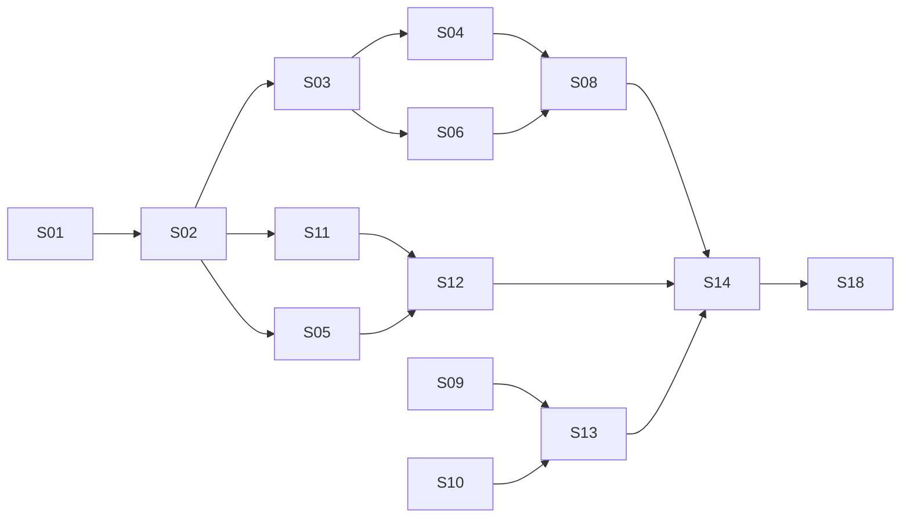

# Build plans

This directory sequences the work. `docs/fragcap-specification.md` is the
architecture of record and says *what* to build; these documents say *in what
order* and *what has to be true first*.

They are distinct from the per-slice `specs/NNN-slug/plan.md` files that the
spec-kit plan phase generates. A document here scopes a slice. The slice's own
spec and plan are still mandatory; see `AGENTS.md`.

## Documents

| Document | Purpose |
| --- | --- |
| [`000-repository-foundation.md`](000-repository-foundation.md) | What the repository foundation established, and why. Complete. |
| [`reconnaissance.md`](reconnaissance.md) | Protocol for open questions Q-1 to Q-6. **Gates S09, S10, S17.** |

## Gates before implementation

Two things block real work, and both are cheap relative to what they protect.

### Gate 1: reconnaissance (Q-1 through Q-6)

**Status: open.** See [`reconnaissance.md`](reconnaissance.md).

Six open questions from specification section 29 are answered by one
reconnaissance session per focal title, using an existing analyzer and no
fragcap code whatsoever. They validate the working assumptions in
specification section 6.2, and their findings populate Appendix D.

They gate S09, S10, and S17. Answering them first means sections 11 and 12 are
implemented against evidence, and the fallback paths in section 6.2 get built
only if they are actually needed. Answering them late risks building
attribution machinery for a topology that does not exist.

This is the only item in the project that can invalidate completed work, and it
costs an evening with an analyzer. Do it first.

### Gate 2: the npcap constraint (specification section 20.2)

**Status: understood, unimplemented.** This is not a license footnote. It
turns into four product requirements that touch packaging, continuous
integration, first-run experience, and the diagnostic command:

1. No bundling in any artifact, including container images.
2. Detection rather than installation. fragcap never invokes an installer.
3. Documented prerequisite ahead of every usage instruction.
4. Continuous integration acquires the SDK at build time; it is never
   vendored.

It also forces two non-default npcap installation options (loopback capture
support, WinPcap API compatibility mode) that `fragcap doctor` must verify and
name individually when absent.

Consequence for slice scoping: S01 carries requirement 4, S14 carries
requirement 2 through `doctor`, and S18 carries requirement 3. Requirement 1 is
a release-workflow assertion. None of these are afterthoughts to bolt on later.

## Slice ordering

Eighteen slices, from specification section 27.3. Each is sized to complete
within a single autopilot run.

| ID | Slice | Depends on | Spec sections | Gated by |
| --- | --- | --- | --- | --- |
| S01 | Workspace scaffold, licensing, CI skeleton | none | 20, 21, 24 | |
| S02 | Core types and traits | S01 | 8.4, 8.5 | |
| S03 | Header parsing and flow keys | S02 | 12.5, 12.6 | |
| S04 | Replay source and fixture corpus | S03 | 25.1, 25.3 | |
| S05 | Profile schema, parsing, validation | S02 | 15 | |
| S06 | pcapng writer and annotation encoding | S03 | 13.1 to 13.4 | |
| S07 | JSON Lines writer | S03 | 13.5 | |
| S08 | Pipeline, buffering, drop accounting | S04, S06 | 8.6, 12.4 | |
| S09 | Live capture source and interfaces | S03 | 12.1, 12.2 | **Q-5** |
| S10 | Socket table attributor | S02 | 11 | **Q-1, Q-2, Q-3** |
| S11 | ETW process watcher and tree | S02 | 10 | |
| S12 | Stage matching and session lifecycle | S05, S11 | 10.3 to 10.6 | |
| S13 | Filter management | S09, S10 | 12.2, 12.3 | |
| S14 | CLI: run, tap, doctor, profile | S08, S12, S13 | 17, 26.3 | |
| S15 | Transports and streaming sinks | S08 | 14.1 to 14.4 | |
| S16 | Ring mode and triggers | S08 | 7.2 | |
| S17 | Steam integration and managed launch | S05, S12 | 16 | **Q-4** |
| S18 | Extcap, wrappers, documentation site | S14, S15 | 14.5, 18, 22 | Q-7, Q-8 |

## Critical path

The critical path runs through core types, header parsing, the replay source,
the pipeline, and the CLI. Everything on it is testable at tier 1, so the
project reaches a demonstrable end-to-end pipeline before any
platform-specific code exists.

This ordering is deliberate. S09 through S11 are the slices requiring Windows,
elevated privilege, and a capture driver, and they are the hardest to verify.
Placing them after a proven pipeline means each is integrated against a
known-good consumer rather than debugged alongside one.

## Suggested sequencing

Two observations shape the practical order.

**Reconnaissance runs in parallel with S01 through S08.** It needs no fragcap
code, so it does not compete with the critical path for anything but operator
attention. The only requirement is that it finish before S09.

**S01 has an external dependency worth checking early.** Open question Q-9
(crate name reservation on the registry) blocks nothing technically, but the
names become harder to secure the moment the repository is public. Worth
handling alongside S01 rather than at first release.

A reasonable order:

1. Reconnaissance session per focal title. Populate Appendix D.
2. S01, including crate name reservation.
3. S02 through S08, the offline-testable pipeline.
4. S09 through S13, the platform-specific work, now against evidence.
5. S14, the first genuinely usable build.
6. S15 through S18.

## Recording deviations

Any divergence from the specification discovered during implementation is
recorded in the slice and promoted to specification section 29 at the next
version. Silent divergence between the specification and the code is a defect
in both.
