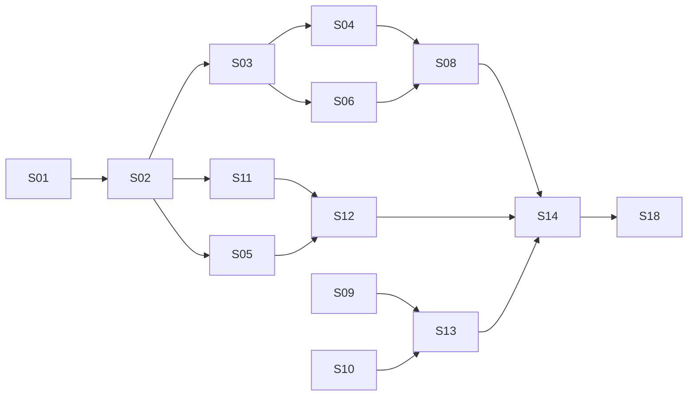

# Build plans

This directory sequences the work. `docs/fragcap-specification.md` is the
architecture of record and says *what* to build; these documents say *in what
order* and *what has to be true first*.

They are distinct from the per-slice `specs/NNN-slug/plan.md` files that the
spec-kit plan phase generates. A document here scopes a slice. The slice's own
spec and plan are still mandatory; see `AGENTS.md`.

## Documents

| Document | Purpose |
| --- | --- |
| [`000-repository-foundation.md`](000-repository-foundation.md) | What the repository foundation established, and why. Complete. |
| [`deep-capture.md`](deep-capture.md) | Product positioning, shipped MVP history, native completion direction, and the S108 correlated evidence and bundle-authority boundary for Deep Capture. |
| [`deep-capture-proxy-backends.md`](deep-capture-proxy-backends.md) | Historical candidate measurements and the S102 owned-stack supersession. |
| [`steam-launcher-proxy-inheritance.md`](steam-launcher-proxy-inheritance.md) | Privacy-preserving measurement protocol for Steam and publisher-launcher proxy inheritance. |
| [`reconnaissance.md`](reconnaissance.md) | Protocol for Q-1 to Q-6. Complete. |
| [`recon/findings-2026-08-06.md`](recon/findings-2026-08-06.md) | Findings from both focal titles. |
| [`../../specs/001-workspace-scaffold/`](../../specs/001-workspace-scaffold/) | S01 slice artifacts. Complete. |

## Gates before implementation

### Gate 1: reconnaissance (Q-1 through Q-6)

**Status: CLOSED, 2026-08-06.** Findings in
[`recon/findings-2026-08-06.md`](recon/findings-2026-08-06.md) and in
specification Appendix D.

Two sessions across both focal titles resolved all six questions. Assumptions
A-1 through A-4 confirmed; **A-5 refuted**: the launcher-to-client handoff is
not visible on loopback in either title. S09, S10, and S17 are unblocked and
are now implemented against evidence rather than assumption.

The sequencing paid for itself. The refutation changed three specification
sections, and the measurements behind A-2 and A-3 removed a roadmap item that
would otherwise have been scheduled on intuition. Building the attribution
machinery first would have produced a loopback strategy aimed at traffic that
does not exist.

### Gate 2: the npcap constraint (specification section 20.2)

**Status: understood, unimplemented.** This is not a license footnote. It
turns into four product requirements that touch packaging, continuous
integration, first-run experience, and the diagnostic command:

1. No bundling in any artifact, including container images.
2. Detection rather than installation. fragcap never invokes an installer.
3. Documented prerequisite ahead of every usage instruction.
4. Continuous integration acquires the SDK at build time; it is never
   vendored.

It also forces two non-default npcap installation options (loopback capture
support, WinPcap API compatibility mode) that `fragcap doctor` must verify and
name individually when absent.

Consequence for slice scoping: S01 carries requirement 4, S14 carries
requirement 2 through `doctor`, and S18 carries requirement 3. Requirement 1 is
a release-workflow assertion. None of these are afterthoughts to bolt on later.

## Resolved: the glossary has a home

Raised by the S01 analyze gate and closed the same day, 2026-08-06.

Constitution P-6 requires a glossary entry in the same change that introduces a
term, but the glossary was scheduled to live in the documentation site that S18
owns. Seventeen slices therefore had nowhere to write, and the backlog would
have landed on the slice least able to reconstruct why each term was chosen.

`docs/glossary.md` was the interim home while the vocabulary accumulated. S18c
split it into the per-category pages of specification section 22.4 under
`docs/glossary/`, one page per section-4.4 category, with a generated
alphabetical index (`docs/glossary/index.md`); nothing had to be reconstructed.

The documentation linter of section 4.6, `scripts/lint-docs.sh`, arrived with
S18c and enforces entry completeness, cross-link resolution, and index
reproducibility mechanically, wired into `cargo xtask ci`. **P-6 is now
enforced** rather than kept by hand.

## Release milestones

There is one first public release, `v0.2.0`, and it comprises the whole roadmap:
all eighteen slices, S01 through S18. It is cut only once every slice is complete
and operational; there is no earlier functional release. `v0.1.0` is the crates.io
namespace-reservation stub already published, carrying no functionality, and it is
not a functional release. The crates.io publication of the functional crates
happens at `v0.2.0`, that is, only after all slices are complete.

| Release | Scope | Slices |
| --- | --- | --- |
| v0.1.0 | crates.io namespace reservation; no functionality | published stub |
| v0.2.0 | First public release; the complete roadmap | S01 through S18 |

The workspace stays at `0.1.0` through S18; the bump to `0.2.0` is the final
release action, a `cargo release minor` taken only once every slice is complete.
That bump is necessary but not sufficient: the pcapng `USER_APPL` and JSON Lines
`VERSION` strings derive from `CARGO_PKG_VERSION`, so the release commit must also
regenerate the golden corpus and update the two version assertions in
`fragcap-sink`, or the release branch fails `cargo xtask ci`. See specification
section 27.3.

## Slice ordering

Eighteen slices, from specification section 27.3. Each is sized to complete
within a single autopilot run.

| ID | Slice | Release | Depends on | Spec sections | Gated by |
| --- | --- | --- | --- | --- | --- |
| S01 | Workspace scaffold, licensing, CI skeleton | v0.2.0 | none | 20, 21, 24 | **done** |
| S02 | Core types and traits | v0.2.0 | S01 | 8.4, 8.5 | |
| S03 | Header parsing and flow keys | v0.2.0 | S02 | 12.5, 12.6 | |
| S04 | Replay source and fixture corpus | v0.2.0 | S03 | 25.1, 25.3 | |
| S05 | Profile schema, parsing, validation | v0.2.0 | S02 | 15 | |
| S06 | pcapng writer and annotation encoding | v0.2.0 | S03 | 13.1 to 13.4 | |
| S07 | JSON Lines writer | v0.2.0 | S03 | 13.5 | |
| S08 | Pipeline, buffering, drop accounting | v0.2.0 | S04, S06 | 8.6, 12.4 | |
| S09 | Live capture source and interfaces | v0.2.0 | S03 | 12.1, 12.2 | Q-5 resolved |
| S10 | Socket table attributor | v0.2.0 | S02 | 11 | Q-1..3 resolved |
| S11 | ETW process watcher and tree | v0.2.0 | S02 | 10 | |
| S12 | Stage matching and session lifecycle | v0.2.0 | S05, S11 | 10.3 to 10.6 | |
| S13 | Filter management | v0.2.0 | S09, S10 | 12.2, 12.3 | |
| S14 | CLI: run, tap, doctor, profile | v0.2.0 | S08, S12, S13 | 17, 26.3 | |
| S15 | Transports and streaming sinks | v0.2.0 | S08 | 14.1 to 14.4 | |
| S16 | Ring mode and triggers | v0.2.0 | S08 | 7.2 | |
| S17 | Steam integration and managed launch | v0.2.0 | S05, S12 | 16 | Q-4 resolved |
| S18 | Extcap, wrappers, documentation site | v0.2.0 | S14, S15 | 14.5, 18, 22 | Q-7, Q-8 resolved |

### Follow-up slices and directory numbering

The roadmap slices above keep their S-numbers. Follow-up slices that refine an
already-merged slice (rather than adding a roadmap capability) take the next free
`specs/NNN-slug` directory ordinals as they are written, which decouples the
directory number from the roadmap S-number. The first is
`specs/015-attribution-pipeline-integration` (the S13 attribution follow-ups,
issues #18 and #19). Because these occupy ordinals starting at 015, the roadmap's
own future slices S15 through S18 take the later directory ordinals 018 through
021 when they are specified. The S-number is the roadmap identity; the directory
ordinal is only a filesystem sequence.

## Critical path

The critical path runs through core types, header parsing, the replay source,
the pipeline, and the CLI. Everything on it is testable at tier 1, so the
project reaches a demonstrable end-to-end pipeline before any
platform-specific code exists.

This ordering is deliberate. S09 through S11 are the slices requiring Windows,
elevated privilege, and a capture driver, and they are the hardest to verify.
Placing them after a proven pipeline means each is integrated against a
known-good consumer rather than debugged alongside one.

## Suggested sequencing

Two observations shape the practical order.

**Reconnaissance is done**, ahead of S01, which is where its value was.

**S01 has an external dependency worth checking early.** Open question Q-9
(crate name reservation on the registry) blocks nothing technically, but the
names become harder to secure the moment the repository is public. Worth
handling alongside S01 rather than at first release.

A reasonable order:

1. ~~Reconnaissance session per focal title.~~ Done 2026-08-06.
2. ~~S01.~~ Done 2026-08-06. Crate name reservation (Q-9) still open.
3. S02 through S08, the offline-testable pipeline.
4. S09 through S13, the platform-specific work, now against evidence.
5. S14, the first genuinely usable build.
6. S15 through S18, the remaining roadmap capabilities.
7. Release `v0.2.0` once every slice is complete: the single first public
   release, comprising all of S01 through S18.

## Recording deviations

Any divergence from the specification discovered during implementation is
recorded in the slice and promoted to specification section 29 at the next
version. Silent divergence between the specification and the code is a defect
in both.

## Native completion follow-up

S114 (`specs/114-authenticated-socks5-tcp`) follows S113 and closes #310 as the
first Native Deep Capture 3 transport-coverage slice. The shared native listener
admits SOCKS5 TCP only through the current session capability, owns domain
resolution and destination policy, relays bounded full-duplex bytes with
half-close, and records typed correlated metadata without claiming generic TCP
payload semantics. UDP ASSOCIATE remains #311, generic TCP and non-HTTP TLS
semantics remain #312, and Deep Capture remains incomplete until #334.
