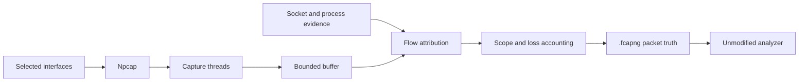

<Callout title="Native completion status">
Deep Capture is functional but incomplete. The v0.8 diagram and execution path
below use external mitmdump and certutil. S102 establishes the native Rust
proxy crate and bounded lifecycle foundation only. [Issue #278](https://github.com/h8rt3rmin8r/fragcap/issues/278)
owns the four milestone completion contract; #334 is the only completion gate.
</Callout>

fragcap has two shipped modes. [Capture](/docs/glossary/capture-and-networking#capture-mode) passively records packets and attributes flows to processes from evidence outside those processes. [Deep Capture](/docs/glossary/capture-and-networking#deep-capture) runs that same Capture path beside explicit, target-scoped local proxy inspection for one compatible stored target. Deep Capture is active by design, and it adds observations only for traffic that reaches its proxy.

Both modes are library capabilities. Deep Capture is exposed through the public `fragcap::deep_capture` session API: side-effect-free preparation returns an immutable plan, caller authorization binds to that exact plan, and a checked coordinator owns start, observation, stop, fact attempts, cleanup, bundle finalization timing, and the terminal report. The CLI maps arguments, supplies the shipped effect bridges, and presents those typed results rather than defining a second lifecycle.

The [master specification](https://github.com/h8rt3rmin8r/fragcap/blob/main/docs/fragcap-specification.md) is the architecture of record. This page explains the execution and trust boundaries a user or reviewer needs to understand.

The native target architecture adds a `fragcap-proxy` leaf beneath the facade.
S102 gives that crate bounded loopback listener and task ownership. DNS and
upstream policy (#284), certificate and trust work (#285 through #287), raw
event accounting (#288), protocol fidelity (#292 through #305), launch and
transport coverage (#306 through #318), and production cutover (#290) remain
open. Current diagrams continue to show the shipped v0.8 external path until
that cutover actually lands.

## Capture: passive packet truth

A packet carries addresses and ports, but not the identity of the process that sent it. Capture joins the packet's [flow key](/docs/glossary/capture-and-networking#flow-key) with Windows socket-table and process-lifecycle evidence, then writes the result without opening or modifying the target process.

Npcap supplies raw packets, one capture thread runs per selected interface, and a bounded drop-oldest buffer keeps acquisition from waiting on consumers. Attribution uses immutable socket snapshots and a process tree. A socket created after a packet cannot have owned it; a connection tail resolved from the short retention window is marked as retained rather than presented as a live match.

[Capture scope](/docs/glossary/capture-and-networking#capture-scope) is a userspace output decision after attribution. The default `target` scope writes packets bound to the selected target roles and omits unattributed and other-process packets with separate named counters. `--scope all` retains all acquired traffic and preserves each packet's attribution state. Buffer, sink, parser, backend, bound, and scope losses remain visible in the final accounting.

The primary file is `.fcapng`, ordinary pcapng with attribution in standard packet comments. Wireshark and other unmodified pcapng analyzers can open it and safely ignore annotations they do not understand. Capture can also write the documented [JSON Lines form](/docs/reference/output-formats), but richer formatting does not change which packets were observed.

## Deep Capture: explicit proxy observations beside Capture

Deep Capture starts from one stored target. Its read-only preflight resolves the launch case, current compatibility evidence, Capture configuration, proxy backend, bundle path, and trust authorization before creating the session directory or starting the proxy.

```mermaid
flowchart LR
  accTitle: Deep Capture session architecture
  target["Stored target"] --> choice["Ordinary run or calibration"]
  choice --> calibrate["Reachability, then optional TLS"]
  calibrate --> plan["Displayed plan and confirmation"]
  plan --> preflight["Read-only preflight"]
  choice --> preflight
  preflight -->|refused| stop["No session side effects"]
  preflight -->|eligible| prepare["Prepared session"]
  prepare --> capture["Ordinary Capture"]
  prepare --> proxy["Loopback mitmdump"]
  proxy --> trust["Current-user CA trust"]
  trust --> launch["Managed target launch"]
  launch --> observations["Proxy observations"]
  proxy --> observations
  capture --> correlate["Structured correlation"]
  observations --> correlate
  correlate --> cleanup["Session cleanup"]
  trust --> cleanup
  cleanup --> bundle["Manifest-indexed bundle"]
```

The current real-target path is deliberately narrow. Ordinary Deep Capture requires current `proxy-routing = reached-client` evidence for the exact cold Steam protocol or cold direct-executable launch case. Unknown, stale, conflicting, or wrong-launch evidence is refused. Compatibility calibration can produce initial local evidence through a trust-free reachability phase followed, only after current final-client routing, by a separate TLS phase. Routing does not itself prove environment propagation. Already-running Steam and direct-executable targets are warm launches fragcap does not own, so both are refused before session side effects. The [Deep Capture compatibility reference](/docs/reference/deep-capture-compatibility) carries the complete current traffic and launch matrix.

After preflight, fragcap starts a loopback `mitmdump` child, manages any authorized CA trust, opens the ordinary Capture backend, and launches the target through Steam with launch-scoped proxy environment. The preflight does not prove that Npcap is available, the process is elevated, or a selected interface can be opened; `fragcap doctor` reports that environment readiness, and a later Capture startup failure is recorded through cleanup and the partial or failed bundle path. The proxy and packet paths run beside each other. Traffic can appear in packet truth without producing an application observation.

## Trust and routing boundaries

| Boundary | Trigger | Scope and owner | Cleanup or refusal |
| --- | --- | --- | --- |
| Compatibility | Current exact routing facts for the selected cold Steam or direct-executable launch case | One selected stored target and launch case, evaluated by fragcap | Refusal occurs before the proxy, trust, launch, or bundle side effects |
| Calibration | Displayed and confirmed plan for one phase | One selected stored target and declared launch case | Reachability changes no trust; TLS requires prior same-case final-client routing |
| Proxy | Successful preflight | One fragcap-owned mitmdump child on a loopback port | The child, port, and ephemeral proxy material receive recorded cleanup outcomes |
| CA trust | Explicit `--trust-ca`, or the broader unattended `--yes` confirmation | The exact fragcap-owned CA in the current user's Root store | fragcap attempts removal and records the exact identity and result |
| Target routing | Prepared managed launch | Proxy environment for the selected launch session | No system-wide proxy fallback is attempted |

`--trust-ca` is the trust authorization. When it is present, no second interactive trust prompt follows. Omit it to refuse that run before the trust change; use `--yes` only when broader unattended preconfirmation is intended. Trust is never silently added to the local-machine store or broadened to an unrelated CA.

Proxy visibility depends on actual target behavior. A flow that bypasses the proxy still belongs to ordinary Capture, but it produces no proxy semantics. HTTPS inspection also depends on the target accepting the fragcap-owned CA. Certificate-pinned traffic is not bypassed, and unsupported non-HTTP protocols remain metadata-only or unsupported according to what the proxy actually observed.

## Output authority and correlation

The [session bundle](/docs/glossary/file-and-wire-formats#session-bundle) keeps several kinds of evidence together without pretending they have equal authority:

| Evidence | Producer and authority |
| --- | --- |
| `capture.fcapng` | Packet truth from ordinary Capture, including external process attribution and loss accounting |
| `application.jsonl` | Proxy-observed application events; sensitive and potentially partial |
| `http.har` | Optional projection of HTTP semantics the proxy observed; omitted when not requested or when no suitable HTTP event exists |
| `tls-keylog.log` | Optional, sensitive [proxy-owned TLS key-log material](/docs/glossary/file-and-wire-formats#proxy-owned-tls-key-log-export) for analyzer workflows; never extracted from the target |
| `proxy.jsonl`, `process-trace.jsonl`, `compatibility.json` | Proxy, process, and launch-specific compatibility evidence used to interpret and correlate the run |
| `manifest.json`, `cleanup.json` | Artifact index, omissions, session state, trust identity, and per-resource cleanup evidence |

Proxy observations carry the session and proxy connection identities. fragcap adds packet flow identifiers only when structured endpoint evidence matches the live flow registry. If no structured match exists, correlation stays absent; fragcap does not fabricate one from timing or content similarity.

This is the high-level authority model. The [CLI reference](/docs/reference/cli#deep-capture) defines the command surface, and the [getting-started guide](/docs/getting-started#7-run-a-known-compatible-deep-capture) shows one bounded session and post-run cleanup check.

## External dependency boundaries

- **Npcap** is the Windows live-packet backend used by Capture, including the ordinary Capture running inside Deep Capture. Attribution itself uses Windows socket and process evidence and does not depend on Npcap.
- **mitmdump** is the shipped local proxy backend for Deep Capture only. If it is unavailable, Deep Capture is unavailable, but ordinary Capture remains usable.
- **Wireshark or another pcapng analyzer** consumes `.fcapng`. It is not part of fragcap's capture or attribution engine. Wireshark's installer is a common way to obtain Npcap.
- **extcap** is an optional adapter that streams Capture into Wireshark. It does not change the packet, attribution, proxy, or trust architecture.

fragcap never bundles, hosts, caches as its own, or redistributes Npcap or its installer. `fragcap doctor --fix` offers a remediation action and performs it only after explicit confirmation. The published build opens the official acquisition page. A source build compiled with optional `net` support may instead fetch the vendor's signed installer to a uniquely named temporary path and launch it after confirmation. fragcap does not install Npcap silently or represent the vendor package as a fragcap artifact. See the glossary's [dependency model](/docs/glossary/platform-and-distribution#dependency-model).

## Security boundary

Capture is passive. Deep Capture is explicitly selected, target-scoped, visible in its events and manifest, reversible through session cleanup, and auditable afterward. Neither mode injects code, hooks target functions, reads target memory, modifies target executables, changes the Winsock catalog through a layered service provider, installs a packet interception driver, or extracts TLS keys from a target process. Deep Capture does not bypass certificate pinning and never falls back to silent trust or system-wide proxy settings.

These exclusions are architectural boundaries rather than compatibility gaps. See the [technique denylist](/docs/glossary/anti-cheat-and-security#technique-denylist) and [local development certificate authority](/docs/glossary/anti-cheat-and-security#local-development-certificate-authority) entries for the governing distinction.
