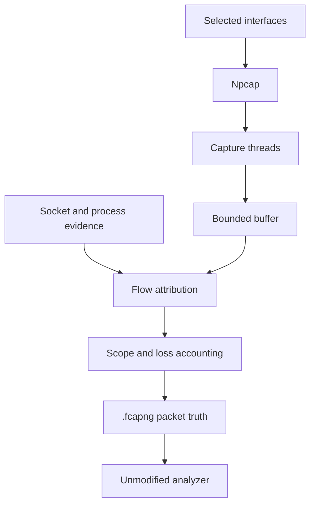
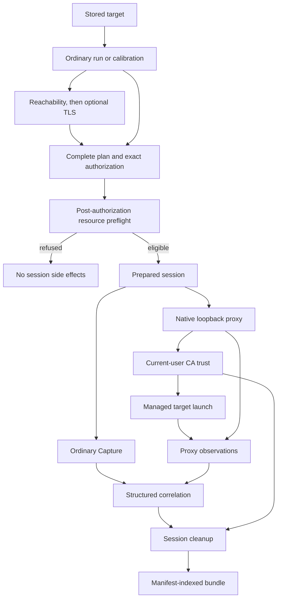

Published baseline: [v0.10.2](https://github.com/h8rt3rmin8r/fragcap/releases/tag/v0.10.2).

<Callout title="Native completion status">
Deep Capture is native and shipped for known-compatible stored targets. Native protocol, managed launch, scoped routing, bounded evidence, recovery, packaging, stable API, guided calibration and S150 documentation shipped in v0.10.0 on 2026-09-15. v0.10.2 adds the complete documentation contract, review-intake, deterministic certification and Windows observation corrections. The independent-review handoff is readiness, not a completed audit. The [Native product contract](/docs/reference/native-documentation) states the supported boundary and the defect workflow for active releases.
</Callout>

fragcap has two shipped modes. [Capture](/docs/glossary/capture-and-networking#capture-mode) passively records packets and attributes flows to processes from evidence outside those processes. [Deep Capture](/docs/glossary/capture-and-networking#deep-capture) runs that same Capture path beside explicit, target-scoped local proxy inspection for one compatible stored target. Deep Capture is active by design, and it adds observations only for traffic that reaches its proxy.

Both modes are library capabilities. The stable [Deep Capture API](/docs/reference/library-api), `fragcap::deep_capture::api` version 1, exposes side-effect-free preparation, exact-plan authorization, checked lifecycle operations, narrow effect adapters, typed observations, cooperative cancellation, and one authoritative terminal report. The CLI supplies effect bridges and presentation rather than defining a second lifecycle.

The [master specification](https://github.com/h8rt3rmin8r/fragcap/blob/main/docs/fragcap-specification.md) is the architecture of record. This page explains the execution and trust boundaries a user or reviewer needs to understand.

The native architecture places `fragcap-proxy` beneath the facade. It owns authenticated loopback admission, finite task and upstream ownership, session certificates, HTTP/1.1, HTTP/2, WebSocket, SSE, gRPC envelopes, SOCKS5 TCP and UDP, generic byte evidence, and scoped QUIC/HTTP/3. Client-facing TLS and upstream TLS are separate verified boundaries. S107 introduced proxy-owned client-facing TLS key logs and explicit upstream client credentials; S108 introduced post-collection correlation, bounded HAR projection, and manifest version 2. Later slices add managed launch, IPv6 parity, exact compatibility applicability, recovery, conformance, security, performance, and final-package certification. These implementation records do not replace the outstanding independent whole-product review.

## Capture: passive packet truth

A packet carries addresses and ports, but not the identity of the process that sent it. Capture joins the packet's [flow key](/docs/glossary/capture-and-networking#flow-key) with Windows socket-table and process-lifecycle evidence, then writes the result without opening or modifying the target process.

Npcap supplies raw packets, one capture thread runs per selected interface, and a bounded drop-oldest buffer keeps acquisition from waiting on consumers. Attribution uses immutable socket snapshots and a process tree. A socket created after a packet cannot have owned it; a connection tail resolved from the short retention window is marked as retained rather than presented as a live match.

[Capture scope](/docs/glossary/capture-and-networking#capture-scope) is a userspace output decision after attribution. The default `target` scope writes packets bound to the selected target roles and omits unattributed and other-process packets with separate named counters. `--scope all` retains all acquired traffic and preserves each packet's attribution state. Buffer, sink, parser, backend, bound, and scope losses remain visible in the final accounting.

The primary file is `.fcapng`, ordinary pcapng with attribution in standard packet comments. Wireshark and other unmodified pcapng analyzers can open it and safely ignore annotations they do not understand. Capture can also write the documented [JSON Lines form](/docs/reference/output-formats), but richer formatting does not change which packets were observed.

## Deep Capture: explicit proxy observations beside Capture

Deep Capture starts from one stored target. Its read-only authorization preparation resolves the launch case, exact profile, client executable, platform root and dispatch where applicable, current compatibility evidence, proxy backend, bundle path, normalized routing policy, and exact process-local CA identity before creating the session directory, reserving the listener, or starting Capture and the proxy. Facade preflight independently prepares and compares that launch authority before selecting an endpoint, then execution consumes the retained preparation.

Ordinary Deep Capture requires current `proxy-routing = reached-client` evidence applicable to the exact target, cold managed launch, routing strategy, loopback family, selected case, backend/version, and product version. Supported topology includes direct executables, cold Steam platform ownership, and declared cold publisher chains. Unknown, stale, conflicting, escaped, ambiguous, or wrong-case authority is refused. Guided `fragcap calibrate` can resolve registration and topology through separately confirmed plans, measure trust-free reachability, and propose concrete protocol attempts only from fresh evidence. Its target-bound checkpoint preserves immutable intent, not a reusable authorization. Warm applications remain operator-owned; explicit close-and-retry observes normal operator shutdown and never stops a process itself. The [compatibility reference](/docs/reference/deep-capture-compatibility) carries the traffic and launch limits.

After preflight, fragcap starts its native loopback proxy, manages any authorized CA trust, opens the ordinary Capture backend, and launches the target with launch-scoped proxy environment. The preflight does not prove that Npcap is available, the process is elevated, or a selected interface can be opened; `fragcap doctor` reports that environment readiness, and a later Capture startup failure is recorded through cleanup and the partial or failed bundle path. The proxy and packet paths run beside each other. Traffic can appear in packet truth without producing an application observation.

## Trust and routing boundaries

| Boundary | Trigger | Scope and owner | Cleanup or refusal |
| --- | --- | --- | --- |
| Compatibility | Current applicable routing facts for the exact supported cold managed launch | One selected stored target and exact measurement identity, evaluated by fragcap | Refusal occurs before proxy, trust, launch, or bundle effects |
| Authorization | Exact versioned plan identifier | One target launch authority, process-local CA, routing policy, artifact set, deadline set, and cleanup contract | Output failure, decline, incomplete input, mismatch, expiry, or drift leaves session effects absent |
| Calibration | Exact complete plan for one phase | One selected stored target and declared launch case | Reachability changes no trust; TLS requires prior same-case final-client routing |
| Proxy | Successful authorization and resource preflight | One fragcap-owned native listener and bounded task set on a loopback port | The listener, tasks, and ephemeral proxy material receive recorded cleanup outcomes |
| CA trust | The exact trust action inside the authorized plan | The exact fragcap-owned CA in the current user's Root store | fragcap attempts removal and records the exact identity and result |
| Target routing | Prepared managed launch | Proxy environment for the selected launch session | No system-wide proxy fallback is attempted |

Interactive execution displays and confirms one complete plan on a complete input line. Structured execution uses `--authorize-stdin` and returns only the exact current plan identifier in the same process. A failed plan write, expired prepared CA, or target change at either revalidation boundary refuses. Before producing a new plan, fragcap inspects prior-session recovery records without mutation and directs pending recovery to `fragcap doctor --fix`; approval for a new session never authorizes cleanup from an older one. Trust is never silently added to the local-machine store or broadened to an unrelated CA. The former Deep Capture `--trust-ca` and `--yes` booleans are rejected migration inputs.

Proxy visibility depends on actual target behavior. Intentional bypass is declared scope rather than proxy loss; bypassed or unrouted flows can appear in packet truth without application semantics. HTTPS inspection depends on acceptance of the session CA. Pinning is never bypassed. Generic streams and datagrams retain bounded byte evidence without inventing application meaning, while refusals and classification preserve what was actually observed.

## Output authority and correlation

The [session bundle](/docs/glossary/file-and-wire-formats#session-bundle) keeps several kinds of evidence together without pretending they have equal authority:

| Evidence | Producer and authority |
| --- | --- |
| `capture.fcapng` | Packet truth from ordinary Capture, including external process attribution and loss accounting |
| `application.jsonl` | Proxy-observed application events; sensitive and potentially partial |
| `http.har` | Optional projection of HTTP semantics the proxy observed; omitted when not requested or when no suitable HTTP event exists |
| `tls-keylog.log` | Optional, sensitive [proxy-owned TLS key-log material](/docs/glossary/file-and-wire-formats#proxy-owned-tls-key-log-export) for analyzer workflows; never extracted from the target |
| `proxy.jsonl`, `process-trace.jsonl`, `compatibility.json` | Proxy, process, and launch-specific compatibility evidence used to interpret and correlate the run |
| `manifest.json`, `cleanup.jsonl`, `cleanup.json` | Artifact authority and omissions, durable resource obligations and reconciliation, and a derived compatibility summary |

Proxy observations carry session, connection, and where applicable stream identities. Correlation reconciles after collection against timestamped packet-flow ownership. Ambiguous and unavailable matches stay explicit; neither timing similarity nor content similarity invents a process owner. Artifact finalization, completeness, loss, session outcome, cleanup outcome, and traffic inspectability remain separate dimensions.

This is the high-level authority model. The [CLI reference](/docs/reference/cli#deep-capture) defines the command surface, and the [getting-started guide](/docs/getting-started#7-run-a-known-compatible-deep-capture) shows one bounded session and post-run cleanup check.

## External dependency boundaries

- **Npcap** is the Windows live-packet backend used by Capture, including the ordinary Capture running inside Deep Capture. Attribution itself uses Windows socket and process evidence and does not depend on Npcap.
- **fragcap-proxy** is the native Rust local proxy used by Deep Capture. It has no separately installed proxy runtime.
- **Wireshark or another pcapng analyzer** consumes `.fcapng`. It is not part of fragcap's capture or attribution engine. Wireshark's installer is a common way to obtain Npcap.
- **extcap** is an optional adapter that streams Capture into Wireshark. It does not change the packet, attribution, proxy, or trust architecture.

fragcap never bundles, hosts, caches as its own, or redistributes Npcap or its installer. `fragcap doctor --fix` offers a remediation action and performs it only after explicit confirmation. The published build opens the official acquisition page. A source build compiled with optional `net` support may instead fetch the vendor's signed installer to a uniquely named temporary path and launch it after confirmation. fragcap does not install Npcap silently or represent the vendor package as a fragcap artifact. See the glossary's [dependency model](/docs/glossary/platform-and-distribution#dependency-model).

## Security boundary

Capture is passive. Deep Capture is explicitly selected, target-scoped, visible in its events and manifest, reversible through session cleanup, and auditable afterward. Neither mode injects code, hooks target functions, reads target memory, modifies target executables, changes the Winsock catalog through a layered service provider, installs a packet interception driver, or extracts TLS keys from a target process. Deep Capture does not bypass certificate pinning and never falls back to silent trust or system-wide proxy settings.

These exclusions are architectural boundaries rather than compatibility gaps. See the [technique denylist](/docs/glossary/anti-cheat-and-security#technique-denylist) and [local development certificate authority](/docs/glossary/anti-cheat-and-security#local-development-certificate-authority) entries for the governing distinction.
