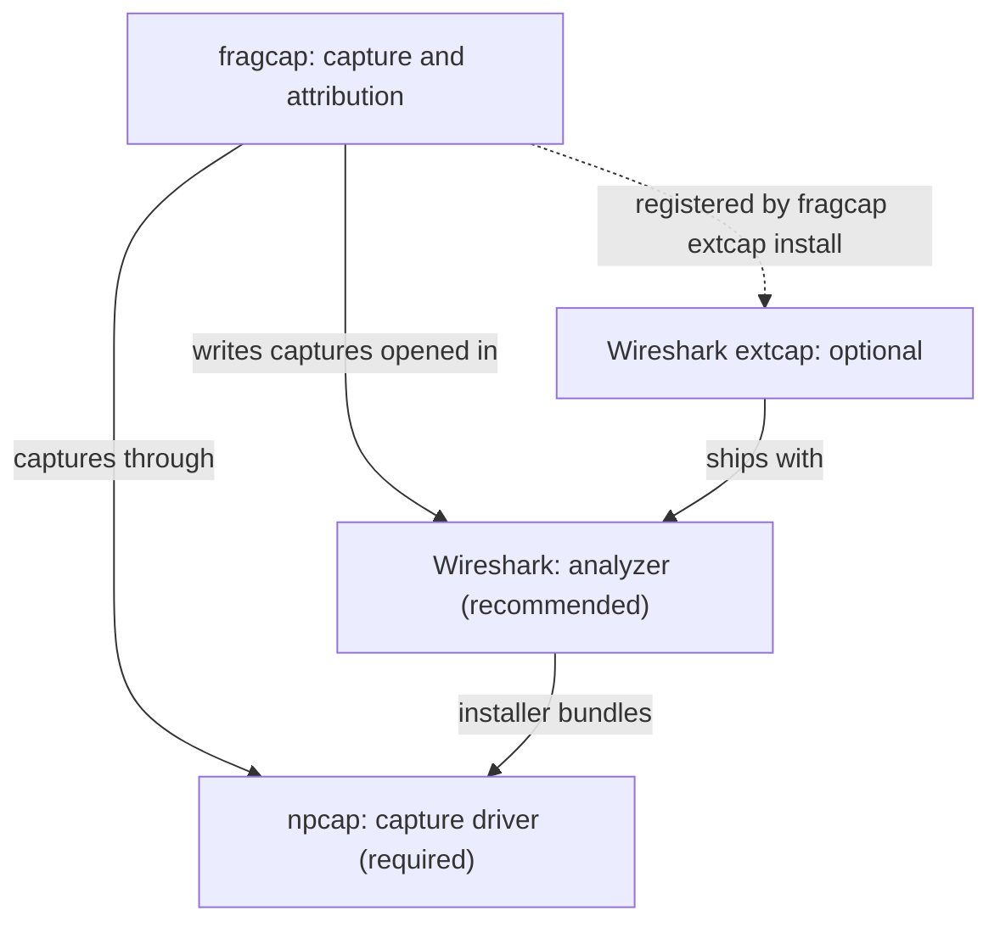
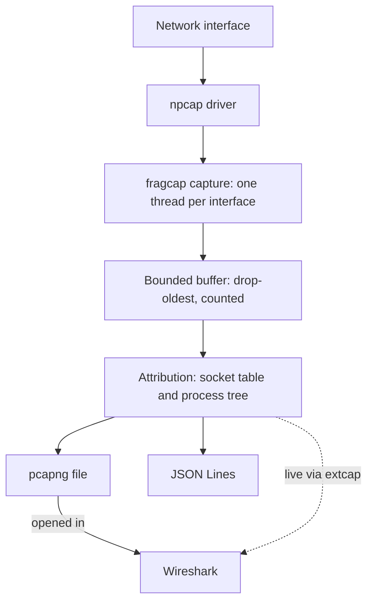
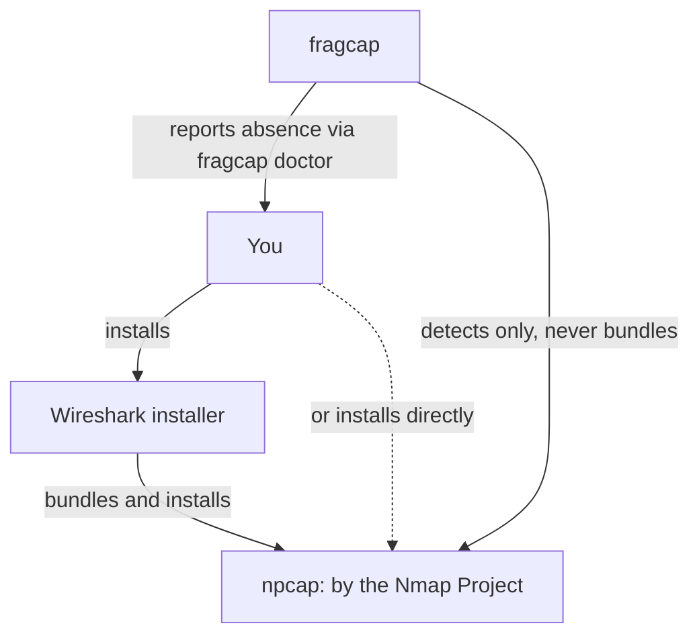

This page explains how fragcap works at the level a user benefits from knowing.
The [master specification](https://github.com/h8rt3rmin8r/fragcap/blob/main/docs/fragcap-specification.md)
is the architecture of record; this is the shape of it.

## The pieces

fragcap captures and attributes; npcap is the required capture driver; Wireshark
is the recommended analyzer and its installer also provides npcap; the Wireshark
extcap integration is optional. See the dependency model in the
[glossary](/docs/glossary/platform-and-distribution#dependency-model).

## The problem

A packet on the wire does not carry the identity of the process that sent it.
Standard capture tools tap the network driver, below the socket layer, where the
association between a packet and its process has already been discarded. So they
can tell you a conversation happened, but not who on your machine had it. For a
game client started indirectly through a launcher, "who" is exactly the question.

## The join

fragcap recovers the association by joining two things it can observe without
touching any target process:

- **The captured flow**, identified by its
  [5-tuple](/docs/glossary/capture-and-networking#5-tuple): protocol and the two
  endpoints.
- **The operating system's socket table**, which lists open sockets and the
  module that owns each one.

Matching a flow's tuple against the socket table yields the owning process. The
join is ordered deterministically: a socket created after a packet cannot have
owned it, so creation time filters out the previous owner of a reused port. When a
connection closes, its tail stays attributed through a short retention window, and
an answer that comes from that window is marked as
[retained](/docs/glossary/file-and-wire-formats#attribution-fidelity) rather than
presented as a live match, because a port reused inside the window is the one way
that answer can be wrong.

## Naming an indirectly launched client

The socket table names a process; a profile names which process is the game. When
a launcher starts the client, "the game" is not a fixed image name but "the client
that this launcher started." fragcap builds a process tree from creation-time
telemetry and resolves a stage's `descends_from` against it, so a profile can name
the client by its ancestry rather than by assuming it is a direct child. See
[writing a profile](/docs/guides/writing-a-profile).

## The pipeline

Capture runs one thread per interface into a single bounded buffer; a separate
thread drains the buffer, attributes each packet, and fans it out to every sink.
The buffer is bounded and drops the oldest packet under pressure rather than
blocking capture, and every discard, at the buffer, at a sink, or against a
capture bound, has a named counter that appears in the completion summary. The
accounting is conservation, not decoration: for every sink, received plus dropped
plus refused equals captured.

## Getting npcap

fragcap never downloads, installs, or bundles npcap; it detects it and reports
its absence through `fragcap doctor`. npcap is by the Nmap Project. The usual way
to get it is the Wireshark installer, which bundles it; you can also install it
directly.

## The security posture

fragcap observes. It does not modify traffic, and it does not reach inside the
processes it names. That is not a default; it is enforced. A denylist of
techniques -- packet interception drivers, code injection, function hooking,
process handles carrying memory-read rights, layered service providers, executable
image modification -- is absolute, and it is checked mechanically, not just
promised. Nothing fragcap does resembles what anti-cheat systems watch for,
because none of those techniques are needed for anything fragcap claims. See the
[technique denylist](/docs/glossary/anti-cheat-and-security#technique-denylist).

Image names come from an ordinary process enumeration, and the socket table comes
from the IP Helper API that ships with Windows. Neither requires a capture driver
or elevation. Capture itself needs npcap; attribution does not.
