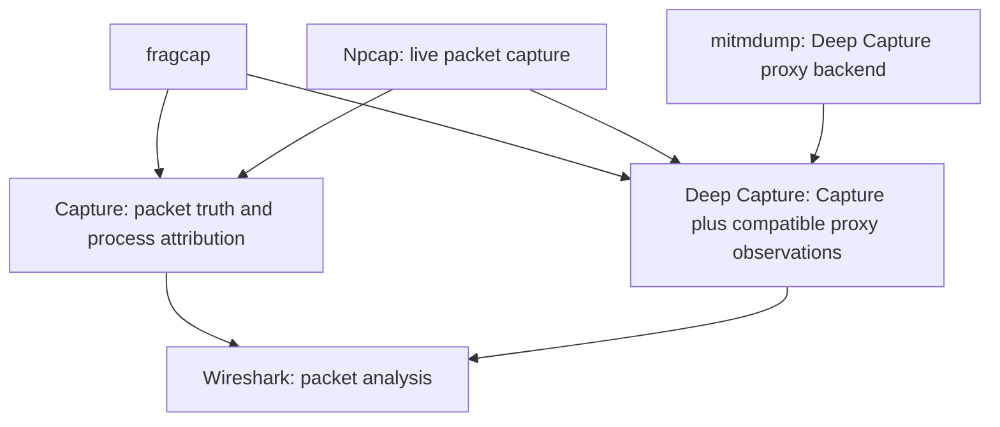

<Callout title="Deep Capture is incomplete">
These instructions describe the current v0.8 external-backend path. S103 completes
the native security, upstream, certificate, event, and protocol-lab foundation,
but native production protocol inspection and CLI
cutover remain tracked under [#278](https://github.com/h8rt3rmin8r/fragcap/issues/278).
</Callout>

fragcap has two capture paths. **Capture** passively records packets and attributes flows to processes. **Deep Capture** runs Capture beside an explicit, target-scoped local proxy and can add application observations for traffic that reaches that proxy. This guide takes you through a first Capture, then continues into Deep Capture only when the selected target already has the current compatibility evidence v0.8.0 requires.

<Callout title="Start with Capture">
Capture remains useful when Deep Capture is unavailable. The `.fcapng` file is packet truth in both paths, and an unmodified pcapng analyzer can open it.
</Callout>

## Before you begin

Live Capture and Deep Capture packet recording require Windows, an elevated terminal, and the separately installed Npcap driver in WinPcap API-compatible mode. [Wireshark](https://www.wireshark.org/download.html) is the recommended analyzer and its Windows installer can install Npcap. Deep Capture additionally requires the `mitmdump` command from [mitmproxy](https://docs.mitmproxy.org/stable/overview/installation/). These tools follow fragcap's documented [dependency model](/docs/glossary/platform-and-distribution#dependency-model).



These tools have distinct jobs:

- **Npcap is required for live packets.** fragcap never bundles, hosts, caches as its own, or redistributes Npcap. The published `doctor --fix` opens the official acquisition page after confirmation; a source build with the optional `net` feature may instead fetch and launch the vendor's signed installer after confirmation.
- **Wireshark is recommended for analysis.** It opens `.fcapng` directly. The optional fragcap extcap integration adds a live fragcap source inside Wireshark.
- **mitmdump is required only for Deep Capture.** Install the Windows mitmproxy package so `mitmdump` is on `PATH`. Do not configure a system-wide proxy or install mitmproxy's CA for this guide; fragcap prepares its target-scoped proxy session and manages its own purpose-specific CA only when the command explicitly includes `--trust-ca`.

Capture records the payload bytes it observes unless you select `--no-payload`. fragcap does not guess whether those bytes are encrypted. Deep Capture can add HTTP semantics only for traffic that follows the scoped proxy route and, for HTTPS, accepts the fragcap-owned local CA. It does not bypass certificate pinning or extract keys from a target process.

## 1. Install fragcap and its prerequisites

Download fragcap from the [release page](https://github.com/h8rt3rmin8r/fragcap/releases). Each release provides a Windows installer and a portable archive with a `.sha256` checksum. The installer adds `fragcap` to `PATH`; the archive can be unpacked and run directly.

The installer is not code-signed, so Windows may show an Unknown Publisher SmartScreen warning. Verify the download against its published checksum before choosing **More info** and **Run anyway**.

If Npcap is not installed, install Wireshark and leave **Install Npcap** selected. In the Npcap installer, leave **Install Npcap in WinPcap API-compatible Mode** selected. Current Npcap releases install loopback support automatically.


For Deep Capture, also install mitmproxy using its [official Windows instructions](https://docs.mitmproxy.org/stable/overview/installation/). The installer places `mitmdump` on `PATH`.

## 2. Verify the environment

Open a terminal as Administrator and run:

```powershell
fragcap doctor
```

`doctor` is read-only. It reports environment, driver, process-event, interface, analyzer, and Deep Capture readiness without starting a capture, proxy, or trust change. A fully ready synthetic report has this structure:

```text
Identity
  version                ok    0.8.0
  binary                 ok    C:\Program Files\fragcap\fragcap.exe
  catalog db             ok    C:\Users\you\AppData\Roaming\fragcap\catalog.db
                               (present)
  local db               ok    C:\Users\you\AppData\Roaming\fragcap\local.db
                               (present)

Platform
  os                     ok    Windows 11
  subsystem              ok    native
  privilege              ok    elevated

Capture driver
  npcap                  ok    version 1.79
  loopback adapter       ok    loopback capture supported
  winpcap api mode       ok    WinPcap API compatible
  live backend           ok    live capture backend is built in
  socket-table backend   ok    socket-table attribution is built in

Tracing
  process events         ok    process-event session available

Interfaces
  adapter                ok    Ethernet 192.0.2.10

Integration
  analyzer extcap        ok    installed for the current user in
                               C:\Users\you\AppData\Roaming\Wireshark\extcap

Deep Capture
  proxy backend          ok    mitmdump Mitmproxy: 12.1.0
  local CA trust         ok    no fragcap Deep Capture CA trust found
  analyzer key log       ok    TLS key-log path is visible to this session
  proxy ports            ok    no stale Deep Capture proxy ports found
  proxy processes        ok    no orphaned Deep Capture proxy processes found
  session manifests      ok    no stale Deep Capture manifests found
  tls key logs           ok    no stale Deep Capture TLS key logs found
  sensitive artifacts    ok    no sensitive Deep Capture sidecars found
  session storage        ok    C:\Users\you\AppData\Roaming\fragcap\sessions
                               (absent)

Ready to capture.
```

The paths are observed defaults, not required arguments. `--catalog-db`, `--local-db`, and the corresponding environment variables are overrides for operators who deliberately keep stores elsewhere.

If a row is not ready, follow the remediation printed beside it. Run `fragcap doctor --fix` only when you want the interactive action runner; it offers one named remediation at a time and asks before acting. Re-run plain `fragcap doctor` afterward to observe the result.

To register fragcap as an optional Wireshark extcap source, run `fragcap extcap install`. This integration is convenient but does not block command-line Capture.

## 3. Find a target

Run the hero target command without a database argument:

```powershell
fragcap targets
```

It discovers installed titles, registers new findings in the default local store, and prints the current stored targets. This synthetic specimen matches the current columns:

```text
  #  TARGET         CAPTURE          ENGINE       SENSITIVITIES
  1  sample-target  ready            not scanned  not scanned

Next command:  fragcap capture 1
```

The row number is an ephemeral selector for the listing you just saw. The handle, such as `sample-target`, is stable for later human commands. `CAPTURE` reports whether fragcap has enough target information to start the passive path. `ENGINE` and `SENSITIVITIES` report detected products or an explicit scan-coverage state; neither column is a compatibility verdict.

If the desired target is absent, run `fragcap targets add --help` or `fragcap targets scan --help` for the supported registration forms. Database flags remain optional overrides. Do not substitute a Steam app identifier for a row number in `capture`; register the title first, then use its listed row or handle.

## 4. Run the first Capture

Use the labelled row and add an explicit bound and output:

```powershell
fragcap capture 1 --duration 5m --out first-capture.fcapng
```

If the target is not already running, start it after fragcap arms. For a Steam-anchored stored target, `fragcap capture 1 --launch --duration 5m --out first-capture.fcapng` can own the platform launch instead. Run `fragcap capture --help` for target, interface, scope, and stopping options.

Capture observes packets on the selected interfaces and attributes matching flows to the target process when the available socket and process evidence permits it. The default `target` scope writes only packets bound to the selected target; unattributed and other-process packets are omitted and counted in the completion statistics. Use `--scope all` only when you deliberately need those packets retained with their attribution state marked. Payload bytes are retained by default for packets admitted by the selected scope; `--no-payload` is an explicit choice to retain metadata without payload bytes.

Capture does not turn encrypted traffic into readable application messages. It also does not assume that a payload is encrypted. The capture lets you inspect what was actually present on the wire.

## 5. Open the packet truth

Open `first-capture.fcapng` in Wireshark or another pcapng-aware analyzer. The packets appear as an ordinary trace. Process image, role, stage, direction, and [attribution fidelity](/docs/glossary/file-and-wire-formats#attribution-fidelity) appear in packet comments. An analyzer that ignores comments still reads the packets normally.

This completes the general first-run path. Continue only if you need application observations and the selected stored target already has current Deep Capture evidence.

## 6. Check Deep Capture eligibility

Replace the synthetic handle with the handle from your own target listing:

```powershell
fragcap targets show sample-target
```

`targets show` is read-only. It does not start a proxy or target, change trust, contact a catalog, or refresh evidence. Ordinary Deep Capture requires current facts proving that scoped proxy routing reached the final client through the exact cold managed launch case. This example uses Steam:

```text
compatibility:
  proxy-routing = reached-client | launch=steam-protocol-cold | source=observed-run | freshness=current
```

Proceed only when the routing fact is current for the selected target's exact `steam-protocol-cold` or `direct-exe-cold` launch case. Propagation, protocol behavior, CA acceptance, and inspectability describe separate observations without replacing that routing requirement.

<Callout type="warn" title="Unknown requires an explicit measurement">
If the detail view reports `unknown`, stale or conflicting routing facts, or evidence for another launch case, do not run ordinary Deep Capture. Close any warm target process and run reachability calibration for the exact target and cold launch case. Use `steam-protocol-cold` for a Steam-managed target or `direct-exe-cold` for an eligible direct target. Do not infer compatibility from the title, engine, launcher, executable, or another target. See the [Deep Capture compatibility reference](/docs/reference/deep-capture-compatibility).
</Callout>

Reachability calibration displays its complete plan before confirmation and never changes certificate trust:

```powershell
fragcap deep-capture sample-target --launch --calibrate reachability --launch-case steam-protocol-cold
```

Review the resulting rows with `fragcap targets show sample-target`. When current same-case evidence says `proxy-routing = reached-client`, measure TLS behavior separately:

```powershell
fragcap deep-capture sample-target --launch --calibrate tls --launch-case steam-protocol-cold --trust-ca
```

Review the target again before ordinary Deep Capture. Calibration outcomes and fact rows preserve uncertainty; they do not create an aggregate compatibility verdict.

For a Steam target, Steam must be closed before the session begins. An already-running Steam process is a warm launch that fragcap does not own, so Deep Capture refuses it. v0.8.0 also supports an eligible cold direct-executable launch from the target's prevalidated executable path; an already-running direct target remains a side-effect-free refusal.

## 7. Run a known-compatible Deep Capture

Review the planned side effects before continuing: fragcap starts a loopback mitmdump child, starts ordinary packet Capture, prepares target-scoped proxy environment for the managed launch, may trust a purpose-specific CA in the current-user Root store when you authorize it with `--trust-ca`, writes a session bundle, and attempts to remove session-owned trust and processes during cleanup. It never falls back to a system-wide proxy.

For a target that passed the eligibility check, run:

```powershell
fragcap deep-capture sample-target --launch --duration 5m --trust-ca --har --key-log
```

`--trust-ca` is the trust confirmation. Adding it authorizes this run to make the stated current-user trust change when HTTPS inspection needs it; there is no second interactive trust prompt. Omit `--har` or `--key-log` when you do not need those sensitive optional artifacts. Do not substitute `--yes` on a first run because that broader flag pre-confirms Deep Capture prompts for unattended use.

Run `fragcap deep-capture --help` to review the current launch, duration, trust, and artifact options before changing this command.

Deep Capture support remains traffic-specific:

| Traffic | What v0.8.0 can add beyond Capture |
| --- | --- |
| HTTP | Method, URL, and response status when traffic reaches the proxy. Headers and bodies are not retained. |
| HTTPS | The same HTTP fields when traffic reaches the proxy and accepts the fragcap-owned CA. Certificate-pinned traffic remains encrypted. |
| WebSocket | The HTTP upgrade handshake only. WebSocket frames and frame payloads are not retained. |
| Non-HTTP TLS | Proxy connection metadata without application-protocol interpretation. |
| QUIC and UDP | No application inspection through the current HTTP proxy. Packet Capture remains available. |
| Other plaintext | Plaintext HTTP follows the HTTP row. Other protocols remain packet payloads unless a future dissector adds records. |

See the [complete traffic matrix and evidence labels](/docs/reference/deep-capture-compatibility) before drawing conclusions from absent application records.

## 8. Review the bundle and cleanup

The completion output names `manifest.json` inside the new session directory. Read the manifest first. It indexes which artifacts were produced or omitted, the session state, and the cleanup result.

- **`complete`** means the session operation completed and cleanup evidence was written. It does not mean every target flow was inspectable.
- **`partial`** means useful packet or sidecar evidence exists even though a later operation failed. Keep the bundle and read its omissions and cleanup records.
- **`failed`** means the operation failed before packet truth was produced. The manifest and cleanup records still describe what was attempted when they could be written.

Bundle artifacts have different authority:

| Artifact | Meaning |
| --- | --- |
| `capture.fcapng` | Packet truth and process attribution, readable by unmodified pcapng analyzers. |
| `application.jsonl` | Sensitive HTTP or connection observations emitted by the proxy. Records may be partial or metadata-only. |
| `http.har` | Optional [HAR](/docs/glossary/file-and-wire-formats#har) projection of observed HTTP semantics. It cannot contain headers or bodies that v0.8.0 never retained. |
| `tls-keylog.log` | Optional, highly sensitive [proxy-owned TLS key-log export](/docs/glossary/file-and-wire-formats#proxy-owned-tls-key-log-export). It is not extracted from the target process. |
| `proxy.jsonl` and `process-trace.jsonl` | Sensitive diagnostic evidence about proxy and process activity. |
| `compatibility.json` | Facts actually observed during this session, with launch and backend provenance. |
| `cleanup.json` | Per-resource cleanup results, including failures that still require attention. |

Packet captures can contain addresses and payload bytes. Application observations, proxy logs, process traces, HAR, and TLS key logs can expose URLs, identifiers, or session material. Keep the entire bundle private by default. Retain, inspect, and share sensitive sidecars and key logs with at least the same care as packet payloads, and scrub a copy rather than altering the original observation.

After the session, run the read-only check again:

```powershell
fragcap doctor
```

If it names stale CA trust, proxy state, manifests, key logs, or sensitive sidecars, review the path and then run:

```powershell
fragcap doctor --fix
```

Cleanup actions remain individually confirmed. If trust cleanup is incomplete, fragcap preserves the manifest ownership evidence instead of presenting a false clean state. Re-run plain `doctor` and keep any remaining bundle and cleanup records until the report is clean.

You now have both first-run outcomes: ordinary packet truth from Capture, and, only for a target whose current facts support the exact launch path, additional application observations and auditable cleanup from Deep Capture.
