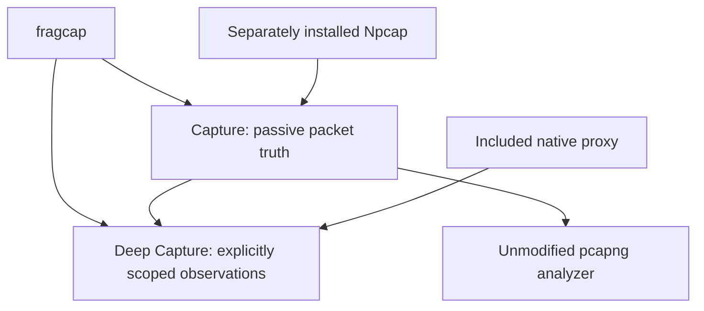

Published baseline: [v0.10.1](https://github.com/h8rt3rmin8r/fragcap/releases/tag/v0.10.1).

<Callout title="Release and completion status">
These instructions describe guided calibration and native functionality shipped in v0.10.0 on 2026-09-15. Deep Capture is functional but incomplete: independent review [#333](https://github.com/h8rt3rmin8r/fragcap/issues/333) and final gate [#334](https://github.com/h8rt3rmin8r/fragcap/issues/334) remain open. Follow documentation matching your installed bytes; v0.10.1 adds S151 Doctor diagnostics and S152 publication protection.
</Callout>

Capture passively records packets and attributes flows to processes. Deep Capture runs Capture beside an explicit target-scoped local proxy and adds application observations only for traffic reaching that proxy under the required trust and scope conditions. Start with Capture; use guided calibration when you deliberately want to investigate Deep Capture eligibility.

## Before you begin

Live packet recording requires Windows, an elevated terminal, and separately installed Npcap in WinPcap API-compatible mode. The native Deep Capture proxy is included. Neither mode reaches inside the target process. Do not configure a system-wide proxy, disable certificate verification, or attempt to bypass pinning.



Npcap supplies live packets, while attribution uses Windows socket and process evidence. Wireshark is an optional analyzer and can install Npcap. fragcap never bundles or redistributes Npcap. See the [dependency model](/docs/glossary/platform-and-distribution#dependency-model) and [security and privacy guide](/docs/guides/security-and-privacy).

## 1. Install fragcap and its prerequisites

Download the installer or portable archive from the [official releases](https://github.com/h8rt3rmin8r/fragcap/releases), and verify its accompanying SHA-256 checksum. The MSI adds fragcap to `PATH`; the portable archive runs from its unpacked directory. Packages are unsigned, so a checksum checks consistency with the published download, not publisher authentication. Review an Unknown Publisher warning deliberately rather than disabling Windows protections. See [packaging and migration](/docs/guides/packaging-and-migration).

If installing Npcap through Wireshark, leave **Install Npcap** selected and enable **WinPcap API-compatible Mode** in the Npcap installer. Loopback support is supplied by current Npcap installations.


## 2. Verify the environment

Open an elevated terminal and run:

```powershell
fragcap doctor
```

Doctor is read-only: it starts no capture, proxy, target, or trust change. It reports separate Capture and Deep Capture readiness, environment and driver checks, and native resource ownership and recovery guidance. Unavailable and indeterminate are not ready. Healthy completed history or deliberately retained sensitive evidence is not automatically stale residue to delete. Do not expect a universal synthetic all-green report.

Review named remediation first. `fragcap doctor --fix` is the individually confirmed action runner, not permission to repair everything. Re-run plain Doctor afterward. Optional `fragcap extcap install` adds a Wireshark source but is not required for command-line Capture. See [Doctor and troubleshooting](/docs/guides/doctor-and-troubleshooting).

## 3. Find a target

```powershell
fragcap targets
```

This command discovers installed titles, registers new findings in the effective local store, and lists stored targets. Ready targets precede targets needing setup. A row number is an ephemeral selector for that listing; the handle is stable. Capture readiness, engine detections, and sensitivity coverage do not establish Deep Capture compatibility. Do not substitute a Steam app identifier for a row number in `capture`.

If a target is missing, inspect `fragcap targets add --help` or `fragcap targets scan --help`. Guided calibration can separately propose registration for an exactly resolved installed Steam identifier or display name. Managed stores have defaults; database flags are deliberate overrides, not required boilerplate.

## 4. Run the first Capture

```powershell
fragcap capture 1 --duration 5m --out first-capture.fcapng
```

Start the target after Capture arms, or use an eligible prepared managed launch with `--launch`. Default `target` scope writes only packets bound to selected target roles. Unattributed and other-process exclusions have separate counters. Select `--scope all` only when deliberately retaining all acquired traffic with attribution state preserved.

Payload is retained by default for admitted packets. `--no-payload` selects metadata without packet payload bytes; it does not establish whether omitted bytes were encrypted. Capture does not decrypt traffic. Review `fragcap capture --help` and [Capture modes](/docs/guides/capture-modes) before changing modes or sinks.

## 5. Open the packet truth

Open `first-capture.fcapng` with an unmodified pcapng-aware analyzer. Process image, role, stage, direction, and attribution fidelity appear in standard packet comments. Ignoring annotations still leaves ordinary readable pcapng. Loss accounting describes acquired, omitted, dropped, and refused traffic rather than equating an empty trace with success.

This completes the passive first-run path. Continue only for deliberately selected, authorized local inspection.

## 6. Check Deep Capture eligibility

Read existing facts without starting anything:

```powershell
fragcap targets show sample-target
```

Ordinary Deep Capture needs current applicable `proxy-routing = reached-client` evidence for the exact target/version, supported cold launch, route, loopback family, measurement case, backend/version, and fragcap version. Unknown, stale, conflicting, wrong-case, or launcher-only evidence does not pass. Protocol behavior, propagation, trust acceptance, and inspectability remain separate facts.

For missing or incomplete evidence, start guided calibration:

```powershell
fragcap calibrate sample-target
```

Registration, executable setup or candidate selection, and every later effectful attempt have separate complete plans and confirmations. Requested protocols are measurement intent, not proof. The workflow measures reachability first when needed, then proposes useful concrete cases from fresh observations. Failure, decline, limitation, interruption, or partial result stops later effects and checkpoints coverage.

Use the workflow identity and local-store-bound resume command printed by your run, not the specimen identity below:

```powershell
fragcap calibrate --resume 17 --local-db C:\Users\you\local.db
fragcap calibrate --resume 17 --pause-for login --local-db C:\Users\you\local.db
```

Resume rebuilds current authority and never reuses a prior plan or response. Pauses record operator-owned login, EULA, update, anti-cheat, gameplay, shutdown, or interruption work, not evidence. Cold direct, Steam platform, and declared publisher chains are supported. Warm applications remain yours to close normally; explicit `--restart-warm` observes shutdown and never kills a process. See [compatibility and calibration](/docs/reference/deep-capture-compatibility) for exact limits and advanced measurements.

## 7. Run a known-compatible Deep Capture

```powershell
fragcap deep-capture sample-target --launch --duration 5m --har
```

Review the complete plan: target and managed launch authority, exact loopback and routing policy, session CA and current-user trust action, sensitive artifacts, millisecond deadlines, fact writes, cleanup obligations, and refusal boundaries. No listener, bundle, trust, launch, Capture, or fact effect occurs until exact authorization. Output failure, target drift, plan mismatch, expiry, or pending prior-session recovery refuses rather than broadening scope.

Interactive execution requires a complete response line. Structured execution requires `--authorize-stdin`: read the emitted plan event and return its exact identifier plus one LF in the same process. `--quiet` and `--silent` never hide required consent output or authorize effects. Retired trust booleans do not authorize a run. Omit optional HAR or key logging when unnecessary.

Supported paths include HTTP/1.1, HTTP/2, HTTPS, WebSocket, SSE, schema-free gRPC envelopes, generic TCP/UDP, separately verified non-HTTP TLS, and scoped QUIC/HTTP/3. Support is route-, trust-, and traffic-specific, not universal. Pinning is never bypassed. See the [traffic matrix](/docs/reference/deep-capture-compatibility) and [CLI reference](/docs/reference/cli#deep-capture).

## 8. Review the bundle and cleanup

Read `manifest.json` first. Session outcome, cleanup outcome, artifact finalization/completeness, loss, and traffic inspectability are independent. A complete operation does not prove every flow was inspectable. Partial evidence must not be silently relabeled complete. [Output formats](/docs/reference/output-formats) explains manifest version 2, packet truth, application JSON Lines version 2, bounded HAR, proxy-owned client-facing TLS key logs, post-collection correlation, durable cleanup streams, sensitivity, and omissions.

Keep bundles private. Packet bytes, URLs, bodies, endpoints, process traces, and key material can expose sensitive information. `bundle export` makes a separate transformed copy with an exhaustive manifest; it does not edit the original. Sensitive cleanup is an explicit exact action, not a prerequisite to preserving legitimate completed evidence.

```powershell
fragcap doctor
fragcap doctor --fix
```

Only run the second command to review named remediation. Exact owned recovery obligations must be reconciled; ambiguous ownership does not authorize unrelated removal. Keep remaining ownership records until recovery is resolved.

## 9. Uninstall or start fresh

Ordinary uninstall removes installer-owned program effects while preserving targets, writable stores, profiles, captures, settings, and bundles. Explicit fresh-start removal is irreversible and reconciles exact recorded current-user obligations before accepted data deletion. It does not follow links, broaden to custom paths, remove Npcap, or own another profile's CurrentUser trust. See [packaging and migration](/docs/guides/packaging-and-migration) for interactive, silent current-user, and preview-bound all-users workflows.
