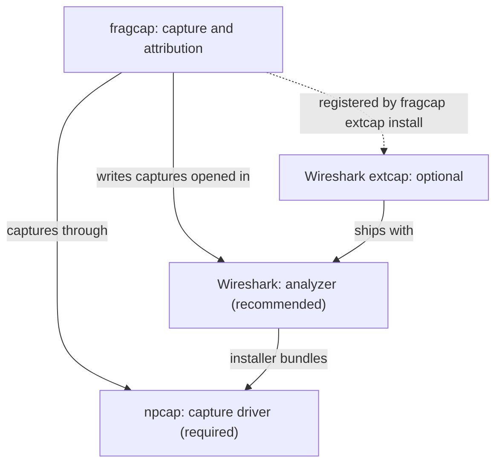

fragcap captures the network traffic your machine sends and receives and labels
each connection with the process that produced it. This guide takes you from
nothing installed to a capture file on disk, opened in Wireshark. Followed top to
bottom, it ends with a `.fcapng` file you can inspect.

## Before you begin

fragcap sits on top of a small, layered set of external tools. The diagram is the
whole dependency model: what is required, what is recommended, and what is
optional.



- **Required: npcap**, the capture driver. Live capture cannot happen without it.
  fragcap detects it and reports where to obtain it when it is absent; on its own
  it never bundles or hosts npcap. (`fragcap doctor --fix` may, only under your
  explicit confirmation, fetch and launch npcap's own signed installer for you;
  see [Verify the install](#2-verify-the-install).)
- **Recommended: Wireshark**, the analyzer you open captures in. Its installer
  also provides npcap, so installing Wireshark is the simplest way to get both at
  once.
- **Optional: the Wireshark extcap integration**, which lets fragcap feed
  Wireshark live. You register it later, once fragcap is installed, in
  [Verify the install](#2-verify-the-install).

The full definitions live in the
[dependency model](/docs/glossary/platform-and-distribution#dependency-model);
this page summarizes and links so the two cannot drift.

### If you do not already have npcap and Wireshark

If you already have them, skip ahead to [Install fragcap](#1-install-fragcap).
Otherwise, install Wireshark, which bundles npcap, and you get the recommended
analyzer in the same step. Download Wireshark from
[wireshark.org](https://www.wireshark.org/), run the installer, and follow the
screens below.

On the **Choose Components** screen, leave the External capture tools (extcap)
group selected. These are the interfaces Wireshark can capture through; fragcap
registers alongside them later.


Accept the default **install location** unless you have a reason to change it.


On the **Packet Capture** screen, leave **Install Npcap** checked. This is the
bundled npcap installer; Wireshark launches it as part of its own setup.


The npcap installer opens with its **license agreement**. npcap is by the Nmap
Project and is not redistributable, which is why fragcap detects it rather than
shipping it. Read and accept the license to continue.


On the npcap **Installation Options**, leave **Install Npcap in WinPcap
API-compatible Mode** checked. fragcap links against the WinPcap-compatible
interface, so this option is the one that matters for capture. Current npcap
installs loopback capture automatically, so there is no separate loopback option
to enable here.


Finish the npcap installer, then the Wireshark installer.

### What to expect from your first capture

Three things, so the result matches what you intend:

- **Payloads are encrypted.** fragcap records that a conversation happened and
  which process owned it, not readable game traffic.
- **The launcher-to-client handoff is not in the capture.** fragcap attributes
  the client's own flows, not the brief launcher exchange that starts it.
- **A loopback conversation is usually a process talking to itself.** Local
  traffic on the loopback interface is normal and often not what you are after.

## 1. Install fragcap

Download a release from the
[fragcap releases page](https://github.com/h8rt3rmin8r/fragcap/releases). Each
release offers a Windows installer (`fragcap-<version>-x86_64.msi`) and a portable
archive (`fragcap-<version>-x86_64-pc-windows-msvc.zip`), each with a `.sha256`
checksum beside it. The `.msi` puts `fragcap` on your `PATH` so it works in any new
terminal; the `.zip` needs no installation, just unzip and run.

The installer is not code-signed, so Windows shows a SmartScreen "Windows protected
your PC" warning with an "Unknown Publisher" note; this is expected for this
release. Choose **More info** then **Run anyway**, and verify the download against
its `.sha256` checksum, which is the integrity check in the absence of a signature.

On completion the installer offers to open the npcap download page, because npcap is
a separate install (see [Before you begin](#before-you-begin)). It checks whether the
capture driver is already present and only pre-selects that option when it is not, so
if you installed npcap with Wireshark above the box is left unchecked and you can
click Finish straight through; if the driver is missing the box is pre-checked and
Finish opens the vendor's page. Either way you can toggle it, and the installer never
downloads, bundles, or installs npcap itself.

The installer also offers an optional step to register fragcap with Wireshark, for
the current user or (for administrators) for all users on the machine. It is off by
default; if you skip it, you can register later from the next step.

## 2. Verify the install

**Open your terminal as Administrator** (right-click the terminal, then **Run as
administrator**). Live capture needs an elevated shell, and elevation is what turns
the `privilege` and capture-driver rows green; a normal terminal will show them as
not-ready and you will not know why.

Run `fragcap doctor`. It reports your environment (identity, platform, the capture
driver, tracing, interfaces, and the Wireshark integration) and captures nothing. A
ready environment looks like this:

```text
fragcap doctor
```

```text
Identity
  version                ok    0.5.0
  binary                 ok    C:\Program Files\fragcap\fragcap.exe
  catalog db             ok    C:\Users\you\AppData\Roaming\fragcap\catalog.db
                               (present)
  local db               ok    C:\Users\you\AppData\Roaming\fragcap\local.db
                               (present)

Platform
  os                     ok    Windows 11
  subsystem              ok    native
  privilege              ok    elevated

Capture driver
  npcap                  ok    version 1.88
  loopback adapter       ok    loopback capture supported
  winpcap api mode       ok    WinPcap API compatible
  live backend           ok    live capture backend is built in
  socket-table backend   ok    socket-table attribution is built in

Tracing
  process events         ok    process-event session available

Interfaces
  adapter                ok    Ethernet 192.0.2.10

Integration
  analyzer extcap        ok    installed for the current user in
                               C:\Users\you\AppData\Roaming\Wireshark\extcap

Ready to capture.
```

Any row that is not `ok` names what is missing and how to resolve it. If npcap is
absent, `doctor` says so and links the download. `fragcap doctor --fix` goes one
step further: it offers, one at a time and only under your confirmation, to perform
the fixes the report named, including relaunching elevated and (in a
network-capable build) fetching and launching npcap's own signed installer. It acts
only on remediations the plain report already printed, and it never installs
anything without asking.

**Optional: register the Wireshark integration.** To feed Wireshark live from its
own capture interface list, register the extcap integration now that fragcap is
installed:

```text
fragcap extcap install
```

This copies fragcap into your Wireshark extcap directory and needs no elevation.
The `analyzer extcap` row in `doctor` is optional, not a blocker, and turns `ok`
once you run this. See [the extcap reference](/docs/reference/cli#environment) for
machine-wide registration and other options.

## 3. Find a target

A capture attributes a game's traffic to it, so fragcap needs to know which title
you mean. It keeps a small local store of **targets**, and it discovers the
installed titles on your machine for you. Just run:

```text
fragcap targets
```

fragcap walks Steam and the common game-install locations, registers what it finds,
and prints a numbered listing:

```text
  #  TARGET                     CAPTURE          KNOWN
  1  the_elder_scrolls_online   ready            no online mode recorded
  2  the_division_2             ready            Denuvo, EasyAntiCheat

  fragcap capture 1
```

The **CAPTURE** column says whether a row is ready to capture; the number in the
first column is the one the capture command honors, so the listing ends by naming
the exact next command for the first ready row.

fragcap registers what it discovers for you, so the title you want is usually
already listed. If it is not (a non-Steam launcher, or an unusual install
location), you can register it by hand with `fragcap targets add` or `fragcap
targets scan`; both take a `--db` pointing at your local store (the `local db`
path `fragcap doctor` shows). See [the targets commands](/docs/reference/cli#targets)
for the exact form. For a Steam title, its **App ID** is the number in its Steam
store or library URL, for example `306130` in
`store.steampowered.com/app/306130/`.

## 4. Capture

Capture the row you want by its number from the listing:

```text
fragcap capture 1 --out capture.fcapng
```

You can also name a target by its handle (`fragcap capture --target
the_elder_scrolls_online --out capture.fcapng`). fragcap arms, waits for the
target's client to appear, attributes its flows to the process that owns them, and
writes `capture.fcapng` when the capture ends. Start the game after fragcap is
armed; it will match the client and begin recording.

To bound the run, add `--duration 30m` (or `--max-packets`, or `--max-bytes`); to
capture only part of the traffic, add `--roles client`. See
[the CLI reference](/docs/reference/cli#capture) for the full set of options and
[capture modes](/docs/guides/capture-modes) for streaming and ring capture.

## 5. Open the result in Wireshark

Open `capture.fcapng` in [Wireshark](https://www.wireshark.org/), or any other
pcapng-aware analyzer. This is where a capture becomes useful: Wireshark shows the
packets as usual, and the owning process, its role, and the attribution fidelity
appear in each packet's comment. Unmodified analyzers read the file as ordinary
pcapng, so nothing bespoke is needed to look at what you captured.
