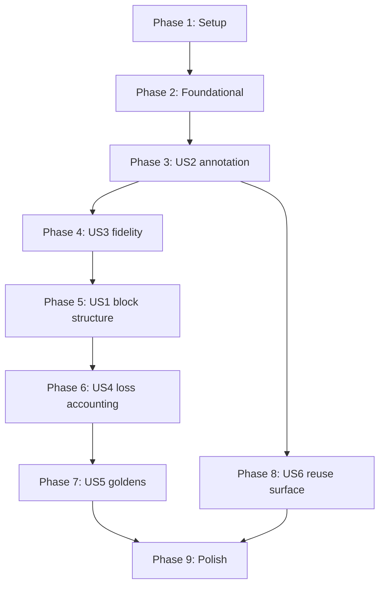

# Tasks: pcapng Writer and Annotation Encoding

**Slice**: S06

**Branch**: `feat/pcapng-writer-annotations`

**Created**: 2026-08-08

**Input**: [spec.md](spec.md), [plan.md](plan.md), [research.md](research.md),
[data-model.md](data-model.md),
[contracts/writer-api.md](contracts/writer-api.md),
[quickstart.md](quickstart.md)

Tests are included and are not optional. FR-037 through FR-040 make them
requirements, and this slice fixes an on-disk format: a format defect is not
contained by the slice that introduces it, it is inherited by every capture
ever written and by S07 and S08, which restate its rules.

Two notes on the shape.

**The phase order is dependency order, not priority order.** User story 2, the
annotation grammar, is built before user story 1, the block structure, even
though the spec ranks them the other way. FR-014 requires every Enhanced Packet
Block to carry its annotation, so the block writer consumes the annotation
encoder and cannot be completed before it exists. Building US1 first would mean
writing packet blocks with a placeholder comment and revisiting them, which is
the same work in a worse order. The priorities in the spec still say which
stories are load-bearing; they do not say which compiles first.

**Phase 7 is where the slice's actual claim is proved.** Everything before it
demonstrates that a part works. Phase 7 demonstrates that the bytes are stable
and that an independent structural pass accepts them, which is what the goldens
in every later slice will rest on.

## Phase 1: Setup

- [X] T001 Confirm the repository's ignore rules admit committed golden files
  before generating any, by creating a throwaway file at
  `fixtures/goldens/probe.fcapng` and checking `git status` sees it.
  `.gitignore` already re-includes `fixtures/**/*.fcapng`, so this is expected
  to pass; it is cheap, and the cost of being wrong is eight generated files
  that silently do not commit. Remove the throwaway
- [X] T002 Create `fixtures/goldens/README.md` stating what the goldens are,
  that they are generated rather than hand-made, the exact command to
  regenerate them, and that a regenerated diff must be read rather than
  committed blind
- [X] T003 Replace the skeleton module documentation in
  `crates/fragcap-sink/src/lib.rs` with the module layout from `plan.md`,
  naming S07, S15, and S16 as the slices that fill what this one does not

## Phase 2: Foundational

Framing primitives and errors. No pcapng semantics yet, and nothing here knows
what a packet is. Blocking for every phase that follows.

- [X] T004 [P] Define `WriteError` in `crates/fragcap-sink/src/error.rs`
  covering the four named conditions in `contracts/writer-api.md`: undeclared
  interface identifier, pre-epoch timestamp, option value exceeding the 16-bit
  length, and an underlying writer failure. Implement conversion into core's
  `SinkError`
- [X] T005 [P] Write failing tests in `crates/fragcap-sink/src/pcapng/block.rs`
  for option framing: a 2-byte code, a 2-byte value length excluding padding,
  the value, then padding to a 32-bit boundary. Cover a value length of 0, 1,
  3, 4, and 5 bytes so every padding case is asserted
- [X] T006 Implement option framing in
  `crates/fragcap-sink/src/pcapng/block.rs` to satisfy T005, writing
  little-endian regardless of host per FR-013
- [X] T007 Write failing tests in `crates/fragcap-sink/src/pcapng/block.rs` for
  block framing: type, total length, body, padding, and the repeated trailing
  total length, with the two length fields required to agree per FR-011 and the
  total required to include all twelve bytes of framing
- [X] T008 Implement block framing in
  `crates/fragcap-sink/src/pcapng/block.rs` to satisfy T007, including
  `opt_endofopt` termination of every option list per FR-012
- [X] T009 [P] Add a test in `crates/fragcap-sink/src/pcapng/block.rs`
  asserting that an option value exceeding 65,535 bytes produces
  `WriteError`, never a silent truncation per FR-033

## Phase 3: User Story 2, attribution is visible without special tooling (P1)

**Goal**: The section 13.3 grammar exists as a value with an encoder and a
decoder that agree, carrying no pcapng knowledge.

**Independent test**: Encode an annotation covering every key in the section
13.3 table, decode it, and compare against the input. Encoding and decoding are
separate code paths, so a round trip that holds proves the grammar rather than
proving one function self-consistent.

- [X] T010 [P] [US2] Define `Annotation`, `AnnotatedDirection`, and `Fidelity`
  in `crates/fragcap-sink/src/annotation.rs` per `data-model.md`, including the
  `Local` and `Retained` variants this slice does not produce. Document each
  fidelity variant with the meaning section 13.4 assigns it, per FR-026 and
  FR-027, since the definitions are the only place `retained` exists until the
  grace period map lands
- [X] T011 [US2] Write failing tests in
  `crates/fragcap-sink/src/annotation.rs` for percent-encoding: the three
  characters section 13.3 names, every code point below 0x20, and 0x7F, with
  uppercase hexadecimal digits on output per FR-022, FR-023, FR-023a
- [X] T012 [US2] Implement percent-encoding and decoding in
  `crates/fragcap-sink/src/annotation.rs` to satisfy T011, with the decoder
  accepting either hexadecimal case per plan decision D-5
- [X] T013 [US2] Write failing tests in
  `crates/fragcap-sink/src/annotation.rs` asserting key order is `pid`, `proc`,
  `role`, `stage`, `dir`, `attr`, `iface` with present keys keeping that
  relative order per FR-016a, and that keys are lowercase ASCII per FR-016
- [X] T014 [US2] Implement `Annotation::encode` in
  `crates/fragcap-sink/src/annotation.rs` to satisfy T013, emitting the
  `fragcap:` sentinel per FR-015
- [X] T015 [US2] Write failing tests in
  `crates/fragcap-sink/src/annotation.rs` for `Annotation::decode`, covering a
  missing sentinel, an unknown key, a malformed percent escape, and an empty
  value, each with a named error
- [X] T016 [US2] Implement `Annotation::decode` in
  `crates/fragcap-sink/src/annotation.rs` to satisfy T015
- [X] T017 [US2] Write a round-trip test in
  `crates/fragcap-sink/src/annotation.rs` over every key in the section 13.3
  table and over values containing each reserved character, asserting decode of
  encode returns the original per FR-024 and SC-005
- [X] T018 [US2] Add a test in `crates/fragcap-sink/src/annotation.rs`
  asserting an empty value is written with its key present rather than omitted
  per FR-023b, since omitting `proc` reports a different fact

## Phase 4: User Story 3, fidelity is recorded and never inferred (P1)

**Goal**: The `attr` and `dir` keys carry what the pipeline resolved, with the
type-level gap between core's two-variant `Direction` and the file's four
states resolved explicitly.

**Independent test**: Derive annotations from packets in all three attribution
states and confirm each carries the correct `attr`, and that an unattributed
packet carries no identity key at all rather than an empty or placeholder
value.

- [X] T019 [US3] Write failing tests in
  `crates/fragcap-sink/src/annotation.rs` for `Annotation::from_packet`
  asserting `pid` and `proc` are present exactly when attribution is present,
  and never present individually, per FR-017
- [X] T020 [US3] Write failing tests in
  `crates/fragcap-sink/src/annotation.rs` asserting `role` and `stage` are
  decided independently of each other per FR-018, including the role-without-
  stage case the specification's paired presentation does not cover
- [X] T021 [US3] Write failing tests in
  `crates/fragcap-sink/src/annotation.rs` for the direction mapping:
  `Some(Inbound)` to `in`, `Some(Outbound)` to `out`, and `None` to `unknown`,
  asserting explicitly that `None` does not map to `local` per FR-019a
- [X] T022 [US3] Write failing tests in
  `crates/fragcap-sink/src/annotation.rs` asserting `attr=none` implies the
  absence of `pid`, `proc`, `role`, and `stage` per FR-028
- [X] T022a [US3] Write a failing test in
  `crates/fragcap-sink/src/annotation.rs` asserting `dir` and `attr` are
  present on every annotation in every attribution state, per FR-019 and
  FR-020. This is the guarantee that lets a consumer parse without a presence
  check, and it is separate from the tests that check which value each carries
- [X] T022b [US3] Write a failing test in
  `crates/fragcap-sink/src/annotation.rs` asserting `iface` is absent when one
  interface is declared and present when more than one is, per FR-021
- [X] T023 [US3] Implement `Annotation::from_packet` in
  `crates/fragcap-sink/src/annotation.rs` to satisfy T019 through T022b,
  deriving fidelity from the packet's attribution state and never defaulting or
  upgrading it per FR-029

## Phase 5: User Story 1, an unmodified analyzer opens the capture (P1)

**Goal**: The three leading block types are emitted, correctly framed, and
structurally valid to a reader that has never seen fragcap.

**Independent test**: Write a capture from a fixture, then walk its bytes by
their declared block lengths through a validator that never calls the writer's
encoding functions, confirming the walk consumes the file exactly.

- [X] T024 [US1] Define `InterfaceDeclaration` and identifier assignment in
  `crates/fragcap-sink/src/pcapng/interface.rs` per `data-model.md`, assigning
  from zero in declaration order per FR-006 and not deduplicating
- [X] T025 [US1] Write failing tests in
  `crates/fragcap-sink/src/pcapng/mod.rs` for the Section Header Block:
  byte-order magic `0x1A2B3C4D`, version 1.0, section length -1,
  `shb_userappl` of `fragcap/0.1.0`, and `opt_comment` of
  `fragcap:profile=0.1.0` per FR-002 and FR-003
- [X] T026 [US1] Implement `PcapngWriter::new` in
  `crates/fragcap-sink/src/pcapng/mod.rs` to satisfy T025, writing the Section
  Header Block immediately so it is always first per FR-001. The writer is
  generic over `std::io::Write` and never opens a path, per FR-034 and FR-035,
  which is what lets every test in this slice write to an in-memory buffer
- [X] T027 [US1] Write failing tests in
  `crates/fragcap-sink/src/pcapng/mod.rs` for the Interface Description Block:
  link type, reserved zero, snap length, `if_name`, and `if_tsresol` of 6 per
  FR-005 and FR-009
- [X] T028 [US1] Implement `PcapngWriter::declare_interface` in
  `crates/fragcap-sink/src/pcapng/mod.rs` to satisfy T027
- [X] T028a [US1] Write a failing test in
  `crates/fragcap-sink/src/pcapng/mod.rs` declaring two interfaces, asserting
  they receive identifiers 0 and 1, that both Interface Description Blocks
  precede any packet referencing them, and that a packet written against each
  carries the matching identifier, per FR-004 and FR-006
- [X] T029 [US1] Write failing tests in
  `crates/fragcap-sink/src/pcapng/mod.rs` for timestamp conversion: flooring
  nanoseconds toward negative infinity per FR-009a, splitting into upper and
  lower 32-bit halves, and refusing a pre-epoch value with a named error per
  FR-009b
- [X] T030 [US1] Write failing tests in
  `crates/fragcap-sink/src/pcapng/mod.rs` for the Enhanced Packet Block:
  interface identifier, timestamp halves, captured and original lengths, packet
  data padded to a 32-bit boundary with padding excluded from `captured_len`,
  and the annotation in `opt_comment` per FR-007, FR-010, FR-014
- [X] T031 [US1] Add a failing test in
  `crates/fragcap-sink/src/pcapng/mod.rs` asserting that a write against an
  undeclared interface identifier is an error rather than an invented
  interface, per FR-033
- [X] T032 [US1] Add a failing test in
  `crates/fragcap-sink/src/pcapng/mod.rs` asserting an original length smaller
  than the captured length is written exactly as recorded, and that a captured
  length exceeding the declared snap length is likewise unrepaired, per the
  edge cases
- [X] T033 [US1] Implement `Sink::write` for `PcapngWriter` in
  `crates/fragcap-sink/src/pcapng/mod.rs` to satisfy T028a through T032, never
  dropping or skipping a packet per FR-030
- [X] T033a [US1] Implement `iface` propagation in
  `crates/fragcap-sink/src/pcapng/mod.rs`, passing the declared interface name
  into `Annotation::from_packet` only when more than one interface is declared,
  satisfying T022b per FR-021
- [X] T034 [US1] Write the independent structural validator in
  `crates/fragcap/tests/structure.rs`: walk blocks by declared length,
  assert the walk consumes the file exactly, assert leading and trailing
  lengths agree, assert option alignment and `opt_endofopt` termination, and
  assert every packet block references an interface declared earlier per
  FR-004. It MUST NOT call the writer's encoding functions, per FR-039
- [X] T035 [US1] Add a test in `crates/fragcap/tests/structure.rs` running
  the validator over output produced from every fixture in `fixtures/`, per
  FR-040 and SC-008

## Phase 6: User Story 4, every drop is in the file (P1)

**Goal**: Finishing the writer records every section 12.4 counter, with
fragcap's own losses distinguishable from upstream ones.

**Independent test**: Finish a writer with a statistics snapshot carrying a
non-zero value in every counter, read the Interface Statistics Block back, and
confirm each value appears in a standard field where one exists and in the
declared comment where none does.

- [X] T036 [US4] Write failing tests in
  `crates/fragcap-sink/src/pcapng/mod.rs` for the Interface Statistics Block:
  one per declared interface, carrying `isb_ifrecv`, `isb_ifdrop`, and
  `isb_osdrop` from the `CaptureStats` snapshot per FR-008
- [X] T037 [US4] Write failing tests in
  `crates/fragcap-sink/src/pcapng/mod.rs` asserting the block timestamp is the
  last packet written on that interface, or zero when none was, and that no
  code path reads a clock, per FR-008a
- [X] T038 [US4] Write failing tests in
  `crates/fragcap-sink/src/pcapng/mod.rs` asserting `buffer_dropped` and
  `sink_dropped` appear in an `opt_comment` under the `fragcap:` sentinel per
  FR-031, and that neither appears in `isb_osdrop` per FR-032
- [X] T039 [US4] Implement `Sink::finish` for `PcapngWriter` in
  `crates/fragcap-sink/src/pcapng/mod.rs` to satisfy T036 through T038,
  consuming the writer so trailing blocks are written exactly once per plan
  decision D-4
- [X] T040 [US4] Implement `Sink::flush` for `PcapngWriter` in
  `crates/fragcap-sink/src/pcapng/mod.rs`, forwarding to the underlying writer
- [X] T041 [US4] Add a test in `crates/fragcap/tests/structure.rs`
  asserting that a writer dropped without finishing leaves the blocks already
  written intact and structurally valid, bounding the damage per US4 scenario 4

## Phase 7: User Story 5, the same input produces the same file (P2)

**Goal**: Output is byte-stable, and the goldens that every later slice will
lean on exist and are checked.

**Independent test**: Write the same fixture twice in one process and compare
the buffers, then compare both against the committed golden.

- [X] T042 [US5] Write a determinism test in
  `crates/fragcap/tests/goldens.rs` asserting that writing the same
  fixture twice in one process produces byte-identical buffers per FR-037.
  Document in the test that SC-007's cross-architecture half cannot be
  asserted from one machine and rests on FR-013 writing little-endian
  unconditionally, so the guarantee is a property of the code rather than a
  claim this test verifies
- [X] T043 [US5] Write the golden generator in
  `crates/fragcap/tests/goldens.rs`, producing one `.fcapng` per fixture
  in the S04 corpus from the fixture and its attribution script, gated behind
  `FRAGCAP_UPDATE_GOLDENS` per `quickstart.md`
- [X] T044 [US5] Generate the eight goldens into `fixtures/goldens/` and read
  the diff before committing them, per FR-038a
- [X] T045 [US5] Write the drift check in
  `crates/fragcap/tests/goldens.rs`, comparing writer output against each
  committed golden and failing with the fixture name and the offset of the
  first differing byte per FR-038
- [X] T046 [US5] Confirm the drift check runs in the ordinary gate by running
  `cargo xtask ci` and observing the `goldens` test execute, per FR-038a. No
  `xtask` change is expected or wanted: `ci` runs `cargo test --workspace
  --locked`, and S04's corpus drift check reaches the gate the same way, as an
  ordinary test target rather than as wiring. If it does not run, the defect is
  in the test target, not in `xtask`

## Phase 8: User Story 6, the next slices can build on the annotation (P2)

**Goal**: S07 can render the same facts as JSON without restating which keys
are present.

**Independent test**: Construct an annotation from a `CapturedPacket` and
assert the key set matches the packet's attribution state, with pcapng
serialization applied as a separate step.

- [X] T047 [US6] Export `Annotation`, `AnnotatedDirection`, and `Fidelity` from
  `crates/fragcap-sink/src/lib.rs`, with documentation stating that derivation
  is the reusable part and the path is not stable, per
  `contracts/writer-api.md`
- [X] T048 [US6] Add a test in `crates/fragcap-sink/src/annotation.rs`
  exercising derivation with no rendering, asserting the key set follows from
  the packet without the caller choosing, per FR-025

## Phase 9: Polish and cross-cutting concerns

- [X] T049 [P] Add glossary entries to `docs/glossary.md` for every term this
  slice introduces, with primary-source references per constitution P-6 and
  specification section 4.3
- [X] T050 [P] Write `changelog.d/S06-pcapng-writer-annotations.added.md`
  describing the writer, the annotation grammar, and the loss accounting
- [X] T051 [P] Write `changelog.d/S06-pcapng-writer-annotations.decisions.md`
  recording, dated, for promotion to specification section 29: the
  percent-encoding widening to control characters, the `dir=unknown` value and
  why `local` was not used, the independent treatment of `role` and `stage`,
  the Interface Statistics Block comment carrying counters pcapng has no field
  for, and the section 12.7 session anchor gap left for S08
- [X] T052 Verify the dependency direction is unchanged by running
  `cargo xtask deps`, confirming no edge from core to sink per FR-036
- [X] T053 Run `cargo xtask ci` in the foreground and watch it to completion,
  then run `cargo xtask neutral` and `cargo xtask msrv` and confirm both exit 0
- [X] T054 Perform the manual tshark verification from `quickstart.md` against
  a committed golden, and record the observed output in the pre-push report.
  This is evidence for SC-001 and SC-002 and is not a gate

## Dependencies

Phase 5 depends on Phase 4 rather than merely on Phase 3, because FR-014
requires every packet block to carry an annotation and the derivation is what
supplies it. Phase 8 depends only on Phase 3, since the reuse surface is the
annotation type rather than the writer.

## Parallel opportunities

- T004 and T005 touch different files and have no ordering between them.
- T010 is independent of the Phase 2 framing work and can begin alongside it.
- T019 through T022 are four independent test tasks against one implementation
  task, T023. Write all four failing, then satisfy them together.
- T049, T050, and T051 touch three different files and are independent.

## Implementation strategy

**MVP is Phases 1 through 5.** At that point fragcap writes a file that an
unmodified analyzer opens and that displays attribution, which is the product
claim of section 13.1. It is missing loss accounting and goldens, so it is not
shippable, but it is demonstrable and every remaining phase adds to a working
artifact rather than completing a broken one.

**The order is TDD throughout.** Every implementation task in Phases 2 through
7 is preceded by the task that writes its failing test. This is not ceremony
here: the failure modes of a format writer are off-by-one lengths, wrong
padding, and inverted byte order, none of which are visible by reading the code
and all of which are obvious in a test that asserts bytes.

**Phase 7 is the gate that matters most.** Until the goldens exist and drift is
checked, every earlier phase is asserted by tests written by the same author
who wrote the code. The goldens are what make a later regression visible to
someone who was not here.
