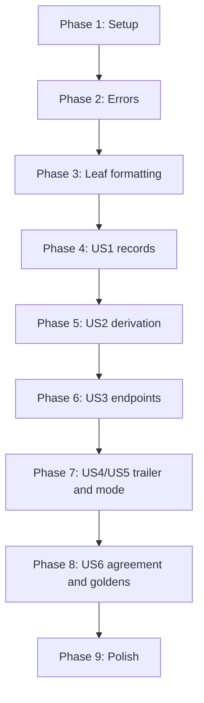

# Tasks: JSON Lines Writer

**Slice**: S07

**Branch**: `feat/json-lines-writer`

**Created**: 2026-08-08

**Input**: [spec.md](spec.md), [plan.md](plan.md), [research.md](research.md),
[data-model.md](data-model.md),
[contracts/jsonl-format.md](contracts/jsonl-format.md),
[quickstart.md](quickstart.md)

Tests are included and are not optional. FR-029 and FR-038 through FR-041 make
them requirements, and this slice adds a second format that must not drift from
the first.

Two notes on the shape.

**Phase 3 comes before Phase 4 for the same reason S06 inverted its phases.**
Escaping and number formatting are leaf functions with no packet in sight, and
every record written in Phase 4 depends on both. They are also the two places
this format can be wrong in a way that reads correctly.

**Phase 7 is the phase that justifies the slice.** Everything before it proves
the JSON stream is well-formed. Phase 7 proves it agrees with the pcapng
output, which is the property the S06 derivation split was built for and which
has never been tested because there was only one format.

## Phase 1: Setup

- [X] T001 Add `serde_json` to `[dev-dependencies]` in
  `crates/fragcap-sink/Cargo.toml` and `crates/fragcap/Cargo.toml`, pinned to
  the workspace convention, per FR-037. It MUST NOT appear under
  `[dependencies]` in either, per FR-036
- [X] T002 Confirm the ignore rules admit `fixtures/goldens/*.jsonl` by
  creating a throwaway file there and checking `git status` sees it. The
  existing rules re-include `fixtures/**` for capture extensions specifically,
  and `.jsonl` is not one of them, so this is expected to fail and to need a
  rule
- [X] T003 Update `crates/fragcap-sink/src/lib.rs` module documentation to name
  the JSON writer and what it shares with the pcapng one

## Phase 2: Foundational

- [X] T004 [P] Extend `WriteError` in `crates/fragcap-sink/src/error.rs` with
  the JSON writer's named conditions from `contracts/jsonl-format.md`, reusing
  `TimestampBeforeEpoch` and `UndeclaredInterface` where they already fit
  rather than adding parallel variants

## Phase 3: Leaf formatting

**Goal**: The two functions that can be silently wrong are correct and proven
against an external oracle.

- [X] T005 [P] Write failing tests in `crates/fragcap-sink/src/json/number.rs`
  for the exact decimal timestamp: `1_754_500_000_123_456_000` nanoseconds
  renders as `1754500000.123456`, a whole second renders with six zeros, and a
  sub-microsecond component floors, per FR-011, FR-013
- [X] T006 [US3] Write a failing test in
  `crates/fragcap-sink/src/json/number.rs` asserting the rendered text for a
  value that `f64` cannot represent exactly differs from what an `f64` round
  trip would produce, so the test fails if anyone introduces a float later, per
  FR-012
- [X] T007 [US3] Implement the timestamp formatter in
  `crates/fragcap-sink/src/json/number.rs` using integer arithmetic only,
  returning `WriteError::TimestampBeforeEpoch` for a negative value per FR-014
- [X] T008 [P] Write failing tests in `crates/fragcap-sink/src/json/escape.rs`
  for JSON string escaping: the double quote and the backslash per FR-026,
  every code point below 0x20 with its short escape where one exists and the
  `\uXXXX` form where it does not per FR-027, and characters above 0x7F
  emitted as UTF-8 rather than escaped per FR-028
- [X] T009 [US1] Implement string escaping in
  `crates/fragcap-sink/src/json/escape.rs` to satisfy T008
- [X] T010 [P] Write failing tests and implement lowercase hex encoding in
  `crates/fragcap-sink/src/json/escape.rs`, per FR-021
- [X] T011 [US1] Add a test in `crates/fragcap-sink/src/json/escape.rs` feeding
  every escaped string through `serde_json` and asserting it parses back to the
  original, which is the external oracle the hand-rolled escaper needs

## Phase 4: User Story 1, a researcher greps a capture (P1)

**Goal**: The three record shapes exist, every line is one object, and an
off-the-shelf parser reads all of them.

**Independent test**: Write a stream and parse every line with `serde_json`,
asserting the parse succeeds and the values match the input.

- [X] T012 [US1] Define `PayloadMode` and `JsonLinesWriter` in
  `crates/fragcap-sink/src/json/mod.rs` per `data-model.md`, taking the
  interface set and mode at construction. It lives in `fragcap-sink` and
  implements the core `Sink` trait per FR-034, generic over `std::io::Write`
  rather than taking a path per FR-035, which is what lets every test here
  write to a buffer
- [X] T013 [US1] Write failing tests in `crates/fragcap-sink/src/json/mod.rs`
  for the header record: `type` first, version, and the interface set in
  declaration order, per FR-003, FR-006, FR-007, FR-038b
- [X] T014 [US1] Implement `JsonLinesWriter::new` to satisfy T013, writing the
  header immediately so it is always the first line per FR-003
- [X] T015 [US1] Write failing tests in `crates/fragcap-sink/src/json/mod.rs`
  for the packet record key order of FR-010, including that absent keys do not
  disturb the relative order of present ones
- [X] T016 [US1] Write a failing test asserting no record contains a literal
  newline, every line ends with exactly one line feed including the last, the
  stream has no enclosing array or separating commas, and the line count equals
  the packet count plus two, per FR-001, FR-002, FR-008, FR-009
- [X] T017 [US1] Implement `Sink::write` in
  `crates/fragcap-sink/src/json/mod.rs` to satisfy T015 and T016, never
  dropping a packet per FR-032
- [X] T018 [US1] Add a test parsing every emitted line with `serde_json` and
  asserting it is an object, per FR-029
- [X] T018a [US1] Write a failing test asserting no packet record carries a
  `type` key, per FR-005. This is the consumer dispatch contract: a packet
  record carrying one would be read as metadata by every consumer that
  dispatches on the first key, and nothing else in the stream would look wrong
- [X] T018b [US1] Write a failing test asserting `len` and `orig_len` are
  written exactly as recorded, including a packet whose original length is
  smaller than its captured length, per FR-020. S04 and S06 both refuse to
  repair a self-contradicting record and this format is no different

## Phase 5: User Story 2, both formats agree (P1)

**Goal**: The attribution keys come from the S06 derivation, not from a second
reading of the packet.

**Independent test**: Assert the JSON writer calls the shared derivation and
that its output matches the pcapng annotation field by field.

- [X] T019 [US2] Write failing tests in `crates/fragcap-sink/src/json/mod.rs`
  asserting `pid` and `proc` appear as a pair per FR-016, `role` and `stage`
  appear independently of each other per FR-017, and `dir` and `attr` are
  always present per FR-018
- [X] T020 [US2] Implement attribution rendering in
  `crates/fragcap-sink/src/json/mod.rs` by reading an `Annotation` from
  `Annotation::from_packet`, with no independent inspection of the packet's
  attribution, per FR-022
- [X] T021 [US2] Write a failing test asserting `iface` is present on every
  record including single-interface captures, which is the deliberate
  divergence from the pcapng rule, per FR-015

## Phase 6: User Story 3 and endpoints (P1)

**Goal**: Nothing is asserted that was not observed: not a timestamp, not a
wire order.

**Independent test**: Write packets with and without a determined direction and
assert which endpoint keys appear.

- [X] T022 [US3] Write failing tests in `crates/fragcap-sink/src/json/mod.rs`
  asserting `src` and `dst` carry wire order for an outbound and an inbound
  packet, derived from direction, per FR-019a
- [X] T023 [US3] Write failing tests asserting a packet with a flow key and no
  determined direction carries `local` and `remote` and neither `src` nor
  `dst`, per FR-019b, and that no record carries both pairs, per FR-019c
- [X] T024 [US3] Write a failing test asserting a packet with no flow key
  carries no `proto` and neither endpoint pair, per FR-019
- [X] T025 [US3] Implement endpoint rendering in
  `crates/fragcap-sink/src/json/mod.rs` to satisfy T022 through T024

## Phase 7: User Story 4 and 5, accounting and payload mode (P1, P2)

**Goal**: The stream accounts for itself, and the metadata-only mode changes
exactly one key.

**Independent test**: Finish with every counter non-zero and read the trailer;
write the same fixture in both modes and diff the records.

- [X] T026 [US4] Write failing tests in `crates/fragcap-sink/src/json/mod.rs`
  for the trailer: emitted once at finish per FR-004, `type` first per FR-006,
  every section 12.4 counter present per FR-030, and present-when-zero per
  FR-031
- [X] T027 [US4] Implement `Sink::finish` to satisfy T026, consuming the writer
  so the trailer is written once, per plan D-4, and taking every counter from
  the supplied snapshot per FR-038c
- [X] T028 [US4] Implement `Sink::flush`, forwarding to the underlying writer
- [X] T029 [US5] Write failing tests asserting `MetadataOnly` omits `data`
  entirely and changes no other key, and that a zero-length payload in
  `WithPayload` mode renders as an empty string, per FR-024, FR-025
- [X] T030 [US5] Implement payload mode handling in
  `crates/fragcap-sink/src/json/mod.rs` to satisfy T029
- [X] T031 [US4] Add a test asserting a writer dropped without finishing leaves
  parseable lines and no trailer, which is how a consumer detects truncation
- [X] T031a [US4] Write a failing test asserting a record the writer refuses
  surfaces as an error to the caller and writes no partial line, per FR-033. A
  half-written line is worse than a refused one: it makes every following line
  unparseable to a consumer reading sequentially
- [X] T031b [US4] Write a test asserting the writer reads no clock, environment
  variable, or locale, per FR-038a, by rendering the same fixture with the
  process environment mutated between runs and asserting identical bytes. S06
  needed this stated; this slice asserts it, since the trailer is the one
  record whose content comes from outside the packet stream

## Phase 8: User Story 6, cross-format agreement and goldens (P1, P2)

**Goal**: The two formats agree over the whole corpus, and the stream is
byte-stable.

**Independent test**: For every fixture, compare the JSON records against the
pcapng annotations field by field, then against committed goldens.

- [X] T032 [US6] Extend `crates/fragcap/tests/common/mod.rs` with a
  `render_jsonl` alongside the existing pcapng render, sharing the same fixture
  read, parse, and attribution path so the two outputs describe the same run
- [X] T033 [US2] Write `crates/fragcap/tests/agreement.rs`: for every fixture,
  parse the JSON records and the pcapng packet comments and assert `pid`,
  `proc`, `role`, `stage`, `dir`, and `attr` agree for every packet, per
  FR-023 and SC-002
- [X] T034 [US6] Write a determinism test in `crates/fragcap/tests/goldens.rs`
  asserting the same fixture written twice produces byte-identical JSON, per
  FR-038
- [X] T035 [US6] Extend the golden generator in
  `crates/fragcap/tests/goldens.rs` to produce one `.jsonl` per fixture beside
  the `.fcapng`, under the same `FRAGCAP_UPDATE_GOLDENS` gate
- [X] T036 [US6] Generate the eight JSON goldens and read the diff before
  committing, per FR-040
- [X] T037 [US6] Extend the drift check to the JSON goldens, failing with the
  fixture name and the first differing line, per FR-039
- [X] T038 [US6] Add a test asserting every line of every committed golden
  parses with `serde_json`, per FR-029 and FR-041

## Phase 9: Polish and cross-cutting concerns

- [X] T039 [P] Add glossary entries to `docs/glossary.md` for JSON Lines,
  payload-free mode, and trailer record, per P-6
- [X] T040 [P] Write `changelog.d/S07-json-lines-writer.added.md`
- [X] T041 [P] Write `changelog.d/S07-json-lines-writer.decisions.md`
  recording, dated, for promotion to specification section 29: the `src` and
  `dst` versus `local` and `remote` resolution, the unconditional `iface`
  divergence from the pcapng profile, the session anchor gap carried forward
  from S06, and the dev-dependency and why it is not a runtime one
- [X] T042 Verify the dependency direction with `cargo xtask deps` and confirm
  `serde_json` appears in no `[dependencies]` section, per FR-036
- [X] T043 Run `cargo xtask ci` in the foreground to completion, then
  `cargo xtask neutral` and `cargo xtask msrv`, confirming both exit 0
- [X] T044 Walk the `jq` commands in `quickstart.md` against the committed
  goldens and record the output in the pre-push report. This is the evidence
  for SC-001 on the consumer the format exists for

## Dependencies

## Parallel opportunities

- T005, T008, and T010 are independent leaf test tasks in two files.
- T039, T040, and T041 touch three different files.

## Implementation strategy

**MVP is Phases 1 through 5.** At that point fragcap emits a valid JSON stream
carrying attribution derived from the same source as the pcapng output. It is
missing endpoints, the trailer, and payload mode, so it is not shippable, but
every later phase adds to a working stream.

**TDD throughout.** The failure modes here are an escape that produces
unparseable output and a number that is approximately right. Neither is visible
by reading the code; both are obvious in a test that asserts bytes, and the
first has a third-party oracle available.

**Phase 8 is the one that cannot be skipped.** The goldens catch a format
change; only the agreement test catches the two formats drifting apart, and
that failure would otherwise surface as two internally consistent outputs that
disagree about the same packet.
