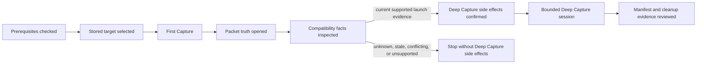

# Data Model: Verified First Capture and Deep Capture Journeys

This slice changes documentation rather than runtime data. The model captures the facts and transitions each documented journey must preserve.

## Journey

| Attribute | First Capture | Known-Compatible Deep Capture |
| --- | --- | --- |
| Entry condition | Installed fragcap and Npcap; elevated terminal; stored or directly named target | First Capture context plus a stored target, current launch-specific evidence, and available mitmdump backend |
| Selection | Numbered listing row or stored handle | Stored handle or row resolved from the current listing |
| Side effects | Opens live capture and writes the selected output | Starts proxy and capture, may add current-user CA trust after confirmation, launches the target, writes a session bundle, then cleans up |
| Primary truth | `.fcapng` packet observations and process attribution | `.fcapng` packet truth plus separate proxy application observations |
| Completion | Finalized capture opened in an unmodified analyzer | Manifest records complete, partial, or failed state and cleanup outcome |
| Refusal | Missing capture prerequisites or unresolved target | Unknown, stale, conflicting, or wrong-launch compatibility evidence; unsupported launch case; unavailable proxy; declined trust |

## Guide Step

| Attribute | Meaning |
| --- | --- |
| Purpose | One operator goal in the ordered first-run sequence |
| Command | A concrete v0.7.0 invocation, or none when the step is explanatory |
| Preconditions | Facts that must be true before the command is attempted |
| Expected observation | Synthetic human output or an exact description of the resulting state |
| Stop condition | A visible refusal or missing prerequisite that prevents later side effects |
| Follow-up reference | The canonical page carrying details outside first-run scope |

## Compatibility Evidence

| Attribute | Required first-run interpretation |
| --- | --- |
| Target identity | One stored synthetic target, `sample-target` |
| Launch case | `steam-protocol-cold` for the shipped real-target path |
| Proxy routing | Must show that the final client reached the proxy |
| Proxy propagation | Must be `confirmed` for the same supported launch case |
| Inspectability | Describes what a session observed and is not substituted for the routing eligibility facts |
| Freshness | Must be current for the documented Deep Capture path |
| Unknown or stale state | Stop before proxy, trust, launch, or bundle mutation |

## Bundle Evidence

| Artifact or state | Authority and first-run handling |
| --- | --- |
| Manifest | Index of attempted session outputs, omissions, completion state, and cleanup result |
| `.fcapng` | Packet truth with process attribution; readable by unmodified pcapng analyzers |
| Application JSONL | Proxy-observed HTTP or connection metadata; sensitive and potentially partial |
| HAR | Optional projection of observed HTTP semantics; no claim of unretained headers or bodies |
| TLS key log | Optional proxy-owned analyzer aid; sensitive and never described as target key extraction |
| Proxy and process sidecars | Diagnostic session evidence indexed by the manifest |
| Compatibility update | Local evidence from facts actually observed during the session |
| Cleanup report | Exact record of side-effect cleanup; incomplete cleanup remains visible and actionable through `doctor --fix` |

## State Transitions

