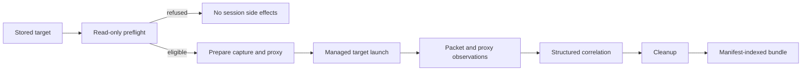

# Data Model: Deep Capture Architecture and Trust Boundaries

This slice changes documentation rather than runtime data. The model defines the components, evidence classes, and trust transitions that the architecture page must preserve.

## Execution Components

| Component | Mode | Owner | Input | Output or decision |
| --- | --- | --- | --- | --- |
| Stored target selection | Deep Capture | fragcap | Existing target identity | One selected target or refusal |
| Compatibility preflight | Deep Capture | fragcap | Current launch-specific facts | Eligible cold Steam launch or refusal before side effects |
| Npcap acquisition | Shared packet foundation | Npcap and fragcap Capture | Selected interfaces | Raw observed packets |
| Socket and process evidence | Capture | Windows adapters and fragcap attribution | Socket snapshots and process lifecycle | External process attribution |
| Scope and loss accounting | Capture | fragcap | Packets plus attribution | Retained packets and named counters |
| Loopback proxy | Deep Capture | fragcap-owned mitmdump child | Target-routed traffic | Supported application observations |
| Prepared managed launch | Deep Capture | fragcap | Selected target and scoped proxy environment | Cold Steam protocol launch owned by the session |
| Correlation | Deep Capture | fragcap | Flow registry and proxy connection evidence | Flow identifiers when matched, explicit absence otherwise |
| Bundle writer | Deep Capture | fragcap | Packet, proxy, process, compatibility, and cleanup evidence | Manifest-indexed session directory |
| Cleanup | Deep Capture | fragcap | Session-owned proxy, port, CA, and ephemeral material | Per-resource cleanup status |

## Evidence Classes

| Evidence class | Representative artifacts | Authority | Important limit |
| --- | --- | --- | --- |
| Packet truth | `capture.fcapng` | Bytes observed by Capture plus external attribution and counters | Encrypted bytes remain encrypted unless analyzed with separately available material |
| Proxy observations | `application.jsonl`, optional `http.har` | Semantics observed by the loopback proxy | Only traffic that reaches the proxy and exposes supported semantics |
| Analyzer aid | Optional `tls-keylog.log` | TLS material produced by the proxy endpoint | Never target-process key extraction and never a pinning bypass |
| Correlation and diagnostics | `proxy.jsonl`, `process-trace.jsonl`, `compatibility.json` | Session, process, proxy, and observed compatibility facts | Correlation may be absent and compatibility remains launch-specific |
| Audit evidence | `manifest.json`, `cleanup.json` | Attempted artifacts, omissions, state, and cleanup results | Records outcomes rather than guaranteeing every cleanup succeeded |

## Trust Boundary Transitions

| Transition | Trigger | Scope | Owner | Completion or refusal evidence |
| --- | --- | --- | --- | --- |
| Compatibility approval | Current exact facts for `steam-protocol-cold` | Selected stored target and launch case | fragcap | Preflight proceeds or refuses before side effects |
| Proxy start | Successful preflight and available backend | One loopback listener and child process | fragcap session | Proxy trace and manifest |
| CA trust | Explicit `--trust-ca` or broader `--yes` authorization | Exact fragcap-owned CA in current-user Root | fragcap session | Manifest trust identity and cleanup resource result |
| Target routing | Prepared managed launch | Launch-scoped proxy environment for the selected session | fragcap session | Compatibility and proxy observations, or explicit absence |
| Cleanup | Session termination | Only session-owned process, port, trust, and ephemeral material | fragcap session | `cleanup.json`, manifest state, and later `doctor` residue checks |

## Mode State Transitions

